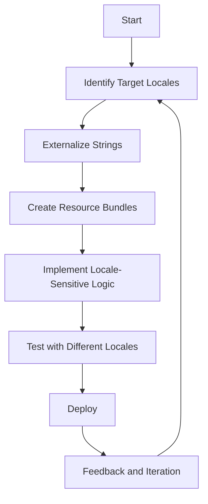

## 13.7 Internationalization Patterns

In today's interconnected world, software applications are expected to reach a global audience. This necessitates the need for internationalization (i18n) and localization (l10n) to ensure that applications can be easily adapted to different languages, regions, and cultural nuances. In this section, we will explore the concepts of internationalization and localization, discuss the challenges involved, and introduce patterns and best practices that facilitate the development of internationalized applications.

### Understanding Internationalization and Localization

**Internationalization (i18n)** is the process of designing a software application in such a way that it can be easily adapted to various languages and regions without requiring engineering changes to the source code. It involves the separation of content from code, allowing for the dynamic inclusion of locale-specific information.

**Localization (l10n)**, on the other hand, is the process of adapting an internationalized application to a specific locale. This includes translating text, adjusting date and time formats, currency symbols, and other locale-specific elements.

#### Importance of Internationalization and Localization

- **Global Reach**: By supporting multiple languages and regional formats, applications can reach a broader audience, increasing user engagement and market potential.
- **User Experience**: Providing content in a user's native language and format enhances usability and satisfaction.
- **Regulatory Compliance**: Some regions have legal requirements for software to be available in the local language.

### Challenges in Creating Internationalized Applications

Developing internationalized applications comes with its own set of challenges:

1. **Language Translations**: Translating text is not just about converting words from one language to another. It involves understanding cultural nuances and context to ensure that the message is conveyed accurately.

2. **Date and Time Formats**: Different regions use different formats for dates and times. For example, the date format in the United States is MM/DD/YYYY, while in many European countries, it is DD/MM/YYYY.

3. **Cultural Nuances**: Colors, symbols, and images may have different meanings in different cultures. For instance, the color white is associated with purity in some cultures and mourning in others.

4. **Character Encoding**: Supporting multiple languages requires handling different character sets and encodings, such as UTF-8 for Unicode.

5. **Right-to-Left Languages**: Languages like Arabic and Hebrew are written from right to left, which requires special handling in the user interface.

### Patterns and Best Practices for Internationalization

To effectively internationalize applications, developers can follow certain patterns and best practices:

#### 1. Resource Bundles

**Resource Bundles** are a key pattern in Java for managing locale-specific resources. They allow developers to store text and other locale-specific data separately from the code.

```java
// Example of a ResourceBundle in Java
import java.util.Locale;
import java.util.ResourceBundle;

public class InternationalizationExample {
    public static void main(String[] args) {
        Locale locale = new Locale("fr", "FR");
        ResourceBundle bundle = ResourceBundle.getBundle("MessagesBundle", locale);
        
        System.out.println(bundle.getString("greeting"));
    }
}
```

In this example, `MessagesBundle` is a properties file that contains key-value pairs for different locales. By changing the `Locale` object, the application can dynamically load the appropriate resources.

#### 2. Message Formatting

**Message Formatting** is essential for constructing locale-sensitive messages. Java provides the `MessageFormat` class to handle this.

```java
import java.text.MessageFormat;
import java.util.Locale;
import java.util.ResourceBundle;

public class MessageFormatExample {
    public static void main(String[] args) {
        Locale locale = new Locale("en", "US");
        ResourceBundle bundle = ResourceBundle.getBundle("MessagesBundle", locale);

        String pattern = bundle.getString("welcomeMessage");
        MessageFormat formatter = new MessageFormat(pattern, locale);

        Object[] messageArguments = {"John", 5};
        String output = formatter.format(messageArguments);

        System.out.println(output);
    }
}
```

In this example, the `welcomeMessage` key in the resource bundle might have a value like "Welcome, {0}! You have {1} new messages." The `MessageFormat` class replaces the placeholders with the provided arguments.

#### 3. Locale-Sensitive Data Handling

Handling locale-sensitive data, such as dates, times, and numbers, is crucial for internationalization. Java provides the `DateFormat` and `NumberFormat` classes for this purpose.

```java
import java.text.DateFormat;
import java.text.NumberFormat;
import java.util.Date;
import java.util.Locale;

public class LocaleSensitiveExample {
    public static void main(String[] args) {
        Locale locale = new Locale("de", "DE");

        // Date formatting
        DateFormat dateFormat = DateFormat.getDateInstance(DateFormat.LONG, locale);
        String formattedDate = dateFormat.format(new Date());
        System.out.println("Formatted Date: " + formattedDate);

        // Number formatting
        NumberFormat numberFormat = NumberFormat.getCurrencyInstance(locale);
        String formattedNumber = numberFormat.format(1234567.89);
        System.out.println("Formatted Number: " + formattedNumber);
    }
}
```

This example demonstrates how to format dates and numbers according to the German locale.

#### 4. Bidirectional Text Handling

For languages that are written from right to left, such as Arabic and Hebrew, special handling is required. Java provides the `Bidi` class to manage bidirectional text.

```java
import java.text.Bidi;

public class BidiExample {
    public static void main(String[] args) {
        String text = "مرحبا بكم في Java!";
        Bidi bidi = new Bidi(text, Bidi.DIRECTION_DEFAULT_LEFT_TO_RIGHT);

        if (bidi.isRightToLeft()) {
            System.out.println("The text is right-to-left.");
        } else {
            System.out.println("The text is left-to-right.");
        }
    }
}
```

This example checks the directionality of the text and prints the appropriate message.

#### 5. Unicode and Character Encoding

Using Unicode and proper character encoding is essential for supporting multiple languages. Java's `String` class uses UTF-16 encoding, which supports a wide range of characters.

```java
public class UnicodeExample {
    public static void main(String[] args) {
        String unicodeString = "\u0048\u0065\u006C\u006C\u006F"; // "Hello" in Unicode
        System.out.println(unicodeString);
    }
}
```

This example demonstrates how to use Unicode escape sequences to represent characters.

#### 6. Externalizing Strings

Externalizing strings involves moving all user-facing text out of the code and into resource files. This makes it easier to translate and manage text for different locales.

#### 7. Using Libraries and Frameworks

Leveraging libraries and frameworks that support internationalization can simplify the process. For example, the Spring Framework provides support for message sources and locale resolution.

### Benefits of Early Internationalization Planning

Planning for internationalization early in the development process offers several benefits:

- **Cost Efficiency**: Making changes to support internationalization after the application is developed can be costly and time-consuming.
- **Scalability**: An internationalized application is easier to scale to new markets and regions.
- **Consistency**: Ensuring consistent user experience across different locales is easier when internationalization is considered from the start.

### Visualizing Internationalization Patterns

To better understand the workflow of internationalization, let's visualize the process using a flowchart.



This flowchart illustrates the iterative process of internationalizing an application, from identifying target locales to deploying and gathering feedback.

### Try It Yourself

To deepen your understanding of internationalization patterns, try modifying the code examples provided:

- **Change the Locale**: Modify the `Locale` object in the examples to see how the application behaves with different languages and regions.
- **Add New Resource Bundles**: Create additional resource bundles for new languages and test the application with these bundles.
- **Experiment with MessageFormat**: Try using different patterns and arguments with the `MessageFormat` class.

### References and Further Reading

- [Java Internationalization and Localization Guide](https://docs.oracle.com/javase/tutorial/i18n/index.html)
- [Unicode Consortium](https://unicode.org/)
- [Spring Framework Internationalization](https://docs.spring.io/spring-framework/docs/current/reference/html/core.html#context-functionality-messagesource)

### Knowledge Check

- **What is the difference between internationalization and localization?**
- **Why is it important to plan for internationalization early in the development process?**
- **How can resource bundles be used to manage locale-specific resources?**

### Embrace the Journey

Remember, internationalization is not just about translating text. It's about creating an inclusive experience for users around the world. As you continue to explore internationalization patterns, keep experimenting, stay curious, and enjoy the journey!

## Quiz Time!



### What is the primary goal of internationalization (i18n)?

- [x] To design software that can be easily adapted to various languages and regions without code changes.
- [ ] To translate software into multiple languages.
- [ ] To ensure software complies with regional laws.
- [ ] To enhance the performance of software applications.

> **Explanation:** Internationalization focuses on designing software that can be adapted to different languages and regions without requiring changes to the source code.

### Which Java class is used for locale-sensitive message formatting?

- [ ] ResourceBundle
- [x] MessageFormat
- [ ] DateFormat
- [ ] NumberFormat

> **Explanation:** The `MessageFormat` class is used for constructing locale-sensitive messages in Java.

### What is the purpose of the `Bidi` class in Java?

- [ ] To format dates and numbers.
- [x] To manage bidirectional text.
- [ ] To handle character encoding.
- [ ] To externalize strings.

> **Explanation:** The `Bidi` class in Java is used to manage bidirectional text, which is essential for languages written from right to left.

### Why is Unicode important in internationalization?

- [x] It allows for the representation of a wide range of characters from different languages.
- [ ] It improves the performance of applications.
- [ ] It simplifies the process of translating text.
- [ ] It ensures compliance with regional laws.

> **Explanation:** Unicode is important because it supports a wide range of characters, enabling applications to handle multiple languages.

### What is a key benefit of planning for internationalization early in the development process?

- [x] Cost efficiency
- [ ] Improved application performance
- [ ] Easier debugging
- [ ] Faster deployment

> **Explanation:** Planning for internationalization early can save costs and time, as it avoids the need for extensive changes later in the development process.

### Which of the following is NOT a challenge in internationalization?

- [ ] Language translations
- [ ] Date and time formats
- [ ] Cultural nuances
- [x] Improved application security

> **Explanation:** Improved application security is not a challenge related to internationalization. Challenges include language translations, date and time formats, and cultural nuances.

### How can resource bundles be utilized in Java?

- [x] To store locale-specific resources separately from the code.
- [ ] To manage character encoding.
- [ ] To format dates and numbers.
- [ ] To handle bidirectional text.

> **Explanation:** Resource bundles are used to store locale-specific resources, such as text, separately from the code, facilitating easier localization.

### What is the role of the `Locale` class in Java?

- [ ] To manage character encoding.
- [x] To represent a specific geographical, political, or cultural region.
- [ ] To format messages.
- [ ] To handle bidirectional text.

> **Explanation:** The `Locale` class in Java represents a specific geographical, political, or cultural region, which is used to tailor locale-sensitive operations.

### Which pattern is essential for constructing locale-sensitive messages?

- [ ] Resource Bundles
- [x] Message Formatting
- [ ] Bidirectional Text Handling
- [ ] Unicode and Character Encoding

> **Explanation:** Message formatting is essential for constructing locale-sensitive messages, allowing dynamic inclusion of locale-specific information.

### True or False: Localization involves designing software to be adaptable to various languages and regions.

- [ ] True
- [x] False

> **Explanation:** False. Localization is the process of adapting an internationalized application to a specific locale, not designing it for adaptability.


