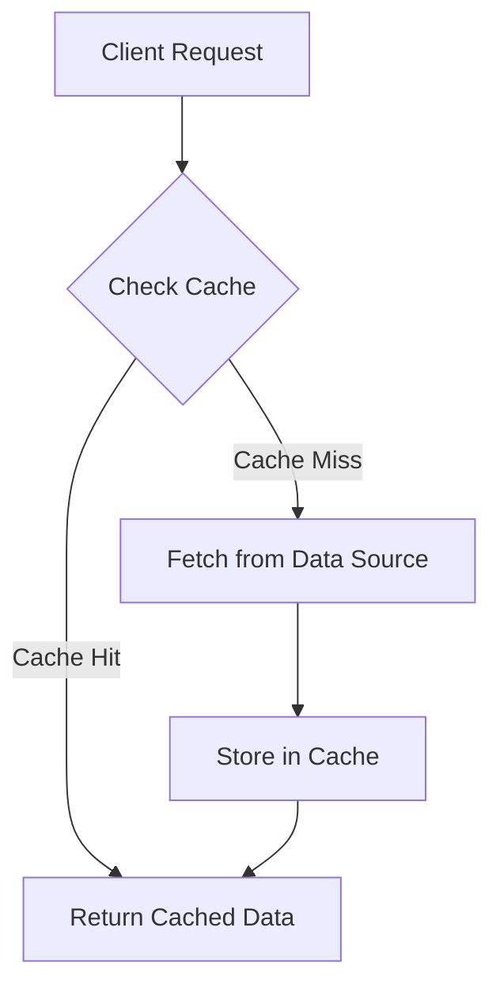

## 13.8.1 Caching Strategies

In the realm of software engineering, performance optimization is a critical aspect of building responsive and efficient applications. One of the most effective techniques for enhancing performance is caching, which involves storing the results of expensive computations or resource-intensive operations to speed up future requests. In this section, we'll explore various caching strategies, their implementations in Java, and best practices to ensure optimal performance.

### Understanding Caching

Caching is a mechanism that temporarily stores data in a cache, a storage layer that allows for faster data retrieval than fetching it from the original source. The primary goal of caching is to reduce latency and improve the performance of applications by minimizing the need to repeatedly compute or fetch the same data.

#### Benefits of Caching

- **Improved Performance**: By storing frequently accessed data in a cache, applications can retrieve data faster, reducing load times and improving user experience.
- **Reduced Load on Backend Systems**: Caching decreases the number of requests to backend systems, reducing server load and resource consumption.
- **Cost Efficiency**: By minimizing the need for repeated computations and data retrievals, caching can lead to cost savings, especially in cloud environments where resource usage is billed.

### Caching Strategies

There are several caching strategies that developers can employ, each with its own advantages and use cases. Let's delve into some of the most common strategies.

#### In-Memory Caching

In-memory caching involves storing data in the RAM of a system, allowing for extremely fast data access. This strategy is ideal for applications that require low-latency data retrieval and can afford to use system memory for caching purposes.

**Example: Using Java Collections for In-Memory Caching**

Java provides built-in collections that can be used to implement simple in-memory caches. Here's a basic example using a `HashMap`:

```java
import java.util.HashMap;
import java.util.Map;

public class InMemoryCache {
    private Map<String, String> cache = new HashMap<>();

    // Add data to cache
    public void put(String key, String value) {
        cache.put(key, value);
    }

    // Retrieve data from cache
    public String get(String key) {
        return cache.get(key);
    }

    // Check if cache contains a key
    public boolean containsKey(String key) {
        return cache.containsKey(key);
    }

    // Remove data from cache
    public void remove(String key) {
        cache.remove(key);
    }
}
```

In this example, we use a `HashMap` to store key-value pairs in memory. While this approach is simple and effective for small-scale applications, it lacks advanced features like eviction policies and concurrency control.

**Try It Yourself**: Modify the `InMemoryCache` class to include a maximum cache size and implement a simple eviction policy when the cache exceeds this size.

#### Distributed Caching

Distributed caching involves using external services to store cached data across multiple nodes, providing scalability and fault tolerance. This strategy is suitable for large-scale applications where data needs to be shared across different servers or instances.

**Example: Using Redis for Distributed Caching**

Redis is a popular in-memory data structure store that can be used for distributed caching. Here's an example of using Redis with Java:

```java
import redis.clients.jedis.Jedis;

public class RedisCache {
    private Jedis jedis;

    public RedisCache(String host, int port) {
        this.jedis = new Jedis(host, port);
    }

    // Add data to Redis cache
    public void put(String key, String value) {
        jedis.set(key, value);
    }

    // Retrieve data from Redis cache
    public String get(String key) {
        return jedis.get(key);
    }

    // Check if Redis cache contains a key
    public boolean containsKey(String key) {
        return jedis.exists(key);
    }

    // Remove data from Redis cache
    public void remove(String key) {
        jedis.del(key);
    }
}
```

In this example, we use the Jedis library to interact with a Redis server. Redis provides features like data persistence, replication, and advanced data structures, making it a powerful choice for distributed caching.

**Try It Yourself**: Experiment with Redis data expiration features by setting a time-to-live (TTL) for cached entries.

#### Cache Eviction Policies

Cache eviction policies determine how data is removed from the cache when it reaches its capacity. Common policies include:

- **LRU (Least Recently Used)**: Evicts the least recently accessed items first.
- **LFU (Least Frequently Used)**: Evicts items that are accessed the least frequently.
- **FIFO (First-In-First-Out)**: Evicts items in the order they were added.

**Example: Implementing LRU Cache in Java**

Java's `LinkedHashMap` can be used to implement an LRU cache:

```java
import java.util.LinkedHashMap;
import java.util.Map;

public class LRUCache<K, V> extends LinkedHashMap<K, V> {
    private final int maxSize;

    public LRUCache(int maxSize) {
        super(maxSize, 0.75f, true);
        this.maxSize = maxSize;
    }

    @Override
    protected boolean removeEldestEntry(Map.Entry<K, V> eldest) {
        return size() > maxSize;
    }
}
```

In this example, the `removeEldestEntry` method is overridden to remove the least recently accessed entry when the cache exceeds its maximum size.

**Try It Yourself**: Modify the `LRUCache` to include a method that returns the current size of the cache.

### Implementing Caching in Java Applications

Java offers several libraries and frameworks to facilitate caching in applications. Let's explore some popular options.

#### Ehcache

Ehcache is a widely used caching library for Java that provides robust features like distributed caching, cache persistence, and advanced eviction policies.

**Example: Configuring Ehcache**

```xml
<ehcache xmlns:xsi="http://www.w3.org/2001/XMLSchema-instance"
         xsi:noNamespaceSchemaLocation="http://www.ehcache.org/ehcache.xsd">
    <cache name="exampleCache"
           maxEntriesLocalHeap="1000"
           eternal="false"
           timeToLiveSeconds="60"
           timeToIdleSeconds="30"
           overflowToDisk="true"
           diskPersistent="false"
           diskExpiryThreadIntervalSeconds="120">
    </cache>
</ehcache>
```

In this configuration, we define a cache named "exampleCache" with a maximum of 1000 entries in the heap, a TTL of 60 seconds, and disk overflow enabled.

**Try It Yourself**: Implement a Java application that uses Ehcache to cache database query results.

#### Caffeine

Caffeine is a high-performance caching library for Java that offers features like asynchronous loading, eviction policies, and statistics.

**Example: Using Caffeine for Caching**

```java
import com.github.benmanes.caffeine.cache.Cache;
import com.github.benmanes.caffeine.cache.Caffeine;

import java.util.concurrent.TimeUnit;

public class CaffeineCache {
    private Cache<String, String> cache = Caffeine.newBuilder()
            .expireAfterWrite(10, TimeUnit.MINUTES)
            .maximumSize(100)
            .build();

    // Add data to Caffeine cache
    public void put(String key, String value) {
        cache.put(key, value);
    }

    // Retrieve data from Caffeine cache
    public String get(String key) {
        return cache.getIfPresent(key);
    }

    // Remove data from Caffeine cache
    public void remove(String key) {
        cache.invalidate(key);
    }
}
```

In this example, we configure a Caffeine cache with a maximum size of 100 entries and a TTL of 10 minutes.

**Try It Yourself**: Experiment with Caffeine's asynchronous loading feature to load data into the cache in the background.

### Cache Invalidation and Consistency

One of the most challenging aspects of caching is ensuring that cached data remains consistent with the source of truth. Cache invalidation strategies are crucial for maintaining data accuracy.

#### Cache Invalidation Strategies

- **Time-Based Expiration**: Set a TTL for cached entries, after which they are automatically invalidated.
- **Event-Based Invalidation**: Invalidate cache entries in response to specific events, such as data updates or deletions.
- **Manual Invalidation**: Provide mechanisms for manually invalidating cache entries when necessary.

**Considerations for Cache Consistency**

- **Staleness**: Cached data may become outdated, leading to stale reads. Consider the acceptable level of staleness for your application.
- **Synchronization**: Ensure that cache updates are synchronized with data source changes to prevent inconsistencies.
- **Consistency Models**: Choose an appropriate consistency model (e.g., eventual consistency, strong consistency) based on application requirements.

### Best Practices for Caching

When implementing caching, consider the following best practices to maximize its effectiveness:

- **Decide What to Cache**: Identify data that is expensive to compute or frequently accessed. Avoid caching data that changes frequently or is inexpensive to retrieve.
- **Cache Sizing**: Determine the optimal cache size based on available resources and application needs. Monitor cache performance and adjust size as necessary.
- **Monitor Cache Performance**: Use monitoring tools to track cache hit rates, eviction rates, and other performance metrics. Adjust caching strategies based on insights.
- **Avoid Over-Caching**: Excessive caching can lead to memory bloat and increased garbage collection. Balance caching with resource constraints.
- **Test and Validate**: Thoroughly test caching implementations to ensure they meet performance and consistency requirements. Validate cache behavior under different load conditions.

### Visualizing Caching Strategies

To better understand the flow of data in caching strategies, let's visualize a typical caching architecture using a flowchart.



**Description**: This flowchart illustrates the process of handling client requests with caching. If the requested data is found in the cache (cache hit), it is returned immediately. If not (cache miss), the data is fetched from the data source, stored in the cache, and then returned to the client.

### Conclusion

Caching is a powerful tool for optimizing the performance of Java applications. By understanding and implementing various caching strategies, such as in-memory and distributed caching, developers can significantly enhance application responsiveness and efficiency. However, it's essential to carefully consider cache invalidation, consistency, and best practices to ensure that caching delivers the desired benefits without introducing new challenges.

### Embrace the Journey

Remember, caching is just one of many performance optimization techniques. As you continue to develop and refine your skills, explore other strategies and patterns to build high-performing, scalable applications. Keep experimenting, stay curious, and enjoy the journey!

## Quiz Time!



### What is the primary goal of caching?

- [x] To reduce latency and improve application performance
- [ ] To increase server load
- [ ] To store all application data permanently
- [ ] To replace databases

> **Explanation:** Caching aims to reduce latency and improve performance by storing frequently accessed data for quick retrieval.

### Which caching strategy involves storing data in RAM for fast access?

- [x] In-Memory Caching
- [ ] Distributed Caching
- [ ] Disk Caching
- [ ] Network Caching

> **Explanation:** In-memory caching stores data in RAM, allowing for extremely fast access compared to other storage methods.

### What is a key benefit of distributed caching?

- [x] Scalability and fault tolerance
- [ ] Increased memory usage
- [ ] Reduced data consistency
- [ ] Slower data retrieval

> **Explanation:** Distributed caching provides scalability and fault tolerance by storing data across multiple nodes.

### Which cache eviction policy removes the least recently accessed items first?

- [x] LRU (Least Recently Used)
- [ ] LFU (Least Frequently Used)
- [ ] FIFO (First-In-First-Out)
- [ ] MRU (Most Recently Used)

> **Explanation:** LRU eviction policy removes the least recently accessed items to make space for new entries.

### What is a common challenge associated with caching?

- [x] Cache Invalidation
- [ ] Increased server load
- [ ] Reduced application performance
- [ ] Permanent data storage

> **Explanation:** Cache invalidation is a common challenge, as it involves ensuring cached data remains consistent with the source.

### Which Java library is known for high-performance caching with features like asynchronous loading?

- [x] Caffeine
- [ ] Ehcache
- [ ] Redis
- [ ] Memcached

> **Explanation:** Caffeine is a high-performance caching library for Java, offering features like asynchronous loading.

### What is the purpose of setting a time-to-live (TTL) for cached entries?

- [x] To automatically invalidate entries after a certain period
- [ ] To increase cache size
- [ ] To reduce cache hit rate
- [ ] To store data permanently

> **Explanation:** TTL is used to automatically invalidate cache entries after a specified period, ensuring data freshness.

### Which consistency model ensures that all reads return the most recent write?

- [x] Strong Consistency
- [ ] Eventual Consistency
- [ ] Weak Consistency
- [ ] Causal Consistency

> **Explanation:** Strong consistency ensures that all reads return the most recent write, maintaining data accuracy.

### What is a best practice for determining what data to cache?

- [x] Cache data that is expensive to compute or frequently accessed
- [ ] Cache all data regardless of cost
- [ ] Cache data that changes frequently
- [ ] Avoid caching altogether

> **Explanation:** It's best to cache data that is expensive to compute or frequently accessed to maximize caching benefits.

### True or False: Excessive caching can lead to memory bloat and increased garbage collection.

- [x] True
- [ ] False

> **Explanation:** Excessive caching can consume a lot of memory, leading to bloat and increased garbage collection overhead.


