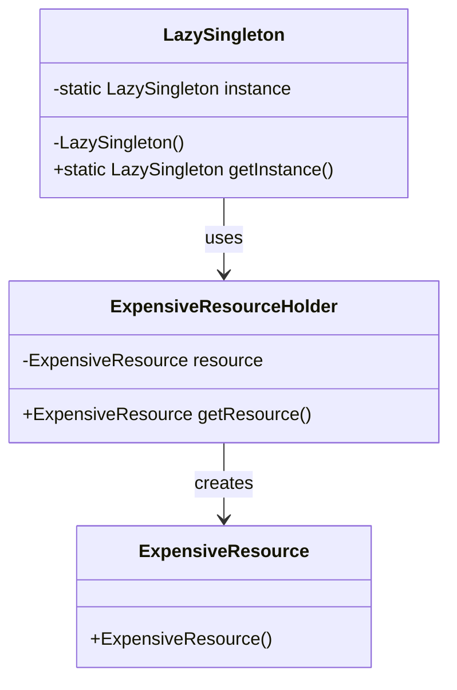

## 13.8.2 Lazy Initialization

Lazy Initialization is a design pattern and performance optimization technique that defers the creation or initialization of an object until it is actually needed. This approach can significantly reduce the startup time and resource usage of an application, making it a valuable strategy in scenarios where resource-intensive objects are not always required.

### Understanding Lazy Initialization

Lazy Initialization is particularly useful in situations where the cost of creating an object is high, and the object might not be used immediately or at all. By delaying the creation of the object until it is needed, we can save on memory and processing power, which is especially beneficial in resource-constrained environments.

#### Benefits of Lazy Initialization

- **Reduced Startup Time**: By deferring object creation, applications can start up faster, as they do not need to allocate resources for objects that might not be used immediately.
- **Lower Memory Usage**: Memory is conserved by only allocating resources for objects when they are needed.
- **Improved Performance**: By avoiding unnecessary computations, the overall performance of the application can be enhanced.
- **Resource Management**: Lazy initialization helps in managing resources more efficiently, especially in applications with a large number of potential objects.

### Implementing Lazy Initialization in Java

Let's explore how to implement lazy initialization in Java through various scenarios, including lazy-loaded singleton instances and lazy initialization of object properties.

#### Lazy-Loaded Singleton Instances

The Singleton pattern ensures that a class has only one instance and provides a global point of access to it. Lazy initialization can be applied to the Singleton pattern to delay the creation of the instance until it is first needed.

```java
public class LazySingleton {
    private static LazySingleton instance;

    // Private constructor to prevent instantiation
    private LazySingleton() {}

    // Method to get the instance of the singleton class
    public static LazySingleton getInstance() {
        if (instance == null) {
            instance = new LazySingleton();
        }
        return instance;
    }
}
```

In this example, the `getInstance()` method checks if the instance is `null` before creating it. This ensures that the instance is only created when it is first accessed, thus implementing lazy initialization.

#### Thread-Safe Lazy Initialization

In a multi-threaded environment, the above implementation can lead to issues if multiple threads try to access the `getInstance()` method simultaneously. To handle this, we can use synchronized methods or blocks, or employ the Double-Checked Locking principle.

```java
public class ThreadSafeLazySingleton {
    private static volatile ThreadSafeLazySingleton instance;

    private ThreadSafeLazySingleton() {}

    public static ThreadSafeLazySingleton getInstance() {
        if (instance == null) {
            synchronized (ThreadSafeLazySingleton.class) {
                if (instance == null) {
                    instance = new ThreadSafeLazySingleton();
                }
            }
        }
        return instance;
    }
}
```

Here, the `volatile` keyword ensures that changes to the `instance` variable are visible to all threads. The synchronized block ensures that only one thread can initialize the instance at a time, while the double-checked locking pattern minimizes synchronization overhead.

#### Lazy Initialization of Object Properties

Lazy initialization can also be applied to individual properties of an object. This is useful when a property is expensive to compute or retrieve, and it might not be needed immediately.

```java
public class ExpensiveResourceHolder {
    private ExpensiveResource resource;

    public ExpensiveResource getResource() {
        if (resource == null) {
            resource = new ExpensiveResource();
        }
        return resource;
    }
}
```

In this example, the `ExpensiveResource` object is only created when the `getResource()` method is called for the first time. This approach can be extended to more complex scenarios, such as loading data from a database or initializing a network connection.

### Preventing Unnecessary Computations and Memory Usage

Lazy initialization can prevent unnecessary computations and memory usage by ensuring that resources are only allocated when they are required. This can be particularly effective in scenarios such as:

- **Large Data Structures**: When dealing with large data structures that might not be needed immediately, lazy initialization can help in conserving memory.
- **Complex Calculations**: For properties that require complex calculations, deferring the computation until the value is needed can save processing power.
- **Network Resources**: In applications that require network resources, such as fetching data from a remote server, lazy initialization can reduce network traffic and latency.

### Scenarios Where Lazy Initialization is Effective

Lazy initialization is particularly effective in the following scenarios:

- **Configuration and Setup**: In applications with complex configuration or setup processes, lazy initialization can defer these processes until they are necessary.
- **User Interfaces**: In GUI applications, components that are not immediately visible or required can be initialized lazily to improve responsiveness.
- **Caching**: Lazy initialization can be used in caching mechanisms to load data only when it is accessed for the first time.
- **Plugin Systems**: In systems with plugins or modules, lazy initialization can defer loading plugins until they are needed, reducing startup time and memory usage.

### Visualizing Lazy Initialization

To better understand lazy initialization, let's visualize the process using a class diagram.



This diagram illustrates how the `LazySingleton` class uses lazy initialization to manage the creation of `ExpensiveResource` through the `ExpensiveResourceHolder`.

### Try It Yourself

To get a hands-on understanding of lazy initialization, try modifying the code examples provided:

1. **Experiment with Thread Safety**: Remove the `synchronized` block from the `ThreadSafeLazySingleton` and observe the behavior in a multi-threaded environment.
2. **Add Logging**: Introduce logging statements in the `getInstance()` and `getResource()` methods to track when the objects are created.
3. **Extend the Example**: Implement lazy initialization for a more complex object, such as a database connection or a file reader.

### Knowledge Check

- What are the primary benefits of using lazy initialization?
- How does lazy initialization improve performance in an application?
- What are the potential pitfalls of using lazy initialization in a multi-threaded environment?
- How can you ensure thread safety when implementing lazy initialization?
- In what scenarios is lazy initialization particularly useful?

### Conclusion

Lazy Initialization is a powerful technique for optimizing performance and resource usage in Java applications. By deferring the creation of expensive objects until they are needed, developers can reduce startup time, conserve memory, and improve overall application efficiency. However, it is crucial to consider thread safety and potential pitfalls when implementing lazy initialization, especially in multi-threaded environments.

Remember, this is just the beginning. As you progress, you'll build more complex and interactive applications. Keep experimenting, stay curious, and enjoy the journey!

## Quiz Time!



### What is the primary purpose of lazy initialization?

- [x] To defer the creation of an object until it is needed
- [ ] To create objects as soon as possible
- [ ] To initialize all objects at application startup
- [ ] To avoid creating objects altogether

> **Explanation:** Lazy initialization defers the creation of an object until it is actually needed, optimizing resource usage.

### How does lazy initialization improve application performance?

- [x] By reducing startup time and conserving memory
- [ ] By increasing the number of objects created
- [ ] By ensuring all objects are initialized at startup
- [ ] By decreasing application responsiveness

> **Explanation:** Lazy initialization reduces startup time and conserves memory by creating objects only when needed.

### What is a potential issue with lazy initialization in a multi-threaded environment?

- [x] Race conditions leading to multiple instances
- [ ] Increased memory usage
- [ ] Decreased application performance
- [ ] Immediate object creation

> **Explanation:** In a multi-threaded environment, race conditions can occur if multiple threads try to initialize the object simultaneously.

### How can thread safety be ensured in lazy initialization?

- [x] By using synchronized blocks or double-checked locking
- [ ] By initializing objects at application startup
- [ ] By avoiding the use of lazy initialization
- [ ] By creating multiple instances

> **Explanation:** Thread safety can be ensured by using synchronized blocks or double-checked locking to control access to the initialization code.

### In which scenario is lazy initialization particularly useful?

- [x] When dealing with large data structures
- [ ] When all objects are needed immediately
- [ ] When memory usage is not a concern
- [ ] When objects are inexpensive to create

> **Explanation:** Lazy initialization is useful for large data structures that might not be needed immediately, conserving memory.

### What is the role of the `volatile` keyword in thread-safe lazy initialization?

- [x] To ensure visibility of changes to the instance variable across threads
- [ ] To increase the speed of object creation
- [ ] To allow multiple instances to be created
- [ ] To prevent object creation altogether

> **Explanation:** The `volatile` keyword ensures that changes to the instance variable are visible to all threads, preventing stale data.

### Which pattern is often used in conjunction with lazy initialization for thread safety?

- [x] Double-Checked Locking
- [ ] Factory Method
- [ ] Observer
- [ ] Adapter

> **Explanation:** Double-Checked Locking is often used with lazy initialization to ensure thread safety while minimizing synchronization overhead.

### What is a common use case for lazy initialization in GUI applications?

- [x] Deferring the creation of components not immediately visible
- [ ] Initializing all components at startup
- [ ] Avoiding the use of components
- [ ] Creating components in advance

> **Explanation:** Lazy initialization in GUI applications can defer the creation of components that are not immediately visible, improving responsiveness.

### How does lazy initialization help in caching mechanisms?

- [x] By loading data only when accessed for the first time
- [ ] By preloading all data at startup
- [ ] By avoiding data loading altogether
- [ ] By increasing memory usage

> **Explanation:** Lazy initialization helps in caching by loading data only when it is accessed for the first time, reducing unnecessary resource usage.

### True or False: Lazy initialization can reduce network traffic and latency in applications requiring network resources.

- [x] True
- [ ] False

> **Explanation:** Lazy initialization can reduce network traffic and latency by deferring network resource loading until necessary.


