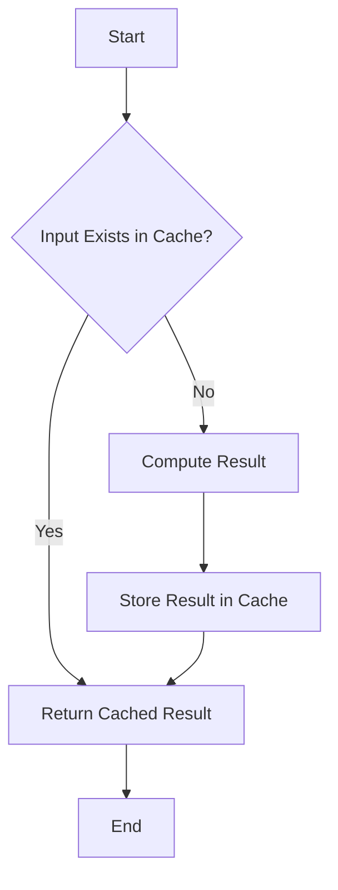

## 13.8.3 Memoization

In the realm of performance optimization, memoization stands out as a powerful technique for improving the efficiency of function calls. By caching the results of expensive function calls and returning the cached result when the same inputs occur again, memoization can significantly reduce computation time. In this section, we'll delve into the concept of memoization, its implementation in Java, and best practices to ensure effective usage.

### Understanding Memoization

Memoization is a specific form of caching that involves storing the results of expensive function calls and reusing the cached result when the same inputs occur again. Unlike general caching, which can apply to any data, memoization specifically targets function outputs based on their inputs. This makes it particularly useful for functions with deterministic outputs, where the same input always produces the same output.

#### Memoization vs. General Caching

While both memoization and caching involve storing data for future use, memoization is focused on function calls. Here are some key differences:

- **Scope**: Memoization is limited to function results, whereas caching can apply to a broader range of data types.
- **Granularity**: Memoization caches results at the level of individual function calls, while caching might store larger data sets or objects.
- **Usage**: Memoization is typically used to optimize recursive or computationally intensive functions, whereas caching is used for data retrieval operations, like database queries or API calls.

### Implementing Memoization in Java

Let's explore how to implement memoization in Java. We'll cover creating memoization wrappers for functions and using data structures like `Map` and `ConcurrentHashMap` to store computed results.

#### Creating Memoization Wrappers

A memoization wrapper is a higher-order function that adds memoization capabilities to an existing function. Here's a simple example of a memoization wrapper in Java:

```java
import java.util.HashMap;
import java.util.Map;
import java.util.function.Function;

public class Memoizer<T, R> {
    private final Map<T, R> cache = new HashMap<>();

    public Function<T, R> memoize(Function<T, R> function) {
        return input -> cache.computeIfAbsent(input, function);
    }
}
```

In this example, the `Memoizer` class uses a `HashMap` to store results. The `memoize` method takes a function as input and returns a new function that checks the cache before computing the result.

#### Using `Map` and `ConcurrentHashMap`

For thread-safe memoization, especially in concurrent applications, `ConcurrentHashMap` is a better choice than `HashMap`. Here's how you can implement memoization with `ConcurrentHashMap`:

```java
import java.util.concurrent.ConcurrentHashMap;
import java.util.concurrent.ConcurrentMap;
import java.util.function.Function;

public class ConcurrentMemoizer<T, R> {
    private final ConcurrentMap<T, R> cache = new ConcurrentHashMap<>();

    public Function<T, R> memoize(Function<T, R> function) {
        return input -> cache.computeIfAbsent(input, function);
    }
}
```

The `ConcurrentMemoizer` class ensures that the cache is accessed in a thread-safe manner, making it suitable for multi-threaded environments.

### Use Cases for Memoization

Memoization is particularly beneficial in scenarios where functions are called repeatedly with the same inputs. Here are some common use cases:

#### Recursive Algorithms

Recursive algorithms, such as those used in dynamic programming, can benefit greatly from memoization. Consider the Fibonacci sequence, where each number is the sum of the two preceding ones. A naive recursive implementation can be inefficient due to repeated calculations:

```java
public class Fibonacci {
    public static int fib(int n) {
        if (n <= 1) return n;
        return fib(n - 1) + fib(n - 2);
    }
}
```

By memoizing the Fibonacci function, we can avoid redundant calculations:

```java
import java.util.HashMap;
import java.util.Map;

public class MemoizedFibonacci {
    private static final Map<Integer, Integer> cache = new HashMap<>();

    public static int fib(int n) {
        if (n <= 1) return n;
        return cache.computeIfAbsent(n, k -> fib(k - 1) + fib(k - 2));
    }
}
```

#### Computationally Intensive Functions

Functions that perform complex calculations, such as those involving mathematical operations or data processing, can also benefit from memoization. By caching results, we can reduce the time spent on repeated computations.

### Challenges in Memoization

While memoization can improve performance, it also introduces challenges, particularly in managing cache size and ensuring thread safety.

#### Managing Cache Size

As the cache grows, it can consume significant memory, potentially leading to memory leaks. To manage cache size, consider the following strategies:

- **Eviction Policies**: Implement policies to remove old or least-used entries, such as Least Recently Used (LRU) or Time-to-Live (TTL).
- **Weak References**: Use weak references to allow garbage collection of unused entries, preventing memory leaks.

Here's an example of using `WeakHashMap` for memoization:

```java
import java.util.WeakHashMap;
import java.util.Map;
import java.util.function.Function;

public class WeakMemoizer<T, R> {
    private final Map<T, R> cache = new WeakHashMap<>();

    public Function<T, R> memoize(Function<T, R> function) {
        return input -> cache.computeIfAbsent(input, function);
    }
}
```

#### Ensuring Thread Safety

In multi-threaded applications, ensure that the cache is accessed in a thread-safe manner. Use `ConcurrentHashMap` or synchronize access to the cache to prevent race conditions.

### Best Practices for Memoization

To effectively use memoization, follow these best practices:

- **Identify Suitable Functions**: Use memoization for functions with deterministic outputs and significant computation costs.
- **Manage Cache Size**: Implement eviction policies and use weak references to prevent memory issues.
- **Ensure Thread Safety**: Use thread-safe data structures or synchronization to avoid concurrency issues.
- **Monitor Performance**: Regularly assess the impact of memoization on performance and adjust strategies as needed.

### Try It Yourself

To get hands-on experience with memoization, try modifying the examples provided. Experiment with different data structures, eviction policies, and thread safety mechanisms to see how they affect performance.

### Visualizing Memoization

To better understand how memoization works, let's visualize the process using a flowchart:



This flowchart illustrates the decision-making process in a memoized function, where the cache is checked before computing the result.

### References and Links

For further reading on memoization and caching, consider the following resources:

- [Java Documentation](https://docs.oracle.com/javase/8/docs/api/java/util/ConcurrentHashMap.html) on `ConcurrentHashMap`
- [GeeksforGeeks](https://www.geeksforgeeks.org/memoization-1d-2d-and-3d/) on Memoization Techniques
- [Baeldung](https://www.baeldung.com/java-memoization) on Memoization in Java

### Knowledge Check

To reinforce your understanding of memoization, consider the following questions:

- What is the primary difference between memoization and general caching?
- How does memoization improve the performance of recursive algorithms?
- What are some strategies for managing cache size in a memoized function?
- How can you ensure thread safety when implementing memoization in a multi-threaded environment?

### Embrace the Journey

Remember, memoization is just one tool in the performance optimization toolkit. As you continue to explore Java design patterns, keep experimenting, stay curious, and enjoy the journey!

## Quiz Time!



### What is memoization primarily used for?

- [x] Caching function results based on inputs
- [ ] Storing database query results
- [ ] Managing session data
- [ ] Logging application events

> **Explanation:** Memoization is specifically used for caching the results of function calls based on their inputs.

### Which Java class is recommended for thread-safe memoization?

- [ ] HashMap
- [x] ConcurrentHashMap
- [ ] ArrayList
- [ ] LinkedList

> **Explanation:** `ConcurrentHashMap` is recommended for thread-safe memoization as it allows concurrent access.

### How does memoization benefit recursive algorithms?

- [x] By avoiding redundant calculations
- [ ] By increasing the number of recursive calls
- [ ] By reducing the number of function parameters
- [ ] By simplifying the algorithm

> **Explanation:** Memoization benefits recursive algorithms by caching results and avoiding redundant calculations.

### What is a potential downside of memoization?

- [ ] Increased computation time
- [x] Memory consumption
- [ ] Reduced code readability
- [ ] Decreased accuracy

> **Explanation:** Memoization can lead to increased memory consumption due to cached results.

### Which strategy can help manage cache size in memoization?

- [x] Implementing eviction policies
- [ ] Increasing cache size
- [ ] Using static variables
- [ ] Disabling garbage collection

> **Explanation:** Implementing eviction policies helps manage cache size by removing old or unused entries.

### What is the role of weak references in memoization?

- [x] To prevent memory leaks
- [ ] To increase cache hit rate
- [ ] To enhance computation speed
- [ ] To simplify code

> **Explanation:** Weak references allow cached entries to be garbage collected, preventing memory leaks.

### Which of the following is NOT a use case for memoization?

- [ ] Recursive algorithms
- [ ] Computationally intensive functions
- [x] Simple arithmetic operations
- [ ] Dynamic programming

> **Explanation:** Simple arithmetic operations typically do not benefit from memoization due to their low computation cost.

### What is a key difference between memoization and general caching?

- [x] Memoization targets function outputs
- [ ] Memoization is used for data retrieval
- [ ] Memoization stores large data sets
- [ ] Memoization applies to any data type

> **Explanation:** Memoization specifically targets function outputs based on inputs, unlike general caching.

### How can you ensure thread safety in memoization?

- [x] Use `ConcurrentHashMap`
- [ ] Use `HashMap`
- [ ] Use `ArrayList`
- [ ] Use `LinkedList`

> **Explanation:** Using `ConcurrentHashMap` ensures thread safety by allowing concurrent access.

### True or False: Memoization can be applied to non-deterministic functions.

- [ ] True
- [x] False

> **Explanation:** Memoization is not suitable for non-deterministic functions, as their outputs can vary for the same inputs.


