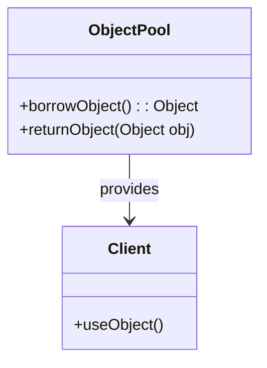
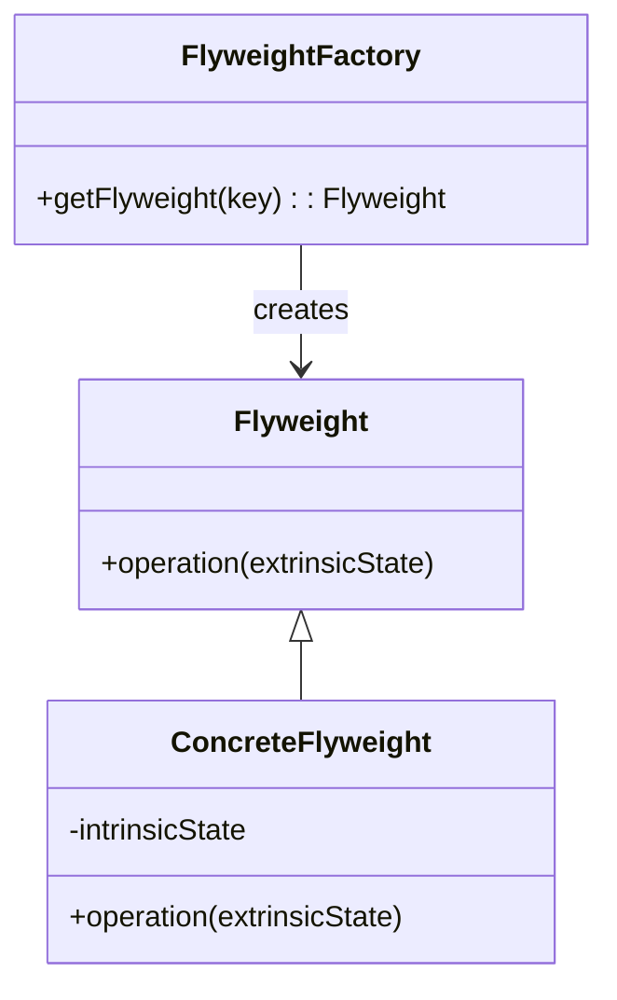

## 13.8.4 Object Pool and Flyweight Revisited

In the realm of software engineering, especially when dealing with high-performance applications, efficient resource management is crucial. Two design patterns that play a significant role in optimizing resource usage are the Object Pool and Flyweight patterns. In this section, we will revisit these patterns, exploring advanced techniques to enhance their effectiveness in large-scale applications.

### Recap of Object Pool and Flyweight Patterns

Before diving into advanced topics, let's briefly recap the fundamental concepts of the Object Pool and Flyweight patterns.

#### Object Pool Pattern

The Object Pool pattern is a creational design pattern that manages a pool of reusable objects. It is particularly beneficial when object creation is costly in terms of time or resources. By reusing objects from a pool rather than creating and destroying them repeatedly, applications can achieve significant performance improvements.

**Key Concepts:**
- **Pooling:** Maintain a collection of reusable objects.
- **Reusability:** Objects are borrowed from the pool and returned after use.
- **Resource Management:** Efficiently manage expensive resources like database connections or threads.

#### Flyweight Pattern

The Flyweight pattern is a structural design pattern aimed at minimizing memory usage by sharing as much data as possible with similar objects. It is particularly useful when dealing with a large number of similar objects.

**Key Concepts:**
- **Intrinsic State:** Shared data that is common across objects.
- **Extrinsic State:** Context-specific data that is unique to each object.
- **Sharing:** Reuse common data to reduce memory footprint.

### Advanced Topics in Object Pooling

In high-demand environments, managing pools of complex resources such as threads or database connections is critical. Let's explore some advanced strategies for implementing custom object pooling mechanisms.

#### Managing Pools of Complex Resources

When dealing with complex resources, such as database connections or threads, the Object Pool pattern can be extended to handle additional complexities like resource initialization, validation, and cleanup.

**Example: Thread Pool Implementation**

```java
import java.util.concurrent.ExecutorService;
import java.util.concurrent.Executors;

public class ThreadPoolExample {
    private final ExecutorService executorService;

    public ThreadPoolExample(int poolSize) {
        // Create a fixed thread pool
        executorService = Executors.newFixedThreadPool(poolSize);
    }

    public void executeTask(Runnable task) {
        // Submit a task to the thread pool
        executorService.submit(task);
    }

    public void shutdown() {
        // Shutdown the thread pool
        executorService.shutdown();
    }

    public static void main(String[] args) {
        ThreadPoolExample threadPool = new ThreadPoolExample(5);

        for (int i = 0; i < 10; i++) {
            int taskNumber = i;
            threadPool.executeTask(() -> {
                System.out.println("Executing task " + taskNumber);
            });
        }

        threadPool.shutdown();
    }
}
```

**Explanation:**
- **ExecutorService:** Manages a pool of threads that can execute tasks concurrently.
- **Fixed Thread Pool:** Limits the number of concurrent threads, preventing resource exhaustion.

#### Implementing Custom Object Pooling Mechanisms

For high-demand objects, custom pooling mechanisms can be designed to cater to specific application needs. Considerations include object lifecycle management, synchronization, and scalability.

**Example: Custom Database Connection Pool**

```java
import java.sql.Connection;
import java.sql.DriverManager;
import java.sql.SQLException;
import java.util.concurrent.BlockingQueue;
import java.util.concurrent.LinkedBlockingQueue;

public class CustomConnectionPool {
    private final BlockingQueue<Connection> connectionPool;
    private final String url;
    private final String user;
    private final String password;

    public CustomConnectionPool(String url, String user, String password, int poolSize) throws SQLException {
        this.url = url;
        this.user = user;
        this.password = password;
        this.connectionPool = new LinkedBlockingQueue<>(poolSize);

        // Initialize the pool with connections
        for (int i = 0; i < poolSize; i++) {
            connectionPool.add(createConnection());
        }
    }

    private Connection createConnection() throws SQLException {
        return DriverManager.getConnection(url, user, password);
    }

    public Connection borrowConnection() throws InterruptedException {
        return connectionPool.take();
    }

    public void returnConnection(Connection connection) {
        connectionPool.offer(connection);
    }
}
```

**Explanation:**
- **BlockingQueue:** Manages the pool of connections, ensuring thread-safe access.
- **Connection Lifecycle:** Connections are created during pool initialization and reused.

### Optimizing Flyweight Implementations

In large-scale applications, optimizing Flyweight implementations involves careful management of intrinsic and extrinsic states, as well as efficient sharing mechanisms.

#### Managing Intrinsic and Extrinsic States

To optimize Flyweight implementations, it's essential to clearly distinguish between intrinsic and extrinsic states and manage them effectively.

**Example: Flyweight Pattern for Graphical Objects**

```java
import java.util.HashMap;
import java.util.Map;

// Flyweight interface
interface Shape {
    void draw(int x, int y);
}

// Concrete Flyweight class
class Circle implements Shape {
    private final String color;

    public Circle(String color) {
        this.color = color;
    }

    @Override
    public void draw(int x, int y) {
        System.out.println("Drawing a " + color + " circle at (" + x + ", " + y + ")");
    }
}

// Flyweight Factory
class ShapeFactory {
    private static final Map<String, Shape> circleMap = new HashMap<>();

    public static Shape getCircle(String color) {
        Circle circle = (Circle) circleMap.get(color);

        if (circle == null) {
            circle = new Circle(color);
            circleMap.put(color, circle);
            System.out.println("Creating a " + color + " circle");
        }
        return circle;
    }
}

public class FlyweightPatternDemo {
    public static void main(String[] args) {
        Shape redCircle = ShapeFactory.getCircle("Red");
        redCircle.draw(10, 20);

        Shape blueCircle = ShapeFactory.getCircle("Blue");
        blueCircle.draw(30, 40);

        Shape redCircle2 = ShapeFactory.getCircle("Red");
        redCircle2.draw(50, 60);
    }
}
```

**Explanation:**
- **Intrinsic State:** The color of the circle, which is shared among objects.
- **Extrinsic State:** The position (x, y) where the circle is drawn, which is unique to each instance.

### Trade-offs and Considerations

While Object Pool and Flyweight patterns offer significant performance benefits, they also introduce complexity. Let's discuss some trade-offs and considerations.

#### Increased Complexity vs. Performance Gains

- **Complexity:** Implementing these patterns can increase code complexity, requiring careful management of object lifecycles and states.
- **Performance Gains:** The performance improvements can be substantial, especially in resource-intensive applications, justifying the added complexity.

#### Scenarios for Significant Improvement

These patterns are particularly beneficial in scenarios where resource creation is expensive or memory usage is a concern, such as:
- **High-traffic web applications:** Efficiently managing database connections or thread pools.
- **Graphical applications:** Reducing memory usage by sharing graphical objects.

### Visualizing Object Pool and Flyweight Patterns

To better understand these patterns, let's visualize their structures using Mermaid.js diagrams.

#### Object Pool Pattern Diagram



**Description:** This diagram illustrates the relationship between the Object Pool and the Client, where the pool provides reusable objects to the client.

#### Flyweight Pattern Diagram



**Description:** This diagram shows the Flyweight pattern structure, highlighting the separation of intrinsic and extrinsic states.

### Try It Yourself

To deepen your understanding, try modifying the code examples:
- **Thread Pool Example:** Experiment with different pool sizes and observe the impact on performance.
- **Custom Connection Pool:** Add connection validation and cleanup logic.
- **Flyweight Pattern:** Implement additional shapes and observe memory usage.

### References and Further Reading

For more information on these patterns, consider exploring the following resources:
- [Java Concurrency in Practice](https://www.oreilly.com/library/view/java-concurrency-in/0321349601/)
- [Design Patterns: Elements of Reusable Object-Oriented Software](https://www.amazon.com/dp/0201633612)
- [Effective Java](https://www.oreilly.com/library/view/effective-java-3rd/9780134686097/)

### Knowledge Check

To reinforce your learning, let's summarize the key takeaways:
- The Object Pool pattern is ideal for managing expensive resources like database connections.
- The Flyweight pattern reduces memory usage by sharing common data.
- Both patterns offer significant performance benefits but require careful management of complexity.

Remember, mastering these patterns can significantly enhance your ability to build efficient, high-performance applications. Keep experimenting, stay curious, and enjoy the journey!

## Quiz Time!



### Which design pattern is best suited for managing a pool of reusable objects?

- [x] Object Pool Pattern
- [ ] Flyweight Pattern
- [ ] Singleton Pattern
- [ ] Factory Pattern

> **Explanation:** The Object Pool pattern is designed to manage a pool of reusable objects, optimizing resource usage.

### What is the primary benefit of using the Flyweight pattern?

- [x] Reducing memory usage by sharing data
- [ ] Simplifying object creation
- [ ] Enhancing concurrency
- [ ] Improving code readability

> **Explanation:** The Flyweight pattern reduces memory usage by sharing intrinsic state among multiple objects.

### In the Flyweight pattern, what is the term for data that is unique to each object?

- [ ] Intrinsic State
- [x] Extrinsic State
- [ ] Shared State
- [ ] Common State

> **Explanation:** Extrinsic state is the data unique to each object in the Flyweight pattern.

### What is a key trade-off when implementing the Object Pool pattern?

- [x] Increased complexity
- [ ] Reduced performance
- [ ] Limited scalability
- [ ] Decreased flexibility

> **Explanation:** The Object Pool pattern can increase complexity due to the need for careful resource management.

### Which of the following is an example of a complex resource that can benefit from object pooling?

- [x] Database connections
- [ ] Simple data objects
- [x] Threads
- [ ] Configuration files

> **Explanation:** Database connections and threads are complex resources that can benefit from pooling due to their creation cost.

### What Java class is commonly used to manage a pool of threads?

- [ ] Thread
- [x] ExecutorService
- [ ] Runnable
- [ ] Callable

> **Explanation:** `ExecutorService` is commonly used to manage a pool of threads in Java.

### How does the Flyweight pattern achieve memory optimization?

- [x] By sharing intrinsic state among objects
- [ ] By duplicating objects
- [ ] By caching all objects
- [ ] By simplifying object interfaces

> **Explanation:** The Flyweight pattern achieves memory optimization by sharing intrinsic state among objects.

### What is a potential downside of using the Flyweight pattern?

- [x] Increased complexity in managing state
- [ ] Higher memory usage
- [ ] Slower object creation
- [ ] Reduced code readability

> **Explanation:** The Flyweight pattern can increase complexity in managing intrinsic and extrinsic states.

### Which pattern is particularly useful in high-traffic web applications for managing resources?

- [x] Object Pool Pattern
- [ ] Flyweight Pattern
- [ ] Singleton Pattern
- [ ] Observer Pattern

> **Explanation:** The Object Pool pattern is useful in high-traffic web applications for managing resources like database connections.

### True or False: The Flyweight pattern is primarily used to manage concurrency.

- [ ] True
- [x] False

> **Explanation:** False. The Flyweight pattern is primarily used to optimize memory usage, not manage concurrency.


