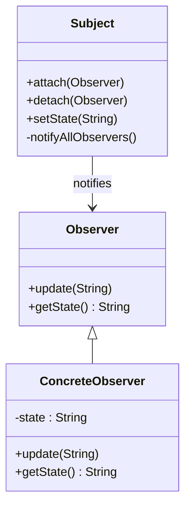

## 14.1 Test-Driven Development (TDD) with Design Patterns

In the realm of software engineering, the integration of Test-Driven Development (TDD) with design patterns is a powerful strategy for enhancing code quality and reliability. This section delves into the fundamentals of TDD, its synergy with design patterns, and practical applications in Java programming.

### Understanding Test-Driven Development (TDD)

#### TDD Fundamentals

Test-Driven Development is a software development process that emphasizes writing tests before the actual code. This approach is encapsulated in the red-green-refactor cycle:

1. **Red**: Write a test that defines a function or improvements of a function, which should fail initially because the function isn't implemented yet.
2. **Green**: Write the minimal amount of code necessary to pass the test.
3. **Refactor**: Clean up the code, ensuring that it adheres to design principles and is optimized for performance without altering its behavior.

This cycle ensures that the codebase remains robust and adaptable, with tests serving as a safety net for future changes.

#### Benefits of TDD

- **Clearer Requirements**: Writing tests first clarifies the requirements and expected behavior of the code.
- **Faster Feedback**: Immediate feedback from tests helps catch errors early in the development process.
- **Improved Design**: TDD encourages developers to write modular, loosely-coupled code, which is easier to maintain and extend.

### Benefits of Combining TDD with Design Patterns

Integrating TDD with design patterns offers several advantages:

- **Ensures Compliance with Requirements**: TDD ensures that design patterns are implemented to meet specific requirements, reducing the risk of deviations.
- **Enhances Code Quality**: The disciplined approach of TDD, combined with the structured nature of design patterns, leads to cleaner, more maintainable code.
- **Facilitates Refactoring**: With a comprehensive suite of tests, developers can confidently refactor code and apply design patterns without fear of breaking functionality.

### Step-by-Step Example: TDD with the Observer Pattern

Let's explore how TDD can be applied to the Observer pattern, a behavioral design pattern that defines a one-to-many dependency between objects.

#### Step 1: Write a Failing Test

First, we define a test for the Observer pattern. We'll use JUnit, a popular testing framework for Java.

```java
import org.junit.jupiter.api.Test;
import static org.junit.jupiter.api.Assertions.*;

class ObserverPatternTest {

    @Test
    void testObserverNotification() {
        Subject subject = new Subject();
        Observer observer = new ConcreteObserver();
        subject.attach(observer);

        subject.setState("New State");
        assertEquals("New State", observer.getState());
    }
}
```

In this test, we expect the `ConcreteObserver` to be notified and its state updated when the `Subject` changes state. Initially, this test will fail because the necessary classes and methods are not implemented.

#### Step 2: Implement Minimal Code to Pass the Test

Next, we implement the minimal code required to pass the test.

```java
import java.util.ArrayList;
import java.util.List;

interface Observer {
    void update(String state);
    String getState();
}

class ConcreteObserver implements Observer {
    private String state;

    @Override
    public void update(String state) {
        this.state = state;
    }

    @Override
    public String getState() {
        return state;
    }
}

class Subject {
    private List<Observer> observers = new ArrayList<>();
    private String state;

    void attach(Observer observer) {
        observers.add(observer);
    }

    void setState(String state) {
        this.state = state;
        notifyAllObservers();
    }

    private void notifyAllObservers() {
        for (Observer observer : observers) {
            observer.update(state);
        }
    }
}
```

With this implementation, the test should pass, confirming that the `Observer` is notified of state changes.

#### Step 3: Refactor

After passing the test, we refactor the code to improve its structure and readability, ensuring it adheres to design principles.

- **Encapsulate Field Access**: Use private fields and provide getters/setters if necessary.
- **Optimize Loops**: Consider using streams for more concise code, if applicable.

```java
class Subject {
    private final List<Observer> observers = new ArrayList<>();
    private String state;

    void attach(Observer observer) {
        observers.add(observer);
    }

    void setState(String state) {
        this.state = state;
        notifyAllObservers();
    }

    private void notifyAllObservers() {
        observers.forEach(observer -> observer.update(state));
    }
}
```

#### Try It Yourself

Experiment with the code by adding more observers or modifying the notification mechanism. For instance, try implementing a `detach` method to remove observers.

### Tools and Frameworks for TDD in Java

#### JUnit and TestNG

JUnit and TestNG are two of the most widely used testing frameworks in Java. They provide annotations and assertions to facilitate writing and organizing tests.

- **JUnit**: Offers a simple and intuitive API with annotations like `@Test`, `@BeforeEach`, and `@AfterEach` to manage test lifecycle.
- **TestNG**: Provides more advanced features like parallel test execution and data-driven testing.

#### Assertion Libraries

Assertion libraries like AssertJ and Hamcrest offer fluent APIs for writing expressive and readable assertions.

```java
import static org.assertj.core.api.Assertions.*;

@Test
void testObserverNotification() {
    Subject subject = new Subject();
    Observer observer = new ConcreteObserver();
    subject.attach(observer);

    subject.setState("New State");
    assertThat(observer.getState()).isEqualTo("New State");
}
```

### Best Practices for TDD with Design Patterns

- **Test One Thing at a Time**: Ensure each test focuses on a single aspect of functionality.
- **Keep Tests Independent**: Avoid dependencies between tests to prevent cascading failures.
- **Prioritize Readability**: Write tests that are easy to understand and maintain.
- **Use Descriptive Names**: Name tests clearly to reflect their purpose and expected outcome.

### Addressing Challenges in TDD with Design Patterns

#### Managing Complex Dependencies

Complex dependencies can complicate testing. Use mocking frameworks like Mockito to isolate units under test.

```java
import static org.mockito.Mockito.*;

@Test
void testObserverNotificationWithMock() {
    Subject subject = new Subject();
    Observer observer = mock(Observer.class);
    subject.attach(observer);

    subject.setState("New State");
    verify(observer).update("New State");
}
```

#### Handling Legacy Code

Refactoring legacy code to accommodate TDD can be challenging. Start by writing tests for existing functionality before making changes.

### Real-World Applications of TDD with Design Patterns

In real-world projects, TDD has been instrumental in improving the implementation of design patterns. For instance, in a large-scale enterprise application, TDD was used to refactor the Observer pattern, resulting in:

- **Reduced Bugs**: A significant decrease in bugs related to state synchronization.
- **Improved Maintainability**: Easier to add new features and modify existing ones without introducing regressions.

### Visualizing the TDD Process with Design Patterns

To better understand the TDD process with design patterns, let's visualize the interaction between the Subject and Observer classes.



This diagram illustrates the relationship between the `Subject` and `Observer` classes, highlighting the notification mechanism.

### Conclusion

Integrating Test-Driven Development with design patterns in Java not only enhances code quality and reliability but also fosters a disciplined approach to software design. By adhering to TDD principles and leveraging design patterns, developers can create robust, maintainable, and scalable applications.

### Embrace the Journey

Remember, mastering TDD with design patterns is a journey. As you continue to practice and refine your skills, you'll discover new ways to improve your code and development process. Keep experimenting, stay curious, and enjoy the journey!

## Quiz Time!



### What is the first step in the TDD cycle?

- [x] Write a failing test
- [ ] Write the minimal code to pass
- [ ] Refactor the code
- [ ] Deploy the code

> **Explanation:** The first step in the TDD cycle is to write a failing test that defines the expected behavior of the code.

### How does TDD improve code quality?

- [x] By ensuring code meets specific requirements
- [ ] By reducing the number of lines of code
- [ ] By eliminating the need for documentation
- [ ] By increasing the complexity of the code

> **Explanation:** TDD improves code quality by ensuring that the code meets specific requirements through rigorous testing.

### Which Java testing framework is known for parallel test execution?

- [ ] JUnit
- [x] TestNG
- [ ] Mockito
- [ ] AssertJ

> **Explanation:** TestNG is known for its advanced features, including parallel test execution.

### What is the role of a mocking framework like Mockito in TDD?

- [x] To isolate units under test
- [ ] To increase test execution time
- [ ] To replace the need for assertions
- [ ] To generate code documentation

> **Explanation:** Mocking frameworks like Mockito are used to isolate units under test by simulating dependencies.

### Which design pattern was used in the step-by-step example?

- [x] Observer
- [ ] Strategy
- [ ] Singleton
- [ ] Factory

> **Explanation:** The Observer pattern was used in the step-by-step example to demonstrate TDD.

### What is the purpose of the refactor step in TDD?

- [x] To improve code structure and readability
- [ ] To add new features
- [ ] To write additional tests
- [ ] To deploy the application

> **Explanation:** The refactor step in TDD is used to improve the code's structure and readability without changing its behavior.

### What is a key benefit of writing tests before code in TDD?

- [x] Clearer requirements
- [ ] Faster code execution
- [ ] Reduced memory usage
- [ ] Increased code complexity

> **Explanation:** Writing tests before code helps clarify the requirements and expected behavior, leading to clearer requirements.

### Which assertion library offers a fluent API for writing expressive assertions?

- [ ] JUnit
- [ ] TestNG
- [ ] Mockito
- [x] AssertJ

> **Explanation:** AssertJ provides a fluent API for writing expressive and readable assertions.

### What is a common challenge when implementing TDD with design patterns?

- [x] Managing complex dependencies
- [ ] Writing too many tests
- [ ] Reducing code complexity
- [ ] Increasing test execution time

> **Explanation:** Managing complex dependencies is a common challenge when implementing TDD with design patterns.

### TDD encourages developers to write modular, loosely-coupled code.

- [x] True
- [ ] False

> **Explanation:** True. TDD encourages developers to write modular, loosely-coupled code, which is easier to maintain and extend.


