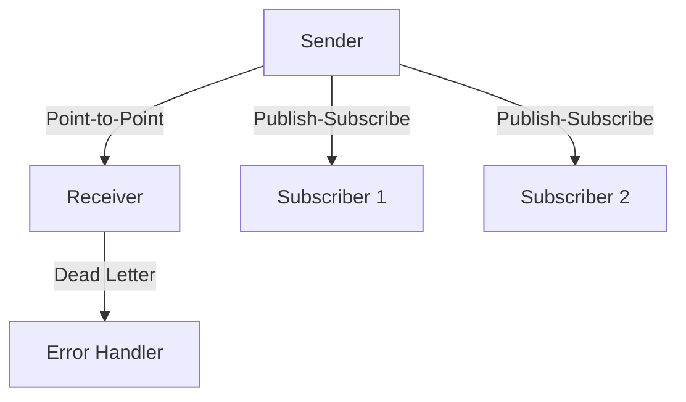
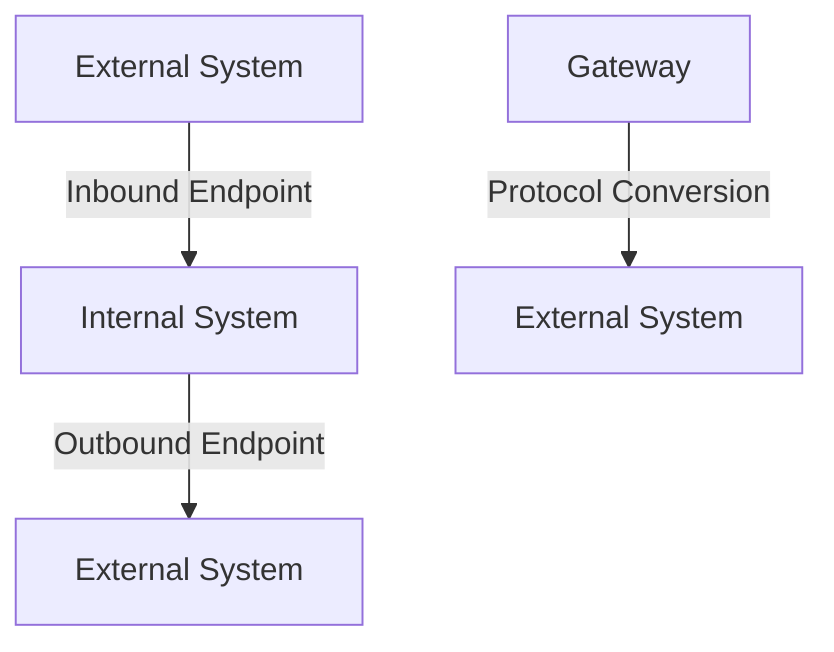

## 14.1 Enterprise Integration Patterns (EIP)

Enterprise Integration Patterns (EIP) are a set of design patterns that provide solutions to common challenges faced when integrating disparate systems. These patterns were popularized by the seminal book "Enterprise Integration Patterns" by Gregor Hohpe and Bobby Woolf, which has become a cornerstone reference for architects and developers working on system integration.

### Understanding Enterprise Integration Patterns

Enterprise Integration Patterns are essential for designing robust integration solutions that enable seamless communication between different systems. These patterns address various aspects of integration, such as message routing, transformation, and processing, providing a structured approach to solving integration problems.

#### The Purpose of EIPs

The primary purpose of Enterprise Integration Patterns is to offer a standardized approach to integrating systems, ensuring that communication between them is efficient, reliable, and maintainable. By using EIPs, developers can design systems that are more adaptable to change, easier to maintain, and capable of handling complex integration scenarios.

### Significance of EIPs in Modern Architectures

In today's software landscape, where microservices and cloud-native architectures are prevalent, the importance of EIPs cannot be overstated. These patterns help in managing the complexity of integrating multiple services, each with its own data formats, protocols, and communication requirements.

#### Categories of Enterprise Integration Patterns

Enterprise Integration Patterns can be broadly categorized into four main areas:

1. **Messaging Channels**: These patterns deal with the pathways through which messages are sent and received. They define how messages are transported between systems.

2. **Message Routing**: These patterns determine how messages are directed from one system to another, based on specific criteria or rules.

3. **Message Transformation**: These patterns focus on converting messages from one format to another, ensuring that different systems can understand and process the data.

4. **Endpoints**: These patterns define the interfaces through which systems send and receive messages, acting as the entry and exit points for communication.

### Messaging Channels

Messaging channels are the backbone of any integration solution, providing the means for systems to communicate with each other. They can be thought of as virtual pipes that carry messages between different components.

#### Types of Messaging Channels

- **Point-to-Point Channel**: A direct communication link between two systems. Messages sent on this channel are consumed by a single receiver.

- **Publish-Subscribe Channel**: A channel where messages are broadcast to multiple subscribers. Each subscriber receives a copy of the message.

- **Dead Letter Channel**: A channel used to handle messages that cannot be processed successfully. This ensures that problematic messages do not disrupt the flow of communication.



*Diagram: Messaging Channels - Point-to-Point, Publish-Subscribe, and Dead Letter Channels.*

### Message Routing

Message routing patterns determine how messages are directed to their appropriate destinations. These patterns are crucial for ensuring that messages reach the correct system or component.

#### Common Routing Patterns

- **Content-Based Router**: Routes messages based on their content. This pattern is useful when different types of messages need to be processed by different systems.

- **Message Filter**: Filters out unwanted messages, allowing only those that meet specific criteria to pass through.

- **Splitter**: Breaks a single message into multiple smaller messages, which can be processed independently.

```java
// Example of a Content-Based Router using Apache Camel
from("direct:start")
    .choice()
        .when(header("type").isEqualTo("order"))
            .to("direct:orderProcessing")
        .when(header("type").isEqualTo("invoice"))
            .to("direct:invoiceProcessing")
        .otherwise()
            .to("direct:error");
```

*Java Code: Content-Based Router using Apache Camel.*

### Message Transformation

Message transformation patterns are used to convert messages from one format to another. This is essential when integrating systems that use different data formats or protocols.

#### Key Transformation Patterns

- **Message Translator**: Converts a message from one format to another. This pattern is often used to bridge the gap between systems with incompatible data formats.

- **Envelope Wrapper**: Wraps a message with additional information, such as metadata or headers, to facilitate processing by other systems.

- **Aggregator**: Combines multiple messages into a single message, often used to consolidate data from different sources.

```java
// Example of a Message Translator using Spring Integration
@Bean
public IntegrationFlow transformFlow() {
    return IntegrationFlows.from("inputChannel")
        .transform(Transformers.fromJson(Order.class))
        .transform(order -> new Invoice(order.getId(), order.getAmount()))
        .channel("outputChannel")
        .get();
}
```

*Java Code: Message Translator using Spring Integration.*

### Endpoints

Endpoints are the interfaces through which systems send and receive messages. They act as the entry and exit points for communication, providing a standardized way for systems to interact.

#### Types of Endpoints

- **Inbound Endpoint**: Receives messages from external systems and passes them to the internal processing components.

- **Outbound Endpoint**: Sends messages from the internal system to external systems.

- **Gateway**: Acts as a bridge between different communication protocols, enabling seamless interaction between systems.



*Diagram: Endpoints - Inbound, Outbound, and Gateway.*

### Applicability of EIPs in Modern Architectures

Enterprise Integration Patterns are highly applicable in modern microservices and cloud-native architectures. They provide a structured approach to managing the complexity of integrating multiple services, each with its own data formats, protocols, and communication requirements.

#### Benefits of Using EIPs

- **Scalability**: EIPs enable systems to scale by decoupling components and allowing them to communicate asynchronously.

- **Flexibility**: By using EIPs, systems can easily adapt to changes in business requirements or technology.

- **Maintainability**: EIPs promote a modular architecture, making it easier to maintain and update individual components without affecting the entire system.

### Tools and Frameworks for Implementing EIPs

Several tools and frameworks implement Enterprise Integration Patterns, making it easier for developers to design and build integration solutions.

#### Apache Camel

Apache Camel is a powerful open-source integration framework that provides a comprehensive set of EIPs. It allows developers to define integration routes using a simple, domain-specific language.

- **Website**: [Apache Camel](https://camel.apache.org/)

#### Spring Integration

Spring Integration is a part of the Spring framework that provides support for building message-driven applications. It offers a wide range of EIPs and integrates seamlessly with other Spring components.

- **Website**: [Spring Integration](https://spring.io/projects/spring-integration)

### Conclusion

Enterprise Integration Patterns are a vital tool for developers and architects working on system integration. By providing a standardized approach to solving integration challenges, EIPs enable the creation of robust, scalable, and maintainable systems. Whether working with microservices, cloud-native architectures, or traditional enterprise systems, EIPs offer valuable solutions for connecting disparate systems.

### Quiz: Test Your Knowledge of Enterprise Integration Patterns



### What is the primary purpose of Enterprise Integration Patterns?

- [x] To provide standardized solutions for integrating disparate systems.
- [ ] To improve the performance of individual applications.
- [ ] To simplify the user interface design.
- [ ] To enhance database management.

> **Explanation:** Enterprise Integration Patterns offer standardized solutions for integrating disparate systems, ensuring efficient and reliable communication.

### Which book popularized Enterprise Integration Patterns?

- [x] "Enterprise Integration Patterns" by Gregor Hohpe and Bobby Woolf
- [ ] "Design Patterns" by Erich Gamma et al.
- [ ] "Clean Code" by Robert C. Martin
- [ ] "Refactoring" by Martin Fowler

> **Explanation:** The book "Enterprise Integration Patterns" by Gregor Hohpe and Bobby Woolf is the seminal work that popularized these patterns.

### Which pattern is used to route messages based on their content?

- [x] Content-Based Router
- [ ] Message Filter
- [ ] Splitter
- [ ] Aggregator

> **Explanation:** The Content-Based Router pattern routes messages based on their content, directing them to the appropriate destination.

### What is the role of a Message Translator?

- [x] To convert a message from one format to another.
- [ ] To filter out unwanted messages.
- [ ] To aggregate multiple messages into one.
- [ ] To split a message into multiple parts.

> **Explanation:** A Message Translator converts a message from one format to another, enabling communication between systems with different data formats.

### Which pattern is used to handle messages that cannot be processed successfully?

- [x] Dead Letter Channel
- [ ] Point-to-Point Channel
- [ ] Publish-Subscribe Channel
- [ ] Gateway

> **Explanation:** The Dead Letter Channel pattern is used to handle messages that cannot be processed successfully, preventing them from disrupting the communication flow.

### What is the main benefit of using a Publish-Subscribe Channel?

- [x] It allows multiple subscribers to receive a copy of the message.
- [ ] It ensures messages are consumed by a single receiver.
- [ ] It converts messages from one format to another.
- [ ] It filters out unwanted messages.

> **Explanation:** A Publish-Subscribe Channel allows multiple subscribers to receive a copy of the message, enabling broadcast communication.

### Which tool is an open-source integration framework that provides a comprehensive set of EIPs?

- [x] Apache Camel
- [ ] Spring Boot
- [ ] Hibernate
- [ ] JUnit

> **Explanation:** Apache Camel is an open-source integration framework that provides a comprehensive set of Enterprise Integration Patterns.

### What is the role of an Inbound Endpoint?

- [x] To receive messages from external systems.
- [ ] To send messages to external systems.
- [ ] To convert messages from one format to another.
- [ ] To filter out unwanted messages.

> **Explanation:** An Inbound Endpoint receives messages from external systems and passes them to the internal processing components.

### Which pattern combines multiple messages into a single message?

- [x] Aggregator
- [ ] Splitter
- [ ] Message Filter
- [ ] Content-Based Router

> **Explanation:** The Aggregator pattern combines multiple messages into a single message, often used to consolidate data from different sources.

### True or False: Enterprise Integration Patterns are only applicable to traditional enterprise systems.

- [ ] True
- [x] False

> **Explanation:** Enterprise Integration Patterns are applicable to both traditional enterprise systems and modern architectures like microservices and cloud-native systems.



By mastering Enterprise Integration Patterns, developers and architects can design systems that are not only robust and scalable but also flexible and maintainable, meeting the demands of modern software development.
