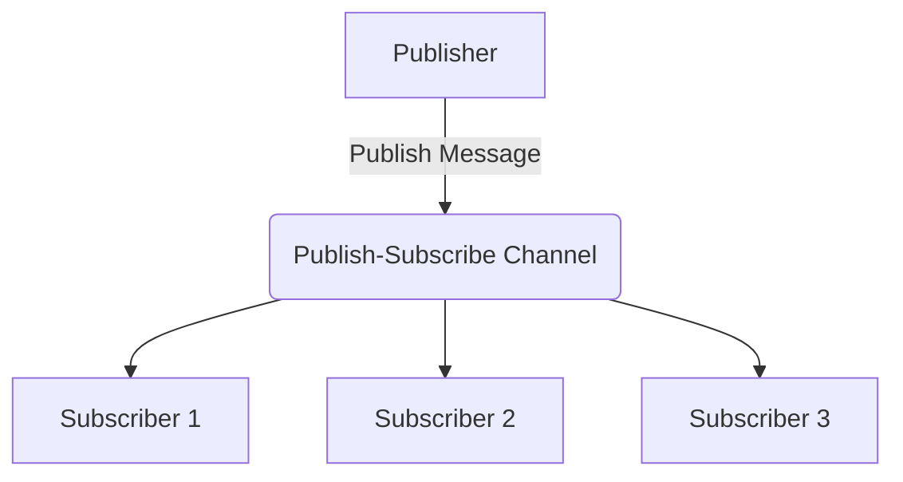

## 14.2.2 Publish-Subscribe Channel

### Introduction

The **Publish-Subscribe Channel** pattern is a fundamental messaging pattern used in software architecture to facilitate communication between different components of a system. It allows a single publisher to broadcast messages to multiple subscribers, enabling a decoupled and scalable architecture. This pattern is particularly useful in scenarios where multiple components need to react to the same event or data change, such as in event broadcasting or notification systems.

### Intent

- **Description**: The Publish-Subscribe Channel pattern is designed to decouple message producers from consumers. It allows a publisher to send a message to a channel, which then broadcasts the message to all interested subscribers. This pattern is essential for building scalable and flexible systems where components can dynamically subscribe to events of interest.

### Also Known As

- **Alternate Names**: Pub-Sub, Event Broadcasting

### Motivation

In modern software systems, especially those built on microservices or event-driven architectures, there is often a need to notify multiple components about certain events. For example, in an e-commerce application, when a new order is placed, various services such as inventory management, billing, and shipping need to be informed. The Publish-Subscribe Channel pattern provides an efficient way to achieve this by allowing services to subscribe to relevant events and react accordingly.

### Applicability

- **Guidelines**: Use the Publish-Subscribe Channel pattern when:
  - You need to broadcast messages to multiple subscribers.
  - Components should not be tightly coupled to the message producer.
  - The system requires scalability and flexibility in handling events.

### Structure



- **Caption**: The diagram illustrates the Publish-Subscribe Channel pattern where a publisher sends messages to a channel, which then broadcasts them to multiple subscribers.

### Participants

- **Publisher**: The component that sends messages to the channel.
- **Publish-Subscribe Channel**: The medium through which messages are broadcast to subscribers.
- **Subscriber**: The component that receives messages from the channel.

### Collaborations

- **Interactions**: The publisher sends messages to the channel. The channel then distributes these messages to all registered subscribers. Subscribers can dynamically subscribe or unsubscribe from the channel.

### Consequences

- **Analysis**: 
  - **Benefits**: 
    - Decouples publishers from subscribers, enhancing system flexibility.
    - Supports dynamic subscription, allowing components to join or leave without affecting others.
    - Facilitates scalability by distributing messages to multiple consumers.
  - **Drawbacks**: 
    - Potential for message overload if too many subscribers are present.
    - Complexity in ensuring message ordering and delivery guarantees.

### Implementation

#### Implementation Guidelines

- Choose a messaging framework that supports the Publish-Subscribe pattern, such as Java Message Service (JMS) or Apache Kafka.
- Define topics or channels for different types of messages.
- Implement publishers to send messages to these topics.
- Implement subscribers to listen for messages on relevant topics.

#### Sample Code Snippets

##### Using Java Message Service (JMS)

```java
import javax.jms.*;

public class Publisher {
    public static void main(String[] args) throws JMSException {
        // Create a connection factory
        ConnectionFactory connectionFactory = new ActiveMQConnectionFactory("tcp://localhost:61616");
        // Create a connection
        Connection connection = connectionFactory.createConnection();
        connection.start();
        // Create a session
        Session session = connection.createSession(false, Session.AUTO_ACKNOWLEDGE);
        // Create a topic
        Topic topic = session.createTopic("exampleTopic");
        // Create a message producer
        MessageProducer producer = session.createProducer(topic);
        // Create a text message
        TextMessage message = session.createTextMessage("Hello, Subscribers!");
        // Send the message
        producer.send(message);
        System.out.println("Message sent: " + message.getText());
        // Clean up
        session.close();
        connection.close();
    }
}

public class Subscriber {
    public static void main(String[] args) throws JMSException {
        // Create a connection factory
        ConnectionFactory connectionFactory = new ActiveMQConnectionFactory("tcp://localhost:61616");
        // Create a connection
        Connection connection = connectionFactory.createConnection();
        connection.start();
        // Create a session
        Session session = connection.createSession(false, Session.AUTO_ACKNOWLEDGE);
        // Create a topic
        Topic topic = session.createTopic("exampleTopic");
        // Create a message consumer
        MessageConsumer consumer = session.createConsumer(topic);
        // Set a message listener
        consumer.setMessageListener(message -> {
            if (message instanceof TextMessage) {
                try {
                    System.out.println("Received message: " + ((TextMessage) message).getText());
                } catch (JMSException e) {
                    e.printStackTrace();
                }
            }
        });
    }
}
```

- **Explanation**: This example demonstrates a simple Publish-Subscribe setup using JMS. The `Publisher` sends a message to a topic, and the `Subscriber` listens for messages on that topic.

##### Using Apache Kafka

```java
import org.apache.kafka.clients.producer.*;
import org.apache.kafka.clients.consumer.*;
import org.apache.kafka.common.serialization.StringSerializer;
import org.apache.kafka.common.serialization.StringDeserializer;

import java.util.Collections;
import java.util.Properties;

public class KafkaPublisher {
    public static void main(String[] args) {
        Properties props = new Properties();
        props.put(ProducerConfig.BOOTSTRAP_SERVERS_CONFIG, "localhost:9092");
        props.put(ProducerConfig.KEY_SERIALIZER_CLASS_CONFIG, StringSerializer.class.getName());
        props.put(ProducerConfig.VALUE_SERIALIZER_CLASS_CONFIG, StringSerializer.class.getName());

        Producer<String, String> producer = new KafkaProducer<>(props);
        producer.send(new ProducerRecord<>("exampleTopic", "Hello, Kafka Subscribers!"));
        producer.close();
    }
}

public class KafkaSubscriber {
    public static void main(String[] args) {
        Properties props = new Properties();
        props.put(ConsumerConfig.BOOTSTRAP_SERVERS_CONFIG, "localhost:9092");
        props.put(ConsumerConfig.GROUP_ID_CONFIG, "exampleGroup");
        props.put(ConsumerConfig.KEY_DESERIALIZER_CLASS_CONFIG, StringDeserializer.class.getName());
        props.put(ConsumerConfig.VALUE_DESERIALIZER_CLASS_CONFIG, StringDeserializer.class.getName());

        Consumer<String, String> consumer = new KafkaConsumer<>(props);
        consumer.subscribe(Collections.singletonList("exampleTopic"));

        while (true) {
            ConsumerRecords<String, String> records = consumer.poll(100);
            for (ConsumerRecord<String, String> record : records) {
                System.out.println("Received message: " + record.value());
            }
        }
    }
}
```

- **Explanation**: This example illustrates the use of Apache Kafka for implementing the Publish-Subscribe pattern. The `KafkaPublisher` sends messages to a Kafka topic, and the `KafkaSubscriber` consumes messages from that topic.

### Sample Use Cases

- **Real-world Scenarios**:
  - **Event Broadcasting**: Broadcasting system-wide events such as user registration or order placement.
  - **Notifications**: Sending notifications to multiple users or systems about updates or alerts.
  - **Log Aggregation**: Collecting logs from various services for centralized analysis.

### Related Patterns

- **Connections**: The Publish-Subscribe Channel pattern is related to the [Observer Pattern]( "Observer Pattern"), as both involve notifying multiple components about changes. However, Publish-Subscribe is more suitable for distributed systems.

### Known Uses

- **Examples in Libraries or Frameworks**:
  - **JMS**: Widely used in enterprise applications for message-oriented middleware.
  - **Apache Kafka**: Popular in big data and real-time analytics for handling high-throughput messaging.

### Considerations

- **Message Ordering**: Ensure that the messaging system supports message ordering if required by the application.
- **Delivery Guarantees**: Choose between at-most-once, at-least-once, or exactly-once delivery semantics based on the application's needs.
- **Scalability**: Consider the scalability of the messaging system to handle a growing number of subscribers.

### Conclusion

The Publish-Subscribe Channel pattern is a powerful tool for building scalable and decoupled systems. By leveraging frameworks like JMS and Apache Kafka, developers can efficiently implement this pattern to broadcast messages to multiple subscribers. Understanding the intricacies of message ordering and delivery guarantees is crucial for ensuring reliable communication in distributed systems.

## Test Your Knowledge: Publish-Subscribe Channel Pattern Quiz



### What is the primary purpose of the Publish-Subscribe Channel pattern?

- [x] To decouple message producers from consumers.
- [ ] To ensure message delivery to a single recipient.
- [ ] To prioritize messages based on importance.
- [ ] To encrypt messages for security.

> **Explanation:** The Publish-Subscribe Channel pattern is designed to decouple message producers from consumers, allowing messages to be broadcast to multiple subscribers.

### Which Java framework is commonly used for implementing the Publish-Subscribe pattern?

- [x] JMS
- [ ] Hibernate
- [ ] Spring MVC
- [ ] JUnit

> **Explanation:** JMS (Java Message Service) is a commonly used framework for implementing the Publish-Subscribe pattern in Java applications.

### In the Publish-Subscribe pattern, what role does the channel play?

- [x] It broadcasts messages to all subscribers.
- [ ] It stores messages for future retrieval.
- [ ] It encrypts messages for security.
- [ ] It prioritizes messages based on importance.

> **Explanation:** The channel in the Publish-Subscribe pattern is responsible for broadcasting messages to all subscribers.

### What is a potential drawback of the Publish-Subscribe pattern?

- [x] Message overload with too many subscribers.
- [ ] Tight coupling between publishers and subscribers.
- [ ] Inability to scale with more subscribers.
- [ ] Lack of message encryption.

> **Explanation:** A potential drawback of the Publish-Subscribe pattern is message overload if there are too many subscribers.

### Which of the following is a real-world use case for the Publish-Subscribe pattern?

- [x] Event Broadcasting
- [ ] Data Encryption
- [x] Notifications
- [ ] Database Transactions

> **Explanation:** The Publish-Subscribe pattern is commonly used for event broadcasting and notifications.

### What is a key consideration when implementing the Publish-Subscribe pattern?

- [x] Message Ordering
- [ ] Data Compression
- [ ] User Authentication
- [ ] File Storage

> **Explanation:** Ensuring message ordering is a key consideration when implementing the Publish-Subscribe pattern.

### Which delivery semantics might be considered in a Publish-Subscribe system?

- [x] At-most-once
- [ ] At-least-twice
- [x] Exactly-once
- [ ] Never-once

> **Explanation:** Delivery semantics such as at-most-once and exactly-once are important considerations in a Publish-Subscribe system.

### How does Apache Kafka support the Publish-Subscribe pattern?

- [x] By allowing producers to send messages to topics and consumers to subscribe to those topics.
- [ ] By encrypting messages for secure transmission.
- [ ] By storing messages in a relational database.
- [ ] By prioritizing messages based on content.

> **Explanation:** Apache Kafka supports the Publish-Subscribe pattern by allowing producers to send messages to topics and consumers to subscribe to those topics.

### What is a benefit of using the Publish-Subscribe pattern?

- [x] Enhanced system flexibility and scalability.
- [ ] Guaranteed message delivery to a single recipient.
- [ ] Simplified message encryption.
- [ ] Reduced system complexity.

> **Explanation:** The Publish-Subscribe pattern enhances system flexibility and scalability by decoupling message producers from consumers.

### True or False: The Publish-Subscribe pattern is suitable for tightly coupled systems.

- [ ] True
- [x] False

> **Explanation:** False. The Publish-Subscribe pattern is designed for decoupling components, making it unsuitable for tightly coupled systems.


