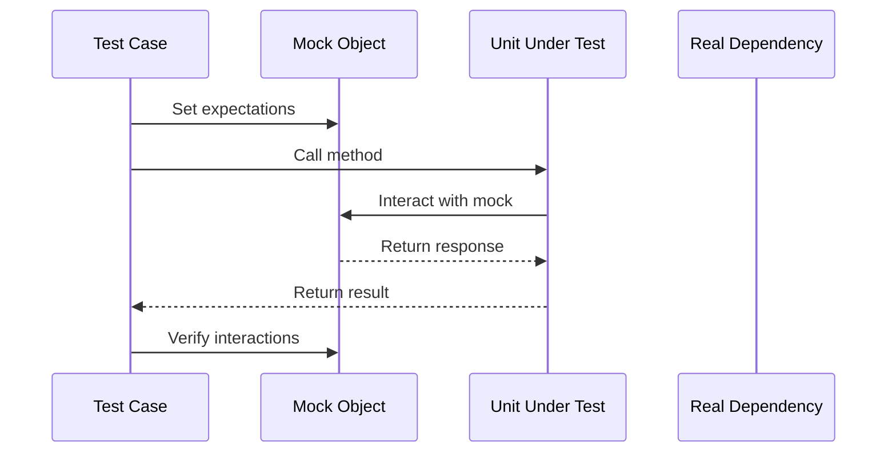

## 14.2 Mocking and Stubs in Pattern Implementation

In the realm of software development, ensuring that individual components function correctly is crucial for building maintainable and scalable systems. This is where unit testing comes into play, and within unit testing, the use of test doubles such as mocks and stubs becomes indispensable. In this section, we will delve into the concepts of mocking and stubbing, their importance in testing design patterns, and how to effectively use them in Java.

### Understanding Test Doubles

Test doubles are objects that stand in for real components in a system during testing. They allow us to isolate the unit under test and control its interactions with the rest of the system. Let's explore the different types of test doubles:

#### Mocks

Mocks are objects that are pre-programmed with expectations which form a specification of the calls they are expected to receive. They are used to verify that certain interactions occur between the unit under test and its dependencies.

#### Stubs

Stubs provide predetermined responses to calls made during the test, usually without any logic. They are used to simulate the behavior of real objects, often to provide indirect input to the unit under test.

#### Spies

Spies are similar to mocks but with the ability to record the interactions they observe, allowing for verification post-execution. They are useful when you want to verify that certain methods were called without pre-programming expectations.

#### Fakes

Fakes are objects that have working implementations but are simplified versions of the real system. They are often used for testing purposes when a full implementation is not feasible.

### Importance in Testing Design Patterns

Design patterns often involve complex interactions between classes and components. Mocks and stubs are particularly useful in these scenarios to isolate the unit under test and simulate various conditions. Let's consider some patterns where mocking is beneficial:

- **Observer Pattern**: Mocks can simulate observers to verify that notifications are sent correctly.
- **Factory Pattern**: Stubs can replace factory methods to test object creation logic without relying on actual implementations.
- **Singleton Pattern**: Mocks can help test singleton behavior by ensuring only one instance is used.

### Using Mocking Frameworks

Java offers several powerful frameworks for mocking, including Mockito, EasyMock, and JMockit. These tools simplify the creation and management of mocks and stubs.

#### Mockito

Mockito is a popular framework known for its simplicity and ease of use. Here's how you can set up a mock using Mockito:

```java
import static org.mockito.Mockito.*;

public class MockExample {
    public static void main(String[] args) {
        // Create a mock object
        List<String> mockedList = mock(List.class);

        // Define behavior
        when(mockedList.get(0)).thenReturn("first");

        // Use the mock
        System.out.println(mockedList.get(0)); // Outputs "first"

        // Verify interactions
        verify(mockedList).get(0);
    }
}
```

#### EasyMock

EasyMock provides a similar functionality with a slightly different syntax. Here's an example:

```java
import org.easymock.EasyMock;
import java.util.List;

public class EasyMockExample {
    public static void main(String[] args) {
        // Create a mock object
        List<String> mockedList = EasyMock.createMock(List.class);

        // Define behavior
        EasyMock.expect(mockedList.get(0)).andReturn("first");
        EasyMock.replay(mockedList);

        // Use the mock
        System.out.println(mockedList.get(0)); // Outputs "first"

        // Verify interactions
        EasyMock.verify(mockedList);
    }
}
```

#### JMockit

JMockit is another powerful tool that supports mocking, stubbing, and spying. Here's a basic example:

```java
import mockit.Expectations;
import mockit.Mocked;
import java.util.List;

public class JMockitExample {
    public static void main(String[] args) {
        // Create a mock object
        @Mocked List<String> mockedList;

        // Define behavior
        new Expectations() {{
            mockedList.get(0); result = "first";
        }};

        // Use the mock
        System.out.println(mockedList.get(0)); // Outputs "first"
    }
}
```

### Code Examples: Mocking in Design Patterns

Let's demonstrate how to use mocks in a class implementing a design pattern. Consider a simple Observer pattern implementation:

```java
// Subject interface
interface Subject {
    void registerObserver(Observer o);
    void notifyObservers();
}

// Observer interface
interface Observer {
    void update(String message);
}

// Concrete Subject
class NewsAgency implements Subject {
    private List<Observer> observers = new ArrayList<>();

    public void registerObserver(Observer o) {
        observers.add(o);
    }

    public void notifyObservers() {
        for (Observer o : observers) {
            o.update("Breaking News!");
        }
    }
}
```

To test the `notifyObservers` method, we can use Mockito to mock the `Observer`:

```java
import static org.mockito.Mockito.*;

public class ObserverTest {
    public static void main(String[] args) {
        // Create a mock observer
        Observer mockObserver = mock(Observer.class);

        // Create a subject and register the mock observer
        NewsAgency newsAgency = new NewsAgency();
        newsAgency.registerObserver(mockObserver);

        // Trigger notification
        newsAgency.notifyObservers();

        // Verify that the observer's update method was called
        verify(mockObserver).update("Breaking News!");
    }
}
```

### Isolation of Units Under Test

Isolating the unit under test is crucial for effective testing. Dependency injection is a common strategy to achieve this, allowing dependencies to be passed into a class rather than being hard-coded. This facilitates mocking and stubbing.

#### Dependency Injection Example

Consider a simple service class:

```java
class UserService {
    private final UserRepository userRepository;

    // Dependency injection via constructor
    public UserService(UserRepository userRepository) {
        this.userRepository = userRepository;
    }

    public void addUser(String user) {
        userRepository.save(user);
    }
}
```

To test `UserService`, we can inject a mock `UserRepository`:

```java
import static org.mockito.Mockito.*;

public class UserServiceTest {
    public static void main(String[] args) {
        // Create a mock repository
        UserRepository mockRepository = mock(UserRepository.class);

        // Inject the mock into the service
        UserService userService = new UserService(mockRepository);

        // Perform the action
        userService.addUser("John Doe");

        // Verify that the repository's save method was called
        verify(mockRepository).save("John Doe");
    }
}
```

### Best Practices for Mocking

When using mocks and stubs, consider the following best practices:

- **Avoid Over-Reliance on Mocks**: Use mocks judiciously to avoid brittle tests. Over-mocking can lead to tests that are too tightly coupled to implementation details.
- **Mock Behavior, Not Implementation**: Focus on mocking the behavior of dependencies rather than their implementation details.
- **Use Stubs for Simple Returns**: When you only need to provide simple return values, prefer stubs over mocks.

### Common Pitfalls

Be aware of common pitfalls when using mocks and stubs:

- **Brittle Tests**: Tests that break with minor changes in implementation can be a sign of over-mocking.
- **Ignoring Integration**: While unit tests are important, don't neglect integration tests that verify the system as a whole.

### Real-World Scenarios

In real-world projects, mocks and stubs can significantly enhance test effectiveness. For instance, in a large-scale enterprise application, using mocks to simulate external services can speed up testing and reduce costs associated with setting up test environments.

### Try It Yourself

Experiment with the provided code examples by modifying the behavior of mocks and observing the effects. Try adding new methods to the interfaces and see how you can mock them in tests.

### Visualizing Mocking and Stubbing

To better understand the interaction between mocks, stubs, and the unit under test, consider the following sequence diagram:



This diagram illustrates the flow of a typical test case using mocks, where the test sets expectations on the mock, calls the method on the unit under test, and verifies the interactions.

### Knowledge Check

Before moving on, consider these questions to reinforce your understanding:

- What are the differences between mocks and stubs?
- How can dependency injection facilitate mocking?
- Why is it important to mock behavior rather than implementation details?

### Conclusion

Mocking and stubbing are powerful techniques in the toolbox of a software engineer, especially when implementing and testing design patterns. By isolating units under test and controlling their interactions, we can ensure robust and reliable software. Remember, this is just the beginning. As you progress, you'll build more complex and interactive systems. Keep experimenting, stay curious, and enjoy the journey!

## Quiz Time!



### What is the primary purpose of using mocks in unit testing?

- [x] To verify interactions between the unit under test and its dependencies
- [ ] To provide actual implementations of dependencies
- [ ] To simulate user interfaces
- [ ] To replace the need for integration testing

> **Explanation:** Mocks are used to verify that certain interactions occur between the unit under test and its dependencies.

### Which of the following is a characteristic of a stub?

- [x] It provides predetermined responses to calls made during the test
- [ ] It records interactions for later verification
- [ ] It has a full working implementation
- [ ] It is used to verify interactions

> **Explanation:** Stubs provide predetermined responses to calls made during the test, often to simulate the behavior of real objects.

### What is a common pitfall when using mocks excessively?

- [x] Brittle tests that break with minor changes in implementation
- [ ] Increased test coverage
- [ ] Reduced test execution time
- [ ] Improved integration testing

> **Explanation:** Over-mocking can lead to brittle tests that are too tightly coupled to implementation details.

### Which Java framework is known for its simplicity and ease of use in mocking?

- [x] Mockito
- [ ] JUnit
- [ ] TestNG
- [ ] JMockit

> **Explanation:** Mockito is a popular framework known for its simplicity and ease of use in mocking.

### What is the role of dependency injection in testing?

- [x] It facilitates the injection of mock objects into the unit under test
- [ ] It replaces the need for unit testing
- [ ] It increases the complexity of the code
- [ ] It is used only in production code

> **Explanation:** Dependency injection facilitates the injection of mock objects into the unit under test, allowing for easier isolation and testing.

### How does a spy differ from a mock?

- [x] A spy records interactions for later verification
- [ ] A spy provides predetermined responses
- [ ] A spy has a full working implementation
- [ ] A spy is used to replace real objects

> **Explanation:** Spies record the interactions they observe, allowing for verification post-execution.

### Why should you avoid over-reliance on mocks?

- [x] To prevent brittle tests that are too tightly coupled to implementation details
- [ ] To increase test execution time
- [ ] To reduce test coverage
- [ ] To eliminate the need for integration testing

> **Explanation:** Over-reliance on mocks can lead to brittle tests that are too tightly coupled to implementation details.

### What is a fake in the context of test doubles?

- [x] An object with a working implementation but simplified for testing
- [ ] An object that records interactions
- [ ] An object that provides predetermined responses
- [ ] An object used to verify interactions

> **Explanation:** Fakes are objects that have working implementations but are simplified versions of the real system, often used for testing purposes.

### In which design pattern is mocking particularly useful for simulating observers?

- [x] Observer Pattern
- [ ] Singleton Pattern
- [ ] Factory Pattern
- [ ] Strategy Pattern

> **Explanation:** Mocks can simulate observers to verify that notifications are sent correctly in the Observer Pattern.

### True or False: Stubs are used to verify interactions between the unit under test and its dependencies.

- [ ] True
- [x] False

> **Explanation:** Stubs provide predetermined responses to calls made during the test, but they do not verify interactions.


