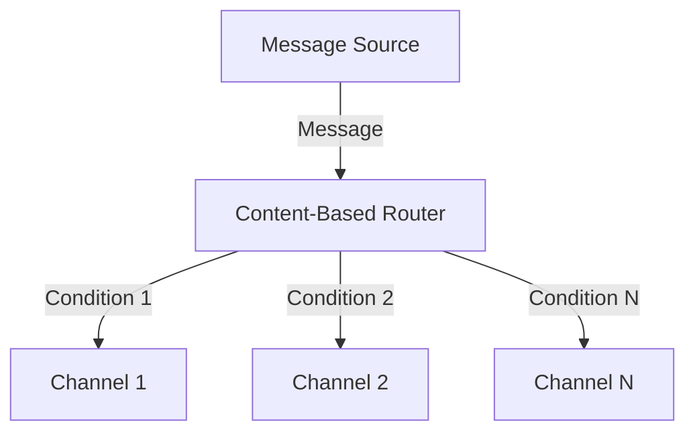

## 14.3.1 Content-Based Router

### Introduction

In the realm of enterprise integration patterns, the **Content-Based Router** stands out as a pivotal design pattern that facilitates the dynamic routing of messages based on their content. This pattern is instrumental in scenarios where messages need to be directed to different processing channels depending on specific criteria extracted from the message itself. By leveraging this pattern, developers can create flexible and maintainable systems that adapt to varying message formats and processing requirements.

### Intent

- **Description**: The Content-Based Router pattern is designed to route messages to different channels based on the content of the message. It inspects the message and applies routing logic to determine the appropriate destination channel.

### Also Known As

- **Alternate Names**: Content-Based Dispatcher

### Motivation

In complex systems, messages often need to be processed differently based on their content. For instance, an order processing system might route high-priority orders to a fast-track processing channel, while standard orders follow a regular processing path. The Content-Based Router pattern provides a mechanism to implement such conditional routing logic efficiently.

### Applicability

- **Guidelines**: Use the Content-Based Router pattern when:
  - Messages need to be routed to different destinations based on their content.
  - The system requires flexibility to adapt to new message types or routing rules.
  - You need to decouple message producers from consumers, allowing for independent evolution.

### Structure



- **Caption**: The diagram illustrates the Content-Based Router pattern, where messages are routed to different channels based on evaluated conditions.

### Participants

- **Message Source**: The originator of the message.
- **Content-Based Router**: Inspects the message content and applies routing logic.
- **Channels**: Different destinations where messages are routed based on conditions.

### Collaborations

- **Interactions**: The Content-Based Router evaluates the message content using predicates or expressions and routes the message to the appropriate channel.

### Consequences

- **Analysis**: 
  - **Benefits**: 
    - Flexibility in routing logic.
    - Decoupling of message producers and consumers.
    - Simplified maintenance and scalability.
  - **Drawbacks**: 
    - Potential performance overhead due to content inspection.
    - Dependency on message format consistency.

### Implementation

#### Implementation Guidelines

To implement a Content-Based Router in Java, you can use frameworks like Apache Camel or Spring Integration, which provide robust support for message routing based on content.

#### Sample Code Snippets

##### Using Apache Camel

Apache Camel is a powerful integration framework that simplifies the implementation of enterprise integration patterns, including the Content-Based Router.

```java
import org.apache.camel.CamelContext;
import org.apache.camel.builder.RouteBuilder;
import org.apache.camel.impl.DefaultCamelContext;

public class ContentBasedRouterExample {
    public static void main(String[] args) throws Exception {
        CamelContext context = new DefaultCamelContext();
        context.addRoutes(new RouteBuilder() {
            @Override
            public void configure() {
                from("direct:start")
                    .choice()
                        .when(simple("${body} contains 'urgent'"))
                            .to("direct:urgent")
                        .when(simple("${body} contains 'standard'"))
                            .to("direct:standard")
                        .otherwise()
                            .to("direct:other");
            }
        });

        context.start();
        // Send test messages
        context.createProducerTemplate().sendBody("direct:start", "This is an urgent message");
        context.createProducerTemplate().sendBody("direct:start", "This is a standard message");
        context.stop();
    }
}
```

- **Explanation**: This example demonstrates a simple Content-Based Router using Apache Camel. Messages are routed to different channels based on their content, evaluated using simple expressions.

##### Using Spring Integration

Spring Integration provides a comprehensive framework for building message-driven applications, including support for content-based routing.

```java
import org.springframework.context.annotation.Bean;
import org.springframework.context.annotation.Configuration;
import org.springframework.integration.annotation.ServiceActivator;
import org.springframework.integration.channel.DirectChannel;
import org.springframework.integration.router.PayloadTypeRouter;
import org.springframework.messaging.MessageChannel;

@Configuration
public class ContentBasedRouterConfig {

    @Bean
    public MessageChannel inputChannel() {
        return new DirectChannel();
    }

    @Bean
    public MessageChannel urgentChannel() {
        return new DirectChannel();
    }

    @Bean
    public MessageChannel standardChannel() {
        return new DirectChannel();
    }

    @Bean
    @ServiceActivator(inputChannel = "inputChannel")
    public PayloadTypeRouter router() {
        PayloadTypeRouter router = new PayloadTypeRouter();
        router.setChannelMapping(String.class.getName(), "urgentChannel");
        router.setChannelMapping(Integer.class.getName(), "standardChannel");
        return router;
    }
}
```

- **Explanation**: This Spring Integration example uses a `PayloadTypeRouter` to route messages based on their payload type. The router directs messages to different channels depending on whether the payload is a `String` or an `Integer`.

### Sample Use Cases

- **Real-world Scenarios**:
  - **Order Processing**: Route orders to different processing channels based on priority or type.
  - **Log Management**: Direct log messages to different storage systems based on severity.
  - **Notification Systems**: Send notifications to different channels (e.g., email, SMS) based on user preferences.

### Related Patterns

- **Connections**: The Content-Based Router pattern is often used in conjunction with other routing patterns such as [14.3.2 Message Filter]( "Message Filter") and [14.3.3 Dynamic Router]( "Dynamic Router").

### Known Uses

- **Examples in Libraries or Frameworks**: 
  - **Apache Camel**: Widely used in enterprise applications for implementing content-based routing.
  - **Spring Integration**: Provides comprehensive support for message routing and transformation.

### Performance Considerations

When implementing a Content-Based Router, consider the following performance aspects:

- **Message Inspection Overhead**: Inspecting message content can introduce latency, especially with large or complex messages. Optimize predicates and expressions to minimize processing time.
- **Message Format Dependencies**: Ensure consistent message formats to avoid routing errors. Consider using a schema validation mechanism to enforce format consistency.

### Exercises

1. **Modify the Apache Camel example** to route messages based on additional criteria, such as message length or specific keywords.
2. **Implement a Content-Based Router** using Spring Integration that routes messages to different channels based on custom header values.

### Conclusion

The Content-Based Router pattern is a powerful tool for building flexible and maintainable message-driven systems. By leveraging frameworks like Apache Camel and Spring Integration, developers can implement sophisticated routing logic that adapts to changing business requirements. As you explore this pattern, consider the performance implications and strive for efficient message inspection and routing strategies.

---

## Test Your Knowledge: Content-Based Router in Java Quiz



### What is the primary purpose of the Content-Based Router pattern?

- [x] To route messages to different channels based on their content.
- [ ] To transform message formats between systems.
- [ ] To aggregate multiple messages into a single message.
- [ ] To split a message into multiple parts.

> **Explanation:** The Content-Based Router pattern inspects message content to determine the appropriate routing channel.

### Which Java framework is commonly used for implementing the Content-Based Router pattern?

- [x] Apache Camel
- [x] Spring Integration
- [ ] Hibernate
- [ ] JUnit

> **Explanation:** Both Apache Camel and Spring Integration provide robust support for implementing the Content-Based Router pattern.

### In Apache Camel, which method is used to define routing logic based on message content?

- [x] choice()
- [ ] split()
- [ ] aggregate()
- [ ] transform()

> **Explanation:** The `choice()` method in Apache Camel is used to define conditional routing logic based on message content.

### What is a potential drawback of using the Content-Based Router pattern?

- [x] Performance overhead due to message inspection.
- [ ] Inability to handle multiple message formats.
- [ ] Lack of flexibility in routing logic.
- [ ] Increased coupling between message producers and consumers.

> **Explanation:** Inspecting message content can introduce performance overhead, especially with large or complex messages.

### How does Spring Integration's PayloadTypeRouter determine routing channels?

- [x] Based on the payload type of the message.
- [ ] Based on message headers.
- [ ] Based on message size.
- [ ] Based on message priority.

> **Explanation:** The `PayloadTypeRouter` in Spring Integration routes messages based on their payload type.

### Which of the following is a real-world use case for the Content-Based Router pattern?

- [x] Routing orders to different processing channels based on priority.
- [ ] Aggregating log messages from multiple sources.
- [ ] Transforming XML messages to JSON format.
- [ ] Splitting a large file into smaller chunks.

> **Explanation:** The Content-Based Router pattern is often used to route orders to different processing channels based on criteria such as priority.

### What is a key benefit of using the Content-Based Router pattern?

- [x] Flexibility in routing logic.
- [ ] Simplified message transformation.
- [ ] Reduced message size.
- [ ] Increased message security.

> **Explanation:** The Content-Based Router pattern provides flexibility in defining routing logic based on message content.

### In the provided Apache Camel example, which channel does a message containing "urgent" get routed to?

- [x] direct:urgent
- [ ] direct:standard
- [ ] direct:other
- [ ] direct:default

> **Explanation:** Messages containing "urgent" are routed to the `direct:urgent` channel in the Apache Camel example.

### What should be considered to optimize performance when using a Content-Based Router?

- [x] Optimize predicates and expressions for message inspection.
- [ ] Increase message size.
- [ ] Use complex message formats.
- [ ] Decrease the number of routing channels.

> **Explanation:** Optimizing predicates and expressions can help minimize the performance overhead of message inspection.

### True or False: The Content-Based Router pattern can only be used with XML messages.

- [x] False
- [ ] True

> **Explanation:** The Content-Based Router pattern can be used with any message format, not just XML.



---

By mastering the Content-Based Router pattern, Java developers and software architects can enhance their ability to design efficient and adaptable message-driven systems. This pattern is a cornerstone of enterprise integration, enabling dynamic routing decisions that align with business needs.
