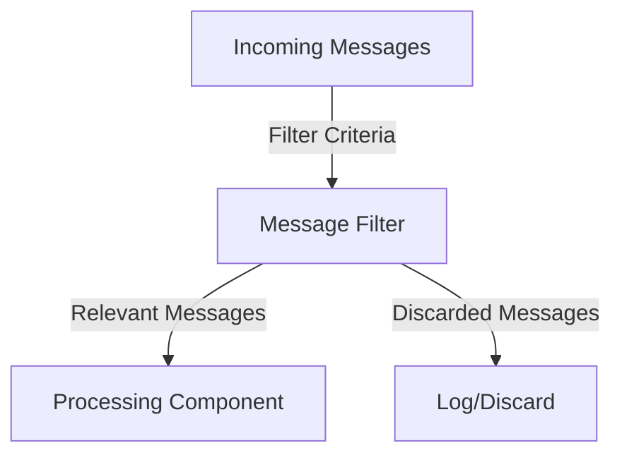

## 14.3.2 Message Filter

### Introduction

In the realm of software architecture, particularly within integration systems, the **Message Filter** pattern plays a pivotal role. This pattern is designed to selectively filter out messages that do not meet specific criteria, ensuring that only relevant messages are processed further. By implementing the Message Filter pattern, developers can enhance the efficiency and performance of their systems, preventing unnecessary processing and potential bottlenecks.

### Intent

- **Description**: The Message Filter pattern is used to examine incoming messages and discard those that do not meet predefined criteria. This pattern is essential in systems where message processing resources are limited or where only specific messages are relevant to the business logic.

### Also Known As

- **Alternate Names**: Content-based Router, Message Selector

### Motivation

In modern distributed systems, especially those involving message-driven architectures, the volume of messages can be overwhelming. Not all messages are pertinent to every component of the system. The Message Filter pattern allows systems to focus on processing only those messages that are relevant, thereby optimizing resource utilization and improving overall system performance.

### Applicability

- **Guidelines**: Use the Message Filter pattern when:
  - You need to process only specific types of messages based on content or metadata.
  - You want to reduce the load on downstream systems by filtering out irrelevant messages early.
  - You are dealing with high-volume message streams where processing every message is impractical.

### Structure



- **Caption**: The diagram illustrates the flow of messages through the Message Filter, where only relevant messages are passed to the processing component.

### Participants

- **Message Source**: The origin of the messages that need to be filtered.
- **Message Filter**: The component that applies filtering criteria to incoming messages.
- **Processing Component**: The system or component that processes the filtered messages.
- **Log/Discard**: Optional component where discarded messages are logged or permanently removed.

### Collaborations

- **Interactions**: The Message Filter receives messages from the Message Source, applies the filtering criteria, and forwards only the relevant messages to the Processing Component. Discarded messages can be logged for auditing or analysis.

### Consequences

- **Analysis**: 
  - **Benefits**: Reduces unnecessary processing, improves system performance, and ensures that only relevant messages are processed.
  - **Drawbacks**: Implementing complex filtering logic can introduce latency, and incorrect filtering criteria may lead to loss of important messages.

### Implementation

#### Implementation Guidelines

- Define clear and concise filtering criteria to ensure efficient message filtering.
- Consider the use of Java Streams and Lambda expressions for concise and readable filter implementations.
- Ensure that the filtering logic is optimized to prevent performance bottlenecks.

#### Sample Code Snippets

```java
import java.util.ArrayList;
import java.util.List;
import java.util.function.Predicate;
import java.util.stream.Collectors;

// Message class representing a simple message structure
class Message {
    private String content;
    private String type;

    public Message(String content, String type) {
        this.content = content;
        this.type = type;
    }

    public String getContent() {
        return content;
    }

    public String getType() {
        return type;
    }
}

// MessageFilter class implementing the filter logic
class MessageFilter {
    public List<Message> filterMessages(List<Message> messages, Predicate<Message> criteria) {
        return messages.stream()
                .filter(criteria)
                .collect(Collectors.toList());
    }
}

// Example usage
public class MessageFilterExample {
    public static void main(String[] args) {
        List<Message> messages = new ArrayList<>();
        messages.add(new Message("Hello World", "greeting"));
        messages.add(new Message("Buy now!", "advertisement"));
        messages.add(new Message("Meeting at 10 AM", "reminder"));

        MessageFilter filter = new MessageFilter();

        // Define filtering criteria: only process messages of type "greeting"
        Predicate<Message> criteria = message -> "greeting".equals(message.getType());

        List<Message> filteredMessages = filter.filterMessages(messages, criteria);

        filteredMessages.forEach(msg -> System.out.println("Filtered Message: " + msg.getContent()));
    }
}
```

- **Explanation**: This example demonstrates a simple implementation of the Message Filter pattern using Java Streams. The `MessageFilter` class filters messages based on a given predicate, allowing for flexible and efficient message filtering.

### Sample Use Cases

- **Spam Filtering**: In email systems, the Message Filter pattern can be used to filter out spam messages based on content analysis.
- **Data Cleansing**: In data processing pipelines, irrelevant or malformed data can be filtered out before further processing.
- **Event Processing**: In event-driven architectures, only events of interest are processed, reducing the load on event handlers.

### Related Patterns

- **Connections**: The Message Filter pattern is related to the [14.3.1 Content-based Router]( "Content-based Router") pattern, which routes messages based on content but does not discard them.

### Known Uses

- **Examples in Libraries or Frameworks**: The Apache Camel framework provides a Message Filter component that allows for declarative message filtering in integration routes.

### Best Practices

- **Optimize Filtering Logic**: Ensure that the filtering logic is efficient to prevent performance degradation.
- **Monitor and Log Discarded Messages**: Keep track of discarded messages for auditing and debugging purposes.
- **Test Filtering Criteria**: Thoroughly test the filtering criteria to avoid unintended message loss.

### Conclusion

The Message Filter pattern is an essential tool in the arsenal of software architects and developers working with message-driven systems. By implementing this pattern, systems can efficiently manage message flows, ensuring that only relevant messages are processed. This not only optimizes resource utilization but also enhances the overall performance and reliability of the system.

---

## Test Your Knowledge: Java Message Filter Pattern Quiz



### What is the primary purpose of the Message Filter pattern?

- [x] To selectively filter out messages that do not meet specific criteria.
- [ ] To route messages to different destinations based on content.
- [ ] To aggregate messages from multiple sources.
- [ ] To transform message formats.

> **Explanation:** The Message Filter pattern is designed to filter out messages that do not meet predefined criteria, ensuring that only relevant messages are processed.

### Which Java feature can be used to implement concise filtering logic in the Message Filter pattern?

- [x] Java Streams
- [ ] Java Reflection
- [ ] Java Annotations
- [ ] Java Serialization

> **Explanation:** Java Streams, along with Lambda expressions, provide a concise and efficient way to implement filtering logic in the Message Filter pattern.

### In which scenario is the Message Filter pattern most beneficial?

- [x] When processing only specific types of messages is necessary.
- [ ] When all messages need to be transformed into a different format.
- [ ] When messages need to be aggregated from multiple sources.
- [ ] When messages need to be split into smaller parts.

> **Explanation:** The Message Filter pattern is beneficial when only specific types of messages need to be processed, reducing unnecessary load on the system.

### What is a potential drawback of implementing complex filtering logic in the Message Filter pattern?

- [x] It can introduce latency.
- [ ] It can increase message throughput.
- [ ] It can simplify message processing.
- [ ] It can enhance message security.

> **Explanation:** Complex filtering logic can introduce latency, affecting the performance of the message processing system.

### How can discarded messages be managed in the Message Filter pattern?

- [x] By logging them for auditing purposes.
- [ ] By transforming them into a different format.
- [x] By permanently deleting them.
- [ ] By routing them to another system.

> **Explanation:** Discarded messages can be logged for auditing or permanently deleted, depending on the system's requirements.

### What is the relationship between the Message Filter pattern and the Content-based Router pattern?

- [x] Both patterns involve examining message content.
- [ ] Both patterns transform message formats.
- [ ] Both patterns aggregate messages.
- [ ] Both patterns split messages into smaller parts.

> **Explanation:** Both the Message Filter and Content-based Router patterns involve examining message content, but the Message Filter discards messages while the Content-based Router routes them.

### Which component is responsible for applying filtering criteria in the Message Filter pattern?

- [x] Message Filter
- [ ] Message Source
- [ ] Processing Component
- [ ] Log/Discard

> **Explanation:** The Message Filter component is responsible for applying filtering criteria to incoming messages.

### What is a common use case for the Message Filter pattern?

- [x] Spam filtering in email systems.
- [ ] Message transformation in data pipelines.
- [ ] Message aggregation in distributed systems.
- [ ] Message splitting in event processing.

> **Explanation:** A common use case for the Message Filter pattern is spam filtering in email systems, where irrelevant messages are discarded.

### Why is it important to test filtering criteria in the Message Filter pattern?

- [x] To avoid unintended message loss.
- [ ] To increase message throughput.
- [ ] To simplify message processing.
- [ ] To enhance message security.

> **Explanation:** Testing filtering criteria is crucial to avoid unintended message loss and ensure that only relevant messages are processed.

### True or False: The Message Filter pattern can help prevent bottlenecks in message-driven systems.

- [x] True
- [ ] False

> **Explanation:** By filtering out irrelevant messages early, the Message Filter pattern helps prevent bottlenecks and optimizes resource utilization in message-driven systems.



---
