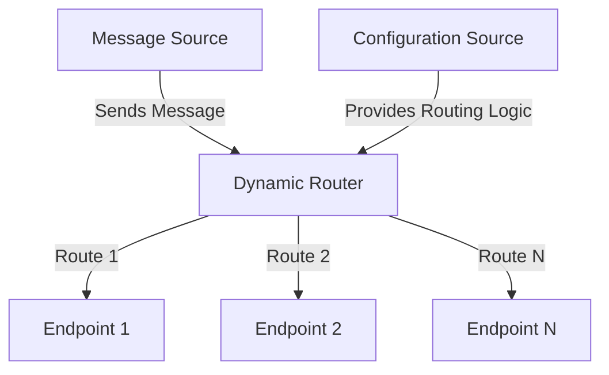

## 14.3.3 Dynamic Router

### Introduction

In the realm of software architecture, the ability to route messages dynamically based on changing conditions is crucial for building flexible and adaptable systems. The **Dynamic Router** pattern is a powerful tool in the integration patterns arsenal, allowing developers to direct messages to different endpoints based on dynamic conditions or external configurations. This pattern is particularly useful in scenarios where routing logic needs to be modified at runtime without redeploying the application, such as in multi-tenant systems or environments with frequently changing business rules.

### Intent

- **Description**: The Dynamic Router pattern enables the routing of messages to different endpoints based on dynamic conditions or configurations. It allows the routing logic to be altered at runtime, providing flexibility and adaptability in message-driven systems.

### Also Known As

- **Alternate Names**: Dynamic Routing, Adaptive Router

### Motivation

In modern software systems, especially those that are distributed or service-oriented, the need to adapt to changing conditions is paramount. Consider a scenario where a business needs to route customer orders to different fulfillment centers based on current inventory levels or delivery times. Hardcoding such logic into the application would make it inflexible and difficult to maintain. The Dynamic Router pattern addresses this challenge by allowing routing decisions to be made based on dynamic conditions, such as data from a database, configuration files, or external services.

### Applicability

- **Guidelines**: Use the Dynamic Router pattern when:
  - Routing logic needs to change frequently or at runtime.
  - The system must adapt to varying business rules or conditions.
  - There is a need to integrate with external systems or services that influence routing decisions.
  - Building multi-tenant systems where routing logic differs per tenant.

### Structure



- **Caption**: The Dynamic Router pattern routes messages to different endpoints based on dynamic conditions or configurations provided by an external source.

### Participants

- **Message Source**: The originator of the message that needs to be routed.
- **Dynamic Router**: The component responsible for determining the routing path based on dynamic conditions.
- **Endpoints**: The possible destinations for the routed messages.
- **Configuration Source**: An external source (e.g., database, configuration file, service) that provides the routing logic or conditions.

### Collaborations

- **Interactions**: The Message Source sends a message to the Dynamic Router. The Dynamic Router consults the Configuration Source to determine the appropriate routing path and forwards the message to the selected Endpoint.

### Consequences

- **Analysis**:
  - **Benefits**:
    - **Flexibility**: Routing logic can be changed without modifying the application code.
    - **Adaptability**: The system can respond to changing business rules or conditions.
    - **Scalability**: Supports complex routing scenarios in distributed systems.
  - **Drawbacks**:
    - **Complexity**: Managing dynamic routing logic can increase system complexity.
    - **Performance**: Frequent access to external configuration sources may impact performance.

### Implementation

#### Implementation Guidelines

To implement the Dynamic Router pattern in Java, consider using frameworks like Apache Camel or Spring Integration, which provide robust support for message routing and integration patterns.

#### Sample Code Snippets

Here is an example of implementing a Dynamic Router using Apache Camel:

```java
import org.apache.camel.CamelContext;
import org.apache.camel.builder.RouteBuilder;
import org.apache.camel.impl.DefaultCamelContext;

public class DynamicRouterExample {

    public static void main(String[] args) throws Exception {
        CamelContext context = new DefaultCamelContext();

        context.addRoutes(new RouteBuilder() {
            @Override
            public void configure() {
                from("direct:start")
                    .dynamicRouter(method(DynamicRouterBean.class, "route"));
            }
        });

        context.start();
        // Send messages to the route
        context.createProducerTemplate().sendBody("direct:start", "Message 1");
        context.stop();
    }
}

class DynamicRouterBean {
    public String route(String body) {
        // Determine the route based on message content or external conditions
        if (body.contains("Condition1")) {
            return "direct:route1";
        } else if (body.contains("Condition2")) {
            return "direct:route2";
        }
        return null; // End of routing
    }
}
```

- **Explanation**: In this example, a Camel route is defined with a dynamic router that uses a method in `DynamicRouterBean` to determine the routing path based on message content. The `route` method can be extended to include logic that queries external configuration sources.

#### Sample Use Cases

- **Real-world Scenarios**:
  - **Multi-Tenant Systems**: Route messages to different processing pipelines based on tenant-specific configurations.
  - **Order Processing**: Direct orders to different fulfillment centers based on inventory levels or delivery times.
  - **Content Delivery**: Route content requests to different servers based on user location or preferences.

### Related Patterns

- **Connections**:
  - **[6.6 Singleton Pattern]( "Singleton Pattern")**: Can be used to manage configuration sources as single instances.
  - **[14.3.1 Content-Based Router]( "Content-Based Router")**: Similar in routing messages based on content, but Dynamic Router focuses on runtime conditions.

### Known Uses

- **Examples in Libraries or Frameworks**:
  - **Apache Camel**: Provides extensive support for dynamic routing through its EIP (Enterprise Integration Patterns) library.
  - **Spring Integration**: Offers dynamic routing capabilities using its integration framework.

### Challenges and Best Practices

#### Managing Complexity

- **Challenge**: As routing logic becomes more dynamic, managing and maintaining it can become complex.
- **Best Practice**: Use centralized configuration management tools and maintain clear documentation of routing rules.

#### Ensuring Performance

- **Challenge**: Accessing external configuration sources frequently can degrade performance.
- **Best Practice**: Cache configuration data locally and update it periodically to reduce latency.

### Conclusion

The Dynamic Router pattern is a versatile tool for building flexible and adaptable message-driven systems. By allowing routing decisions to be made based on dynamic conditions, it provides the flexibility needed in modern, distributed architectures. However, it is essential to manage the complexity and performance implications carefully to fully leverage its benefits.

### Exercises

1. **Experiment with Apache Camel**: Modify the provided code example to route messages based on external configuration files.
2. **Implement a Dynamic Router in Spring Integration**: Create a similar dynamic routing setup using Spring Integration and compare the approaches.
3. **Design a Multi-Tenant System**: Use the Dynamic Router pattern to design a message routing system for a multi-tenant application, considering tenant-specific configurations.

### Key Takeaways

- The Dynamic Router pattern enables flexible message routing based on dynamic conditions.
- It is particularly useful in scenarios where routing logic needs to change frequently or at runtime.
- Implementing dynamic routing requires careful management of complexity and performance.

### Reflection

Consider how the Dynamic Router pattern can be applied to your current projects. How can it improve flexibility and adaptability in your message-driven systems?

---

## Test Your Knowledge: Dynamic Router Pattern Quiz



### What is the primary purpose of the Dynamic Router pattern?

- [x] To route messages based on dynamic conditions or external configurations.
- [ ] To route messages based on static conditions.
- [ ] To handle message transformation.
- [ ] To manage message persistence.

> **Explanation:** The Dynamic Router pattern is designed to route messages to different endpoints based on dynamic conditions or configurations, allowing for runtime flexibility.

### Which Java framework is commonly used to implement the Dynamic Router pattern?

- [x] Apache Camel
- [ ] Hibernate
- [ ] JUnit
- [ ] Log4j

> **Explanation:** Apache Camel is a popular framework that provides extensive support for implementing the Dynamic Router pattern through its EIP library.

### In the provided code example, what determines the routing path?

- [x] The content of the message
- [ ] The message sender
- [ ] The message timestamp
- [ ] The message size

> **Explanation:** The routing path is determined by the content of the message, as the `route` method in `DynamicRouterBean` checks the message content to decide the route.

### What is a potential drawback of using the Dynamic Router pattern?

- [x] Increased complexity
- [ ] Reduced flexibility
- [ ] Decreased adaptability
- [ ] Limited scalability

> **Explanation:** The Dynamic Router pattern can increase system complexity due to the need to manage dynamic routing logic and external configurations.

### Which scenario is an ideal use case for the Dynamic Router pattern?

- [x] Multi-tenant systems with tenant-specific routing logic
- [ ] Single-threaded applications
- [ ] Static content delivery
- [ ] Simple CRUD operations

> **Explanation:** Multi-tenant systems benefit from the Dynamic Router pattern as it allows for tenant-specific routing logic, enhancing flexibility and adaptability.

### How can performance be improved when using the Dynamic Router pattern?

- [x] Caching configuration data locally
- [ ] Increasing the number of endpoints
- [ ] Reducing the number of routes
- [ ] Using smaller messages

> **Explanation:** Caching configuration data locally helps reduce latency and improve performance by minimizing frequent access to external configuration sources.

### What is a common challenge when implementing the Dynamic Router pattern?

- [x] Managing dynamic routing logic
- [ ] Handling static routing logic
- [ ] Ensuring message integrity
- [ ] Maintaining message order

> **Explanation:** Managing dynamic routing logic can be challenging due to the complexity of maintaining and updating routing rules and configurations.

### Which pattern is related to the Dynamic Router pattern?

- [x] Content-Based Router
- [ ] Singleton Pattern
- [ ] Observer Pattern
- [ ] Factory Pattern

> **Explanation:** The Content-Based Router pattern is related to the Dynamic Router pattern as both involve routing messages based on conditions, but the Dynamic Router focuses on runtime conditions.

### What is a benefit of using the Dynamic Router pattern?

- [x] Flexibility in routing logic
- [ ] Simplicity in implementation
- [ ] Static routing paths
- [ ] Reduced system complexity

> **Explanation:** The Dynamic Router pattern provides flexibility in routing logic, allowing it to be changed at runtime based on dynamic conditions.

### True or False: The Dynamic Router pattern is only applicable to message-driven systems.

- [x] True
- [ ] False

> **Explanation:** The Dynamic Router pattern is specifically designed for message-driven systems where routing decisions need to be made dynamically based on conditions or configurations.



---
