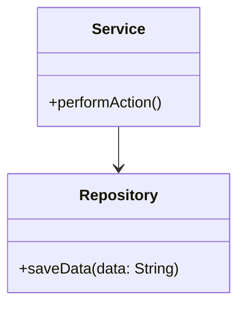

## 14.3 Design for Testability

In the realm of software engineering, the ability to test code effectively is paramount. Testability refers to the ease with which software can be tested to ensure it behaves as expected. Designing for testability involves structuring code in a way that facilitates thorough, efficient, and automated testing. This section explores principles, design patterns, and best practices that enhance the testability of Java applications.

### Principles of Testable Design

To design testable software, developers must focus on simplicity, decoupling, and observability. These characteristics ensure that code is not only easier to test but also more maintainable and scalable.

#### Simplicity

**Simplicity** is the cornerstone of testable design. Simple code is easier to understand, modify, and test. It involves breaking down complex problems into smaller, manageable components. This can be achieved by adhering to the **Single Responsibility Principle (SRP)**, which states that a class should have only one reason to change. By ensuring each class or method does one thing well, you reduce complexity and improve testability.

#### Decoupling

**Decoupling** refers to minimizing dependencies between components. When classes are tightly coupled, changes in one class can ripple through others, making testing difficult. Decoupling is achieved through the use of interfaces and abstractions, which allow components to interact without being directly dependent on each other. This promotes flexibility and makes it easier to test components in isolation.

#### Observability

**Observability** is the ability to understand the internal state of a system from its outputs. In testing, this means having clear and accessible interfaces that allow you to verify the behavior of a component. This can be facilitated by designing components with clear input and output interfaces, making it easier to observe and validate their behavior during tests.

### Design Patterns that Enhance Testability

Certain design patterns inherently promote testability by encouraging loose coupling and modularity. Let's explore a few key patterns that enhance testability in Java applications.

#### Dependency Injection

**Dependency Injection (DI)** is a pattern that involves passing dependencies to a class rather than having the class create them itself. This decouples the class from its dependencies, making it easier to test. With DI, you can inject mock objects or stubs during testing, allowing you to isolate the component under test.

```java
// Example of Dependency Injection in Java
public class Service {
    private final Repository repository;

    // Dependency is injected via the constructor
    public Service(Repository repository) {
        this.repository = repository;
    }

    public void performAction() {
        repository.saveData("Sample Data");
    }
}

// Test class using a mock repository
public class ServiceTest {
    @Test
    public void testPerformAction() {
        Repository mockRepository = Mockito.mock(Repository.class);
        Service service = new Service(mockRepository);

        service.performAction();

        Mockito.verify(mockRepository).saveData("Sample Data");
    }
}
```

#### Strategy Pattern

The **Strategy Pattern** allows you to define a family of algorithms, encapsulate each one, and make them interchangeable. This pattern promotes testability by enabling you to test each strategy independently and swap them during testing.

```java
// Strategy interface
public interface SortingStrategy {
    void sort(int[] numbers);
}

// Concrete strategy
public class BubbleSortStrategy implements SortingStrategy {
    public void sort(int[] numbers) {
        // Implementation of bubble sort
    }
}

// Context class
public class Sorter {
    private SortingStrategy strategy;

    public Sorter(SortingStrategy strategy) {
        this.strategy = strategy;
    }

    public void sort(int[] numbers) {
        strategy.sort(numbers);
    }
}

// Test class
public class SorterTest {
    @Test
    public void testSort() {
        SortingStrategy mockStrategy = Mockito.mock(SortingStrategy.class);
        Sorter sorter = new Sorter(mockStrategy);

        int[] numbers = {5, 3, 8, 1};
        sorter.sort(numbers);

        Mockito.verify(mockStrategy).sort(numbers);
    }
}
```

#### Facade Pattern

The **Facade Pattern** provides a simplified interface to a complex subsystem, making it easier to test by isolating the complexity. By testing the facade, you can ensure the subsystem behaves correctly without delving into its intricate details.

```java
// Subsystem classes
public class SubsystemA {
    public void operationA() {
        // Complex operation
    }
}

public class SubsystemB {
    public void operationB() {
        // Complex operation
    }
}

// Facade class
public class Facade {
    private SubsystemA subsystemA;
    private SubsystemB subsystemB;

    public Facade() {
        this.subsystemA = new SubsystemA();
        this.subsystemB = new SubsystemB();
    }

    public void performOperations() {
        subsystemA.operationA();
        subsystemB.operationB();
    }
}

// Test class
public class FacadeTest {
    @Test
    public void testPerformOperations() {
        Facade facade = new Facade();

        // Test the facade's behavior
        facade.performOperations();

        // Assertions to verify the expected outcome
    }
}
```

### Code Structuring Techniques

Proper structuring of classes and methods is crucial for testability. Here are some techniques to consider:

#### Single Responsibility Principle

Adhering to the **Single Responsibility Principle (SRP)** ensures that each class or method has one responsibility, making it easier to test. When a class has multiple responsibilities, it becomes harder to test because you need to account for various scenarios and interactions.

#### Clear and Consistent Interfaces

Design classes with clear and consistent interfaces. This means defining methods with well-defined inputs and outputs, making it easier to test their behavior. Avoid side effects and ensure that methods do not depend on external state.

#### Use of Interfaces and Abstractions

Utilize interfaces and abstractions to decouple dependencies. This allows you to replace real implementations with mocks or stubs during testing, isolating the component under test.

### Examples of Testable Designs

Let's look at some code examples that illustrate good practices in designing for testability.

#### Testable Design

```java
// Interface for a data source
public interface DataSource {
    String fetchData();
}

// Class using the data source
public class DataProcessor {
    private final DataSource dataSource;

    public DataProcessor(DataSource dataSource) {
        this.dataSource = dataSource;
    }

    public String process() {
        String data = dataSource.fetchData();
        return "Processed: " + data;
    }
}

// Test class
public class DataProcessorTest {
    @Test
    public void testProcess() {
        DataSource mockDataSource = Mockito.mock(DataSource.class);
        Mockito.when(mockDataSource.fetchData()).thenReturn("Sample Data");

        DataProcessor processor = new DataProcessor(mockDataSource);
        String result = processor.process();

        assertEquals("Processed: Sample Data", result);
    }
}
```

#### Hard-to-Test Design

```java
// Class with hard-coded dependency
public class DataProcessor {
    private final Database database = new Database();

    public String process() {
        String data = database.fetchData();
        return "Processed: " + data;
    }
}

// Test class
public class DataProcessorTest {
    @Test
    public void testProcess() {
        // Difficult to test due to hard-coded dependency
        DataProcessor processor = new DataProcessor();
        String result = processor.process();

        // Assertions to verify the expected outcome
    }
}
```

### Refactoring for Testability

Refactoring existing codebases to improve testability involves several strategies:

#### Introduce Interfaces and Abstractions

Refactor classes to use interfaces and abstractions, allowing you to decouple dependencies and inject mock objects during testing.

#### Break Down Complex Methods

Identify complex methods and break them down into smaller, more manageable pieces. This not only improves testability but also enhances readability and maintainability.

#### Use Dependency Injection

Implement dependency injection to pass dependencies to classes rather than creating them internally. This allows you to replace real dependencies with mocks or stubs during testing.

### Testing Private and Complex Methods

Testing private methods or complex logic can be challenging. Here are some approaches to consider:

#### Test Through Public Interfaces

Whenever possible, test private methods through public interfaces. This ensures that you are testing the behavior of the class as a whole, rather than focusing on implementation details.

#### Use Reflection Cautiously

If necessary, use reflection to access private methods during testing. However, this should be done sparingly, as it can lead to brittle tests that are tightly coupled to the implementation.

### Best Practices

To ensure your code is testable, consider the following best practices:

#### Write Test Cases Alongside Development

Develop test cases alongside your code. This ensures that you are considering testability from the outset and helps catch issues early in the development process.

#### Follow Clear and Consistent Code Conventions

Adopt clear and consistent code conventions to improve readability and maintainability. This makes it easier for others to understand and test your code.

### Overcoming Challenges

Designing for testability can be challenging, especially when dealing with legacy code or tightly coupled components. Here are some strategies to overcome these obstacles:

#### Introduce Testability Incrementally

When working with legacy code, introduce testability incrementally. Start by refactoring small parts of the codebase to improve testability, and gradually expand your efforts.

#### Use Mocking Frameworks

Leverage mocking frameworks like Mockito to create mock objects and isolate components during testing. This can help you test components in isolation, even when dealing with tightly coupled code.

### Visualizing Testable Design

To better understand the concepts of testable design, let's visualize the relationships between components using a class diagram.



**Caption**: This diagram illustrates the relationship between the `Service` and `Repository` classes, highlighting the dependency injection that enhances testability.

### Try It Yourself

Experiment with the code examples provided in this section. Try modifying the `Service` class to use a different repository implementation, or refactor the `DataProcessor` class to use dependency injection. By experimenting with these examples, you'll gain a deeper understanding of how to design for testability.

### Knowledge Check

- What are the key characteristics of testable code?
- How does the Dependency Injection pattern enhance testability?
- Why is the Single Responsibility Principle important for testability?
- What are some strategies for refactoring code to improve testability?

### Embrace the Journey

Remember, designing for testability is an ongoing process. As you continue to develop your skills, you'll discover new ways to enhance the testability of your code. Keep experimenting, stay curious, and enjoy the journey!

## Quiz Time!



### Which principle emphasizes that a class should have only one reason to change?

- [x] Single Responsibility Principle
- [ ] Open/Closed Principle
- [ ] Liskov Substitution Principle
- [ ] Interface Segregation Principle

> **Explanation:** The Single Responsibility Principle states that a class should have only one reason to change, which enhances testability by reducing complexity.

### What is a key benefit of Dependency Injection in terms of testability?

- [x] It allows for easy replacement of dependencies with mocks during testing.
- [ ] It increases the number of dependencies in a class.
- [ ] It makes classes more tightly coupled.
- [ ] It reduces the need for interfaces.

> **Explanation:** Dependency Injection allows for easy replacement of dependencies with mocks during testing, promoting loose coupling and enhancing testability.

### How does the Strategy Pattern enhance testability?

- [x] By allowing algorithms to be tested independently.
- [ ] By increasing the complexity of the code.
- [ ] By coupling strategies tightly with the context.
- [ ] By making algorithms static and unchangeable.

> **Explanation:** The Strategy Pattern enhances testability by allowing algorithms to be tested independently and swapped during testing.

### Which pattern provides a simplified interface to a complex subsystem?

- [x] Facade Pattern
- [ ] Observer Pattern
- [ ] Singleton Pattern
- [ ] Adapter Pattern

> **Explanation:** The Facade Pattern provides a simplified interface to a complex subsystem, making it easier to test by isolating complexity.

### What is a common approach to testing private methods?

- [x] Test through public interfaces.
- [ ] Use reflection extensively.
- [ ] Modify the method to be public.
- [ ] Ignore testing private methods.

> **Explanation:** Testing through public interfaces is a common approach, as it ensures the behavior of the class is tested as a whole.

### What is a characteristic of clear and consistent interfaces?

- [x] Well-defined inputs and outputs.
- [ ] Dependence on external state.
- [ ] Frequent side effects.
- [ ] Complex method signatures.

> **Explanation:** Clear and consistent interfaces have well-defined inputs and outputs, making it easier to test their behavior.

### How can legacy code be made more testable?

- [x] Introduce testability incrementally.
- [ ] Avoid refactoring.
- [ ] Increase coupling between components.
- [ ] Use hard-coded dependencies.

> **Explanation:** Introducing testability incrementally involves refactoring small parts of the codebase to improve testability over time.

### What is the role of mocking frameworks in testing?

- [x] To create mock objects and isolate components during testing.
- [ ] To increase the complexity of tests.
- [ ] To replace all real implementations with mocks.
- [ ] To eliminate the need for interfaces.

> **Explanation:** Mocking frameworks create mock objects and isolate components during testing, allowing for easier testing of individual components.

### Why is observability important in testable design?

- [x] It allows understanding of the internal state from outputs.
- [ ] It increases the complexity of the code.
- [ ] It makes testing unnecessary.
- [ ] It reduces the need for clear interfaces.

> **Explanation:** Observability allows understanding of the internal state from outputs, making it easier to verify component behavior during tests.

### True or False: Designing for testability is only important during the initial development phase.

- [ ] True
- [x] False

> **Explanation:** Designing for testability is an ongoing process that remains important throughout the software development lifecycle, including maintenance and refactoring.


