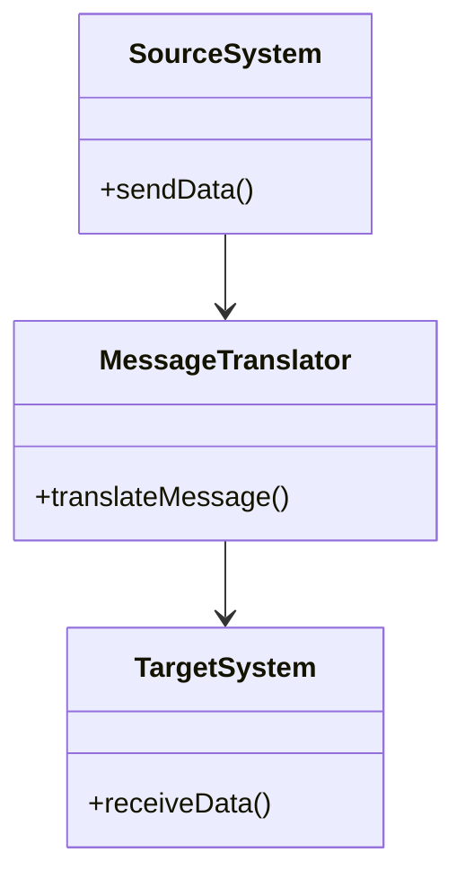
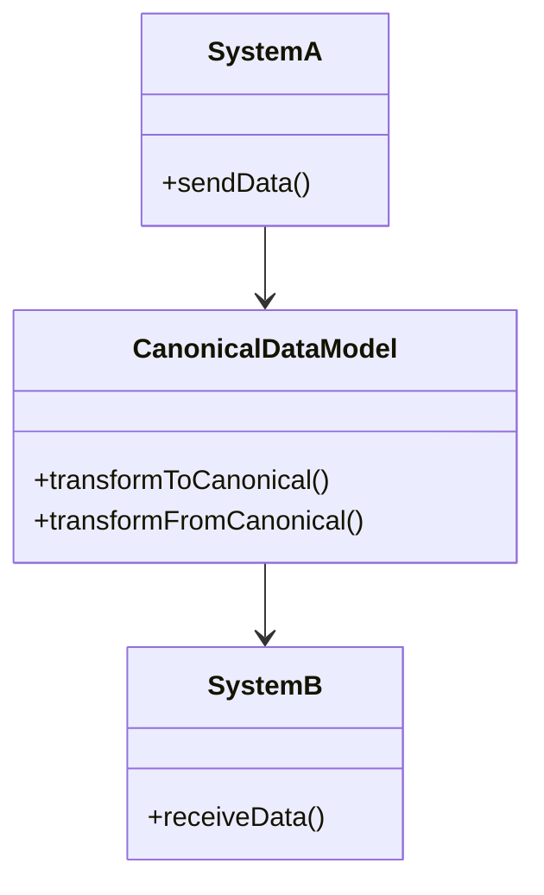

## 14.4.1 Data Transformation Patterns

In the realm of software integration, data transformation is a critical process that ensures seamless communication between disparate systems. As systems often use different data formats and structures, transforming message data is essential for interoperability. This section delves into common data transformation patterns, focusing on the Message Translator and Canonical Data Model patterns. We will explore how these patterns can be implemented in Java using libraries like Jackson for JSON and JAXB for XML, and discuss best practices for designing reusable and maintainable transformation components.

### Introduction to Data Transformation Needs

Data transformation is a fundamental requirement in integration scenarios where systems need to exchange information. These systems may differ in terms of data formats, structures, or semantics. Common data transformation needs include:

- **Format Conversion**: Transforming data from one format to another, such as XML to JSON.
- **Structure Mapping**: Adjusting the data structure to match the target system's requirements.
- **Semantic Translation**: Converting data semantics to ensure meaningful communication between systems.

These transformations are crucial in scenarios such as enterprise application integration, data migration, and service-oriented architectures.

### Common Data Transformation Patterns

#### Message Translator Pattern

- **Category**: Integration Pattern

##### Intent

- **Description**: The Message Translator pattern is used to convert a message from one format to another, enabling communication between systems with different data formats.

##### Also Known As

- **Alternate Names**: Data Mapper, Data Converter

##### Motivation

- **Explanation**: In a heterogeneous system environment, different applications may use different data formats. The Message Translator pattern facilitates communication by translating messages into a format that the receiving system can understand.

##### Applicability

- **Guidelines**: Use this pattern when integrating systems with incompatible data formats. It is particularly useful in middleware solutions where messages need to be routed between different systems.

##### Structure



- **Caption**: The diagram illustrates the flow of data from the Source System through the Message Translator to the Target System.

##### Participants

- **Source System**: The system that sends the original message.
- **Message Translator**: The component responsible for converting the message format.
- **Target System**: The system that receives the translated message.

##### Collaborations

- **Interactions**: The Source System sends data to the Message Translator, which converts the message format and forwards it to the Target System.

##### Consequences

- **Analysis**: The pattern simplifies integration by abstracting the complexity of format conversion. However, it may introduce additional processing overhead.

##### Implementation

- **Implementation Guidelines**: Implement the Message Translator as a standalone component or service that can be reused across different integration scenarios.

- **Sample Code Snippets**:

```java
import com.fasterxml.jackson.databind.ObjectMapper;
import com.fasterxml.jackson.dataformat.xml.XmlMapper;

public class MessageTranslator {

    private ObjectMapper jsonMapper = new ObjectMapper();
    private XmlMapper xmlMapper = new XmlMapper();

    public String translateXmlToJson(String xmlData) throws Exception {
        // Convert XML to Java object
        MyDataObject dataObject = xmlMapper.readValue(xmlData, MyDataObject.class);
        // Convert Java object to JSON
        return jsonMapper.writeValueAsString(dataObject);
    }
}
```

- **Explanation**: This example demonstrates a simple Message Translator that converts XML data to JSON using Jackson and JAXB. The `translateXmlToJson` method reads XML data into a Java object and then serializes it to JSON.

##### Sample Use Cases

- **Real-world Scenarios**: The Message Translator pattern is commonly used in enterprise service buses (ESBs) and message brokers to facilitate communication between systems with different data formats.

##### Related Patterns

- **Connections**: The Message Translator pattern is often used in conjunction with the [6.6 Singleton Pattern]( "Singleton Pattern") to ensure a single instance of the translator is used across the application.

##### Known Uses

- **Examples in Libraries or Frameworks**: Apache Camel and Spring Integration provide built-in support for message translation.

#### Canonical Data Model Pattern

- **Category**: Integration Pattern

##### Intent

- **Description**: The Canonical Data Model pattern establishes a common data format to which all messages are transformed, simplifying integration and reducing the number of transformations required.

##### Also Known As

- **Alternate Names**: Common Data Model, Unified Data Model

##### Motivation

- **Explanation**: In complex integration scenarios, maintaining multiple point-to-point transformations can become unmanageable. The Canonical Data Model pattern reduces complexity by introducing a single, unified data format.

##### Applicability

- **Guidelines**: Use this pattern in environments with multiple systems that need to communicate with each other. It is particularly beneficial in large-scale enterprise integrations.

##### Structure



- **Caption**: The diagram shows how System A and System B communicate through a Canonical Data Model.

##### Participants

- **System A**: The system sending data.
- **Canonical Data Model**: The common data format used for integration.
- **System B**: The system receiving data.

##### Collaborations

- **Interactions**: System A transforms its data to the Canonical Data Model, which is then transformed to the format required by System B.

##### Consequences

- **Analysis**: The pattern simplifies integration by reducing the number of transformations. However, it requires agreement on a common data format, which can be challenging to establish.

##### Implementation

- **Implementation Guidelines**: Define a common data model that all systems agree upon. Implement transformation logic to and from this model.

- **Sample Code Snippets**:

```java
public class CanonicalDataModel {

    public CanonicalData transformToCanonical(SystemAData data) {
        // Transform System A data to Canonical Data Model
        return new CanonicalData(data.getField1(), data.getField2());
    }

    public SystemBData transformFromCanonical(CanonicalData data) {
        // Transform Canonical Data Model to System B data
        return new SystemBData(data.getField1(), data.getField2());
    }
}
```

- **Explanation**: This example illustrates a Canonical Data Model that transforms data between System A and System B. The `transformToCanonical` and `transformFromCanonical` methods handle the conversion logic.

##### Sample Use Cases

- **Real-world Scenarios**: The Canonical Data Model pattern is widely used in enterprise integration platforms to standardize data exchange.

##### Related Patterns

- **Connections**: This pattern is often used alongside the [6.6 Singleton Pattern]( "Singleton Pattern") to manage the canonical model instance.

##### Known Uses

- **Examples in Libraries or Frameworks**: MuleSoft and IBM Integration Bus utilize canonical data models for integration.

### Designing Reusable and Maintainable Transformation Components

To design transformation components that are reusable and maintainable, consider the following best practices:

- **Modular Design**: Break down transformation logic into smaller, reusable modules. This approach enhances maintainability and allows for easier testing and debugging.
- **Configuration-Driven**: Use configuration files or metadata to define transformation rules. This approach decouples transformation logic from code, making it easier to update and manage.
- **Error Handling**: Implement robust error handling to manage transformation failures gracefully. Log errors and provide meaningful error messages to facilitate troubleshooting.
- **Performance Optimization**: Optimize transformation logic for performance, especially in high-throughput scenarios. Use efficient data structures and algorithms to minimize processing time.

### Considerations for Data Integrity and Performance

When implementing data transformation patterns, it is crucial to consider data integrity and performance:

- **Data Integrity**: Ensure that transformations preserve the accuracy and consistency of data. Validate data before and after transformation to detect and correct errors.
- **Performance**: Monitor and optimize the performance of transformation processes. Consider using parallel processing or asynchronous techniques to improve throughput.

### Conclusion

Data transformation patterns play a vital role in enabling seamless integration between systems with different data formats and structures. By understanding and implementing patterns like Message Translator and Canonical Data Model, developers can create robust, maintainable, and efficient integration solutions. Leveraging Java libraries such as Jackson and JAXB, along with best practices for designing transformation components, ensures that data transformation processes are both effective and scalable.

---

## Test Your Knowledge: Java Data Transformation Patterns Quiz



### What is the primary purpose of the Message Translator pattern?

- [x] To convert a message from one format to another
- [ ] To store messages in a database
- [ ] To encrypt messages for security
- [ ] To compress messages for transmission

> **Explanation:** The Message Translator pattern is used to convert messages between different formats, enabling communication between systems with incompatible data formats.

### Which Java library is commonly used for JSON data transformation?

- [x] Jackson
- [ ] JAXB
- [ ] Hibernate
- [ ] Log4j

> **Explanation:** Jackson is a popular Java library for processing JSON data, including serialization and deserialization.

### What is a key benefit of using the Canonical Data Model pattern?

- [x] It reduces the number of transformations required between systems.
- [ ] It increases the complexity of integration.
- [ ] It requires more storage space.
- [ ] It slows down data processing.

> **Explanation:** The Canonical Data Model pattern reduces complexity by introducing a single, unified data format, minimizing the number of transformations needed.

### In the Message Translator pattern, what is the role of the Target System?

- [x] To receive the translated message
- [ ] To send the original message
- [ ] To encrypt the message
- [ ] To log the message

> **Explanation:** The Target System receives the message after it has been translated by the Message Translator.

### Which of the following is a best practice for designing transformation components?

- [x] Use modular design
- [ ] Hard-code transformation rules
- [ ] Ignore error handling
- [ ] Optimize for maximum complexity

> **Explanation:** Modular design enhances maintainability and allows for easier testing and debugging of transformation components.

### What is a common challenge when implementing the Canonical Data Model pattern?

- [x] Establishing agreement on a common data format
- [ ] Increasing the number of transformations
- [ ] Reducing data accuracy
- [ ] Decreasing system interoperability

> **Explanation:** Establishing a common data format that all systems agree upon can be challenging but is essential for the Canonical Data Model pattern.

### How can performance be optimized in data transformation processes?

- [x] Use efficient data structures and algorithms
- [ ] Increase the number of transformations
- [ ] Ignore data validation
- [ ] Use synchronous processing only

> **Explanation:** Using efficient data structures and algorithms helps minimize processing time and optimize performance.

### What is the role of error handling in data transformation?

- [x] To manage transformation failures gracefully
- [ ] To increase transformation complexity
- [ ] To slow down data processing
- [ ] To ignore data integrity

> **Explanation:** Robust error handling is crucial for managing transformation failures and providing meaningful error messages for troubleshooting.

### Which pattern is often used with the Canonical Data Model to manage the model instance?

- [x] Singleton Pattern
- [ ] Observer Pattern
- [ ] Factory Pattern
- [ ] Strategy Pattern

> **Explanation:** The Singleton Pattern is often used to ensure a single instance of the canonical model is used across the application.

### True or False: The Message Translator pattern can introduce additional processing overhead.

- [x] True
- [ ] False

> **Explanation:** While the Message Translator pattern simplifies integration, it may introduce additional processing overhead due to format conversion.


