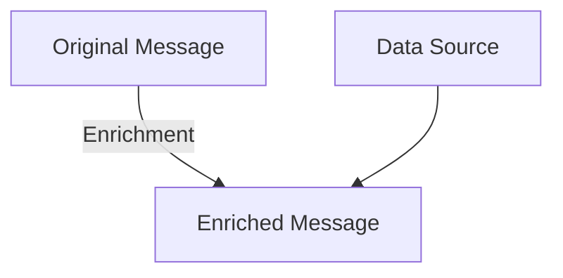
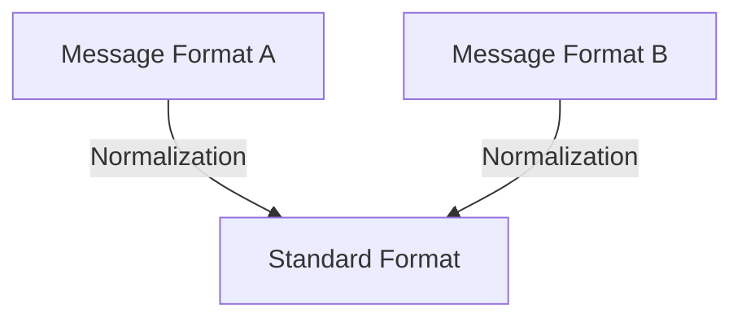

## 14.4.2 Enrichment and Normalization

In the realm of software integration, message transformation is a critical process that ensures seamless communication between disparate systems. Two pivotal patterns in this domain are the **Enricher Pattern** and the **Normalizer Pattern**. These patterns address the challenges of augmenting messages with additional data and converting various message formats into a standardized structure, respectively. This section delves into these patterns, providing a comprehensive understanding of their implementation in Java, practical applications, and the benefits they offer in simplifying downstream processing.

### Enricher Pattern

#### Intent

The **Enricher Pattern** is designed to enhance a message by adding supplementary data that is not present in the original message. This pattern is particularly useful when the receiving system requires additional information to process the message effectively.

#### Motivation

In many integration scenarios, messages exchanged between systems may lack certain data elements necessary for processing. The Enricher Pattern addresses this by augmenting the message with the required data, which can be sourced from databases, external services, or other systems.

#### Applicability

- When messages need additional data for processing.
- When integrating with systems that require enriched data for decision-making.
- In scenarios where data enrichment can improve the accuracy or completeness of information.

#### Structure



**Caption**: The Enricher Pattern structure involves augmenting the original message with data from an external source.

#### Participants

- **Original Message**: The initial message that requires enrichment.
- **Enricher**: The component responsible for adding additional data to the message.
- **Data Source**: The source from which the additional data is retrieved.

#### Collaborations

The Enricher retrieves data from the Data Source and appends it to the Original Message, resulting in an Enriched Message that is then passed to the next processing stage.

#### Consequences

- **Benefits**: Provides complete and accurate data for downstream processing, enhances decision-making capabilities, and reduces the need for multiple data retrieval operations.
- **Drawbacks**: Can introduce latency if data retrieval from external sources is slow, and may increase complexity in message processing pipelines.

#### Implementation

**Implementation Guidelines**: When implementing the Enricher Pattern in Java, consider using asynchronous data retrieval to minimize latency and ensure thread safety when accessing shared resources.

**Sample Code Snippets**:

```java
import java.util.HashMap;
import java.util.Map;

// Original message class
class Message {
    private Map<String, String> data;

    public Message() {
        this.data = new HashMap<>();
    }

    public void addData(String key, String value) {
        data.put(key, value);
    }

    public Map<String, String> getData() {
        return data;
    }
}

// Enricher class
class MessageEnricher {
    private ExternalDataSource dataSource;

    public MessageEnricher(ExternalDataSource dataSource) {
        this.dataSource = dataSource;
    }

    public Message enrich(Message message) {
        Map<String, String> additionalData = dataSource.fetchData();
        additionalData.forEach(message::addData);
        return message;
    }
}

// External data source simulation
class ExternalDataSource {
    public Map<String, String> fetchData() {
        // Simulate fetching data from an external source
        Map<String, String> data = new HashMap<>();
        data.put("additionalKey", "additionalValue");
        return data;
    }
}

// Usage
public class EnrichmentExample {
    public static void main(String[] args) {
        Message message = new Message();
        message.addData("originalKey", "originalValue");

        ExternalDataSource dataSource = new ExternalDataSource();
        MessageEnricher enricher = new MessageEnricher(dataSource);

        Message enrichedMessage = enricher.enrich(message);
        System.out.println("Enriched Message Data: " + enrichedMessage.getData());
    }
}
```

**Explanation**: In this example, the `MessageEnricher` class enriches a `Message` object by fetching additional data from an `ExternalDataSource`. The enriched message is then ready for further processing.

#### Sample Use Cases

- **E-commerce**: Enriching order messages with customer data retrieved from a CRM system.
- **Healthcare**: Augmenting patient records with additional medical history from external databases.

#### Related Patterns

- **Decorator Pattern**: Similar in concept, but focuses on adding behavior rather than data.
- **Adapter Pattern**: Used to convert interfaces, while the Enricher focuses on data augmentation.

#### Known Uses

- **Apache Camel**: Provides built-in support for message enrichment through its EIP (Enterprise Integration Patterns) components.

### Normalizer Pattern

#### Intent

The **Normalizer Pattern** aims to convert messages from various formats into a common, standardized format. This pattern is essential for ensuring that downstream systems can process messages consistently, regardless of their original format.

#### Motivation

In heterogeneous environments, systems often communicate using different message formats. The Normalizer Pattern addresses this challenge by transforming these diverse formats into a unified structure, simplifying processing and reducing the need for format-specific logic.

#### Applicability

- When integrating systems that use different message formats.
- When a consistent message format is required for processing.
- In scenarios where format-specific processing logic needs to be minimized.

#### Structure



**Caption**: The Normalizer Pattern structure involves converting various message formats into a standard format.

#### Participants

- **Original Message**: The message in its original format.
- **Normalizer**: The component responsible for converting the message to the standard format.
- **Standard Format**: The unified format to which all messages are converted.

#### Collaborations

The Normalizer receives messages in different formats and transforms them into the Standard Format, ensuring consistency for downstream processing.

#### Consequences

- **Benefits**: Simplifies processing by providing a consistent message format, reduces the need for format-specific logic, and enhances system interoperability.
- **Drawbacks**: May introduce processing overhead due to format conversion and requires maintenance of the normalization logic.

#### Implementation

**Implementation Guidelines**: When implementing the Normalizer Pattern in Java, consider using libraries such as Jackson or Gson for JSON conversion, and JAXB for XML processing.

**Sample Code Snippets**:

```java
import com.fasterxml.jackson.databind.ObjectMapper;
import java.util.Map;

// Normalizer class
class MessageNormalizer {
    private ObjectMapper objectMapper;

    public MessageNormalizer() {
        this.objectMapper = new ObjectMapper();
    }

    public StandardMessage normalize(String jsonMessage) throws Exception {
        Map<String, Object> data = objectMapper.readValue(jsonMessage, Map.class);
        return new StandardMessage(data);
    }
}

// Standard message class
class StandardMessage {
    private Map<String, Object> data;

    public StandardMessage(Map<String, Object> data) {
        this.data = data;
    }

    public Map<String, Object> getData() {
        return data;
    }
}

// Usage
public class NormalizationExample {
    public static void main(String[] args) {
        String jsonMessage = "{\"key1\":\"value1\", \"key2\":\"value2\"}";

        MessageNormalizer normalizer = new MessageNormalizer();
        try {
            StandardMessage standardMessage = normalizer.normalize(jsonMessage);
            System.out.println("Standard Message Data: " + standardMessage.getData());
        } catch (Exception e) {
            e.printStackTrace();
        }
    }
}
```

**Explanation**: In this example, the `MessageNormalizer` class uses Jackson to convert a JSON message into a `StandardMessage` object, which represents the standardized format.

#### Sample Use Cases

- **Financial Services**: Normalizing transaction messages from different banks to a common format for processing.
- **Telecommunications**: Converting call detail records from various providers into a unified format.

#### Related Patterns

- **Adapter Pattern**: Similar in concept, but focuses on interface conversion rather than data format transformation.
- **Facade Pattern**: Provides a simplified interface to complex subsystems, similar to how normalization simplifies message processing.

#### Known Uses

- **Spring Integration**: Offers message transformation capabilities, including normalization, as part of its integration framework.

### Practical Considerations

#### Sources for Enrichment Data

- **Databases**: Use JDBC or JPA to retrieve data from relational databases.
- **External Services**: Leverage RESTful APIs or SOAP services to fetch data from external systems.
- **In-memory Caches**: Utilize caching solutions like Redis or Ehcache for frequently accessed data.

#### Importance of Normalization

Normalization is crucial for simplifying downstream processing, as it ensures that all messages conform to a consistent format. This reduces the complexity of processing logic and enhances system interoperability, making it easier to integrate new systems or modify existing ones.

### Best Practices

- **Asynchronous Processing**: Use asynchronous techniques to minimize latency in enrichment and normalization processes.
- **Error Handling**: Implement robust error handling to manage failures in data retrieval or format conversion.
- **Performance Optimization**: Profile and optimize enrichment and normalization logic to minimize processing overhead.
- **Scalability**: Design patterns to handle increased message volumes without degradation in performance.

### Conclusion

The Enricher and Normalizer patterns are indispensable tools in the integration architect's toolkit. By enriching messages with additional data and normalizing diverse formats, these patterns facilitate seamless communication between systems, enhance data quality, and simplify processing logic. Implementing these patterns in Java requires careful consideration of data sources, processing techniques, and performance optimization strategies. By mastering these patterns, developers can build robust, scalable, and maintainable integration solutions.

## Test Your Knowledge: Enrichment and Normalization Patterns Quiz



### What is the primary purpose of the Enricher Pattern?

- [x] To add supplementary data to a message.
- [ ] To convert messages to a standard format.
- [ ] To filter messages based on content.
- [ ] To compress message size.

> **Explanation:** The Enricher Pattern is used to enhance a message by adding additional data that is not present in the original message.

### Which component in the Enricher Pattern is responsible for retrieving additional data?

- [ ] Original Message
- [x] Enricher
- [ ] Data Source
- [ ] Standard Format

> **Explanation:** The Enricher is the component responsible for adding additional data to the message by retrieving it from a Data Source.

### What is the main benefit of the Normalizer Pattern?

- [x] It simplifies processing by providing a consistent message format.
- [ ] It reduces message size.
- [ ] It encrypts messages for security.
- [ ] It increases message throughput.

> **Explanation:** The Normalizer Pattern simplifies processing by converting various message formats into a standardized format, ensuring consistency for downstream systems.

### Which Java library is commonly used for JSON conversion in normalization?

- [ ] JAXB
- [x] Jackson
- [ ] Apache Commons
- [ ] Log4j

> **Explanation:** Jackson is a popular Java library used for JSON conversion, making it suitable for implementing the Normalizer Pattern.

### In which scenario is the Enricher Pattern most applicable?

- [x] When messages need additional data for processing.
- [ ] When messages need to be compressed.
- [ ] When messages need to be encrypted.
- [ ] When messages need to be logged.

> **Explanation:** The Enricher Pattern is most applicable when messages require additional data to be processed effectively.

### What is a potential drawback of the Normalizer Pattern?

- [x] It may introduce processing overhead due to format conversion.
- [ ] It increases message size.
- [ ] It reduces message security.
- [ ] It complicates message routing.

> **Explanation:** The Normalizer Pattern can introduce processing overhead due to the need to convert various message formats into a standardized format.

### Which pattern is related to the Enricher Pattern by focusing on adding behavior rather than data?

- [ ] Adapter Pattern
- [x] Decorator Pattern
- [ ] Singleton Pattern
- [ ] Observer Pattern

> **Explanation:** The Decorator Pattern is related to the Enricher Pattern as it focuses on adding behavior to objects, whereas the Enricher Pattern adds data to messages.

### What is a common source for enrichment data in the Enricher Pattern?

- [x] Databases
- [ ] Message Queues
- [ ] Log Files
- [ ] Configuration Files

> **Explanation:** Databases are a common source for enrichment data, providing additional information that can be added to messages.

### Why is normalization important in message processing?

- [x] It ensures all messages conform to a consistent format.
- [ ] It reduces message size.
- [ ] It encrypts messages for security.
- [ ] It increases message throughput.

> **Explanation:** Normalization is important because it ensures that all messages conform to a consistent format, simplifying downstream processing and enhancing system interoperability.

### True or False: The Enricher Pattern can introduce latency if data retrieval from external sources is slow.

- [x] True
- [ ] False

> **Explanation:** True. The Enricher Pattern can introduce latency if the process of retrieving additional data from external sources is slow.



By understanding and applying the Enricher and Normalizer patterns, Java developers and software architects can significantly enhance the robustness and efficiency of their integration solutions. These patterns not only improve data quality and consistency but also streamline the processing of messages across diverse systems, paving the way for more scalable and maintainable architectures.
