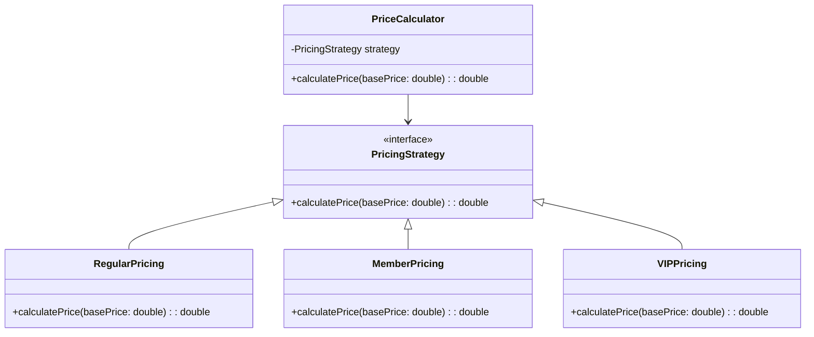

## 14.4 Refactoring with Design Patterns

Refactoring is a critical process in software development that involves restructuring existing code without changing its external behavior. It enhances code readability, reduces complexity, and improves maintainability. In this section, we will delve into the concept of refactoring, identify opportunities for improvement, and explore how design patterns can be effectively applied to resolve common code issues. We'll also provide practical examples, discuss tools and techniques, and highlight best practices to ensure successful refactoring.

### Understanding Refactoring

Refactoring is the process of improving the internal structure of code while maintaining its functionality. It is a disciplined technique for restructuring an existing body of code, altering its internal structure without changing its external behavior. The primary goal of refactoring is to make the code easier to understand and cheaper to modify.

#### Purpose of Refactoring

- **Enhance Readability**: Clean and well-organized code is easier to read and understand.
- **Improve Maintainability**: Simplified code structures make future modifications easier and less error-prone.
- **Reduce Complexity**: Breaking down large, complex code into smaller, manageable pieces.
- **Increase Reusability**: Refactored code can often be reused in different parts of the application.
- **Facilitate Testing**: Cleaner code is easier to test and debug.

### Identifying Refactoring Opportunities

To refactor effectively, you need to recognize when and where refactoring is necessary. This involves identifying code smells and anti-patterns that indicate potential issues in the codebase.

#### Recognizing Code Smells

Code smells are indicators of potential problems in the code that may require refactoring. Here are some common code smells:

- **Duplicated Code**: The same code appears in multiple places, making maintenance difficult.
- **Long Methods**: Methods that are too long and do too much, violating the Single Responsibility Principle.
- **Large Classes**: Classes that have grown too large and complex, often taking on too many responsibilities.
- **Divergent Change**: A class that requires multiple changes for different reasons.
- **Shotgun Surgery**: A single change that requires many small changes in different classes.
- **Feature Envy**: A method that seems more interested in a class other than the one it is in.
- **Data Clumps**: Groups of data that are often found together and should be encapsulated.

#### Identifying Anti-Patterns

Anti-patterns are common responses to recurring problems that are ineffective and counterproductive. Some examples include:

- **Spaghetti Code**: Code with a complex and tangled control structure.
- **God Object**: A class that knows too much or does too much.
- **Golden Hammer**: Over-reliance on a familiar solution or tool.
- **Magic Numbers and Strings**: Use of unexplained literals in code.
- **Hard Coding**: Embedding configuration data directly in code.

### Applying Design Patterns

Design patterns provide proven solutions to common software design problems. By applying the right design pattern, you can resolve specific code issues identified during refactoring.

#### Matching Problems with Patterns

- **Duplicated Code**: Use the **Template Method** pattern to extract common behavior into a superclass.
- **Long Methods**: Apply the **Strategy** pattern to encapsulate algorithms in separate classes.
- **Large Classes**: Use the **Facade** pattern to simplify complex interfaces.
- **Conditional Logic**: Replace with the **State** or **Strategy** pattern to manage state-dependent behavior.

#### Example: Replacing Conditional Logic with Strategy Pattern

Let's refactor a piece of code that uses conditional logic to determine pricing strategies.

**Before Refactoring:**

```java
public class PriceCalculator {
    public double calculatePrice(String customerType, double basePrice) {
        if (customerType.equals("Regular")) {
            return basePrice;
        } else if (customerType.equals("Member")) {
            return basePrice * 0.9;
        } else if (customerType.equals("VIP")) {
            return basePrice * 0.8;
        }
        return basePrice;
    }
}
```

**After Refactoring with Strategy Pattern:**

```java
// Strategy Interface
interface PricingStrategy {
    double calculatePrice(double basePrice);
}

// Concrete Strategies
class RegularPricing implements PricingStrategy {
    public double calculatePrice(double basePrice) {
        return basePrice;
    }
}

class MemberPricing implements PricingStrategy {
    public double calculatePrice(double basePrice) {
        return basePrice * 0.9;
    }
}

class VIPPricing implements PricingStrategy {
    public double calculatePrice(double basePrice) {
        return basePrice * 0.8;
    }
}

// Context
public class PriceCalculator {
    private PricingStrategy strategy;

    public PriceCalculator(PricingStrategy strategy) {
        this.strategy = strategy;
    }

    public double calculatePrice(double basePrice) {
        return strategy.calculatePrice(basePrice);
    }
}

// Usage
PriceCalculator calculator = new PriceCalculator(new VIPPricing());
double price = calculator.calculatePrice(100.0);
```

### Step-by-Step Refactoring Examples

Let's walk through a detailed example of refactoring a piece of code to incorporate the **Observer Pattern**.

**Scenario**: We have a system that needs to notify multiple components whenever a data change occurs.

**Before Refactoring:**

```java
public class DataSource {
    private int data;
    private Display display;
    private Logger logger;

    public DataSource(Display display, Logger logger) {
        this.display = display;
        this.logger = logger;
    }

    public void setData(int data) {
        this.data = data;
        display.update(data);
        logger.log(data);
    }
}
```

**After Refactoring with Observer Pattern:**

```java
import java.util.ArrayList;
import java.util.List;

// Observer Interface
interface Observer {
    void update(int data);
}

// Concrete Observers
class Display implements Observer {
    public void update(int data) {
        System.out.println("Display updated with data: " + data);
    }
}

class Logger implements Observer {
    public void update(int data) {
        System.out.println("Logger recorded data: " + data);
    }
}

// Subject
class DataSource {
    private int data;
    private List<Observer> observers = new ArrayList<>();

    public void addObserver(Observer observer) {
        observers.add(observer);
    }

    public void removeObserver(Observer observer) {
        observers.remove(observer);
    }

    public void setData(int data) {
        this.data = data;
        notifyObservers();
    }

    private void notifyObservers() {
        for (Observer observer : observers) {
            observer.update(data);
        }
    }
}

// Usage
DataSource dataSource = new DataSource();
dataSource.addObserver(new Display());
dataSource.addObserver(new Logger());
dataSource.setData(42);
```

### Tools and Techniques

Refactoring can be greatly facilitated by using modern Integrated Development Environments (IDEs) and their built-in tools.

#### Refactoring Tools

- **IntelliJ IDEA**: Offers a wide range of refactoring tools, including renaming, extracting methods, and introducing variables.
- **Eclipse**: Provides features like code analysis, refactoring wizards, and quick fixes.
- **NetBeans**: Includes automated refactoring tools and code templates.

#### Automated Refactoring and Code Analysis

- **Automated Refactoring**: Use IDE features to automate repetitive refactoring tasks, reducing the risk of human error.
- **Code Analysis**: Leverage static code analysis tools to identify potential issues and refactoring opportunities.

### Maintaining Functionality

Before embarking on refactoring, it's crucial to have a comprehensive test suite to ensure that changes do not introduce bugs.

#### Importance of Testing

- **Regression Testing**: Ensure that existing functionality remains intact after refactoring.
- **Unit Tests**: Validate individual components and their interactions.
- **Integration Tests**: Confirm that the system works as a whole.

### Best Practices

Refactoring should be approached methodically to maximize its benefits and minimize risks.

#### Guidelines for Refactoring

- **Plan Incremental Changes**: Break down refactoring into small, manageable tasks.
- **Regularly Commit Progress**: Use version control to track changes and facilitate rollback if necessary.
- **Communicate with the Team**: Keep team members informed about refactoring plans and progress.

### Impact on Development Process

Refactoring can significantly enhance team productivity and codebase longevity, but it may also have some temporary downsides.

#### Benefits

- **Improved Code Quality**: Cleaner, more maintainable code.
- **Enhanced Team Productivity**: Easier code comprehension and modification.
- **Increased Codebase Longevity**: A well-maintained codebase is more adaptable to future changes.

#### Potential Downsides

- **Temporary Slowdown**: Refactoring may slow down feature development temporarily.
- **Risk of Introducing Bugs**: Changes can inadvertently introduce new issues if not properly tested.

### Try It Yourself

Experiment with the provided examples by modifying the code to add new strategies or observers. Try creating a new pricing strategy or observer to see how easily the refactored code can be extended.

### Visualizing Refactoring with Design Patterns

Below is a class diagram illustrating the refactoring of the `PriceCalculator` using the Strategy Pattern.



### Knowledge Check

- **What are some common code smells that indicate refactoring opportunities?**
- **How can design patterns help resolve specific code issues?**
- **Why is it important to maintain a comprehensive test suite during refactoring?**

### Embrace the Journey

Refactoring is an ongoing journey of improvement. As you continue to refactor and apply design patterns, you'll enhance your code's quality and your skills as a developer. Remember, this is just the beginning. Keep experimenting, stay curious, and enjoy the journey!

## Quiz Time!



### What is the primary goal of refactoring?

- [x] To improve code readability and maintainability without changing its external behavior.
- [ ] To add new features to the codebase.
- [ ] To optimize code for performance.
- [ ] To rewrite the entire codebase.

> **Explanation:** Refactoring aims to improve the internal structure of the code while preserving its external behavior.

### Which design pattern is suitable for replacing complex conditional logic?

- [x] Strategy Pattern
- [ ] Singleton Pattern
- [ ] Observer Pattern
- [ ] Factory Pattern

> **Explanation:** The Strategy Pattern encapsulates algorithms in separate classes, making it ideal for replacing complex conditional logic.

### What is a common code smell indicating a need for refactoring?

- [x] Duplicated Code
- [ ] Well-documented code
- [ ] Efficient algorithms
- [ ] Modular design

> **Explanation:** Duplicated code is a common code smell that suggests the need for refactoring to improve maintainability.

### Which tool is NOT typically used for refactoring in Java?

- [ ] IntelliJ IDEA
- [ ] Eclipse
- [ ] NetBeans
- [x] Microsoft Word

> **Explanation:** Microsoft Word is not a development tool and is not used for refactoring code.

### What is a potential downside of refactoring?

- [x] Temporary slowdown in feature development
- [ ] Improved code quality
- [ ] Enhanced team productivity
- [ ] Increased codebase longevity

> **Explanation:** Refactoring can temporarily slow down feature development as it focuses on improving existing code rather than adding new features.

### Why is it important to have a comprehensive test suite before refactoring?

- [x] To ensure that refactoring does not introduce new bugs.
- [ ] To increase the complexity of the codebase.
- [ ] To make refactoring unnecessary.
- [ ] To remove the need for documentation.

> **Explanation:** A comprehensive test suite helps verify that refactoring does not alter the external behavior of the code.

### Which pattern can be used to simplify complex interfaces?

- [x] Facade Pattern
- [ ] Singleton Pattern
- [ ] Observer Pattern
- [ ] Factory Pattern

> **Explanation:** The Facade Pattern provides a simplified interface to a complex subsystem, making it easier to use.

### What is the role of automated refactoring tools?

- [x] To automate repetitive refactoring tasks and reduce human error.
- [ ] To manually rewrite code.
- [ ] To add new features to the codebase.
- [ ] To replace the need for developers.

> **Explanation:** Automated refactoring tools help automate repetitive tasks, reducing the risk of human error and speeding up the refactoring process.

### Which of the following is NOT a code smell?

- [ ] Long Methods
- [ ] Large Classes
- [x] Modular Design
- [ ] Feature Envy

> **Explanation:** Modular design is a positive attribute, not a code smell. Code smells indicate potential issues in the code.

### True or False: Refactoring should be done in large, infrequent batches to maximize efficiency.

- [ ] True
- [x] False

> **Explanation:** Refactoring should be done incrementally and regularly to manage complexity and reduce the risk of introducing errors.


