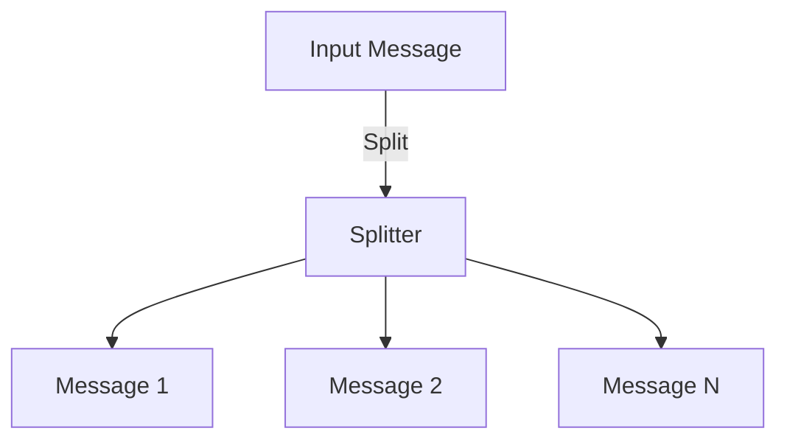

## 14.5.1 Splitter

### Introduction to the Splitter Pattern

The Splitter pattern is a fundamental integration pattern used to divide a message containing multiple elements into separate, individual messages. This pattern is particularly useful in scenarios where a single message encapsulates a collection of items that need to be processed independently. By splitting the message, each element can be handled separately, allowing for more granular processing and improved system efficiency.

### Intent

- **Description**: The Splitter pattern aims to decompose a complex message into smaller, manageable parts, enabling parallel processing and simplifying the handling of each element.
- **Problem Solved**: It addresses the challenge of processing messages that contain multiple elements, such as batch data or large payloads, by breaking them down into individual components.

### Motivation

In modern software systems, especially those dealing with data integration and message-oriented middleware, it's common to encounter messages that bundle multiple data elements. For example, a message might contain a list of orders, each requiring separate processing. The Splitter pattern facilitates this by dividing the message into individual order messages, which can then be processed independently.

### Applicability

The Splitter pattern is applicable in scenarios such as:

- **Batch Processing**: When dealing with batch data, where each item in the batch needs individual attention.
- **Large Payloads**: When a message contains a large payload that can be broken down into smaller parts for easier handling.
- **Parallel Processing**: When elements within a message can be processed in parallel to improve throughput and performance.

### Structure

The structure of the Splitter pattern involves a component that takes an input message, splits it into multiple messages, and then routes these messages for further processing.



**Caption**: The diagram illustrates the Splitter pattern, where an input message is divided into multiple individual messages.

### Participants

- **Splitter**: The component responsible for dividing the input message into separate messages.
- **Message Processor**: The entity that processes each individual message after splitting.

### Collaborations

The Splitter collaborates with message processors to ensure that each split message is handled appropriately. It may also work with other integration patterns, such as the [Aggregator]( "Aggregator Pattern"), to reassemble messages after processing.

### Consequences

- **Benefits**: 
  - Enables parallel processing of message elements.
  - Simplifies the handling of complex messages.
  - Improves system scalability and performance.
- **Drawbacks**:
  - May introduce complexity in maintaining message order and correlation.
  - Requires careful design to ensure message integrity and consistency.

### Implementation

#### Implementation Guidelines

To implement the Splitter pattern in Java, consider using Java Streams or integration frameworks like Apache Camel or Spring Integration. These tools provide robust mechanisms for splitting and processing messages.

#### Sample Code Snippets

**Using Java Streams**

Java Streams offer a straightforward way to implement the Splitter pattern, especially when dealing with collections.

```java
import java.util.Arrays;
import java.util.List;
import java.util.stream.Collectors;

public class SplitterExample {
    public static void main(String[] args) {
        List<String> messages = Arrays.asList("Order1", "Order2", "Order3");

        // Split and process each message
        List<String> processedMessages = messages.stream()
            .map(SplitterExample::processMessage)
            .collect(Collectors.toList());

        processedMessages.forEach(System.out::println);
    }

    private static String processMessage(String message) {
        // Simulate message processing
        return "Processed " + message;
    }
}
```

**Explanation**: This example demonstrates using Java Streams to split and process a list of messages. Each message is processed individually, showcasing the Splitter pattern's utility.

**Using Apache Camel**

Apache Camel provides a more comprehensive framework for implementing the Splitter pattern, especially in enterprise integration scenarios.

```java
import org.apache.camel.CamelContext;
import org.apache.camel.builder.RouteBuilder;
import org.apache.camel.impl.DefaultCamelContext;

public class CamelSplitterExample {
    public static void main(String[] args) throws Exception {
        CamelContext context = new DefaultCamelContext();
        context.addRoutes(new RouteBuilder() {
            @Override
            public void configure() {
                from("direct:start")
                    .split(body().tokenize(","))
                    .to("log:split");
            }
        });

        context.start();
        context.createProducerTemplate().sendBody("direct:start", "Order1,Order2,Order3");
        Thread.sleep(1000);
        context.stop();
    }
}
```

**Explanation**: This example uses Apache Camel to split a comma-separated string into individual messages. The `split` method is used to tokenize the input message, demonstrating the pattern's application in an integration framework.

### Sample Use Cases

- **Order Processing Systems**: In e-commerce platforms, orders are often received in batches. The Splitter pattern can divide these batches into individual orders for processing.
- **Data Transformation Pipelines**: In ETL (Extract, Transform, Load) processes, large datasets can be split into smaller chunks for parallel transformation and loading.

### Related Patterns

- **[Aggregator]( "Aggregator Pattern")**: Often used in conjunction with the Splitter pattern to reassemble messages after processing.
- **[Message Filter]( "Message Filter Pattern")**: Can be used to filter out unwanted messages after splitting.

### Known Uses

- **Apache Camel**: Widely used in enterprise integration projects to implement the Splitter pattern.
- **Spring Integration**: Provides support for message splitting in distributed systems.

### Considerations for Maintaining Message Order and Correlation

When implementing the Splitter pattern, it's crucial to maintain the order and correlation of messages, especially if the order is significant for downstream processing. Consider using correlation identifiers or sequence numbers to track and manage message order.

### Expert Tips and Best Practices

- **Use Correlation Identifiers**: Assign unique identifiers to each message to maintain correlation and order.
- **Optimize for Parallel Processing**: Design your system to take advantage of parallel processing capabilities when using the Splitter pattern.
- **Monitor and Log**: Implement robust logging and monitoring to track message flow and identify potential issues.

### Common Pitfalls and How to Avoid Them

- **Loss of Message Order**: Ensure that your implementation maintains the order of messages if required by the business logic.
- **Resource Overhead**: Be mindful of the resource overhead introduced by splitting messages, especially in high-throughput systems.

### Exercises and Practice Problems

1. **Implement a Splitter using Java Streams**: Create a Java application that splits a list of customer records into individual records for processing.
2. **Use Apache Camel to Split Messages**: Set up a Camel route that splits a JSON array into individual JSON objects for further processing.

### Summary and Key Takeaways

- The Splitter pattern is essential for dividing complex messages into manageable parts.
- It is applicable in scenarios like batch processing and handling large payloads.
- Java Streams and integration frameworks like Apache Camel provide effective means to implement this pattern.
- Maintaining message order and correlation is crucial in Splitter pattern implementations.

### Reflection

Consider how the Splitter pattern can be applied to your current projects. Are there scenarios where breaking down complex messages could improve system performance and scalability?

## Test Your Knowledge: Mastering the Splitter Pattern in Java



### What is the primary purpose of the Splitter pattern?

- [x] To divide a message containing multiple elements into separate messages.
- [ ] To combine multiple messages into a single message.
- [ ] To filter out unwanted messages.
- [ ] To transform messages into a different format.

> **Explanation:** The Splitter pattern is used to divide a complex message into individual messages for separate processing.

### Which Java feature can be used to implement the Splitter pattern?

- [x] Java Streams
- [ ] Java Reflection
- [ ] Java Annotations
- [ ] Java Serialization

> **Explanation:** Java Streams provide a straightforward way to split and process collections of data.

### In which scenario is the Splitter pattern most applicable?

- [x] Processing batch data
- [ ] Encrypting messages
- [ ] Logging messages
- [ ] Compressing data

> **Explanation:** The Splitter pattern is ideal for processing batch data where each item needs individual handling.

### What is a potential drawback of using the Splitter pattern?

- [x] It may introduce complexity in maintaining message order.
- [ ] It increases message size.
- [ ] It reduces system scalability.
- [ ] It complicates message encryption.

> **Explanation:** Maintaining message order and correlation can be challenging when using the Splitter pattern.

### Which integration framework supports the Splitter pattern?

- [x] Apache Camel
- [ ] Hibernate
- [ ] JUnit
- [ ] Log4j

> **Explanation:** Apache Camel is a popular integration framework that supports the Splitter pattern.

### How can message order be maintained in the Splitter pattern?

- [x] Use correlation identifiers
- [ ] Use message encryption
- [ ] Use message compression
- [ ] Use message logging

> **Explanation:** Correlation identifiers help maintain message order and correlation in the Splitter pattern.

### What is a common use case for the Splitter pattern?

- [x] Order processing systems
- [ ] User authentication
- [ ] Data encryption
- [ ] Logging

> **Explanation:** Order processing systems often use the Splitter pattern to handle individual orders from a batch.

### Which pattern is often used with the Splitter pattern to reassemble messages?

- [x] Aggregator
- [ ] Singleton
- [ ] Observer
- [ ] Factory

> **Explanation:** The Aggregator pattern is used to reassemble messages after they have been split and processed.

### What is a benefit of using the Splitter pattern?

- [x] It enables parallel processing of message elements.
- [ ] It reduces message size.
- [ ] It simplifies message encryption.
- [ ] It increases message complexity.

> **Explanation:** The Splitter pattern allows for parallel processing, improving system efficiency and throughput.

### True or False: The Splitter pattern is only applicable to XML messages.

- [x] False
- [ ] True

> **Explanation:** The Splitter pattern can be applied to any message format, not just XML.


