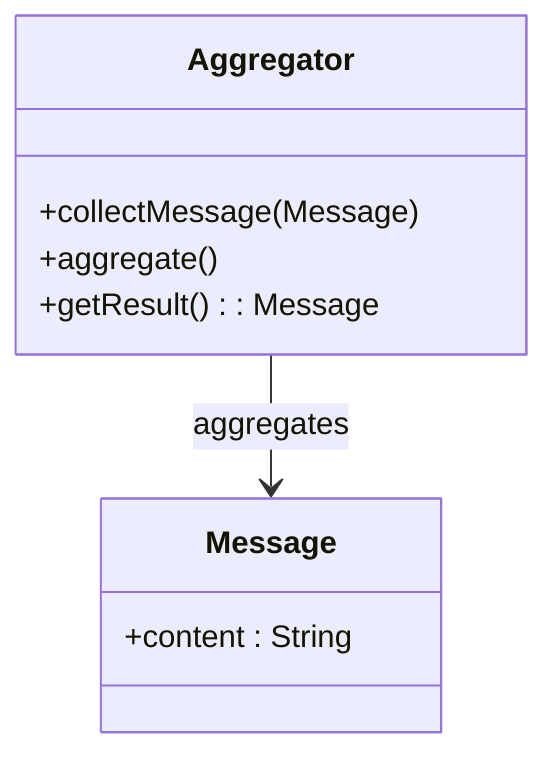

## 14.5.2 Aggregator

### Introduction

The **Aggregator Pattern** is a fundamental integration pattern used in software design to combine multiple related messages into a single, cohesive message. This pattern is particularly useful in scenarios where data from various sources needs to be merged or when coordinating parallel processing tasks. The Aggregator Pattern is a key component in building robust, scalable, and efficient systems, especially in distributed architectures.

### Intent

- **Description**: The Aggregator Pattern aims to collect and combine multiple messages or data points based on specific criteria, producing a single, unified output. This pattern is essential for integrating disparate data sources and ensuring that the resulting message is complete and consistent.

### Also Known As

- **Alternate Names**: Message Aggregator, Data Merger

### Motivation

In modern software systems, especially those employing microservices or distributed architectures, data often comes from multiple sources. These sources might be different services, databases, or external APIs. The Aggregator Pattern provides a structured way to collect these disparate pieces of information and merge them into a single, comprehensive message. This is crucial for tasks such as generating reports, synchronizing data, or processing complex workflows.

### Applicability

- **Guidelines**: Use the Aggregator Pattern when:
  - You need to merge data from multiple sources into a single message.
  - Coordinating parallel processing tasks that produce partial results.
  - Handling scenarios where messages arrive asynchronously and need to be combined.
  - Ensuring consistency and completeness in the resulting data.

### Structure



- **Caption**: The diagram illustrates the basic structure of the Aggregator Pattern, where the Aggregator collects multiple Message instances and combines them into a single result.

### Participants

- **Aggregator**: The central component that collects and combines messages.
- **Message**: Represents the individual data points or messages that need to be aggregated.

### Collaborations

- **Interactions**: The Aggregator receives messages, applies aggregation logic, and produces a single output message. It may handle timeouts and partial results to ensure timely processing.

### Consequences

- **Analysis**: 
  - **Benefits**: Simplifies data processing by providing a unified view of multiple messages. Enhances system scalability and flexibility.
  - **Drawbacks**: Managing state and ensuring consistency can be challenging. May introduce latency due to waiting for all messages to arrive.

### Implementation

#### Implementation Guidelines

- **Design the Aggregator** to handle various message types and aggregation criteria.
- **Implement timeout mechanisms** to handle scenarios where not all messages arrive.
- **Consider partial results** to ensure that the system can proceed even if some messages are missing.

#### Sample Code Snippets

```java
import java.util.ArrayList;
import java.util.List;
import java.util.concurrent.CompletableFuture;
import java.util.concurrent.TimeUnit;

class Message {
    private String content;

    public Message(String content) {
        this.content = content;
    }

    public String getContent() {
        return content;
    }
}

class Aggregator {
    private List<Message> messages = new ArrayList<>();

    public void collectMessage(Message message) {
        messages.add(message);
    }

    public Message aggregate() {
        StringBuilder aggregatedContent = new StringBuilder();
        for (Message message : messages) {
            aggregatedContent.append(message.getContent()).append(" ");
        }
        return new Message(aggregatedContent.toString().trim());
    }

    public CompletableFuture<Message> aggregateWithTimeout(long timeout, TimeUnit unit) {
        return CompletableFuture.supplyAsync(this::aggregate)
                .orTimeout(timeout, unit)
                .exceptionally(ex -> new Message("Partial result due to timeout"));
    }
}

public class AggregatorExample {
    public static void main(String[] args) {
        Aggregator aggregator = new Aggregator();
        aggregator.collectMessage(new Message("Hello"));
        aggregator.collectMessage(new Message("World"));

        Message result = aggregator.aggregate();
        System.out.println("Aggregated Message: " + result.getContent());

        // Example with timeout
        CompletableFuture<Message> futureResult = aggregator.aggregateWithTimeout(1, TimeUnit.SECONDS);
        futureResult.thenAccept(msg -> System.out.println("Aggregated with Timeout: " + msg.getContent()));
    }
}
```

- **Explanation**: The code demonstrates a simple Aggregator that collects messages and aggregates them into a single message. It includes a method to handle timeouts, returning a partial result if necessary.

### Sample Use Cases

- **Real-world Scenarios**:
  - **Data Merging**: Combining data from multiple databases or services to create a comprehensive report.
  - **Parallel Processing Coordination**: Aggregating results from parallel tasks, such as distributed computations or batch processing.
  - **Event Stream Processing**: Collecting and merging events from different sources in real-time systems.

### Related Patterns

- **Connections**: The Aggregator Pattern is often used in conjunction with the [14.5.1 Splitter Pattern]( "Splitter Pattern"), which divides a message into multiple parts for parallel processing.

### Known Uses

- **Examples in Libraries or Frameworks**: 
  - **Apache Camel**: Provides built-in support for the Aggregator Pattern, allowing developers to easily implement message aggregation in integration workflows.
  - **Spring Integration**: Offers components for message aggregation, enabling seamless integration with other Spring-based applications.

### Challenges and Best Practices

- **Managing State**: Ensure that the Aggregator maintains a consistent state, especially in distributed systems where messages may arrive out of order.
- **Handling Partial Results**: Design the system to handle scenarios where not all messages are available, providing meaningful partial results.
- **Ensuring Consistency**: Implement mechanisms to verify the completeness and accuracy of the aggregated message.

### Conclusion

The Aggregator Pattern is a powerful tool for integrating and processing data from multiple sources. By understanding and implementing this pattern, developers can build systems that are more efficient, scalable, and capable of handling complex data processing tasks. As with any design pattern, careful consideration of the specific use case and potential challenges is essential to ensure successful implementation.

## Test Your Knowledge: Aggregator Pattern in Java Design Quiz



### What is the primary purpose of the Aggregator Pattern?

- [x] To combine multiple related messages into a single message.
- [ ] To split a message into multiple parts.
- [ ] To filter messages based on criteria.
- [ ] To route messages to different destinations.

> **Explanation:** The Aggregator Pattern is designed to collect and combine multiple messages into a single, cohesive message.

### In which scenarios is the Aggregator Pattern most applicable?

- [x] When merging data from multiple sources.
- [x] When coordinating parallel processing tasks.
- [ ] When filtering messages based on content.
- [ ] When routing messages to different endpoints.

> **Explanation:** The Aggregator Pattern is ideal for merging data from various sources and coordinating tasks that produce partial results.

### What is a potential drawback of using the Aggregator Pattern?

- [x] Managing state and ensuring consistency can be challenging.
- [ ] It simplifies data processing.
- [ ] It enhances system scalability.
- [ ] It provides a unified view of messages.

> **Explanation:** While the Aggregator Pattern offers many benefits, managing state and ensuring consistency can be complex.

### How does the Aggregator Pattern handle scenarios where not all messages arrive?

- [x] By implementing timeout mechanisms and handling partial results.
- [ ] By discarding incomplete messages.
- [ ] By waiting indefinitely for all messages.
- [ ] By splitting messages into smaller parts.

> **Explanation:** The Aggregator Pattern can use timeouts and partial results to handle incomplete message scenarios.

### Which Java framework provides built-in support for the Aggregator Pattern?

- [x] Apache Camel
- [x] Spring Integration
- [ ] Hibernate
- [ ] JUnit

> **Explanation:** Both Apache Camel and Spring Integration offer components for implementing the Aggregator Pattern.

### What is the role of the Aggregator in the pattern?

- [x] To collect and combine messages.
- [ ] To split messages into parts.
- [ ] To filter messages based on criteria.
- [ ] To route messages to different destinations.

> **Explanation:** The Aggregator is responsible for collecting and combining messages into a single output.

### How can the Aggregator Pattern enhance system scalability?

- [x] By providing a unified view of multiple messages.
- [x] By simplifying data processing.
- [ ] By increasing message complexity.
- [ ] By reducing message throughput.

> **Explanation:** The Aggregator Pattern enhances scalability by simplifying data processing and providing a unified message view.

### What is a common use case for the Aggregator Pattern?

- [x] Merging data from multiple databases.
- [ ] Filtering messages based on content.
- [ ] Routing messages to different endpoints.
- [ ] Splitting messages into smaller parts.

> **Explanation:** A common use case is merging data from various databases or services.

### What should be considered when implementing the Aggregator Pattern?

- [x] Managing state and ensuring consistency.
- [x] Handling partial results.
- [ ] Increasing message complexity.
- [ ] Reducing message throughput.

> **Explanation:** Managing state, ensuring consistency, and handling partial results are key considerations.

### True or False: The Aggregator Pattern is used to split messages into multiple parts.

- [ ] True
- [x] False

> **Explanation:** False. The Aggregator Pattern is used to combine multiple messages into a single message, not to split them.


