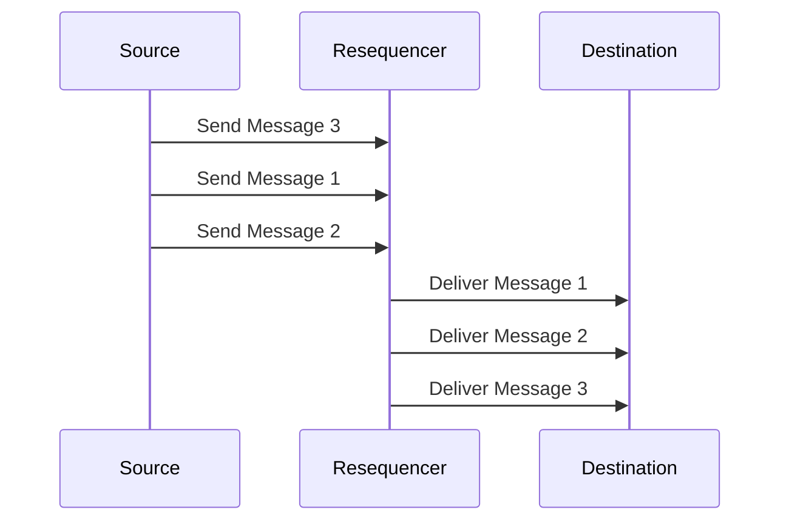

## 14.5.3 Resequencer

### Introduction

In the realm of software integration, ensuring that messages are processed in the correct order is paramount, especially in systems where the sequence of operations affects the outcome. The **Resequencer Pattern** is a design pattern that addresses this challenge by reordering messages that arrive out of sequence. This pattern is particularly useful in distributed systems where messages can be delayed, lost, or arrive out of order due to network latency or other factors.

### Intent

- **Description**: The Resequencer pattern aims to reorder messages that arrive out of sequence, ensuring that they are processed in the correct order. This is crucial in scenarios where the order of operations affects the system's state or output.

### Also Known As

- **Alternate Names**: Message Resequencer, Sequence Corrector

### Motivation

In distributed systems, messages often travel through various channels and nodes, leading to potential delays and out-of-order delivery. For example, in a financial transaction system, processing transactions in the wrong order could lead to incorrect account balances. The Resequencer pattern ensures that messages are processed in the correct sequence, maintaining data integrity and consistency.

### Applicability

- **Guidelines**: Use the Resequencer pattern when:
  - Messages must be processed in a specific order.
  - The system cannot guarantee in-order delivery.
  - Data integrity and consistency depend on message order.
  - Handling real-time data streams where sequence matters.

### Structure



- **Caption**: The diagram illustrates the Resequencer pattern, where messages are reordered before being delivered to the destination.

### Participants

- **Source**: The originator of messages that may arrive out of sequence.
- **Resequencer**: The component responsible for reordering messages.
- **Destination**: The recipient that requires messages in a specific order.

### Collaborations

- **Interactions**: The Source sends messages to the Resequencer, which holds and reorders them before forwarding them to the Destination.

### Consequences

- **Analysis**: The Resequencer pattern ensures message order, improving data consistency and integrity. However, it may introduce latency and require additional memory to hold messages temporarily.

### Implementation

#### Implementation Guidelines

1. **Identify the Sequence**: Determine the criteria for ordering messages, such as timestamps or sequence numbers.
2. **Buffer Messages**: Temporarily store incoming messages until they can be ordered correctly.
3. **Reorder and Deliver**: Once the correct order is determined, deliver messages to the destination.

#### Sample Code Snippets

```java
import java.util.PriorityQueue;
import java.util.concurrent.ConcurrentHashMap;
import java.util.concurrent.ConcurrentMap;

public class Resequencer {
    private final PriorityQueue<Message> messageQueue;
    private final ConcurrentMap<Integer, Message> messageBuffer;
    private int expectedSequenceNumber;

    public Resequencer() {
        this.messageQueue = new PriorityQueue<>((m1, m2) -> Integer.compare(m1.getSequenceNumber(), m2.getSequenceNumber()));
        this.messageBuffer = new ConcurrentHashMap<>();
        this.expectedSequenceNumber = 1;
    }

    public void receiveMessage(Message message) {
        messageBuffer.put(message.getSequenceNumber(), message);
        resequence();
    }

    private void resequence() {
        while (messageBuffer.containsKey(expectedSequenceNumber)) {
            Message message = messageBuffer.remove(expectedSequenceNumber);
            messageQueue.offer(message);
            expectedSequenceNumber++;
        }
    }

    public Message deliverNext() {
        return messageQueue.poll();
    }
}

class Message {
    private final int sequenceNumber;
    private final String content;

    public Message(int sequenceNumber, String content) {
        this.sequenceNumber = sequenceNumber;
        this.content = content;
    }

    public int getSequenceNumber() {
        return sequenceNumber;
    }

    public String getContent() {
        return content;
    }
}
```

- **Explanation**: This Java implementation uses a `PriorityQueue` to reorder messages based on their sequence numbers. The `ConcurrentMap` is used to buffer messages until they can be ordered correctly. The `resequence` method checks for the next expected sequence number and orders messages accordingly.

#### Handling Missing Messages or Duplicates

- **Missing Messages**: Implement timeouts or thresholds to handle missing messages. If a message is missing for too long, decide whether to skip it or trigger an alert.
- **Duplicates**: Use unique identifiers to detect and discard duplicate messages.

#### Sample Use Cases

- **Real-time Data Processing**: In stock trading platforms, the order of trades is crucial for accurate portfolio management.
- **Financial Transactions**: Ensuring transactions are processed in the correct order to maintain accurate account balances.
- **Log Aggregation**: Reordering log entries from distributed systems to reconstruct the correct sequence of events.

### Related Patterns

- **Connections**: The Resequencer pattern is often used in conjunction with the [Aggregator Pattern]( "Aggregator Pattern") to collect and reorder messages before aggregation.

### Known Uses

- **Examples in Libraries or Frameworks**: Apache Camel provides a Resequencer component that can be used to reorder messages in integration routes.

### Performance Implications

- **Memory Usage**: Holding messages in memory can lead to increased memory consumption, especially in high-throughput systems.
- **Latency**: Introducing a resequencing step may add latency to message processing. Consider the trade-off between order accuracy and processing speed.

### Expert Tips and Best Practices

- **Optimize Buffer Size**: Adjust the buffer size based on expected message volume and system capacity.
- **Monitor System Performance**: Regularly monitor memory usage and processing latency to ensure the system remains responsive.
- **Use Concurrency Wisely**: Leverage Java's concurrency utilities to handle message buffering and resequencing efficiently.

### Common Pitfalls

- **Overloading Memory**: Avoid holding too many messages in memory by implementing efficient buffering strategies.
- **Ignoring Duplicates**: Ensure that duplicate messages are detected and handled appropriately to prevent data inconsistencies.

### Exercises and Practice Problems

1. **Implement a Resequencer**: Modify the provided code to handle missing messages by introducing a timeout mechanism.
2. **Optimize for Performance**: Experiment with different buffer sizes and concurrency settings to optimize the resequencer's performance in a high-throughput scenario.

### Summary

The Resequencer pattern is a powerful tool for ensuring message order in distributed systems. By reordering messages that arrive out of sequence, it maintains data integrity and consistency, which is crucial in many real-world applications. However, it is important to consider the performance implications and implement strategies to handle missing or duplicate messages effectively.

## Test Your Knowledge: Java Resequencer Pattern Quiz



### What is the primary purpose of the Resequencer pattern?

- [x] To reorder messages that arrive out of sequence
- [ ] To aggregate messages into a single message
- [ ] To split messages into multiple parts
- [ ] To filter messages based on content

> **Explanation:** The Resequencer pattern is designed to reorder messages that arrive out of sequence, ensuring they are processed in the correct order.

### Which Java collection is used in the sample code to reorder messages?

- [x] PriorityQueue
- [ ] ArrayList
- [ ] HashMap
- [ ] LinkedList

> **Explanation:** The sample code uses a `PriorityQueue` to reorder messages based on their sequence numbers.

### How does the Resequencer pattern handle missing messages?

- [x] By implementing timeouts or thresholds
- [ ] By discarding all messages
- [ ] By duplicating existing messages
- [ ] By ignoring the sequence

> **Explanation:** The Resequencer pattern can handle missing messages by implementing timeouts or thresholds to decide whether to skip or alert on missing messages.

### What is a potential drawback of using the Resequencer pattern?

- [x] Increased memory usage
- [ ] Decreased message order accuracy
- [ ] Reduced message throughput
- [ ] Increased message duplication

> **Explanation:** Holding messages in memory can lead to increased memory usage, especially in high-throughput systems.

### In which scenario is the Resequencer pattern most applicable?

- [x] Real-time data processing where order is critical
- [ ] Batch processing of independent messages
- [ ] Static content delivery
- [ ] Simple request-response communication

> **Explanation:** The Resequencer pattern is most applicable in real-time data processing scenarios where the order of messages is critical.

### What is a common pitfall when implementing a Resequencer?

- [x] Overloading memory with too many messages
- [ ] Ignoring message content
- [ ] Using incorrect data types
- [ ] Overusing concurrency

> **Explanation:** A common pitfall is overloading memory by holding too many messages, which can affect system performance.

### How can duplicates be handled in the Resequencer pattern?

- [x] By using unique identifiers
- [ ] By increasing buffer size
- [x] By discarding duplicates
- [ ] By reordering duplicates

> **Explanation:** Duplicates can be handled by using unique identifiers to detect and discard them.

### What is the role of the `ConcurrentMap` in the sample code?

- [x] To buffer messages until they can be ordered
- [ ] To deliver messages to the destination
- [ ] To aggregate messages
- [ ] To split messages into parts

> **Explanation:** The `ConcurrentMap` is used to buffer messages until they can be ordered correctly.

### Which pattern is often used in conjunction with the Resequencer?

- [x] Aggregator Pattern
- [ ] Singleton Pattern
- [ ] Observer Pattern
- [ ] Factory Pattern

> **Explanation:** The Resequencer pattern is often used with the Aggregator Pattern to collect and reorder messages before aggregation.

### True or False: The Resequencer pattern can introduce latency in message processing.

- [x] True
- [ ] False

> **Explanation:** Introducing a resequencing step may add latency to message processing as messages are held and reordered.



By mastering the Resequencer pattern, Java developers can ensure that their systems maintain the correct order of operations, which is essential for data integrity and consistency in many applications.
