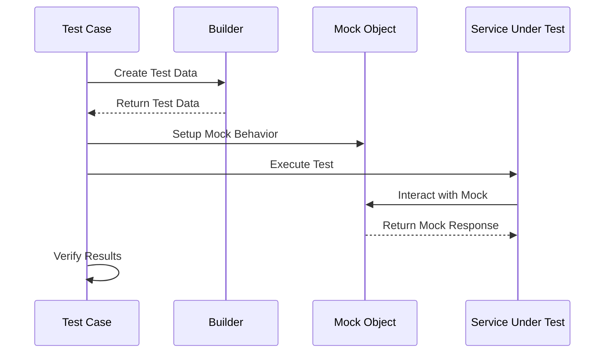

## 14.5 Using Design Patterns in Unit Testing

Unit testing is a critical aspect of software development that ensures individual components of an application function correctly. However, writing effective unit tests can be challenging, especially when dealing with complex objects and dependencies. Design patterns offer a structured approach to tackle these challenges, making tests more maintainable, readable, and effective. In this section, we will explore how design patterns such as Builder, Factory Method, and Singleton can be leveraged in unit testing.

### Patterns Beneficial for Testing

#### Builder Pattern for Constructing Test Data

The Builder pattern is particularly useful in unit testing for constructing complex objects. It allows you to create a step-by-step construction process, which is invaluable when you need to set up test data with specific configurations.

**Example: Implementing the Builder Pattern in Tests**

Let's consider a scenario where we need to test a `User` class with multiple attributes. Creating a `UserBuilder` can simplify the test setup:

```java
public class User {
    private String name;
    private int age;
    private String email;

    // Constructor and getters
}

public class UserBuilder {
    private String name = "Default Name";
    private int age = 18;
    private String email = "default@example.com";

    public UserBuilder setName(String name) {
        this.name = name;
        return this;
    }

    public UserBuilder setAge(int age) {
        this.age = age;
        return this;
    }

    public UserBuilder setEmail(String email) {
        this.email = email;
        return this;
    }

    public User build() {
        return new User(name, age, email);
    }
}
```

**Using the Builder in Tests**

```java
@Test
public void testUserCreation() {
    User user = new UserBuilder().setName("Alice").setAge(30).setEmail("alice@example.com").build();
    assertEquals("Alice", user.getName());
    assertEquals(30, user.getAge());
    assertEquals("alice@example.com", user.getEmail());
}
```

The Builder pattern allows for flexible and readable test data setup, making it easy to understand the test's intent.

#### Factory Method Pattern for Creating Mock Objects

The Factory Method pattern provides a way to encapsulate the instantiation logic of objects. This is particularly useful in testing when you need to create mock objects or test doubles.

**Example: Implementing Factory Method for Mocks**

Consider a scenario where you need to test a service that depends on a `DatabaseConnection` interface. You can use a factory method to create mock instances:

```java
public interface DatabaseConnection {
    void connect();
    void disconnect();
}

public class MockDatabaseConnection implements DatabaseConnection {
    private boolean connected = false;

    @Override
    public void connect() {
        connected = true;
    }

    @Override
    public void disconnect() {
        connected = false;
    }

    public boolean isConnected() {
        return connected;
    }
}

public class DatabaseConnectionFactory {
    public static DatabaseConnection createMockConnection() {
        return new MockDatabaseConnection();
    }
}
```

**Using the Factory Method in Tests**

```java
@Test
public void testServiceWithMockDatabase() {
    DatabaseConnection mockConnection = DatabaseConnectionFactory.createMockConnection();
    mockConnection.connect();
    assertTrue(((MockDatabaseConnection) mockConnection).isConnected());
    mockConnection.disconnect();
    assertFalse(((MockDatabaseConnection) mockConnection).isConnected());
}
```

The Factory Method pattern abstracts the creation of mock objects, promoting reuse and consistency across tests.

#### Singleton Pattern for Test Configurations

The Singleton pattern ensures that a class has only one instance and provides a global point of access to it. In testing, this can be useful for managing configurations or shared resources.

**Example: Singleton for Test Configuration**

Suppose you have a configuration class that should be consistent across all tests:

```java
public class TestConfig {
    private static TestConfig instance;
    private String databaseUrl;

    private TestConfig() {
        // Load configuration
        databaseUrl = "jdbc:testdb://localhost";
    }

    public static TestConfig getInstance() {
        if (instance == null) {
            instance = new TestConfig();
        }
        return instance;
    }

    public String getDatabaseUrl() {
        return databaseUrl;
    }
}
```

**Using Singleton in Tests**

```java
@Test
public void testDatabaseUrlConfiguration() {
    TestConfig config = TestConfig.getInstance();
    assertEquals("jdbc:testdb://localhost", config.getDatabaseUrl());
}
```

The Singleton pattern ensures that the configuration is consistent and easily accessible across different test cases.

### Mock Objects Pattern

Beyond using mocking frameworks like Mockito, the Mock Objects pattern involves designing custom mock objects that simulate the behavior of real objects. This approach can be beneficial when you need more control over the mock's behavior or when integrating with legacy systems.

**Designing Custom Mock Objects**

Custom mock objects can be tailored to specific testing needs, providing more detailed control over interactions and state.

**Example: Custom Mock Object**

```java
public class EmailServiceMock implements EmailService {
    private List<String> sentEmails = new ArrayList<>();

    @Override
    public void sendEmail(String recipient, String message) {
        sentEmails.add(recipient + ": " + message);
    }

    public List<String> getSentEmails() {
        return sentEmails;
    }
}

@Test
public void testEmailService() {
    EmailServiceMock emailService = new EmailServiceMock();
    emailService.sendEmail("test@example.com", "Hello, World!");
    assertEquals(1, emailService.getSentEmails().size());
    assertEquals("test@example.com: Hello, World!", emailService.getSentEmails().get(0));
}
```

Custom mock objects provide flexibility and can be designed to meet specific testing requirements, offering a deeper level of control than generic mocking frameworks.

### Organizing Test Code

Effective organization of test code is crucial for maintaining readability and ease of maintenance. Design patterns can guide the structuring of test classes and methods.

#### Structuring Test Classes and Methods

- **Use Descriptive Naming**: Ensure test methods and classes have clear, descriptive names that convey their purpose.
- **Group Related Tests**: Organize tests into classes based on functionality or feature being tested.
- **Follow Arrange-Act-Assert (AAA) Pattern**: Structure tests into setup, execution, and verification phases for clarity.

**Example: Organizing Test Code**

```java
public class UserServiceTest {

    @Test
    public void shouldCreateUserSuccessfully() {
        // Arrange
        UserBuilder builder = new UserBuilder().setName("Bob").setAge(25);

        // Act
        User user = builder.build();

        // Assert
        assertNotNull(user);
        assertEquals("Bob", user.getName());
        assertEquals(25, user.getAge());
    }

    @Test
    public void shouldFailToCreateUserWithInvalidAge() {
        // Arrange
        UserBuilder builder = new UserBuilder().setAge(-1);

        // Act & Assert
        assertThrows(IllegalArgumentException.class, builder::build);
    }
}
```

### Enhancing Test Maintainability

Design patterns help reduce duplication and simplify updates when requirements change. By encapsulating test logic and data setup, patterns make tests more adaptable to changes.

#### Reducing Duplication

- **Use Builders for Test Data**: Avoid duplicating object creation logic by using builders.
- **Centralize Mock Creation**: Use factory methods to centralize the creation of mock objects.

#### Simplifying Updates

- **Encapsulate Configuration**: Use Singleton for shared configurations to simplify updates.
- **Abstract Complex Logic**: Use patterns like Strategy or Template Method to abstract complex test logic.

### Code Examples

Let's explore comprehensive code snippets demonstrating the use of these patterns in unit tests. We'll cover setup, execution, and verification phases.

**Example: Comprehensive Test Using Patterns**

```java
public class OrderServiceTest {

    private OrderService orderService;
    private PaymentGatewayMock paymentGateway;

    @BeforeEach
    public void setup() {
        paymentGateway = new PaymentGatewayMock();
        orderService = new OrderService(paymentGateway);
    }

    @Test
    public void shouldProcessOrderSuccessfully() {
        // Arrange
        OrderBuilder builder = new OrderBuilder().setProductId(1).setQuantity(2);

        // Act
        Order order = builder.build();
        orderService.processOrder(order);

        // Assert
        assertTrue(paymentGateway.isPaymentProcessed());
        assertEquals(OrderStatus.PROCESSED, order.getStatus());
    }

    @Test
    public void shouldFailToProcessOrderWithInvalidPayment() {
        // Arrange
        OrderBuilder builder = new OrderBuilder().setProductId(1).setQuantity(2);
        paymentGateway.setPaymentValid(false);

        // Act & Assert
        Order order = builder.build();
        assertThrows(PaymentException.class, () -> orderService.processOrder(order));
        assertEquals(OrderStatus.FAILED, order.getStatus());
    }
}
```

### Potential Drawbacks

While design patterns can greatly enhance test quality, there is a risk of overcomplicating tests with unnecessary patterns. It's important to keep tests as simple as possible and only introduce patterns when they provide clear benefits.

#### Avoid Over-Engineering

- **Assess Complexity**: Evaluate whether a pattern simplifies or complicates the test.
- **Prioritize Clarity**: Ensure that the use of patterns enhances, rather than hinders, test readability.

### Real-World Applications

In real-world applications, using design patterns in tests has led to concrete benefits such as improved test quality and easier maintenance. Development teams have reported that patterns help in:

- **Reducing Test Flakiness**: By providing consistent setup and teardown processes.
- **Improving Test Coverage**: By making it easier to test edge cases and complex scenarios.
- **Facilitating Collaboration**: By providing a common language and structure for tests.

### Try It Yourself

Experiment with the provided code examples by modifying the builder configurations or mock behaviors. Try creating additional test cases to explore different scenarios and edge cases.

### Visualizing Design Patterns in Unit Testing

To better understand how these patterns fit into the unit testing process, let's visualize the interaction between test components using a sequence diagram.



This diagram illustrates the flow of a typical unit test using design patterns, highlighting the roles of builders and mocks in setting up and executing tests.

### Knowledge Check

Reflect on the material covered and consider the following questions:

- How does the Builder pattern simplify test data setup?
- What are the benefits of using the Factory Method pattern for mock creation?
- How can the Singleton pattern help manage test configurations?
- What are the potential drawbacks of overusing design patterns in tests?

### Embrace the Journey

Remember, this is just the beginning. As you progress, you'll discover more ways to leverage design patterns in testing. Keep experimenting, stay curious, and enjoy the journey!

## Quiz Time!



### Which design pattern is particularly useful for constructing complex test data?

- [x] Builder Pattern
- [ ] Singleton Pattern
- [ ] Factory Method Pattern
- [ ] Observer Pattern

> **Explanation:** The Builder Pattern is ideal for constructing complex objects, making it useful for setting up test data with specific configurations.


### What is a key benefit of using the Factory Method pattern in unit tests?

- [x] It encapsulates the instantiation logic of objects.
- [ ] It ensures a class has only one instance.
- [ ] It provides a global point of access.
- [ ] It defines a family of algorithms.

> **Explanation:** The Factory Method pattern encapsulates the instantiation logic, which is beneficial for creating mock objects in tests.


### How does the Singleton pattern help in unit testing?

- [x] It manages shared configurations or resources.
- [ ] It constructs complex objects.
- [ ] It encapsulates object creation logic.
- [ ] It decouples interfaces from implementations.

> **Explanation:** The Singleton pattern ensures consistent configuration or resource management across tests by providing a single instance.


### What is a potential drawback of overusing design patterns in tests?

- [x] Overcomplicating tests
- [ ] Improving test readability
- [ ] Reducing test coverage
- [ ] Increasing test flakiness

> **Explanation:** Overusing design patterns can lead to unnecessary complexity, making tests harder to understand and maintain.


### Why might you design custom mock objects instead of using a mocking framework?

- [x] To gain more control over the mock's behavior
- [ ] To simplify the test setup
- [x] To integrate with legacy systems
- [ ] To reduce test execution time

> **Explanation:** Custom mock objects provide detailed control over interactions and are useful for integrating with legacy systems.


### What is the Arrange-Act-Assert pattern used for in testing?

- [x] Structuring tests into setup, execution, and verification phases
- [ ] Creating complex test data
- [ ] Managing test configurations
- [ ] Encapsulating object creation

> **Explanation:** The Arrange-Act-Assert pattern structures tests into clear phases, enhancing readability and organization.


### How can the Builder pattern reduce duplication in tests?

- [x] By centralizing object creation logic
- [ ] By managing shared configurations
- [x] By providing flexible test data setup
- [ ] By encapsulating mock creation

> **Explanation:** The Builder pattern centralizes object creation, reducing duplication and providing flexible test data setup.


### What is a benefit of using design patterns in unit testing?

- [x] Improved test maintainability
- [ ] Increased test complexity
- [ ] Reduced test coverage
- [ ] Increased test execution time

> **Explanation:** Design patterns enhance test maintainability by reducing duplication and simplifying updates.


### How does the Factory Method pattern promote reuse in tests?

- [x] By centralizing mock object creation
- [ ] By managing test configurations
- [ ] By encapsulating test logic
- [ ] By decoupling interfaces from implementations

> **Explanation:** The Factory Method pattern centralizes the creation of mock objects, promoting reuse and consistency.


### True or False: The Singleton pattern can be used to manage test configurations across different test cases.

- [x] True
- [ ] False

> **Explanation:** The Singleton pattern ensures consistent configuration management by providing a single instance accessible across tests.


