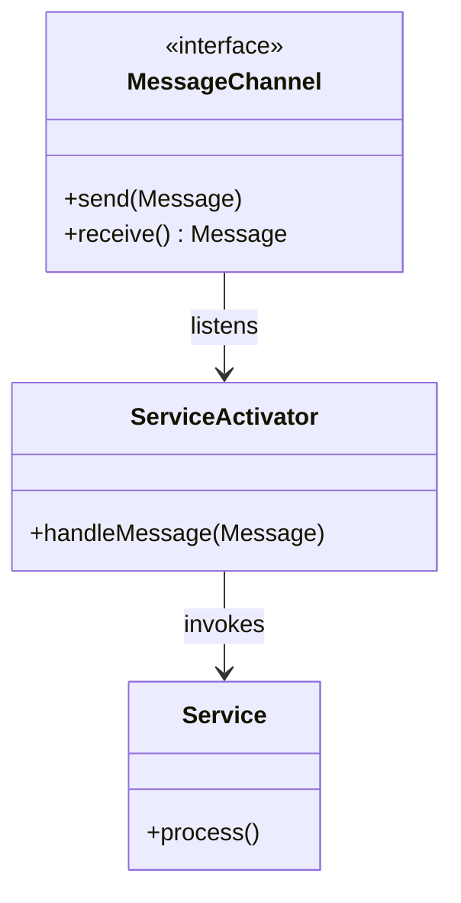

## 14.6.1 Service Activator

### Introduction

In the realm of enterprise application integration, the **Service Activator** pattern plays a pivotal role in bridging the gap between messaging systems and service handling logic. This pattern is a crucial component of the [Message Endpoint Patterns](https://www.enterpriseintegrationpatterns.com/patterns/messaging/MessageEndpoint.html) and is instrumental in enabling asynchronous processing and seamless integration within distributed systems.

### Intent

- **Description**: The Service Activator pattern is designed to connect incoming messages to the appropriate service handling logic. It acts as an intermediary that listens for messages on a messaging channel and invokes the corresponding service to process these messages.

### Also Known As

- **Alternate Names**: Message-Driven POJO (Plain Old Java Object)

### Motivation

In modern software architectures, especially those involving microservices and cloud-native applications, there is a need to decouple the messaging infrastructure from the business logic. The Service Activator pattern addresses this need by providing a mechanism to invoke services in response to messages, thus promoting loose coupling and enhancing scalability.

### Applicability

- **Guidelines**: Use the Service Activator pattern when:
  - You need to process messages asynchronously.
  - There is a requirement to decouple message handling from business logic.
  - You are integrating with external systems or services through messaging.
  - You want to leverage existing messaging infrastructure for service invocation.

### Structure



- **Caption**: The diagram illustrates the structure of the Service Activator pattern, where the Service Activator listens to a Message Channel and invokes the appropriate Service to process the message.

### Participants

- **MessageChannel**: The interface through which messages are sent and received.
- **ServiceActivator**: The component that listens for messages and invokes the appropriate service.
- **Service**: The business logic component that processes the message.

### Collaborations

- **Interactions**: The Service Activator listens for messages on the Message Channel. Upon receiving a message, it invokes the Service to process the message, thereby decoupling the messaging infrastructure from the business logic.

### Consequences

- **Analysis**:
  - **Benefits**: 
    - Decouples messaging infrastructure from business logic.
    - Facilitates asynchronous processing.
    - Enhances scalability and flexibility.
  - **Drawbacks**:
    - Introduces complexity in managing message delivery and processing.
    - Requires robust error handling and message retry mechanisms.

### Implementation

#### Implementation Guidelines

To implement the Service Activator pattern in Java, you can leverage frameworks such as Spring Integration or Apache Camel, which provide built-in support for message-driven architectures.

#### Sample Code Snippets

Below is an example of implementing a Service Activator using Spring Integration:

```java
// Import necessary Spring Integration components
import org.springframework.integration.annotation.ServiceActivator;
import org.springframework.messaging.Message;
import org.springframework.stereotype.Component;

// Define the service activator component
@Component
public class OrderServiceActivator {

    // Annotate the method with @ServiceActivator to indicate it processes messages
    @ServiceActivator(inputChannel = "orderChannel")
    public void handleOrder(Message<String> message) {
        // Extract the payload from the message
        String order = message.getPayload();
        // Process the order
        System.out.println("Processing order: " + order);
    }
}
```

- **Explanation**: In this example, the `OrderServiceActivator` class is annotated with `@ServiceActivator`, indicating that it processes messages from the `orderChannel`. The `handleOrder` method extracts the payload from the message and processes it.

#### Sample Use Cases

- **Real-world Scenarios**:
  - **Order Processing Systems**: In e-commerce platforms, the Service Activator pattern can be used to process orders asynchronously, allowing for scalable and efficient order handling.
  - **Notification Systems**: In notification services, messages can trigger notifications to be sent to users, decoupling the notification logic from the messaging infrastructure.

### Related Patterns

- **Connections**: The Service Activator pattern is closely related to the [Message Channel Pattern](https://www.enterpriseintegrationpatterns.com/patterns/messaging/MessageChannel.html) and the [Message Router Pattern](https://www.enterpriseintegrationpatterns.com/patterns/messaging/MessageRouter.html), which are also part of the Message Endpoint Patterns.

### Known Uses

- **Examples in Libraries or Frameworks**:
  - **Spring Integration**: Provides extensive support for implementing the Service Activator pattern through annotations and configuration.
  - **Apache Camel**: Offers a flexible routing and mediation engine that supports the Service Activator pattern.

### Best Practices

- **Emphasize Java-Specific Features**: Utilize Java's concurrency utilities and modern features such as Lambdas and Streams to enhance the implementation of the Service Activator pattern.
- **Discuss Trade-offs**: Consider the performance impacts and complexity introduced by asynchronous processing and message handling.
- **Compare and Contrast Similar Patterns**: Differentiate the Service Activator pattern from other integration patterns to help choose the appropriate pattern for specific use cases.

### Conclusion

The Service Activator pattern is a powerful tool for integrating messaging systems with service handling logic in Java applications. By decoupling the messaging infrastructure from business logic, it enables scalable and flexible architectures that can efficiently handle asynchronous processing. Leveraging frameworks like Spring Integration and Apache Camel can simplify the implementation of this pattern, allowing developers to focus on building robust and maintainable applications.

---

## Test Your Knowledge: Service Activator Design Pattern Quiz



### What is the primary purpose of the Service Activator pattern?

- [x] To connect incoming messages to service handling logic.
- [ ] To manage database transactions.
- [ ] To handle user authentication.
- [ ] To render user interfaces.

> **Explanation:** The Service Activator pattern is designed to connect incoming messages to the appropriate service handling logic, enabling asynchronous processing and integration.

### Which Java framework is commonly used to implement the Service Activator pattern?

- [x] Spring Integration
- [ ] Hibernate
- [ ] JSF
- [ ] JUnit

> **Explanation:** Spring Integration provides extensive support for implementing the Service Activator pattern through annotations and configuration.

### What is a key benefit of using the Service Activator pattern?

- [x] It decouples messaging infrastructure from business logic.
- [ ] It simplifies user interface design.
- [ ] It enhances database performance.
- [ ] It reduces code complexity.

> **Explanation:** The Service Activator pattern decouples messaging infrastructure from business logic, facilitating asynchronous processing and enhancing scalability.

### In the Service Activator pattern, what role does the Message Channel play?

- [x] It serves as the interface through which messages are sent and received.
- [ ] It processes the business logic.
- [ ] It handles user authentication.
- [ ] It manages database transactions.

> **Explanation:** The Message Channel is the interface through which messages are sent and received, allowing the Service Activator to listen for messages.

### Which of the following is a drawback of the Service Activator pattern?

- [x] It introduces complexity in managing message delivery and processing.
- [ ] It simplifies user interface design.
- [ ] It enhances database performance.
- [ ] It reduces code complexity.

> **Explanation:** The Service Activator pattern introduces complexity in managing message delivery and processing, requiring robust error handling and message retry mechanisms.

### What is the role of the Service in the Service Activator pattern?

- [x] It processes the message received by the Service Activator.
- [ ] It sends messages to the Message Channel.
- [ ] It manages database transactions.
- [ ] It handles user authentication.

> **Explanation:** The Service is the business logic component that processes the message received by the Service Activator.

### How does the Service Activator pattern enhance scalability?

- [x] By enabling asynchronous processing and decoupling messaging from business logic.
- [ ] By simplifying user interface design.
- [ ] By enhancing database performance.
- [ ] By reducing code complexity.

> **Explanation:** The Service Activator pattern enhances scalability by enabling asynchronous processing and decoupling messaging from business logic.

### What is a common use case for the Service Activator pattern?

- [x] Order processing systems in e-commerce platforms.
- [ ] User interface design.
- [ ] Database management.
- [ ] User authentication.

> **Explanation:** A common use case for the Service Activator pattern is in order processing systems, where it enables scalable and efficient order handling.

### Which pattern is closely related to the Service Activator pattern?

- [x] Message Channel Pattern
- [ ] Singleton Pattern
- [ ] Factory Pattern
- [ ] Observer Pattern

> **Explanation:** The Service Activator pattern is closely related to the Message Channel Pattern, as both are part of the Message Endpoint Patterns.

### True or False: The Service Activator pattern is only applicable in synchronous processing scenarios.

- [ ] True
- [x] False

> **Explanation:** The Service Activator pattern is primarily used in asynchronous processing scenarios, where it decouples messaging infrastructure from business logic.



---
