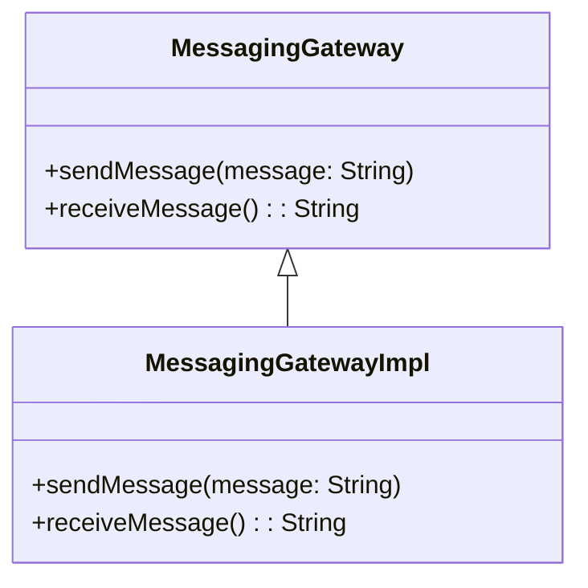

## 14.6.2 Messaging Gateway

### Introduction

In the realm of enterprise application integration, the **Messaging Gateway** pattern plays a pivotal role by abstracting the complexities of messaging systems. This pattern provides a unified and simplified interface for applications to interact with messaging infrastructures, such as message queues or topics, without delving into the intricacies of the underlying messaging protocols or APIs.

### Intent

The primary intent of the Messaging Gateway pattern is to encapsulate messaging-specific code, thereby isolating messaging concerns from the core application logic. This separation of concerns enhances the maintainability, testability, and scalability of the application.

### Motivation

In complex systems, direct interaction with messaging APIs can lead to tightly coupled code that is difficult to maintain and test. By implementing a Messaging Gateway, developers can create a clear boundary between the application and the messaging system, allowing for easier modifications and testing of the messaging logic.

### Applicability

The Messaging Gateway pattern is applicable in scenarios where:

- Applications need to communicate with external systems via messaging protocols.
- There is a need to decouple application logic from messaging infrastructure.
- The system requires a consistent interface for sending and receiving messages.
- Enhanced testability and maintainability of messaging logic are desired.

### Structure

The structure of a Messaging Gateway typically involves an interface that defines the messaging operations and a concrete implementation that interacts with the messaging system.



**Diagram Explanation**: The diagram illustrates the relationship between the `MessagingGateway` interface and its implementation `MessagingGatewayImpl`. The interface defines the contract for messaging operations, while the implementation handles the actual interaction with the messaging system.

### Participants

- **MessagingGateway**: An interface that defines the operations for sending and receiving messages.
- **MessagingGatewayImpl**: A concrete class that implements the `MessagingGateway` interface and interacts with the messaging system.
- **MessagingSystem**: Represents the external messaging infrastructure (e.g., JMS, RabbitMQ).

### Collaborations

The `MessagingGatewayImpl` collaborates with the `MessagingSystem` to send and receive messages. The application interacts with the `MessagingGateway` interface, ensuring that messaging concerns are isolated from the application logic.

### Consequences

#### Benefits

- **Decoupling**: Isolates messaging logic from application code, promoting separation of concerns.
- **Maintainability**: Simplifies code maintenance by encapsulating messaging-specific logic.
- **Testability**: Facilitates unit testing by allowing mock implementations of the gateway.
- **Flexibility**: Enables easy switching between different messaging systems or protocols.

#### Drawbacks

- **Complexity**: Introduces an additional layer of abstraction, which may increase complexity.
- **Performance Overhead**: May introduce slight performance overhead due to the abstraction layer.

### Implementation

#### Implementation Guidelines

1. **Define the Interface**: Create an interface that specifies the messaging operations.
2. **Implement the Interface**: Develop a concrete class that implements the interface and interacts with the messaging system.
3. **Handle Exceptions**: Implement robust exception handling to manage messaging errors.
4. **Manage Transactions**: Ensure that message sending and receiving are part of a transaction if required.

#### Sample Code Snippets

```java
// Define the MessagingGateway interface
public interface MessagingGateway {
    void sendMessage(String message);
    String receiveMessage();
}

// Implement the MessagingGateway interface
public class MessagingGatewayImpl implements MessagingGateway {
    private final MessageQueue messageQueue;

    public MessagingGatewayImpl(MessageQueue messageQueue) {
        this.messageQueue = messageQueue;
    }

    @Override
    public void sendMessage(String message) {
        try {
            messageQueue.send(message);
        } catch (MessagingException e) {
            // Handle exception
            System.err.println("Failed to send message: " + e.getMessage());
        }
    }

    @Override
    public String receiveMessage() {
        try {
            return messageQueue.receive();
        } catch (MessagingException e) {
            // Handle exception
            System.err.println("Failed to receive message: " + e.getMessage());
            return null;
        }
    }
}

// Example usage
public class Application {
    public static void main(String[] args) {
        MessageQueue messageQueue = new MessageQueue(); // Assume this is a messaging system
        MessagingGateway messagingGateway = new MessagingGatewayImpl(messageQueue);

        messagingGateway.sendMessage("Hello, World!");
        String message = messagingGateway.receiveMessage();
        System.out.println("Received message: " + message);
    }
}
```

**Explanation**: The code defines a `MessagingGateway` interface and its implementation `MessagingGatewayImpl`. The implementation interacts with a hypothetical `MessageQueue` to send and receive messages, demonstrating exception handling within the messaging operations.

### Sample Use Cases

- **Enterprise Service Bus (ESB)**: A Messaging Gateway can be used to interface with an ESB, abstracting the complexities of message routing and transformation.
- **Microservices Communication**: In a microservices architecture, a Messaging Gateway can facilitate communication between services using message brokers like Kafka or RabbitMQ.
- **Legacy System Integration**: When integrating with legacy systems that use messaging protocols, a Messaging Gateway can provide a modern interface for interaction.

### Related Patterns

- **[Adapter Pattern]( "Adapter Pattern")**: Similar to the Adapter pattern, the Messaging Gateway adapts the messaging system's interface to a more application-friendly interface.
- **[Facade Pattern]( "Facade Pattern")**: Like the Facade pattern, the Messaging Gateway provides a simplified interface to a complex subsystem.

### Known Uses

- **Spring Integration**: The Spring Integration framework provides support for implementing Messaging Gateways, allowing developers to easily integrate with various messaging systems.
- **Apache Camel**: Apache Camel uses the Messaging Gateway pattern to provide a consistent interface for interacting with different messaging protocols.

### Exception Handling and Transaction Management

#### Exception Handling

When implementing a Messaging Gateway, it is crucial to handle exceptions gracefully. Consider the following best practices:

- **Log Exceptions**: Ensure that all exceptions are logged for troubleshooting purposes.
- **Retry Mechanism**: Implement a retry mechanism for transient errors, such as network issues.
- **Fallback Strategy**: Define fallback strategies for critical operations, such as storing messages in a database if the messaging system is unavailable.

#### Transaction Management

In scenarios where message delivery must be guaranteed, transaction management becomes essential. Consider using Java Transaction API (JTA) or Spring's transaction management features to ensure atomicity of message operations.

### Conclusion

The Messaging Gateway pattern is a powerful tool for simplifying the integration of applications with messaging systems. By encapsulating messaging-specific logic, it enhances the maintainability, testability, and flexibility of the application. When implementing this pattern, consider exception handling and transaction management to ensure robust and reliable messaging operations.

---

## Test Your Knowledge: Messaging Gateway Pattern Quiz



### What is the primary purpose of the Messaging Gateway pattern?

- [x] To encapsulate messaging-specific code and provide a simplified interface.
- [ ] To directly interact with the messaging system.
- [ ] To replace the messaging system with a database.
- [ ] To enhance the performance of message processing.

> **Explanation:** The Messaging Gateway pattern encapsulates messaging-specific code, providing a simplified interface to the application.

### Which of the following is a benefit of using the Messaging Gateway pattern?

- [x] Improved maintainability
- [ ] Increased complexity
- [ ] Direct access to messaging APIs
- [ ] Reduced testability

> **Explanation:** The Messaging Gateway pattern improves maintainability by isolating messaging logic from application code.

### How does the Messaging Gateway pattern enhance testability?

- [x] By allowing mock implementations of the gateway
- [ ] By providing direct access to the messaging system
- [ ] By eliminating the need for unit tests
- [ ] By increasing code complexity

> **Explanation:** The pattern enhances testability by allowing developers to use mock implementations for testing purposes.

### What is a common drawback of the Messaging Gateway pattern?

- [x] It introduces an additional layer of abstraction.
- [ ] It reduces code maintainability.
- [ ] It complicates exception handling.
- [ ] It eliminates the need for messaging systems.

> **Explanation:** The additional layer of abstraction can introduce complexity, which is a common drawback of the pattern.

### In which scenario is the Messaging Gateway pattern most applicable?

- [x] When decoupling application logic from messaging infrastructure is needed
- [ ] When direct database access is required
- [ ] When performance is the primary concern
- [ ] When no messaging system is used

> **Explanation:** The pattern is most applicable when there is a need to decouple application logic from messaging infrastructure.

### What should be considered when implementing exception handling in a Messaging Gateway?

- [x] Logging exceptions and implementing a retry mechanism
- [ ] Ignoring exceptions
- [ ] Directly throwing exceptions to the user
- [ ] Eliminating all exception handling

> **Explanation:** Logging exceptions and implementing a retry mechanism are best practices for handling exceptions in a Messaging Gateway.

### How can transaction management be ensured in a Messaging Gateway?

- [x] By using Java Transaction API (JTA) or Spring's transaction management
- [ ] By avoiding transactions altogether
- [ ] By using direct database transactions
- [ ] By implementing custom transaction logic

> **Explanation:** Using JTA or Spring's transaction management ensures proper transaction handling in a Messaging Gateway.

### Which pattern is closely related to the Messaging Gateway?

- [x] Adapter Pattern
- [ ] Singleton Pattern
- [ ] Observer Pattern
- [ ] Factory Pattern

> **Explanation:** The Adapter Pattern is closely related as it also adapts interfaces to be more application-friendly.

### What is a potential performance concern when using a Messaging Gateway?

- [x] The abstraction layer may introduce slight performance overhead.
- [ ] It eliminates the need for performance optimization.
- [ ] It directly improves performance.
- [ ] It has no impact on performance.

> **Explanation:** The abstraction layer introduced by the Messaging Gateway may cause slight performance overhead.

### True or False: The Messaging Gateway pattern can be used to integrate with legacy systems.

- [x] True
- [ ] False

> **Explanation:** The Messaging Gateway pattern can provide a modern interface for integrating with legacy systems that use messaging protocols.


