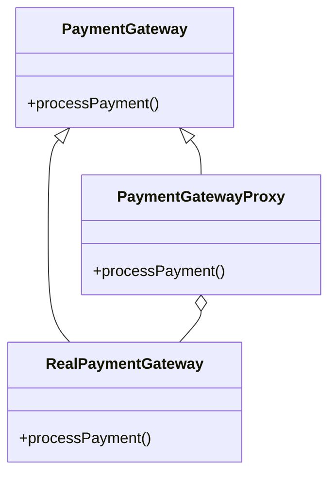

## 14.6 Case Studies in Testing Patterns

In this section, we delve into real-world examples of how design patterns have been effectively utilized to enhance testing in complex Java systems. By examining these case studies, we aim to provide insights into the challenges faced, the patterns applied, and the outcomes achieved. This exploration serves as a guide for expert developers seeking to optimize their testing strategies using design patterns.

### Selecting Case Studies

For our exploration, we have selected three diverse case studies from different industries: financial services, healthcare, and e-commerce. Each project presented unique challenges and required tailored testing strategies to ensure robust and reliable software delivery.

### Case Study 1: Financial Services Application

#### Background Information

Our first case study involves a financial services company developing a trading platform. The project aimed to provide real-time trading capabilities with high reliability and security. The system's complexity stemmed from its need to integrate with multiple external financial data sources and ensure compliance with stringent regulatory standards.

#### Testing Challenges

The primary testing challenges included:

- **Integration Complexity**: The platform needed to interact with various external APIs, each with different data formats and protocols.
- **Security Concerns**: Ensuring data privacy and protection against cyber threats was paramount.
- **Performance Requirements**: The system had to handle high transaction volumes with minimal latency.

#### Patterns Applied in Testing

To address these challenges, several design patterns were employed:

- **Adapter Pattern**: Used to create a uniform interface for interacting with diverse external APIs, simplifying integration testing.
- **Decorator Pattern**: Applied to enhance security testing by dynamically adding security checks to data processing components.
- **Strategy Pattern**: Utilized to implement different testing strategies for performance testing, allowing easy switching between load testing and stress testing approaches.

```java
// Example of Adapter Pattern for API Integration Testing
public interface TradingAPI {
    void fetchData();
}

public class ExternalAPIAdapter implements TradingAPI {
    private ExternalAPI externalAPI;

    public ExternalAPIAdapter(ExternalAPI externalAPI) {
        this.externalAPI = externalAPI;
    }

    @Override
    public void fetchData() {
        externalAPI.getData(); // Adapts the external API call to the TradingAPI interface
    }
}
```

#### Outcomes and Benefits

The application of these patterns led to:

- **Improved Test Coverage**: The Adapter Pattern facilitated comprehensive integration testing across all external APIs.
- **Enhanced Security**: The Decorator Pattern allowed for flexible and thorough security testing.
- **Efficient Performance Testing**: The Strategy Pattern enabled the team to quickly adapt testing strategies, resulting in faster identification of performance bottlenecks.

#### Lessons Learned

Key insights from this case study include:

- **Flexibility in Testing**: Design patterns can provide the flexibility needed to adapt testing strategies to evolving project requirements.
- **Security as a Priority**: Incorporating security checks as decorators ensures that security is an integral part of the testing process.

#### Challenges and Responses

One significant challenge was the initial complexity of implementing the Adapter Pattern for multiple APIs. This was overcome by creating a robust framework that allowed for easy addition of new adapters as needed.

### Case Study 2: Healthcare Management System

#### Background Information

The second case study focuses on a healthcare management system designed to streamline patient data management and appointment scheduling. The project aimed to improve healthcare delivery efficiency while ensuring data accuracy and compliance with health regulations.

#### Testing Challenges

The testing challenges included:

- **Data Accuracy**: Ensuring the accuracy and consistency of patient data across various modules.
- **Regulatory Compliance**: Adhering to healthcare regulations such as HIPAA.
- **User Interface Complexity**: Testing a complex user interface with numerous workflows.

#### Patterns Applied in Testing

The following patterns were applied:

- **Observer Pattern**: Used to monitor changes in patient data and trigger automated tests to verify data consistency.
- **Facade Pattern**: Implemented to simplify the testing of complex UI workflows by providing a unified interface for test scripts.
- **Memento Pattern**: Utilized to capture and restore the state of the application during testing, facilitating rollback in case of test failures.

```java
// Example of Observer Pattern for Data Consistency Testing
public class PatientDataObserver implements Observer {
    @Override
    public void update(Observable o, Object arg) {
        // Automated test to verify data consistency
        System.out.println("Patient data updated, running consistency tests...");
    }
}
```

#### Outcomes and Benefits

The use of these patterns resulted in:

- **Increased Data Integrity**: The Observer Pattern ensured real-time verification of data changes, maintaining data integrity.
- **Simplified UI Testing**: The Facade Pattern reduced the complexity of UI test scripts, making them easier to maintain.
- **Robust State Management**: The Memento Pattern allowed for effective state management during testing, reducing the impact of test failures.

#### Lessons Learned

Important takeaways from this case study are:

- **Real-Time Monitoring**: The Observer Pattern is invaluable for real-time monitoring and testing of dynamic data changes.
- **Simplification through Facades**: Facades can greatly simplify the testing of complex systems by abstracting underlying complexities.

#### Challenges and Responses

A challenge encountered was the initial setup of the Observer Pattern, which required careful design to avoid performance overhead. This was addressed by optimizing the observer notification mechanism.

### Case Study 3: E-commerce Platform

#### Background Information

Our final case study examines an e-commerce platform designed to support a large catalog of products and handle high traffic volumes. The project aimed to provide a seamless shopping experience with personalized recommendations and secure payment processing.

#### Testing Challenges

The testing challenges included:

- **Scalability**: Ensuring the platform could scale to handle peak shopping periods.
- **Personalization**: Testing the accuracy and relevance of personalized recommendations.
- **Payment Security**: Verifying secure payment processing and fraud detection mechanisms.

#### Patterns Applied in Testing

The following patterns were employed:

- **Chain of Responsibility Pattern**: Used to implement a flexible and scalable testing framework for load testing different components.
- **Prototype Pattern**: Applied to create test doubles for personalized recommendation algorithms, enabling isolated testing.
- **Proxy Pattern**: Utilized to simulate secure payment gateways during testing, ensuring realistic test scenarios.

```java
// Example of Proxy Pattern for Payment Gateway Testing
public class PaymentGatewayProxy implements PaymentGateway {
    private RealPaymentGateway realPaymentGateway;

    public PaymentGatewayProxy(RealPaymentGateway realPaymentGateway) {
        this.realPaymentGateway = realPaymentGateway;
    }

    @Override
    public void processPayment() {
        // Simulate payment processing for testing
        System.out.println("Processing payment through proxy...");
        realPaymentGateway.processPayment();
    }
}
```

#### Outcomes and Benefits

The application of these patterns led to:

- **Scalable Testing Framework**: The Chain of Responsibility Pattern provided a scalable framework for load testing, accommodating varying traffic loads.
- **Isolated Testing of Algorithms**: The Prototype Pattern enabled effective testing of recommendation algorithms without affecting production data.
- **Realistic Payment Testing**: The Proxy Pattern facilitated realistic testing of payment processing, ensuring security and reliability.

#### Lessons Learned

Key insights from this case study include:

- **Scalability through Chains**: The Chain of Responsibility Pattern is effective for creating scalable testing frameworks that can adapt to different testing needs.
- **Realism in Testing**: Proxies can simulate real-world scenarios, enhancing the realism and effectiveness of tests.

#### Challenges and Responses

One challenge was ensuring the Proxy Pattern accurately simulated real payment gateways. This was addressed by collaborating closely with payment gateway providers to understand their processes and incorporate them into the proxy design.

### Visual Aids

To enhance understanding, let's visualize the application of the Proxy Pattern in the e-commerce platform:



*Diagram: The Proxy Pattern in the e-commerce platform simulates payment processing for testing purposes.*

### Conclusion and Recommendations

These case studies demonstrate the significant role design patterns play in enhancing testing strategies for complex Java systems. By applying patterns such as Adapter, Decorator, Observer, Facade, Memento, Chain of Responsibility, Prototype, and Proxy, teams can address diverse testing challenges effectively.

**Recommendations**:

- **Consider Design Patterns Early**: Incorporate design patterns into the testing strategy from the outset of the project to maximize their benefits.
- **Tailor Patterns to Project Needs**: Select and adapt patterns based on the specific challenges and requirements of the project.
- **Collaborate Across Teams**: Work closely with development and operations teams to ensure testing strategies align with overall project goals.

Remember, the journey of mastering testing patterns is ongoing. As you continue to explore and apply these strategies, you'll enhance your ability to deliver robust and reliable software solutions.

## Quiz Time!



### Which pattern was used to create a uniform interface for interacting with diverse external APIs in the financial services case study?

- [x] Adapter Pattern
- [ ] Decorator Pattern
- [ ] Strategy Pattern
- [ ] Observer Pattern

> **Explanation:** The Adapter Pattern was used to create a uniform interface for interacting with diverse external APIs, simplifying integration testing.

### What pattern was applied to enhance security testing in the financial services application?

- [ ] Adapter Pattern
- [x] Decorator Pattern
- [ ] Strategy Pattern
- [ ] Observer Pattern

> **Explanation:** The Decorator Pattern was applied to enhance security testing by dynamically adding security checks to data processing components.

### Which pattern facilitated real-time verification of data changes in the healthcare management system?

- [ ] Facade Pattern
- [ ] Memento Pattern
- [ ] Proxy Pattern
- [x] Observer Pattern

> **Explanation:** The Observer Pattern facilitated real-time verification of data changes, maintaining data integrity.

### What pattern was used to simplify the testing of complex UI workflows in the healthcare management system?

- [x] Facade Pattern
- [ ] Memento Pattern
- [ ] Observer Pattern
- [ ] Chain of Responsibility Pattern

> **Explanation:** The Facade Pattern was used to simplify the testing of complex UI workflows by providing a unified interface for test scripts.

### Which pattern was employed to create test doubles for personalized recommendation algorithms in the e-commerce platform?

- [ ] Proxy Pattern
- [ ] Chain of Responsibility Pattern
- [x] Prototype Pattern
- [ ] Decorator Pattern

> **Explanation:** The Prototype Pattern was applied to create test doubles for personalized recommendation algorithms, enabling isolated testing.

### How was the Proxy Pattern utilized in the e-commerce platform?

- [x] To simulate secure payment gateways during testing
- [ ] To enhance security testing
- [ ] To create a uniform interface for APIs
- [ ] To implement different testing strategies

> **Explanation:** The Proxy Pattern was utilized to simulate secure payment gateways during testing, ensuring realistic test scenarios.

### Which pattern provided a scalable framework for load testing in the e-commerce platform?

- [x] Chain of Responsibility Pattern
- [ ] Prototype Pattern
- [ ] Proxy Pattern
- [ ] Observer Pattern

> **Explanation:** The Chain of Responsibility Pattern provided a scalable framework for load testing, accommodating varying traffic loads.

### What was a key insight from the financial services case study regarding security?

- [ ] Security checks should be added last
- [x] Security should be an integral part of the testing process
- [ ] Security is only needed for production
- [ ] Security testing is not necessary

> **Explanation:** A key insight was that incorporating security checks as decorators ensures that security is an integral part of the testing process.

### What challenge was addressed by optimizing the observer notification mechanism in the healthcare management system?

- [ ] Scalability
- [x] Performance overhead
- [ ] Security
- [ ] Integration complexity

> **Explanation:** The challenge of performance overhead was addressed by optimizing the observer notification mechanism.

### True or False: Design patterns can provide the flexibility needed to adapt testing strategies to evolving project requirements.

- [x] True
- [ ] False

> **Explanation:** True. Design patterns can provide the flexibility needed to adapt testing strategies to evolving project requirements.


