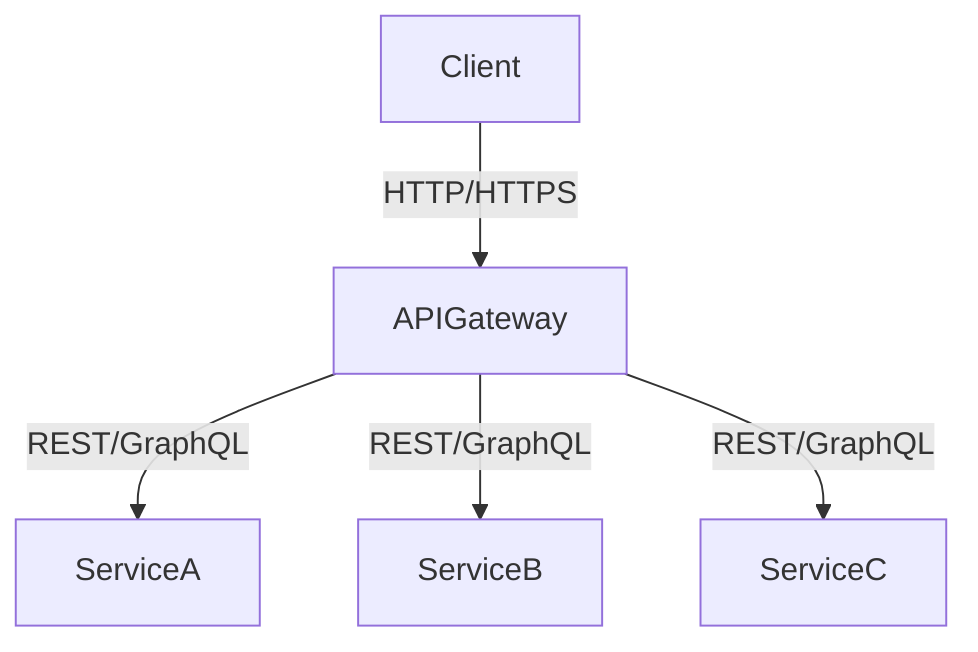

## 14.7.1 API Gateway Pattern

### Introduction

The **API Gateway Pattern** is a crucial component in microservices architecture, serving as a single entry point for client interactions with a suite of microservices. This pattern is designed to handle request routing, composition, and protocol translation, thereby simplifying client interactions and abstracting the complexities of the underlying services.

### Intent

- **Description**: The API Gateway Pattern aims to provide a unified interface for clients to interact with various microservices. It acts as a reverse proxy, routing requests to the appropriate service and aggregating responses when necessary.

### Also Known As

- **Alternate Names**: Edge Server, Reverse Proxy

### Motivation

In a microservices architecture, each service is designed to be independently deployable and scalable. However, this independence can lead to complexity for clients that need to interact with multiple services. The API Gateway Pattern addresses this by providing a single point of access, reducing the need for clients to manage multiple endpoints and protocols.

### Applicability

- **Guidelines**: Use the API Gateway Pattern when you have multiple microservices that need to be accessed by clients, and you want to simplify client interactions by providing a single entry point. It is also applicable when you need to perform cross-cutting concerns like authentication, logging, or rate limiting at a centralized location.

### Structure



- **Caption**: The diagram illustrates the API Gateway Pattern, where the API Gateway acts as a single entry point for clients, routing requests to various microservices.

### Participants

- **Client**: The entity that interacts with the API Gateway.
- **API Gateway**: The component that routes requests to the appropriate microservices.
- **Microservices**: The individual services that handle specific business functionalities.

### Collaborations

- **Interactions**: The client sends a request to the API Gateway, which then routes the request to the appropriate microservice. The microservice processes the request and sends the response back through the API Gateway to the client.

### Consequences

- **Analysis**: The API Gateway Pattern simplifies client interactions and centralizes cross-cutting concerns. However, it can become a single point of failure and a performance bottleneck if not properly managed.

### Implementation

#### Implementation Guidelines

- **Choose the Right Tool**: Select an API Gateway tool that fits your needs, such as Netflix Zuul or Spring Cloud Gateway.
- **Design for Scalability**: Ensure the API Gateway can scale horizontally to handle increased load.
- **Implement Security**: Use the API Gateway to enforce security policies, such as authentication and authorization.
- **Optimize Routing**: Configure efficient routing rules to minimize latency.

#### Sample Code Snippets

**Using Spring Cloud Gateway**

```java
import org.springframework.boot.SpringApplication;
import org.springframework.boot.autoconfigure.SpringBootApplication;
import org.springframework.cloud.gateway.route.RouteLocator;
import org.springframework.cloud.gateway.route.builder.RouteLocatorBuilder;
import org.springframework.context.annotation.Bean;

@SpringBootApplication
public class ApiGatewayApplication {

    public static void main(String[] args) {
        SpringApplication.run(ApiGatewayApplication.class, args);
    }

    @Bean
    public RouteLocator customRouteLocator(RouteLocatorBuilder builder) {
        return builder.routes()
                .route("serviceA", r -> r.path("/serviceA/**")
                        .uri("http://localhost:8081"))
                .route("serviceB", r -> r.path("/serviceB/**")
                        .uri("http://localhost:8082"))
                .build();
    }
}
```

- **Explanation**: This code snippet demonstrates how to set up a simple API Gateway using Spring Cloud Gateway. It defines routes for two services, ServiceA and ServiceB, and maps incoming requests to the appropriate service based on the request path.

#### Sample Use Cases

- **Real-world Scenarios**: An e-commerce platform uses an API Gateway to route requests to different services such as product catalog, order management, and user authentication.

### Related Patterns

- **Connections**: The API Gateway Pattern is often used in conjunction with the [Service Mesh Pattern]( "Service Mesh Pattern") to manage service-to-service communication.

### Known Uses

- **Examples in Libraries or Frameworks**: Netflix Zuul and Spring Cloud Gateway are popular implementations of the API Gateway Pattern.

### Considerations

#### Scalability

- **Horizontal Scaling**: Deploy multiple instances of the API Gateway to handle increased traffic.
- **Load Balancing**: Use load balancers to distribute requests across API Gateway instances.

#### Security

- **Authentication and Authorization**: Implement security measures at the API Gateway to protect backend services.
- **Rate Limiting**: Prevent abuse by limiting the number of requests a client can make in a given time period.

#### Routing

- **Dynamic Routing**: Use dynamic routing to adapt to changes in the microservices landscape.
- **Protocol Translation**: Translate between different protocols (e.g., HTTP to WebSocket) as needed.

#### Bottleneck Mitigation

- **Caching**: Implement caching strategies to reduce load on backend services.
- **Circuit Breakers**: Use circuit breakers to prevent cascading failures in the system.

### Conclusion

The API Gateway Pattern is a powerful tool in microservices architecture, providing a centralized entry point for client interactions and simplifying the management of multiple services. By carefully considering scalability, security, and routing, developers can effectively implement this pattern to enhance the robustness and maintainability of their systems.

### Exercises

1. **Implement an API Gateway**: Set up a simple API Gateway using Spring Cloud Gateway and configure routes for at least three microservices.
2. **Enhance Security**: Add authentication and authorization to your API Gateway implementation.
3. **Optimize Performance**: Implement caching and load balancing to improve the performance of your API Gateway.

### Key Takeaways

- The API Gateway Pattern simplifies client interactions with microservices by providing a single entry point.
- It centralizes cross-cutting concerns such as security and logging.
- Proper implementation requires careful consideration of scalability, security, and routing.

### Reflection

Consider how the API Gateway Pattern can be applied to your current projects. What benefits could it bring, and what challenges might you face in its implementation?

## Test Your Knowledge: API Gateway Pattern in Microservices Quiz



### What is the primary role of an API Gateway in microservices architecture?

- [x] To provide a single entry point for client requests
- [ ] To store data for microservices
- [ ] To replace microservices
- [ ] To directly interact with databases

> **Explanation:** The API Gateway acts as a single entry point for client requests, routing them to the appropriate microservices.

### Which tool is commonly used to implement an API Gateway in Java?

- [x] Spring Cloud Gateway
- [ ] Hibernate
- [ ] Apache Kafka
- [ ] JUnit

> **Explanation:** Spring Cloud Gateway is a popular tool for implementing API Gateways in Java.

### What is a potential drawback of using an API Gateway?

- [x] It can become a bottleneck
- [ ] It simplifies client interactions
- [ ] It enhances security
- [ ] It improves scalability

> **Explanation:** An API Gateway can become a bottleneck if not properly managed, as it handles all client requests.

### How can the API Gateway Pattern improve security?

- [x] By centralizing authentication and authorization
- [ ] By storing sensitive data
- [ ] By encrypting all data
- [ ] By replacing firewalls

> **Explanation:** The API Gateway can centralize authentication and authorization, enhancing security for backend services.

### What strategy can be used to prevent the API Gateway from becoming a bottleneck?

- [x] Horizontal scaling
- [ ] Reducing microservices
- [x] Caching
- [ ] Increasing client requests

> **Explanation:** Horizontal scaling and caching are effective strategies to prevent the API Gateway from becoming a bottleneck.

### Which of the following is a cross-cutting concern that can be managed by an API Gateway?

- [x] Logging
- [ ] Database management
- [ ] UI design
- [ ] Code compilation

> **Explanation:** Logging is a cross-cutting concern that can be managed by an API Gateway.

### What is the benefit of using dynamic routing in an API Gateway?

- [x] It adapts to changes in microservices
- [ ] It reduces the number of microservices
- [x] It improves request handling
- [ ] It simplifies database queries

> **Explanation:** Dynamic routing allows the API Gateway to adapt to changes in the microservices landscape, improving request handling.

### Which protocol translation might an API Gateway perform?

- [x] HTTP to WebSocket
- [ ] SQL to NoSQL
- [ ] XML to JSON
- [ ] HTML to CSS

> **Explanation:** An API Gateway might perform protocol translation from HTTP to WebSocket to support different client needs.

### What is a common use case for an API Gateway in e-commerce?

- [x] Routing requests to product catalog and order management services
- [ ] Storing customer data
- [ ] Designing the user interface
- [ ] Compiling code

> **Explanation:** In e-commerce, an API Gateway can route requests to various services like product catalog and order management.

### True or False: An API Gateway can replace microservices in an architecture.

- [x] False
- [ ] True

> **Explanation:** An API Gateway cannot replace microservices; it acts as an intermediary to facilitate communication between clients and microservices.


