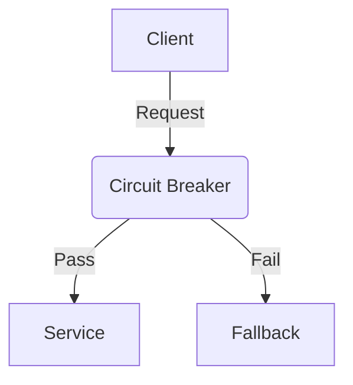

## 14.7.2 Circuit Breaker Pattern

### Introduction

In the realm of microservices architecture, ensuring the reliability and resilience of services is paramount. The **Circuit Breaker Pattern** is a critical design pattern that helps protect services from failures and latencies in remote calls. This pattern is akin to an electrical circuit breaker, which prevents electrical overloads by interrupting the flow of electricity. Similarly, the Circuit Breaker Pattern interrupts the flow of requests to a failing service, preventing cascading failures and allowing the system to recover gracefully.

### Intent

- **Description**: The Circuit Breaker Pattern aims to detect failures and prevent cascading failures in distributed systems. It acts as a protective barrier, stopping the flow of requests to a service that is likely to fail, thus maintaining the overall health of the system.

### Also Known As

- **Alternate Names**: None

### Motivation

In a microservices architecture, services often depend on other services to function correctly. When a service fails or experiences latency, it can cause a ripple effect, leading to system-wide failures. The Circuit Breaker Pattern helps mitigate this risk by monitoring the health of services and interrupting requests to failing services, allowing them time to recover.

### Applicability

- **Guidelines**: Use the Circuit Breaker Pattern when:
  - You have services that depend on remote calls to other services.
  - You need to prevent cascading failures in your system.
  - You want to improve the resilience and fault tolerance of your application.

### Structure



- **Caption**: The diagram illustrates the flow of requests through a Circuit Breaker. If the service is healthy, requests pass through. If the service is failing, requests are redirected to a fallback mechanism.

### Participants

- **Client**: The entity making requests to the service.
- **Circuit Breaker**: Monitors the health of the service and decides whether to allow or block requests.
- **Service**: The target service that the client is trying to access.
- **Fallback**: An alternative mechanism or response used when the service is unavailable.

### Collaborations

- **Interactions**: The client sends requests through the Circuit Breaker to the service. The Circuit Breaker monitors the service's health and either allows requests to pass or redirects them to a fallback mechanism if the service is failing.

### Consequences

- **Analysis**: The Circuit Breaker Pattern provides several benefits, including improved system resilience, reduced latency during failures, and prevention of cascading failures. However, it also introduces complexity in managing and configuring the Circuit Breaker.

### Implementation

#### Implementation Guidelines

1. **Choose a Library**: Select a library like Resilience4j or Netflix Hystrix to implement the Circuit Breaker Pattern.
2. **Configure Thresholds**: Set thresholds for failure rates and response times to determine when the Circuit Breaker should trip.
3. **Implement Fallbacks**: Define fallback mechanisms to handle requests when the Circuit Breaker is open.
4. **Monitor and Alert**: Implement monitoring and alerting to track the health of services and the state of the Circuit Breaker.

#### Sample Code Snippets

**Using Resilience4j**

```java
import io.github.resilience4j.circuitbreaker.CircuitBreaker;
import io.github.resilience4j.circuitbreaker.CircuitBreakerConfig;
import io.github.resilience4j.circuitbreaker.CircuitBreakerRegistry;

import java.time.Duration;
import java.util.function.Supplier;

public class CircuitBreakerExample {

    public static void main(String[] args) {
        // Create a custom configuration for a CircuitBreaker
        CircuitBreakerConfig config = CircuitBreakerConfig.custom()
                .failureRateThreshold(50)
                .waitDurationInOpenState(Duration.ofMillis(1000))
                .slidingWindowSize(2)
                .build();

        // Create a CircuitBreakerRegistry with a custom global configuration
        CircuitBreakerRegistry registry = CircuitBreakerRegistry.of(config);

        // Get or create a CircuitBreaker from the CircuitBreakerRegistry
        CircuitBreaker circuitBreaker = registry.circuitBreaker("myCircuitBreaker");

        // Decorate your call to the remote service
        Supplier<String> decoratedSupplier = CircuitBreaker
                .decorateSupplier(circuitBreaker, CircuitBreakerExample::callRemoteService);

        // Execute the decorated supplier and recover from any exception
        String result = circuitBreaker.executeSupplier(decoratedSupplier);
        System.out.println(result);
    }

    private static String callRemoteService() {
        // Simulate a remote service call
        throw new RuntimeException("Service not available");
    }
}
```

- **Explanation**: This example demonstrates how to use Resilience4j to implement a Circuit Breaker. The Circuit Breaker is configured with a failure rate threshold and a wait duration in the open state. The `callRemoteService` method simulates a remote service call that fails, triggering the Circuit Breaker.

#### Sample Use Cases

- **Real-world Scenarios**: The Circuit Breaker Pattern is commonly used in e-commerce platforms to protect against failures in payment gateways, inventory services, and shipping services.

### Configuration Options

- **Thresholds**: Define the failure rate and response time thresholds that determine when the Circuit Breaker should trip.
- **Timeouts**: Set timeouts for requests to prevent long waits for unresponsive services.
- **Fallback Mechanisms**: Implement fallback responses or alternative services to handle requests when the Circuit Breaker is open.

### Monitoring and Alerting

Monitoring and alerting are crucial components of the Circuit Breaker Pattern. Implement tools to track the health of services and the state of the Circuit Breaker. Use alerts to notify operators of failures or when the Circuit Breaker trips.

### Related Patterns

- **Connections**: The Circuit Breaker Pattern is often used in conjunction with the [Retry Pattern]( "Retry Pattern") to enhance fault tolerance.

### Known Uses

- **Examples in Libraries or Frameworks**: Resilience4j and Netflix Hystrix are popular libraries that implement the Circuit Breaker Pattern.

### Conclusion

The Circuit Breaker Pattern is an essential tool for building resilient microservices architectures. By detecting failures and preventing cascading failures, it helps maintain the health and reliability of distributed systems. Implementing this pattern requires careful configuration and monitoring, but the benefits it provides in terms of system stability and fault tolerance are invaluable.

## Test Your Knowledge: Circuit Breaker Pattern in Java Quiz



### What is the primary purpose of the Circuit Breaker Pattern?

- [x] To prevent cascading failures in distributed systems.
- [ ] To improve the speed of service responses.
- [ ] To enhance data security.
- [ ] To reduce memory usage.

> **Explanation:** The Circuit Breaker Pattern is designed to prevent cascading failures by interrupting requests to failing services.

### Which library is commonly used to implement the Circuit Breaker Pattern in Java?

- [x] Resilience4j
- [ ] Apache Commons
- [x] Netflix Hystrix
- [ ] Spring Boot

> **Explanation:** Resilience4j and Netflix Hystrix are popular libraries for implementing the Circuit Breaker Pattern in Java.

### What is a fallback mechanism in the context of the Circuit Breaker Pattern?

- [x] An alternative response or service used when the primary service is unavailable.
- [ ] A method to increase service throughput.
- [ ] A security protocol for data encryption.
- [ ] A tool for monitoring service performance.

> **Explanation:** A fallback mechanism provides an alternative response or service when the primary service is unavailable due to a Circuit Breaker being open.

### How does the Circuit Breaker Pattern improve system resilience?

- [x] By interrupting requests to failing services and allowing them time to recover.
- [ ] By increasing the number of service instances.
- [ ] By caching service responses.
- [ ] By encrypting service data.

> **Explanation:** The Circuit Breaker Pattern improves resilience by stopping requests to failing services, preventing further strain and allowing recovery.

### What configuration option determines when a Circuit Breaker should trip?

- [x] Failure rate threshold
- [ ] Data encryption level
- [x] Response time threshold
- [ ] Number of service instances

> **Explanation:** The failure rate and response time thresholds determine when a Circuit Breaker should trip, stopping requests to a failing service.

### Why is monitoring important in the Circuit Breaker Pattern?

- [x] To track the health of services and the state of the Circuit Breaker.
- [ ] To increase the speed of service responses.
- [ ] To reduce service costs.
- [ ] To enhance data encryption.

> **Explanation:** Monitoring is crucial to track the health of services and the state of the Circuit Breaker, ensuring timely intervention and recovery.

### What happens when a Circuit Breaker is in the "open" state?

- [x] Requests are redirected to a fallback mechanism.
- [ ] Requests are processed normally.
- [x] Requests are blocked from reaching the service.
- [ ] Requests are encrypted.

> **Explanation:** When a Circuit Breaker is open, requests are blocked from reaching the service and redirected to a fallback mechanism.

### Which of the following is a benefit of using the Circuit Breaker Pattern?

- [x] Improved system resilience
- [ ] Increased data storage
- [ ] Faster service responses
- [ ] Enhanced data encryption

> **Explanation:** The Circuit Breaker Pattern improves system resilience by preventing cascading failures and allowing services to recover.

### What is the role of the Circuit Breaker in a microservices architecture?

- [x] To monitor service health and decide whether to allow or block requests.
- [ ] To encrypt service data.
- [ ] To increase service throughput.
- [ ] To store service data.

> **Explanation:** The Circuit Breaker monitors service health and decides whether to allow or block requests based on the service's state.

### True or False: The Circuit Breaker Pattern can be used to enhance data security.

- [ ] True
- [x] False

> **Explanation:** The Circuit Breaker Pattern is not designed for data security; its primary purpose is to prevent cascading failures in distributed systems.



By understanding and implementing the Circuit Breaker Pattern, Java developers and software architects can significantly enhance the resilience and reliability of their microservices architectures.
