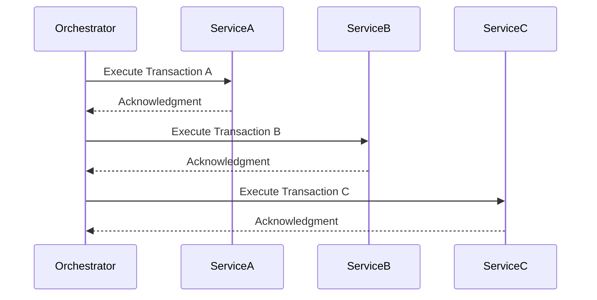
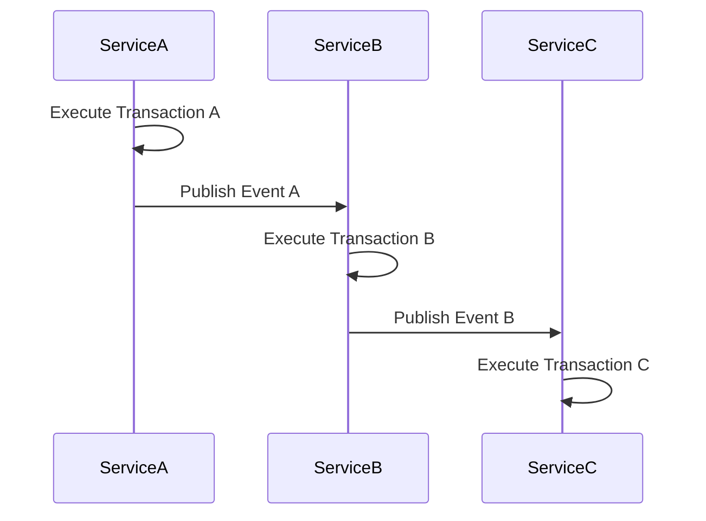

## 14.7.5 Saga Pattern

### Introduction

In the realm of microservices, managing distributed transactions and ensuring data consistency across services is a significant challenge. The **Saga Pattern** emerges as a powerful solution to address these challenges by breaking down a transaction into a series of smaller, manageable steps, each of which is a local transaction within a single microservice. This pattern is crucial for maintaining data integrity and consistency in distributed systems where traditional ACID transactions are not feasible.

### Intent

- **Description**: The Saga Pattern is designed to manage distributed transactions across multiple microservices by dividing them into a series of smaller, isolated transactions. Each transaction in a saga is completed independently, and compensating transactions are defined to undo changes if a step fails.

### Also Known As

- **Alternate Names**: Long-running transactions, Distributed transactions

### Motivation

In a microservices architecture, each service typically manages its own database, making it challenging to maintain consistency across services during a transaction. Traditional two-phase commit protocols are often unsuitable due to their complexity and performance overhead. The Saga Pattern provides a way to achieve eventual consistency by coordinating transactions across services without locking resources.

### Applicability

- **Guidelines**: Use the Saga Pattern when you need to manage complex business processes that span multiple microservices and require eventual consistency rather than immediate consistency.

### Structure

The Saga Pattern can be implemented using two primary approaches: **Orchestration** and **Choreography**.

#### Orchestration

In the orchestration approach, a central coordinator (orchestrator) manages the sequence of transactions. This approach provides a clear view of the transaction flow and simplifies error handling.



**Caption**: Orchestration approach with a central orchestrator managing the transaction flow.

#### Choreography

In the choreography approach, each service is responsible for executing its transaction and publishing events. Other services listen to these events and react accordingly. This approach promotes loose coupling and scalability.



**Caption**: Choreography approach where services communicate through events.

### Participants

- **Orchestrator**: Manages the sequence of transactions in the orchestration approach.
- **Microservices**: Execute local transactions and publish events in the choreography approach.
- **Event Bus**: Facilitates communication between services in the choreography approach.

### Collaborations

- **Interactions**: In orchestration, the orchestrator communicates directly with each service. In choreography, services communicate indirectly through events.

### Consequences

- **Analysis**: The Saga Pattern provides eventual consistency and resilience to failures. However, it introduces complexity in managing compensating transactions and monitoring the transaction flow.

### Implementation

#### Implementation Guidelines

- **Orchestration**: Use tools like Camunda to define and manage the transaction flow.
- **Choreography**: Implement an event-driven architecture using event buses like Apache Kafka or RabbitMQ.

#### Sample Code Snippets

**Orchestration with Camunda**

```java
import org.camunda.bpm.engine.ProcessEngine;
import org.camunda.bpm.engine.ProcessEngines;
import org.camunda.bpm.engine.runtime.ProcessInstance;

public class SagaOrchestrator {
    public static void main(String[] args) {
        ProcessEngine processEngine = ProcessEngines.getDefaultProcessEngine();
        ProcessInstance processInstance = processEngine.getRuntimeService()
            .startProcessInstanceByKey("sagaProcess");

        System.out.println("Saga Process started with ID: " + processInstance.getId());
    }
}
```

**Explanation**: This code snippet demonstrates starting a saga process using Camunda, a popular orchestration tool.

**Choreography with Event Bus**

```java
import org.springframework.kafka.annotation.KafkaListener;
import org.springframework.stereotype.Service;

@Service
public class ServiceA {

    @KafkaListener(topics = "eventA", groupId = "sagaGroup")
    public void handleEventA(String message) {
        // Execute local transaction
        System.out.println("Handling Event A: " + message);
        // Publish next event
        // kafkaTemplate.send("eventB", "Transaction B completed");
    }
}
```

**Explanation**: This code snippet illustrates a service listening to an event and executing a local transaction in a choreography-based saga.

### Sample Use Cases

- **Real-world Scenarios**: E-commerce order processing, where an order involves multiple services like inventory, payment, and shipping.

### Related Patterns

- **Connections**: The Saga Pattern is related to the [14.7.4 Event Sourcing and CQRS]( "Event Sourcing Pattern"), which can be used to capture changes in state as a sequence of events.

### Known Uses

- **Examples in Libraries or Frameworks**: Camunda, Apache Kafka, and Spring Cloud Stream are commonly used to implement the Saga Pattern.

### Challenges and Considerations

- **Compensation Transactions**: Define compensating transactions to undo changes if a step fails.
- **Failure Handling**: Implement robust error handling and retry mechanisms.
- **Coordination and Monitoring**: Use monitoring tools to track the progress and status of sagas.

### Conclusion

The Saga Pattern is a vital tool for managing distributed transactions in microservices architectures. By understanding and implementing this pattern, developers can ensure data consistency and resilience in complex systems. Experiment with both orchestration and choreography approaches to determine the best fit for your specific use case.

## Test Your Knowledge: Saga Pattern in Microservices Quiz



### What is the primary purpose of the Saga Pattern in microservices?

- [x] To manage distributed transactions and ensure data consistency
- [ ] To improve performance of microservices
- [ ] To simplify service communication
- [ ] To enhance security of microservices

> **Explanation:** The Saga Pattern is designed to manage distributed transactions across microservices, ensuring data consistency without using traditional ACID transactions.

### Which approach involves a central coordinator managing the transaction flow?

- [x] Orchestration
- [ ] Choreography
- [ ] Event Sourcing
- [ ] CQRS

> **Explanation:** In the orchestration approach, a central orchestrator manages the sequence of transactions, providing a clear view of the transaction flow.

### What is a key advantage of the choreography approach?

- [x] Promotes loose coupling and scalability
- [ ] Simplifies error handling
- [ ] Provides a clear view of transaction flow
- [ ] Requires fewer resources

> **Explanation:** The choreography approach promotes loose coupling and scalability by allowing services to communicate through events without a central coordinator.

### Which tool is commonly used for implementing orchestration in the Saga Pattern?

- [x] Camunda
- [ ] Apache Kafka
- [ ] RabbitMQ
- [ ] Spring Cloud Stream

> **Explanation:** Camunda is a popular tool for implementing orchestration in the Saga Pattern, allowing developers to define and manage transaction flows.

### What is the role of compensating transactions in the Saga Pattern?

- [x] To undo changes if a step fails
- [ ] To enhance performance
- [ ] To simplify service communication
- [ ] To improve security

> **Explanation:** Compensating transactions are used to undo changes made by previous transactions if a step in the saga fails, ensuring data consistency.

### In which scenario is the Saga Pattern most applicable?

- [x] When managing complex business processes across multiple microservices
- [ ] When optimizing database queries
- [ ] When enhancing user interface design
- [ ] When improving network security

> **Explanation:** The Saga Pattern is most applicable when managing complex business processes that span multiple microservices and require eventual consistency.

### What is a potential drawback of the Saga Pattern?

- [x] Complexity in managing compensating transactions
- [ ] Reduced performance
- [ ] Increased security risks
- [ ] Limited scalability

> **Explanation:** The Saga Pattern introduces complexity in managing compensating transactions and monitoring the transaction flow.

### Which pattern is related to the Saga Pattern and captures changes in state as a sequence of events?

- [x] Event Sourcing Pattern
- [ ] Singleton Pattern
- [ ] Factory Pattern
- [ ] Observer Pattern

> **Explanation:** The Event Sourcing Pattern captures changes in state as a sequence of events, and it is related to the Saga Pattern in managing distributed transactions.

### What is the main communication mechanism used in the choreography approach?

- [x] Event buses
- [ ] Direct service calls
- [ ] Central coordinator
- [ ] Shared database

> **Explanation:** In the choreography approach, services communicate through event buses, allowing for loose coupling and scalability.

### True or False: The Saga Pattern can only be implemented using the orchestration approach.

- [ ] True
- [x] False

> **Explanation:** The Saga Pattern can be implemented using both orchestration and choreography approaches, each with its own advantages and trade-offs.



By mastering the Saga Pattern, developers can effectively manage distributed transactions in microservices, ensuring data consistency and resilience in complex systems.
