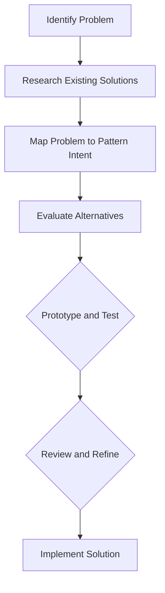

## 15.1 Selecting the Right Pattern

In the world of software engineering, design patterns are invaluable tools that provide reusable solutions to common problems. However, the effectiveness of these patterns hinges on selecting the right one for the task at hand. In this section, we will explore the importance of choosing the appropriate design pattern, the factors to consider during selection, and provide a framework to aid in making informed decisions.

### Importance of Pattern Selection

Selecting the right design pattern is crucial for several reasons:

1. **Efficiency and Maintainability**: The correct pattern can streamline development, making the codebase more maintainable and adaptable to future changes. Conversely, an inappropriate pattern can introduce unnecessary complexity, making the system harder to understand and modify.

2. **Performance**: Different patterns have varying impacts on performance. Choosing a pattern that aligns with the application's performance requirements is essential to avoid bottlenecks.

3. **Scalability**: As applications grow, the ability to scale efficiently becomes vital. The right pattern can facilitate scalability, while the wrong one might hinder it.

4. **Team Productivity**: Familiarity with a pattern can enhance a team's productivity, as developers can leverage their existing knowledge and experience.

### Factors to Consider

When selecting a design pattern, consider the following factors:

#### Problem Nature

- **Define the Problem**: Clearly understand the problem you are trying to solve. Is it related to object creation, structural organization, or behavior?
- **Identify Requirements**: Determine the specific requirements and constraints of the problem.

#### Context and Constraints

- **Environment**: Consider the environment in which the application will run, including hardware and software constraints.
- **Limitations**: Be aware of any limitations, such as memory, processing power, or network bandwidth.

#### Scalability Needs

- **Future Growth**: Anticipate future growth and ensure the chosen pattern can accommodate increased demand.
- **Adaptability**: Evaluate how easily the pattern can adapt to changing requirements.

#### Team Expertise

- **Familiarity**: Consider the team's familiarity with certain patterns or technologies.
- **Training Needs**: Assess whether additional training is required for the team to effectively implement the pattern.

#### Performance

- **Efficiency**: Analyze the performance implications of different patterns, particularly in terms of speed and resource usage.
- **Optimization**: Determine if the pattern allows for optimization without significant rework.

### Pattern Classification and Categories

Design patterns are typically classified into several categories, each addressing different aspects of software design:

#### Creational Patterns

- **Purpose**: Deal with object creation mechanisms, trying to create objects in a manner suitable to the situation.
- **Examples**: Singleton, Factory Method, Abstract Factory, Builder, Prototype.

#### Structural Patterns

- **Purpose**: Simplify the structure by identifying the relationships between entities.
- **Examples**: Adapter, Bridge, Composite, Decorator, Facade, Flyweight, Proxy.

#### Behavioral Patterns

- **Purpose**: Focus on communication between objects.
- **Examples**: Chain of Responsibility, Command, Interpreter, Iterator, Mediator, Memento, Observer, State, Strategy, Template Method, Visitor.

#### Concurrency Patterns

- **Purpose**: Address issues related to multi-threading and concurrent execution.
- **Examples**: Active Object, Balking, Double-Checked Locking, Read-Write Lock, Thread Pool.

### Decision-Making Framework

To systematically select the right pattern, follow these steps:

1. **Problem Identification**: Clearly define the problem and its requirements.
2. **Analysis of Existing Solutions**: Research existing solutions and patterns that address similar problems.
3. **Mapping Problems to Pattern Intents**: Match the problem with the pattern's intent. Use resources like pattern catalogs or decision trees.
4. **Evaluation of Alternatives**: Consider multiple patterns and evaluate their pros and cons in the context of your problem.
5. **Prototype and Test**: Implement a prototype to test the pattern's effectiveness in solving the problem.
6. **Review and Refine**: Review the implementation with peers or experts, and refine as necessary.

### Comparison of Patterns

To aid in pattern selection, consider using comparison tables or matrices. Below is an example comparing some common patterns based on criteria like complexity, flexibility, and reusability:

| Pattern            | Complexity | Flexibility | Reusability |
|--------------------|------------|-------------|-------------|
| Singleton          | Low        | Low         | High        |
| Factory Method     | Medium     | High        | Medium      |
| Observer           | Medium     | High        | High        |
| Decorator          | Medium     | High        | Medium      |
| Strategy           | Medium     | High        | High        |

### Case Studies and Examples

#### Successful Pattern Selection

- **Scenario**: A company needed to develop a scalable logging system.
- **Solution**: The Observer pattern was selected to allow multiple logging handlers to be added dynamically.
- **Outcome**: The system was able to scale efficiently as new logging requirements emerged.

#### Poor Pattern Choice

- **Scenario**: A team used the Singleton pattern for a class that required frequent updates.
- **Issue**: The Singleton pattern led to bottlenecks and reduced system performance.
- **Lesson**: The team learned the importance of considering concurrency and update frequency when selecting patterns.

### Common Mistakes to Avoid

1. **Overengineering**: Avoid using patterns just for the sake of it. Ensure the pattern adds value to the solution.
2. **Pattern Overuse**: Applying too many patterns can lead to complexity and confusion.
3. **Lack of Understanding**: Ensure a thorough understanding of the pattern's implications before implementation.

### Best Practices

- **Start Simple**: Begin with simple solutions and introduce patterns as necessary.
- **Understand the Problem**: Deeply understand the problem before selecting a pattern.
- **Consult Experts**: When in doubt, consult with team members or experts to gain insights.
- **Iterate and Refine**: Be prepared to iterate and refine your choice as the project evolves.

### Resources for Further Learning

- **Books**: "Design Patterns: Elements of Reusable Object-Oriented Software" by Erich Gamma et al.
- **Articles**: Explore online articles and tutorials on design patterns.
- **Tools**: Utilize tools like pattern catalogs and decision trees to aid in pattern selection.

### Try It Yourself

Experiment with the following code example to see how different patterns can be applied to a simple problem. Modify the code to use different patterns and observe the changes in behavior and complexity.

```java
// Example: Implementing a simple logging system using the Observer pattern

import java.util.ArrayList;
import java.util.List;

// Observer interface
interface LogObserver {
    void update(String message);
}

// Concrete observer
class ConsoleLogger implements LogObserver {
    @Override
    public void update(String message) {
        System.out.println("Console Log: " + message);
    }
}

// Subject
class Logger {
    private List<LogObserver> observers = new ArrayList<>();

    public void addObserver(LogObserver observer) {
        observers.add(observer);
    }

    public void removeObserver(LogObserver observer) {
        observers.remove(observer);
    }

    public void log(String message) {
        for (LogObserver observer : observers) {
            observer.update(message);
        }
    }
}

public class LoggingSystem {
    public static void main(String[] args) {
        Logger logger = new Logger();
        ConsoleLogger consoleLogger = new ConsoleLogger();

        logger.addObserver(consoleLogger);
        logger.log("Application started");

        // Try adding more observers or changing the pattern to see different behaviors
    }
}
```

### Visualizing Pattern Selection

To better understand the decision-making process, consider the following flowchart that outlines the steps in selecting the right pattern:



### Embrace the Journey

Remember, selecting the right design pattern is a journey of discovery and learning. As you progress, you'll gain deeper insights into how patterns can transform your code into a robust and maintainable system. Keep experimenting, stay curious, and enjoy the journey of mastering design patterns in Java!

## Quiz Time!



### Why is selecting the right design pattern important?

- [x] It ensures efficiency and maintainability.
- [ ] It guarantees the fastest execution time.
- [ ] It always reduces the code size.
- [ ] It makes the code more complex.

> **Explanation:** Selecting the right pattern ensures efficiency and maintainability by providing a suitable solution for the problem at hand.

### What should be considered when selecting a design pattern?

- [x] Problem nature
- [x] Context and constraints
- [x] Scalability needs
- [ ] The pattern's popularity

> **Explanation:** Problem nature, context, constraints, and scalability needs are crucial factors in pattern selection.

### Which pattern category deals with object creation?

- [x] Creational
- [ ] Structural
- [ ] Behavioral
- [ ] Concurrency

> **Explanation:** Creational patterns deal with object creation mechanisms.

### What is a common mistake when using design patterns?

- [x] Overengineering
- [ ] Underengineering
- [ ] Ignoring patterns
- [ ] Using only one pattern

> **Explanation:** Overengineering involves using patterns unnecessarily, adding complexity without benefit.

### How can you ensure the chosen pattern is effective?

- [x] Prototype and test
- [ ] Implement immediately
- [ ] Avoid peer reviews
- [ ] Skip documentation

> **Explanation:** Prototyping and testing help ensure the pattern effectively solves the problem.

### What is the first step in the decision-making framework for pattern selection?

- [x] Problem identification
- [ ] Implementing a prototype
- [ ] Evaluating alternatives
- [ ] Mapping problems to pattern intents

> **Explanation:** Identifying the problem is the first step in selecting the right pattern.

### Which pattern is suitable for managing communication between objects?

- [x] Observer
- [ ] Singleton
- [ ] Factory Method
- [ ] Builder

> **Explanation:** The Observer pattern manages communication between objects.

### What is a benefit of starting with simple solutions?

- [x] It allows for gradual complexity introduction.
- [ ] It guarantees the best performance.
- [ ] It eliminates the need for patterns.
- [ ] It always reduces the code size.

> **Explanation:** Starting simple allows for gradual complexity introduction as needed.

### What should you do when in doubt about pattern selection?

- [x] Consult experts
- [ ] Implement immediately
- [ ] Ignore the problem
- [ ] Use the most complex pattern

> **Explanation:** Consulting experts can provide insights and guidance on pattern selection.

### True or False: The Singleton pattern is always the best choice for managing shared resources.

- [ ] True
- [x] False

> **Explanation:** The Singleton pattern is not always the best choice; it can lead to bottlenecks and reduced performance if not used appropriately.


