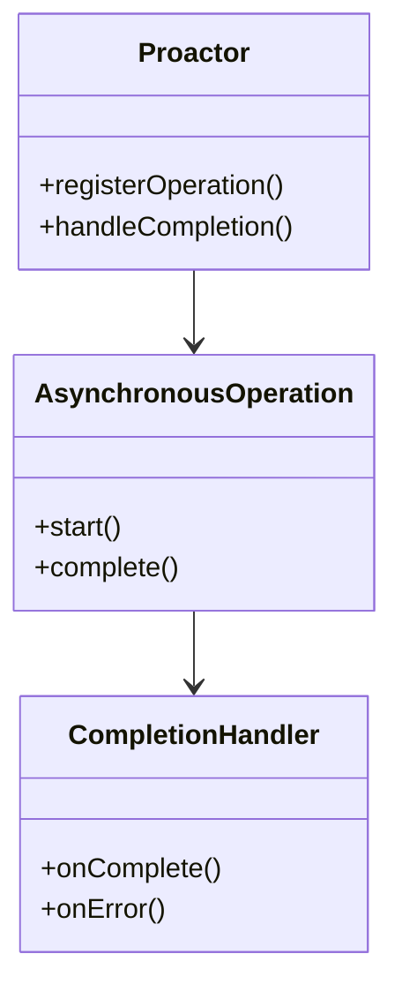
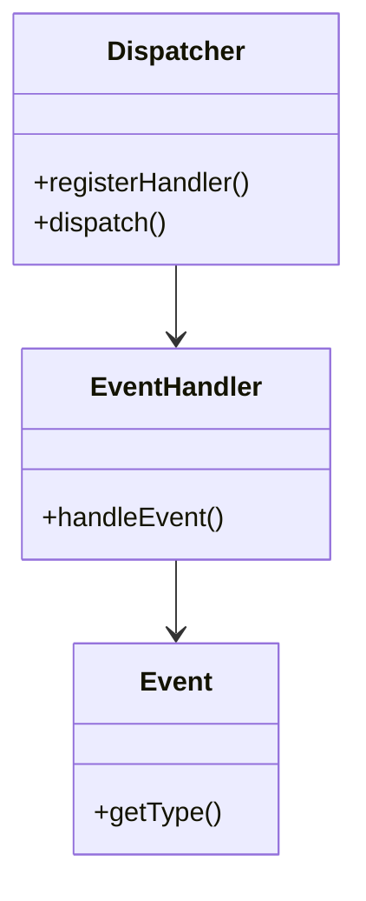

## 15.10 Non-Blocking I/O Patterns

In the realm of modern software development, the demand for responsive and efficient applications has never been higher. Non-blocking I/O patterns in Java play a crucial role in meeting these demands by allowing applications to handle multiple I/O operations concurrently without being hindered by the latency of blocking calls. This section delves into the key strategies and patterns for implementing non-blocking I/O in Java, focusing on the Proactor and Dispatcher patterns, and provides guidance on selecting the appropriate pattern based on application requirements.

### Understanding Non-Blocking I/O

Non-blocking I/O refers to the ability of an application to initiate an I/O operation and continue executing other tasks while waiting for the I/O operation to complete. This approach contrasts with blocking I/O, where the application halts execution until the I/O operation finishes. Non-blocking I/O is particularly beneficial in scenarios where I/O operations are slow or unpredictable, such as network communication or file access.

#### Key Concepts

- **Asynchronous I/O**: Allows operations to be performed in the background, enabling the application to continue processing other tasks.
- **Event-driven Architecture**: Utilizes events to signal the completion of I/O operations, allowing the application to respond accordingly.
- **Concurrency**: Enables multiple I/O operations to be handled simultaneously, improving throughput and responsiveness.

### Java's Non-Blocking I/O Capabilities

Java provides robust support for non-blocking I/O through the New I/O (NIO) package introduced in Java 1.4 and enhanced in subsequent versions. The NIO package offers a set of APIs that facilitate non-blocking I/O operations, including:

- **Channels**: Represent connections to entities capable of performing I/O operations, such as files or sockets.
- **Selectors**: Allow a single thread to monitor multiple channels for events, enabling efficient management of multiple I/O operations.
- **Buffers**: Provide a mechanism for data storage during I/O operations, allowing data to be read from or written to channels.

### Non-Blocking I/O Patterns

Non-blocking I/O patterns provide structured approaches to implementing asynchronous I/O operations. Two prominent patterns in this domain are the Proactor and Dispatcher patterns.

#### Proactor Pattern

- **Category**: Behavioral Pattern

##### Intent

The Proactor pattern is designed to handle asynchronous I/O operations by delegating the completion of these operations to separate handlers. This pattern is particularly useful in scenarios where the application needs to perform other tasks while waiting for I/O operations to complete.

##### Also Known As

- Asynchronous Completion Token

##### Motivation

In applications where I/O operations are time-consuming, blocking the main thread can lead to inefficiencies and reduced responsiveness. The Proactor pattern addresses this by allowing the application to continue processing other tasks while I/O operations are handled asynchronously.

##### Applicability

- Use the Proactor pattern when dealing with high-latency I/O operations, such as network communication.
- Suitable for applications requiring high concurrency and responsiveness.

##### Structure



- **Caption**: The Proactor pattern structure, illustrating the interaction between the Proactor, AsynchronousOperation, and CompletionHandler.

##### Participants

- **Proactor**: Initiates and manages asynchronous operations, delegating completion to handlers.
- **AsynchronousOperation**: Represents the I/O operation to be performed asynchronously.
- **CompletionHandler**: Handles the completion of the asynchronous operation, processing results or errors.

##### Collaborations

- The Proactor registers an asynchronous operation and specifies a completion handler.
- The AsynchronousOperation executes in the background and invokes the CompletionHandler upon completion.

##### Consequences

- **Benefits**: Improves application responsiveness by offloading I/O operations to separate handlers.
- **Drawbacks**: Complexity in managing multiple asynchronous operations and handlers.

##### Implementation

- **Implementation Guidelines**: Use Java's `AsynchronousChannelGroup` and `CompletionHandler` interfaces to implement the Proactor pattern.

- **Sample Code Snippets**:

    ```java
    import java.nio.channels.AsynchronousSocketChannel;
    import java.nio.channels.CompletionHandler;
    import java.net.InetSocketAddress;
    import java.nio.ByteBuffer;

    public class ProactorExample {
        public static void main(String[] args) throws Exception {
            AsynchronousSocketChannel client = AsynchronousSocketChannel.open();
            InetSocketAddress hostAddress = new InetSocketAddress("localhost", 8080);
            client.connect(hostAddress, null, new CompletionHandler<Void, Void>() {
                @Override
                public void completed(Void result, Void attachment) {
                    ByteBuffer buffer = ByteBuffer.allocate(1024);
                    client.read(buffer, buffer, new CompletionHandler<Integer, ByteBuffer>() {
                        @Override
                        public void completed(Integer result, ByteBuffer buffer) {
                            buffer.flip();
                            System.out.println("Received: " + new String(buffer.array()).trim());
                        }

                        @Override
                        public void failed(Throwable exc, ByteBuffer buffer) {
                            System.err.println("Read failed: " + exc.getMessage());
                        }
                    });
                }

                @Override
                public void failed(Throwable exc, Void attachment) {
                    System.err.println("Connection failed: " + exc.getMessage());
                }
            });

            // Keep the main thread alive to allow asynchronous operations to complete
            Thread.sleep(5000);
        }
    }
    ```

- **Explanation**: This example demonstrates the Proactor pattern using Java's `AsynchronousSocketChannel` and `CompletionHandler`. The client connects to a server and reads data asynchronously, allowing the main thread to remain responsive.

##### Sample Use Cases

- **Real-world Scenarios**: Web servers handling multiple client connections, file transfer applications, and real-time data processing systems.

##### Related Patterns

- **Connections**: The Proactor pattern is often compared to the Reactor pattern, which handles synchronous I/O operations.

##### Known Uses

- **Examples in Libraries or Frameworks**: Java's NIO.2 API, particularly the `AsynchronousChannelGroup` and `CompletionHandler` interfaces.

#### Dispatcher Pattern

- **Category**: Behavioral Pattern

##### Intent

The Dispatcher pattern is designed to manage multiple I/O operations by dispatching events to appropriate handlers. This pattern is useful in scenarios where a single thread needs to handle multiple I/O operations concurrently.

##### Also Known As

- Event Dispatcher

##### Motivation

In applications with numerous I/O operations, managing each operation individually can be inefficient. The Dispatcher pattern centralizes the management of I/O events, improving scalability and maintainability.

##### Applicability

- Use the Dispatcher pattern when dealing with multiple concurrent I/O operations.
- Suitable for applications requiring centralized event management.

##### Structure



- **Caption**: The Dispatcher pattern structure, illustrating the interaction between the Dispatcher, EventHandler, and Event.

##### Participants

- **Dispatcher**: Manages and dispatches events to appropriate handlers.
- **EventHandler**: Processes events dispatched by the Dispatcher.
- **Event**: Represents an I/O event to be handled.

##### Collaborations

- The Dispatcher registers event handlers and dispatches events to them based on event type.
- EventHandlers process the events and perform necessary actions.

##### Consequences

- **Benefits**: Centralizes event management, improving scalability and maintainability.
- **Drawbacks**: Potential bottleneck if the Dispatcher becomes overloaded with events.

##### Implementation

- **Implementation Guidelines**: Use Java's `Selector` and `SelectionKey` classes to implement the Dispatcher pattern.

- **Sample Code Snippets**:

    ```java
    import java.io.IOException;
    import java.net.InetSocketAddress;
    import java.nio.ByteBuffer;
    import java.nio.channels.SelectionKey;
    import java.nio.channels.Selector;
    import java.nio.channels.ServerSocketChannel;
    import java.nio.channels.SocketChannel;
    import java.util.Iterator;

    public class DispatcherExample {
        public static void main(String[] args) throws IOException {
            Selector selector = Selector.open();
            ServerSocketChannel serverSocket = ServerSocketChannel.open();
            serverSocket.bind(new InetSocketAddress("localhost", 8080));
            serverSocket.configureBlocking(false);
            serverSocket.register(selector, SelectionKey.OP_ACCEPT);

            while (true) {
                selector.select();
                Iterator<SelectionKey> keys = selector.selectedKeys().iterator();
                while (keys.hasNext()) {
                    SelectionKey key = keys.next();
                    keys.remove();

                    if (key.isAcceptable()) {
                        SocketChannel client = serverSocket.accept();
                        client.configureBlocking(false);
                        client.register(selector, SelectionKey.OP_READ);
                    } else if (key.isReadable()) {
                        SocketChannel client = (SocketChannel) key.channel();
                        ByteBuffer buffer = ByteBuffer.allocate(1024);
                        client.read(buffer);
                        buffer.flip();
                        System.out.println("Received: " + new String(buffer.array()).trim());
                    }
                }
            }
        }
    }
    ```

- **Explanation**: This example demonstrates the Dispatcher pattern using Java's `Selector` and `SelectionKey`. The server listens for incoming connections and reads data asynchronously, dispatching events to appropriate handlers.

##### Sample Use Cases

- **Real-world Scenarios**: Chat servers, multiplayer online games, and distributed systems requiring efficient event management.

##### Related Patterns

- **Connections**: The Dispatcher pattern is related to the Observer pattern, which also involves event handling.

##### Known Uses

- **Examples in Libraries or Frameworks**: Java's NIO API, particularly the `Selector` and `SelectionKey` classes.

### Choosing the Appropriate Pattern

Selecting the right non-blocking I/O pattern depends on the specific requirements of your application. Consider the following factors when making your decision:

- **Concurrency Requirements**: If your application needs to handle a large number of concurrent I/O operations, the Dispatcher pattern may be more suitable due to its centralized event management.
- **Responsiveness**: For applications requiring high responsiveness, the Proactor pattern can be beneficial as it offloads I/O operations to separate handlers.
- **Complexity**: Consider the complexity of implementing and maintaining the pattern. The Proactor pattern may introduce additional complexity due to the need for multiple handlers.

### Tools and Libraries for Non-Blocking I/O Development

Several tools and libraries can simplify the development of non-blocking I/O applications in Java:

- **Netty**: A popular framework for building high-performance network applications, providing an asynchronous event-driven architecture.
- **Vert.x**: A toolkit for building reactive applications on the JVM, offering support for non-blocking I/O operations.
- **Akka**: A toolkit for building concurrent, distributed, and resilient message-driven applications, supporting non-blocking I/O through its actor model.

### Best Practices for Non-Blocking I/O

- **Use Efficient Data Structures**: Choose appropriate data structures for managing I/O operations, such as queues or buffers.
- **Optimize Thread Management**: Ensure efficient thread management to prevent bottlenecks and improve scalability.
- **Monitor Performance**: Continuously monitor the performance of your application to identify and address potential issues.

### Common Pitfalls and How to Avoid Them

- **Overloading the Dispatcher**: Avoid overloading the Dispatcher with too many events, as this can lead to performance bottlenecks.
- **Inefficient Buffer Management**: Ensure efficient buffer management to prevent memory leaks and improve performance.
- **Ignoring Error Handling**: Implement robust error handling to manage exceptions and ensure application stability.

### Exercises and Practice Problems

1. **Implement a Simple Chat Server**: Use the Dispatcher pattern to implement a simple chat server that handles multiple client connections concurrently.
2. **Optimize a File Transfer Application**: Refactor a file transfer application to use the Proactor pattern, improving responsiveness and throughput.

### Summary and Key Takeaways

- Non-blocking I/O patterns in Java enable applications to handle multiple I/O operations concurrently, improving responsiveness and efficiency.
- The Proactor and Dispatcher patterns provide structured approaches to implementing non-blocking I/O operations.
- Selecting the appropriate pattern depends on the specific requirements of your application, including concurrency, responsiveness, and complexity.
- Tools and libraries like Netty, Vert.x, and Akka can simplify the development of non-blocking I/O applications.
- Follow best practices and avoid common pitfalls to ensure the success of your non-blocking I/O implementations.

### Reflection

Consider how you might apply non-blocking I/O patterns to your own projects. What challenges do you anticipate, and how can you address them using the strategies discussed in this section?

---

## Test Your Knowledge: Non-Blocking I/O Patterns in Java Quiz



### What is the primary benefit of using non-blocking I/O in Java applications?

- [x] Improved application responsiveness and concurrency
- [ ] Simplified code structure
- [ ] Reduced memory usage
- [ ] Enhanced security features

> **Explanation:** Non-blocking I/O allows applications to handle multiple I/O operations concurrently, improving responsiveness and throughput.

### Which Java package provides support for non-blocking I/O operations?

- [x] java.nio
- [ ] java.io
- [ ] java.util
- [ ] java.net

> **Explanation:** The java.nio package provides APIs for non-blocking I/O operations, including Channels, Selectors, and Buffers.

### In the Proactor pattern, what role does the CompletionHandler play?

- [x] Handles the completion of asynchronous operations
- [ ] Initiates asynchronous operations
- [ ] Manages multiple I/O events
- [ ] Provides data storage for I/O operations

> **Explanation:** The CompletionHandler is responsible for handling the completion of asynchronous operations, processing results or errors.

### What is a potential drawback of the Dispatcher pattern?

- [x] Potential bottleneck if overloaded with events
- [ ] Increased complexity due to multiple handlers
- [ ] Limited scalability for large applications
- [ ] Reduced responsiveness for high-latency operations

> **Explanation:** The Dispatcher pattern can become a bottleneck if it is overloaded with too many events, affecting performance.

### Which tool or library is known for building high-performance network applications with non-blocking I/O?

- [x] Netty
- [ ] Spring Boot
- [ ] Hibernate
- [ ] JUnit

> **Explanation:** Netty is a popular framework for building high-performance network applications, providing an asynchronous event-driven architecture.

### What is the primary focus of the Dispatcher pattern?

- [x] Centralized management of I/O events
- [ ] Offloading I/O operations to separate handlers
- [ ] Simplifying thread management
- [ ] Enhancing security features

> **Explanation:** The Dispatcher pattern focuses on centralized management of I/O events, improving scalability and maintainability.

### How can you prevent overloading the Dispatcher in a non-blocking I/O application?

- [x] Efficiently manage event queues and prioritize critical events
- [ ] Increase the number of threads handling events
- [ ] Use larger buffers for data storage
- [ ] Implement additional security measures

> **Explanation:** Efficiently managing event queues and prioritizing critical events can prevent overloading the Dispatcher and improve performance.

### What is a common use case for the Proactor pattern?

- [x] Web servers handling multiple client connections
- [ ] Single-threaded applications
- [ ] Batch processing systems
- [ ] Static content delivery

> **Explanation:** The Proactor pattern is commonly used in web servers to handle multiple client connections concurrently, improving responsiveness.

### Which Java class is used to monitor multiple channels for events in the Dispatcher pattern?

- [x] Selector
- [ ] Channel
- [ ] Buffer
- [ ] Socket

> **Explanation:** The Selector class is used to monitor multiple channels for events, enabling efficient management of I/O operations in the Dispatcher pattern.

### True or False: The Proactor pattern is suitable for applications requiring high responsiveness and concurrency.

- [x] True
- [ ] False

> **Explanation:** The Proactor pattern is designed to improve application responsiveness and concurrency by offloading I/O operations to separate handlers.



---

By mastering non-blocking I/O patterns in Java, developers can create applications that are not only efficient and responsive but also scalable and maintainable. Embrace these patterns to enhance your application's performance and meet the demands of modern software development.
