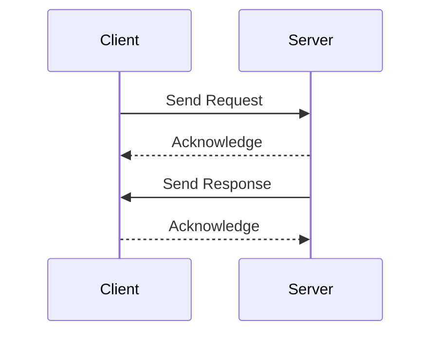

## 15.4.1 Designing Custom Protocols

In the realm of networked applications, the design of custom protocols is a critical skill for Java developers. Custom protocols enable applications to communicate efficiently and securely, tailored to specific requirements that standard protocols may not address. This section delves into the considerations and methodologies for designing custom protocols, with a focus on message formats, state management, error handling, and ensuring extensibility and compatibility.

### Considerations for Protocol Design

Designing a custom protocol involves several key considerations that ensure the protocol is robust, efficient, and adaptable to future needs.

#### Message Formats

The choice of message format is fundamental to protocol design. It determines how data is structured, transmitted, and interpreted. There are two primary types of message formats:

1. **Text-Based Protocols**: These are human-readable and often easier to debug. Examples include HTTP and SMTP. Text-based protocols are typically used when interoperability and ease of use are priorities.

2. **Binary Protocols**: These are more efficient in terms of bandwidth and processing speed. Examples include Protocol Buffers and Thrift. Binary protocols are preferred when performance is critical, and the overhead of parsing text is undesirable.

**Example of a Text-Based Protocol**:

```java
// Simple text-based protocol for a chat application
public class TextProtocolMessage {
    private String header;
    private String body;

    public TextProtocolMessage(String header, String body) {
        this.header = header;
        this.body = body;
    }

    public String formatMessage() {
        return header + "\n" + body;
    }

    public static TextProtocolMessage parseMessage(String message) {
        String[] parts = message.split("\n", 2);
        return new TextProtocolMessage(parts[0], parts[1]);
    }
}
```

**Example of a Binary Protocol**:

```java
import java.nio.ByteBuffer;

// Simple binary protocol for a file transfer application
public class BinaryProtocolMessage {
    private int messageType;
    private byte[] payload;

    public BinaryProtocolMessage(int messageType, byte[] payload) {
        this.messageType = messageType;
        this.payload = payload;
    }

    public byte[] toByteArray() {
        ByteBuffer buffer = ByteBuffer.allocate(4 + payload.length);
        buffer.putInt(messageType);
        buffer.put(payload);
        return buffer.array();
    }

    public static BinaryProtocolMessage fromByteArray(byte[] data) {
        ByteBuffer buffer = ByteBuffer.wrap(data);
        int messageType = buffer.getInt();
        byte[] payload = new byte[buffer.remaining()];
        buffer.get(payload);
        return new BinaryProtocolMessage(messageType, payload);
    }
}
```

#### State Management

State management is crucial in protocol design, especially for protocols that require maintaining a session or connection state. Consider the following:

- **Stateless Protocols**: Each request is independent, and no session information is retained between requests. HTTP is a classic example.
- **Stateful Protocols**: These maintain session information across multiple requests. Examples include FTP and Telnet.

State management can be implemented using session identifiers, tokens, or persistent connections. It is essential to ensure that state transitions are well-defined and that the protocol can handle unexpected states gracefully.

#### Error Handling

Robust error handling is vital for ensuring that a protocol can recover from unexpected conditions and continue operating smoothly. Consider the following strategies:

- **Error Codes**: Define a set of error codes that can be returned in response to invalid requests or other issues.
- **Retries and Timeouts**: Implement mechanisms to retry requests or operations that fail due to transient errors, with appropriate timeout settings.
- **Graceful Degradation**: Ensure that the protocol can continue to operate in a reduced capacity if certain features or services are unavailable.

### Ensuring Extensibility and Compatibility

A well-designed protocol should be extensible and compatible with future versions. This involves:

- **Versioning**: Include version information in protocol messages to ensure compatibility between different versions of the protocol.
- **Backward Compatibility**: Design new features in a way that they do not break existing implementations.
- **Extensible Message Formats**: Use flexible message formats that allow for the addition of new fields or message types without disrupting existing functionality.

### Practical Applications and Real-World Scenarios

Custom protocols are used in various applications, from IoT devices to enterprise systems. Consider the following scenarios:

- **IoT Devices**: Custom protocols can be designed to minimize bandwidth usage and power consumption, crucial for battery-powered devices.
- **Enterprise Systems**: Protocols tailored to specific business processes can improve efficiency and security, such as in financial transactions or supply chain management.

### Historical Context and Evolution

The evolution of protocol design has been driven by the need for more efficient, secure, and scalable communication mechanisms. Early protocols like Telnet and FTP laid the groundwork for modern protocols, which have evolved to address the challenges of today's networked environments.

### Code Examples and Exercises

To reinforce your understanding, experiment with the provided code examples. Try modifying the message formats or implementing additional features such as encryption or compression.

### Visualizing Protocol Design

To better understand the structure and flow of a custom protocol, consider the following sequence diagram illustrating a simple request-response interaction:



**Caption**: Sequence diagram illustrating a simple request-response interaction in a custom protocol.

### Conclusion

Designing custom protocols is a complex but rewarding endeavor that allows developers to create tailored communication solutions. By considering message formats, state management, error handling, and ensuring extensibility and compatibility, developers can design robust and efficient protocols that meet specific application needs.

### Key Takeaways

- **Message Formats**: Choose between text-based and binary formats based on the application's needs.
- **State Management**: Decide between stateless and stateful designs, and implement appropriate state management mechanisms.
- **Error Handling**: Implement robust error handling strategies to ensure protocol reliability.
- **Extensibility and Compatibility**: Design protocols to be extensible and backward compatible.

### Reflection

Consider how you might apply these principles to your own projects. What specific requirements do your applications have that could benefit from a custom protocol?

## Test Your Knowledge: Designing Custom Protocols Quiz



### What is a primary advantage of binary protocols over text-based protocols?

- [x] Efficiency in terms of bandwidth and processing speed.
- [ ] Easier to debug.
- [ ] More human-readable.
- [ ] Better for interoperability.

> **Explanation:** Binary protocols are more efficient because they require less bandwidth and processing power compared to text-based protocols.

### Which of the following is a characteristic of stateless protocols?

- [x] Each request is independent and no session information is retained.
- [ ] They maintain session information across requests.
- [ ] They require persistent connections.
- [ ] They are less scalable.

> **Explanation:** Stateless protocols do not retain session information between requests, making each request independent.

### What is a common method for ensuring backward compatibility in protocol design?

- [x] Including version information in protocol messages.
- [ ] Using only binary message formats.
- [ ] Avoiding the use of error codes.
- [ ] Implementing retries and timeouts.

> **Explanation:** Including version information helps ensure that different versions of a protocol can interoperate.

### How can a protocol handle unexpected states gracefully?

- [x] By defining well-structured state transitions and handling errors appropriately.
- [ ] By ignoring unexpected states.
- [ ] By using only text-based message formats.
- [ ] By avoiding state management altogether.

> **Explanation:** Well-structured state transitions and appropriate error handling allow a protocol to manage unexpected states effectively.

### What is a benefit of using text-based protocols?

- [x] They are human-readable and easier to debug.
- [ ] They are more efficient in terms of bandwidth.
- [x] They are better for interoperability.
- [ ] They require less processing power.

> **Explanation:** Text-based protocols are human-readable, making them easier to debug and more suitable for interoperability.

### What is a key consideration when designing error handling for a protocol?

- [x] Implementing retries and timeouts for transient errors.
- [ ] Avoiding the use of error codes.
- [ ] Ensuring the protocol is stateless.
- [ ] Using only binary message formats.

> **Explanation:** Implementing retries and timeouts helps manage transient errors effectively.

### Which of the following strategies can help ensure a protocol's extensibility?

- [x] Using flexible message formats that allow for new fields.
- [ ] Avoiding versioning in protocol messages.
- [x] Designing new features to not break existing implementations.
- [ ] Using only text-based message formats.

> **Explanation:** Flexible message formats and backward-compatible designs help ensure extensibility.

### What is a common use case for custom protocols in IoT devices?

- [x] Minimizing bandwidth usage and power consumption.
- [ ] Maximizing human readability.
- [ ] Ensuring backward compatibility.
- [ ] Implementing retries and timeouts.

> **Explanation:** Custom protocols in IoT devices are often designed to minimize bandwidth and power usage.

### How does versioning contribute to protocol design?

- [x] It ensures compatibility between different protocol versions.
- [ ] It makes the protocol more human-readable.
- [ ] It reduces the need for error handling.
- [ ] It simplifies state management.

> **Explanation:** Versioning helps maintain compatibility across different versions of a protocol.

### True or False: Binary protocols are always preferred over text-based protocols.

- [ ] True
- [x] False

> **Explanation:** The choice between binary and text-based protocols depends on the specific requirements of the application, such as performance needs and ease of debugging.


