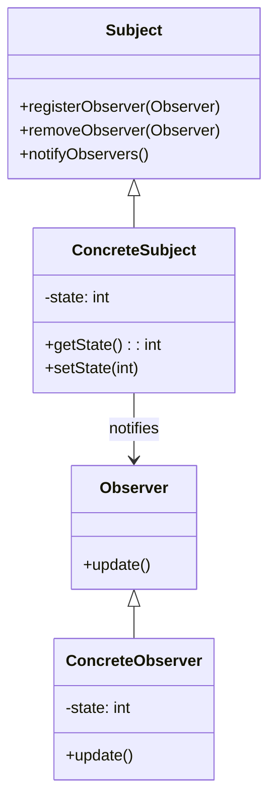

## 15.4 Documentation and Maintainability

In the realm of software engineering, documentation is often the unsung hero that ensures the longevity and maintainability of a codebase. This is especially true when working with design patterns in Java, where the complexity of patterns can obscure the underlying logic if not properly documented. In this section, we will delve into the importance of documentation, effective practices, tools, and strategies for maintaining documentation, and how all these contribute to a maintainable codebase.

### Importance of Documentation

Documentation is the backbone of maintainable code. It serves as a guide for developers to understand the code's functionality, structure, and the rationale behind design decisions. Here's why documentation is crucial:

- **Facilitates Team Collaboration**: Well-documented code allows team members to quickly grasp the functionality and design of a system, enabling seamless collaboration and reducing onboarding time for new developers.
- **Reduces Technical Debt**: Poor documentation can lead to misunderstandings and incorrect assumptions, resulting in technical debt. This can make future changes more difficult and costly.
- **Prevents Knowledge Loss**: As team members come and go, documentation ensures that critical knowledge about the system is not lost, preserving the institutional memory of the project.

#### Risks of Poor Documentation

Without proper documentation, a project can quickly become unmanageable. Some risks include:

- **Increased Maintenance Costs**: Developers may spend excessive time deciphering poorly documented code, leading to increased maintenance costs.
- **Higher Bug Rates**: Misunderstandings due to lack of documentation can introduce bugs, as developers may not fully understand the system's behavior.
- **Difficulty in Scaling**: As systems grow, undocumented code can become a bottleneck, making it difficult to scale and adapt to new requirements.

### Documenting Design Patterns

When implementing design patterns, documentation plays a pivotal role in conveying the intent and structure of the pattern used. Here are some guidelines for documenting design patterns in your Java projects:

- **Include Pattern Names and Intents**: Clearly state the name of the design pattern being used and its intent. This helps other developers understand the purpose of the pattern at a glance.
- **Explain the Selection Rationale**: Document why a particular pattern was chosen over others. This provides context and helps future developers understand the design decisions.
- **Illustrate with Examples**: Provide code snippets or examples that demonstrate how the pattern is implemented in the codebase.

#### Example: Documenting the Singleton Pattern

```java
/**
 * Singleton class to manage database connections.
 * 
 * <p>This class implements the Singleton pattern to ensure that only one
 * instance of the database connection manager exists throughout the application.
 * The Singleton pattern is chosen to control access to the database and
 * manage resource usage efficiently.</p>
 */
public class DatabaseConnectionManager {
    private static DatabaseConnectionManager instance;

    private DatabaseConnectionManager() {
        // Private constructor to prevent instantiation
    }

    /**
     * Returns the single instance of DatabaseConnectionManager.
     * 
     * @return the singleton instance
     */
    public static synchronized DatabaseConnectionManager getInstance() {
        if (instance == null) {
            instance = new DatabaseConnectionManager();
        }
        return instance;
    }
}
```

### Effective Documentation Practices

To ensure that your documentation is effective and helpful, consider the following practices:

- **Use Clear Naming Conventions**: Adopt consistent and descriptive naming conventions for classes, methods, and variables. This reduces the need for excessive comments and makes the code self-explanatory.
- **Incorporate Code Comments**: Use inline comments to explain complex logic or non-obvious code segments. However, avoid over-commenting, as this can clutter the code.
- **Utilize UML Diagrams**: Visual representations such as UML diagrams can effectively communicate the structure and relationships within a design pattern. They provide a high-level overview that complements detailed code comments.

#### Example: UML Diagram for the Observer Pattern



### Tools for Documentation

Several tools can aid in generating and maintaining documentation:

- **Javadoc**: A standard tool for generating API documentation in Java. It extracts comments from the source code and produces HTML documentation.
- **PlantUML**: A tool for creating UML diagrams from simple textual descriptions. It integrates well with documentation platforms and can be used to visualize design patterns.
- **Wikis and Documentation Platforms**: Tools like Confluence or GitHub Pages provide a centralized location for documentation, making it accessible and easy to update.

### Maintaining Documentation

Keeping documentation up-to-date is as important as writing it. Here are some strategies to ensure your documentation remains relevant:

- **Integrate Documentation Updates in Workflow**: Make documentation a part of the development process. Encourage developers to update documentation alongside code changes.
- **Conduct Regular Reviews**: Schedule periodic reviews of documentation to ensure accuracy and completeness. This can be part of code review processes.
- **Automate Where Possible**: Use tools that automatically generate documentation from code comments or annotations, reducing the manual effort required.

### Team Collaboration

Good documentation is a catalyst for effective team collaboration. It facilitates knowledge sharing and ensures that all team members are on the same page. Here are some ways documentation can enhance collaboration:

- **Onboarding New Developers**: Comprehensive documentation accelerates the onboarding process, helping new team members understand the system quickly.
- **Code Reviews**: Encourage code reviews that focus not only on code quality but also on the quality of documentation. This ensures that documentation remains a priority.

### Examples and Templates

Providing examples and templates can standardize documentation practices across a team. Here are some examples:

#### Example: Documenting a Factory Method Pattern

```java
/**
 * Factory class for creating different types of notifications.
 * 
 * <p>This class implements the Factory Method pattern to create instances
 * of various notification types based on the input parameter. The Factory
 * Method pattern is used to encapsulate the instantiation logic and
 * promote code reusability.</p>
 */
public class NotificationFactory {

    /**
     * Creates a notification instance based on the specified type.
     * 
     * @param type the type of notification
     * @return a notification instance
     */
    public Notification createNotification(String type) {
        switch (type) {
            case "SMS":
                return new SMSNotification();
            case "Email":
                return new EmailNotification();
            default:
                throw new IllegalArgumentException("Unknown notification type");
        }
    }
}
```

### Best Practices

To ensure your documentation is both useful and maintainable, consider these best practices:

- **Clarity and Conciseness**: Write documentation that is clear and to the point. Avoid unnecessary jargon and focus on conveying essential information.
- **Avoid Redundancy**: Keep documentation relevant and avoid duplicating information. This reduces the risk of inconsistencies and makes updates easier.
- **Use Templates**: Develop templates for documenting patterns, classes, and methods. This ensures consistency and completeness across the codebase.

### Try It Yourself

To reinforce your understanding of documentation practices, try modifying the provided code examples:

- **Add More Comments**: Enhance the existing comments in the code examples by explaining the purpose of each method and class.
- **Create UML Diagrams**: Use PlantUML to create diagrams for other design patterns you have implemented.
- **Document a New Pattern**: Choose a design pattern not covered in the examples and document its implementation in your codebase.

### Embrace the Journey

Remember, documentation is a continuous process. As your code evolves, so should your documentation. By prioritizing documentation, you not only improve the maintainability of your code but also foster a collaborative and efficient development environment. Keep experimenting with different documentation tools and practices, and enjoy the journey of creating a well-documented codebase!

## Quiz Time!



### What is the primary purpose of documentation in software development?

- [x] To ensure code maintainability and facilitate team collaboration
- [ ] To increase the complexity of the code
- [ ] To make the code harder to understand
- [ ] To reduce the number of developers needed

> **Explanation:** Documentation serves to make code maintainable and understandable, aiding in collaboration and knowledge transfer among team members.

### Which tool is commonly used for generating API documentation in Java?

- [x] Javadoc
- [ ] PlantUML
- [ ] Confluence
- [ ] GitHub Pages

> **Explanation:** Javadoc is a standard tool for generating API documentation from Java source code comments.

### What is a key benefit of using UML diagrams in documentation?

- [x] They provide a visual representation of code structure and relationships
- [ ] They make the code more complex
- [ ] They replace the need for code comments
- [ ] They are only useful for non-developers

> **Explanation:** UML diagrams visually represent the structure and relationships within a system, complementing detailed code comments.

### How can documentation updates be integrated into the development workflow?

- [x] By making documentation updates a part of code changes
- [ ] By ignoring documentation until the project is complete
- [ ] By assigning documentation tasks to non-developers only
- [ ] By using outdated documentation tools

> **Explanation:** Integrating documentation updates with code changes ensures that documentation remains current and accurate.

### What is a risk of poor documentation?

- [x] Increased maintenance costs
- [ ] Reduced complexity
- [ ] Improved team collaboration
- [ ] Faster onboarding of new developers

> **Explanation:** Poor documentation can lead to increased maintenance costs as developers spend more time understanding the code.

### Which of the following is a best practice for documentation?

- [x] Use clear naming conventions and concise comments
- [ ] Write as much text as possible
- [ ] Avoid using diagrams
- [ ] Keep documentation separate from code

> **Explanation:** Clear naming conventions and concise comments improve the readability and maintainability of the code.

### What is the role of a Factory Method pattern in Java?

- [x] To encapsulate instantiation logic and promote code reusability
- [ ] To increase the complexity of object creation
- [ ] To eliminate the need for constructors
- [ ] To replace all design patterns

> **Explanation:** The Factory Method pattern encapsulates the logic of object creation, promoting reusability and flexibility.

### How can team collaboration be enhanced through documentation?

- [x] By providing comprehensive documentation for onboarding and knowledge sharing
- [ ] By keeping documentation private
- [ ] By using complex jargon
- [ ] By avoiding documentation altogether

> **Explanation:** Comprehensive documentation aids in onboarding new team members and facilitates knowledge sharing among existing members.

### What is a benefit of using templates for documentation?

- [x] Ensures consistency and completeness across the codebase
- [ ] Increases redundancy
- [ ] Makes updates more difficult
- [ ] Reduces the need for code comments

> **Explanation:** Templates standardize documentation practices, ensuring consistency and completeness across the codebase.

### True or False: Documentation should be updated only at the end of a project.

- [ ] True
- [x] False

> **Explanation:** Documentation should be updated continuously throughout the development process to ensure it remains accurate and relevant.


