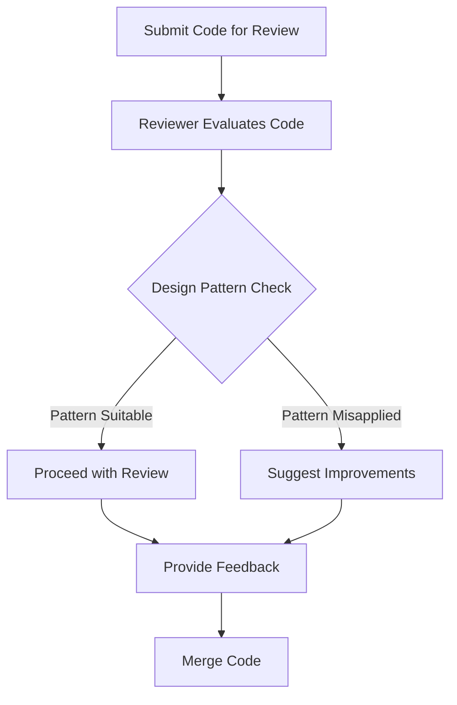

## 15.6 Code Reviews and Design Patterns

In the realm of software engineering, code reviews stand as a cornerstone for maintaining high-quality codebases and fostering collaborative team environments. When integrated with design patterns, code reviews become even more powerful, ensuring that best practices are adhered to and that team members continuously learn from each other. In this section, we will delve into the role of code reviews, how design patterns can be incorporated into the review process, and the best practices to follow for effective code reviews.

### Role of Code Reviews

Code reviews serve multiple purposes in software development, each contributing significantly to the overall quality and maintainability of a project. Let's explore these roles in detail:

#### Purpose and Benefits of Code Reviews

- **Quality Assurance**: Code reviews act as a quality gate, ensuring that code meets the project's standards before it is merged into the main codebase. By catching bugs and issues early, they prevent defects from reaching production.
  
- **Knowledge Sharing**: They provide an opportunity for team members to learn from each other. Junior developers can gain insights from more experienced colleagues, while seniors can stay informed about different parts of the codebase.

- **Consistency**: Code reviews help maintain consistency in coding styles and practices across the team, which is crucial for long-term maintainability.

- **Collaboration and Communication**: They foster a culture of collaboration, where team members discuss and debate the best approaches to solving problems, leading to better solutions.

- **Innovation and Improvement**: Through reviews, teams can identify areas for improvement and innovation, encouraging continuous enhancement of the codebase.

#### Contribution to Code Quality and Team Collaboration

- **Error Reduction**: By having multiple eyes on the code, the likelihood of errors slipping through is significantly reduced.

- **Improved Design**: Code reviews encourage thoughtful design by requiring developers to justify their design choices to their peers.

- **Enhanced Team Dynamics**: Regular reviews promote a culture of openness and trust, where team members feel comfortable sharing their ideas and feedback.

### Incorporating Design Patterns in Reviews

Design patterns are a crucial aspect of software design, offering proven solutions to common problems. Incorporating them into code reviews ensures that these solutions are applied correctly and effectively.

#### Evaluating the Correct Application of Design Patterns

- **Appropriate Use**: During reviews, assess whether the chosen design pattern is suitable for the problem at hand. Patterns should simplify, not complicate, the solution.

- **Correct Implementation**: Ensure that the pattern is implemented correctly, following the established guidelines and principles.

- **Efficiency**: Evaluate the efficiency of the pattern's implementation. Consider whether it introduces unnecessary complexity or performance overhead.

- **Simplicity**: Sometimes, a simpler solution might be more appropriate. Ensure that the chosen pattern is not over-engineering the problem.

#### Checking for Appropriate Pattern Use, Potential Misuse, or Overcomplication

- **Pattern Suitability**: Is the pattern solving the right problem? Misapplied patterns can lead to unnecessary complexity.

- **Overuse of Patterns**: Avoid using patterns for the sake of it. Ensure that their use is justified and beneficial.

- **Alternative Solutions**: Consider whether there are simpler alternatives that achieve the same goal without the overhead of a pattern.

### Code Review Guidelines

To ensure that design patterns are effectively integrated into code reviews, it's helpful to have a set of guidelines or a checklist. Here are some key points to consider:

#### Checklist for Design Patterns in Code Reviews

- **Pattern Suitability**: Is the pattern appropriate for the problem being solved?
- **Correctness**: Is the implementation of the pattern correct according to its definition?
- **Efficiency**: Does the pattern implementation optimize performance and resource usage?
- **Simplicity**: Could a simpler solution be more effective?
- **Readability**: Is the pattern implementation easy to understand and maintain?
- **Documentation**: Are the design decisions and pattern usage well-documented?

### Common Issues to Look For

Even experienced developers can fall into the trap of misapplying design patterns. Here are some common issues to watch for during code reviews:

#### Signs of Anti-Patterns or Code Smells Related to Patterns

- **Overengineering**: Using complex patterns for simple problems.
- **Pattern Obsession**: Applying patterns unnecessarily, leading to convoluted code.
- **Inconsistent Pattern Use**: Inconsistent application of patterns across the codebase.

#### Patterns Frequently Misapplied or Misunderstood

- **Singleton Pattern**: Often misused, leading to issues with testing and concurrency.
- **Factory Patterns**: Can be overused, leading to unnecessary abstraction layers.
- **Observer Pattern**: Misapplied, it can lead to tight coupling and difficult-to-maintain code.

### Facilitating Knowledge Sharing

One of the greatest benefits of code reviews is the opportunity for knowledge sharing. Discussing design patterns during reviews can significantly enhance this aspect.

#### Discussing Design Patterns to Educate Team Members

- **Explain Pattern Choices**: Encourage reviewers to explain why a particular pattern was chosen and how it benefits the code.
- **Highlight Best Practices**: Use reviews as an opportunity to highlight best practices in pattern implementation.
- **Encourage Questions**: Create an environment where team members feel comfortable asking questions and seeking clarification.

#### Providing Constructive Feedback and Explanations

- **Be Positive**: Focus on constructive feedback that aims to improve the code and the developer's skills.
- **Be Specific**: Provide specific examples and explanations to illustrate points.
- **Encourage Dialogue**: Foster a two-way conversation where both the reviewer and the author can learn from each other.

### Best Practices for Code Reviews

To maximize the effectiveness of code reviews, it's important to follow some best practices:

#### Positive, Collaborative, and Respectful Communication

- **Be Respectful**: Always approach reviews with respect and empathy.
- **Be Collaborative**: Work together to find the best solutions.
- **Be Open-Minded**: Be open to different perspectives and approaches.

#### Setting Clear Goals for Code Reviews

- **Focus on Learning and Improvement**: Set goals that prioritize learning and continuous improvement.
- **Define Review Scope**: Clearly define what aspects of the code should be reviewed, including design patterns.

### Tools and Platforms

Several tools and platforms can facilitate effective code reviews, especially when it comes to discussing design patterns.

#### Code Review Tools Supporting Collaborative Reviewing

- **GitHub Pull Requests**: Offers inline comments and discussions, making it easy to review and discuss code changes.
- **Gerrit**: Provides a comprehensive code review system with features for collaborative reviewing.
- **Bitbucket**: Supports pull requests with inline comments and discussions.

#### Features Facilitating Pattern Discussions

- **Inline Comments**: Allow reviewers to comment directly on specific lines of code, facilitating detailed discussions.
- **Discussion Threads**: Enable ongoing conversations about particular design choices or patterns.

### Continuous Improvement

Code reviews should be seen as an evolving process that can be continuously improved over time.

#### Refining Code Review Processes Over Time

- **Regular Feedback**: Gather feedback from team members on the review process and make adjustments as needed.
- **Iterative Improvements**: Continuously refine and improve the review process based on lessons learned.

#### Periodic Meetings to Discuss Common Findings and Share Best Practices

- **Review Retrospectives**: Hold regular meetings to discuss common findings, share best practices, and identify areas for improvement.
- **Knowledge Sharing Sessions**: Organize sessions where team members can present on specific design patterns or review techniques.

### Code Examples

Let's explore some code examples to illustrate how design patterns can be evaluated during code reviews.

#### Example 1: Singleton Pattern

```java
public class Singleton {
    private static volatile Singleton instance;

    private Singleton() {
        // Private constructor to prevent instantiation
    }

    public static Singleton getInstance() {
        if (instance == null) {
            synchronized (Singleton.class) {
                if (instance == null) {
                    instance = new Singleton();
                }
            }
        }
        return instance;
    }
}
```

**Review Focus**: Ensure that the Singleton pattern is implemented correctly, with thread safety in mind. Check for the use of the `volatile` keyword and double-checked locking.

#### Example 2: Factory Method Pattern

```java
abstract class Product {
    public abstract void use();
}

class ConcreteProductA extends Product {
    @Override
    public void use() {
        System.out.println("Using Product A");
    }
}

class ConcreteProductB extends Product {
    @Override
    public void use() {
        System.out.println("Using Product B");
    }
}

abstract class Creator {
    public abstract Product createProduct();
}

class ConcreteCreatorA extends Creator {
    @Override
    public Product createProduct() {
        return new ConcreteProductA();
    }
}

class ConcreteCreatorB extends Creator {
    @Override
    public Product createProduct() {
        return new ConcreteProductB();
    }
}
```

**Review Focus**: Evaluate whether the Factory Method pattern is used appropriately to create objects. Ensure that the pattern simplifies object creation and enhances flexibility.

### Visualizing Design Patterns in Code Reviews

To better understand the integration of design patterns in code reviews, let's visualize a typical review process using a flowchart.



**Diagram Description**: This flowchart illustrates the code review process, highlighting the evaluation of design patterns. If a pattern is suitable, the review proceeds. If misapplied, improvements are suggested before merging the code.

### Try It Yourself

To deepen your understanding, try modifying the code examples provided. For instance, implement a different design pattern, such as the Observer pattern, and evaluate its suitability and correctness during a mock code review.

### Knowledge Check

- **Question**: Why is it important to evaluate the correct application of design patterns during code reviews?
- **Exercise**: Identify a piece of code in your current project where a design pattern could be applied or improved. Discuss your findings with a colleague.

### Embrace the Journey

Remember, code reviews and design patterns are tools to help us grow as developers. By integrating these practices into our workflows, we not only improve our code but also enhance our skills and collaboration. Keep experimenting, stay curious, and enjoy the journey!

## Quiz Time!



### What is one of the primary purposes of code reviews?

- [x] To ensure code quality and consistency
- [ ] To increase the number of lines of code
- [ ] To reduce the number of developers needed
- [ ] To eliminate the need for testing

> **Explanation:** Code reviews are primarily conducted to ensure code quality and consistency across the codebase, not to increase lines of code or reduce developers.

### How can design patterns enhance code reviews?

- [x] By providing a framework for evaluating code structure
- [ ] By making code reviews unnecessary
- [ ] By increasing code complexity
- [ ] By reducing the need for documentation

> **Explanation:** Design patterns offer a framework for evaluating code structure and ensure that best practices are followed, enhancing the review process.

### What should be checked when reviewing the use of a Singleton pattern?

- [x] Thread safety and correct implementation
- [ ] The number of instances created
- [ ] The use of inheritance
- [ ] The presence of multiple constructors

> **Explanation:** When reviewing a Singleton pattern, it's crucial to check for thread safety and correct implementation, ensuring only one instance is created.

### Why is it important to discuss design patterns during code reviews?

- [x] To facilitate knowledge sharing and learning
- [ ] To increase the complexity of the code
- [ ] To reduce the number of patterns used
- [ ] To make reviews longer

> **Explanation:** Discussing design patterns during reviews helps facilitate knowledge sharing and learning among team members.

### What is a common issue to look for in design pattern implementation?

- [x] Overengineering and unnecessary complexity
- [ ] Too few lines of code
- [ ] Lack of comments
- [ ] Use of simple algorithms

> **Explanation:** Overengineering and unnecessary complexity are common issues in design pattern implementation that should be addressed during reviews.

### Which tool is commonly used for code reviews?

- [x] GitHub Pull Requests
- [ ] Microsoft Word
- [ ] Adobe Photoshop
- [ ] Google Sheets

> **Explanation:** GitHub Pull Requests is a commonly used tool for code reviews, providing features for collaborative reviewing.

### What should be the focus of code review goals?

- [x] Learning and continuous improvement
- [ ] Reducing the number of developers
- [ ] Increasing the number of lines of code
- [ ] Eliminating the need for testing

> **Explanation:** Code review goals should focus on learning and continuous improvement, not reducing developers or increasing code lines.

### What is a benefit of using inline comments in code reviews?

- [x] Facilitating detailed discussions on specific lines of code
- [ ] Increasing the length of the review process
- [ ] Reducing the need for documentation
- [ ] Making code more complex

> **Explanation:** Inline comments facilitate detailed discussions on specific lines of code, enhancing the review process.

### How can teams continuously improve their code review process?

- [x] By gathering feedback and making iterative improvements
- [ ] By reducing the number of reviews
- [ ] By eliminating design patterns
- [ ] By increasing the number of reviewers

> **Explanation:** Teams can continuously improve their code review process by gathering feedback and making iterative improvements.

### True or False: Code reviews are only beneficial for junior developers.

- [ ] True
- [x] False

> **Explanation:** Code reviews are beneficial for all developers, regardless of experience level, as they promote learning, collaboration, and code quality.


