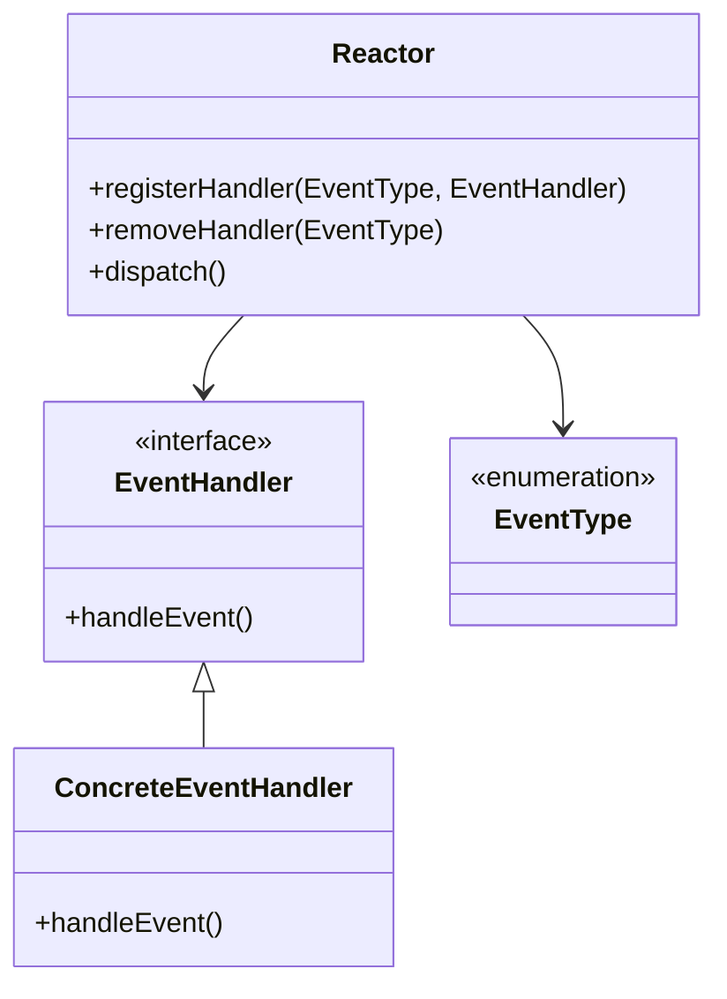

## 15.9 The Asynchronous Reactor Pattern

### Introduction

The Asynchronous Reactor Pattern is a cornerstone in the realm of high-performance networked applications. It is a design pattern that efficiently handles service requests delivered concurrently to a service handler by one or more inputs. This pattern is particularly significant in scenarios requiring non-blocking I/O operations, enabling applications to manage numerous connections simultaneously without the overhead of multiple threads.

### Intent

- **Description**: The Reactor Pattern is designed to handle multiple service requests that are delivered concurrently to a service handler by one or more inputs. It demultiplexes and dispatches events to the appropriate request handlers, allowing for efficient non-blocking I/O operations.

### Also Known As

- **Alternate Names**: Dispatcher Pattern, Event Demultiplexer

### Motivation

In traditional blocking I/O models, each client connection typically requires a dedicated thread. This approach can lead to significant resource consumption and scalability issues, especially in high-load environments. The Reactor Pattern addresses these challenges by using a single or a few threads to manage multiple I/O operations, thereby enhancing scalability and performance.

### Applicability

- **Guidelines**: The Reactor Pattern is applicable in systems where:
  - High concurrency is required.
  - Non-blocking I/O operations are preferred.
  - Scalability is a critical concern.
  - Efficient resource utilization is necessary.

### Structure



- **Caption**: The diagram illustrates the structure of the Reactor Pattern, showing the relationships between the Reactor, EventHandler, and EventType components.

### Participants

- **Reactor**: The core component that listens for events and dispatches them to the appropriate handlers.
- **EventHandler**: An interface or abstract class that defines the method for handling events.
- **ConcreteEventHandler**: Implements the EventHandler interface to provide specific event handling logic.
- **EventType**: Represents the types of events that can be handled.

### Collaborations

- **Interactions**: The Reactor listens for incoming events and uses the EventType to determine the appropriate EventHandler. It then delegates the event handling to the ConcreteEventHandler.

### Consequences

- **Analysis**: The Reactor Pattern offers several benefits, including:
  - **Scalability**: Efficiently handles a large number of concurrent connections.
  - **Resource Efficiency**: Reduces the need for multiple threads, lowering resource consumption.
  - **Responsiveness**: Provides non-blocking I/O operations, improving application responsiveness.

  However, it also has potential drawbacks:
  - **Complexity**: Implementing the pattern can be complex, especially in large systems.
  - **Debugging Difficulty**: Asynchronous operations can complicate debugging and error handling.

### Implementation

#### Implementation Guidelines

- **Use Java NIO**: Leverage Java's New I/O (NIO) package to implement non-blocking I/O operations.
- **Event Loop**: Implement an event loop within the Reactor to continuously listen for and dispatch events.
- **Thread Management**: Use a small number of threads to manage multiple connections, optimizing resource usage.

#### Sample Code Snippets

```java
import java.io.IOException;
import java.nio.channels.*;
import java.util.Iterator;
import java.util.Set;

public class Reactor implements Runnable {
    private final Selector selector;

    public Reactor() throws IOException {
        this.selector = Selector.open();
    }

    public void registerHandler(SelectableChannel channel, int ops, EventHandler handler) throws ClosedChannelException {
        channel.register(selector, ops, handler);
    }

    @Override
    public void run() {
        try {
            while (!Thread.interrupted()) {
                selector.select();
                Set<SelectionKey> selectedKeys = selector.selectedKeys();
                Iterator<SelectionKey> iterator = selectedKeys.iterator();
                while (iterator.hasNext()) {
                    SelectionKey key = iterator.next();
                    dispatch(key);
                    iterator.remove();
                }
            }
        } catch (IOException e) {
            e.printStackTrace();
        }
    }

    private void dispatch(SelectionKey key) {
        EventHandler handler = (EventHandler) key.attachment();
        if (handler != null) {
            handler.handleEvent(key);
        }
    }
}

interface EventHandler {
    void handleEvent(SelectionKey key);
}

class ConcreteEventHandler implements EventHandler {
    @Override
    public void handleEvent(SelectionKey key) {
        // Handle the event
    }
}
```

- **Explanation**: The code demonstrates a basic implementation of the Reactor Pattern using Java NIO. The `Reactor` class manages the event loop and dispatches events to the appropriate `EventHandler`.

### Sample Use Cases

- **Real-world Scenarios**: The Reactor Pattern is widely used in high-performance web servers, such as Netty and Apache MINA, which require efficient handling of numerous concurrent connections.

### Related Patterns

- **Connections**: The Reactor Pattern is often compared to the [Observer Pattern]( "Observer Pattern"), as both involve event handling. However, the Reactor Pattern is more focused on I/O operations and scalability.

### Known Uses

- **Examples in Libraries or Frameworks**: Notable implementations of the Reactor Pattern can be found in frameworks like Netty and Apache MINA, which are used for building scalable network applications.

### Advantages and Design Considerations

#### Advantages

- **High Scalability**: The Reactor Pattern allows applications to handle thousands of connections simultaneously, making it ideal for high-load environments.
- **Non-blocking I/O**: By using non-blocking I/O operations, the pattern ensures that applications remain responsive even under heavy load.
- **Efficient Resource Utilization**: Reduces the need for multiple threads, leading to lower CPU and memory usage.

#### Design Considerations

- **Complexity**: Implementing the Reactor Pattern can be complex, requiring careful design and testing.
- **Error Handling**: Asynchronous operations can complicate error handling and debugging.
- **Thread Management**: Proper thread management is crucial to avoid bottlenecks and ensure optimal performance.

### Conclusion

The Asynchronous Reactor Pattern is a powerful tool for building high-performance, scalable networked applications. By leveraging non-blocking I/O operations, it enables efficient handling of numerous concurrent connections, making it a popular choice for modern web servers and networked systems. However, its complexity requires careful design and implementation to fully realize its benefits.

### Exercises

1. **Implement a Simple Reactor**: Create a simple Reactor implementation using Java NIO to handle basic read and write operations.
2. **Extend the Reactor**: Add support for additional event types, such as connect and accept, to your Reactor implementation.
3. **Experiment with Thread Pools**: Integrate a thread pool into your Reactor to manage event handling more efficiently.

### Reflection

Consider how the Reactor Pattern could be applied to your current projects. What benefits could it bring in terms of scalability and performance? How might you address the challenges associated with its implementation?

---

## Test Your Knowledge: Asynchronous Reactor Pattern Quiz



### What is the primary benefit of using the Reactor Pattern in Java?

- [x] It allows for non-blocking I/O operations.
- [ ] It simplifies the codebase.
- [ ] It increases the number of threads.
- [ ] It reduces the need for event handlers.

> **Explanation:** The Reactor Pattern is designed to handle multiple service requests concurrently using non-blocking I/O operations, enhancing scalability and performance.

### Which Java package is commonly used to implement the Reactor Pattern?

- [x] java.nio
- [ ] java.util
- [ ] java.io
- [ ] java.net

> **Explanation:** The java.nio package provides the necessary classes and interfaces for implementing non-blocking I/O operations, which are essential for the Reactor Pattern.

### What role does the Reactor play in the pattern?

- [x] It listens for events and dispatches them to handlers.
- [ ] It processes events directly.
- [ ] It creates new threads for each event.
- [ ] It logs events for debugging.

> **Explanation:** The Reactor is responsible for listening for incoming events and dispatching them to the appropriate handlers for processing.

### How does the Reactor Pattern improve scalability?

- [x] By using a small number of threads to manage many connections.
- [ ] By increasing the number of threads.
- [ ] By simplifying the code structure.
- [ ] By reducing the number of event handlers.

> **Explanation:** The Reactor Pattern uses a small number of threads to manage multiple connections, reducing resource consumption and improving scalability.

### Which of the following is a potential drawback of the Reactor Pattern?

- [x] Complexity in implementation
- [ ] Increased resource consumption
- [ ] Blocking I/O operations
- [ ] Limited scalability

> **Explanation:** The Reactor Pattern can be complex to implement, especially in large systems, due to its asynchronous nature and event-driven architecture.

### What is a common use case for the Reactor Pattern?

- [x] High-performance web servers
- [ ] Desktop applications
- [ ] Simple command-line tools
- [ ] Batch processing systems

> **Explanation:** The Reactor Pattern is commonly used in high-performance web servers that require efficient handling of numerous concurrent connections.

### How does the Reactor Pattern handle multiple connections?

- [x] By using non-blocking I/O operations
- [ ] By creating a thread for each connection
- [ ] By using blocking I/O operations
- [ ] By limiting the number of connections

> **Explanation:** The Reactor Pattern uses non-blocking I/O operations to handle multiple connections efficiently without the need for multiple threads.

### What is the role of an EventHandler in the Reactor Pattern?

- [x] To process events dispatched by the Reactor
- [ ] To listen for incoming events
- [ ] To manage thread pools
- [ ] To log events for debugging

> **Explanation:** The EventHandler is responsible for processing events that are dispatched by the Reactor, providing the specific logic for handling each event type.

### Which of the following frameworks implements the Reactor Pattern?

- [x] Netty
- [ ] Spring Boot
- [ ] Hibernate
- [ ] JUnit

> **Explanation:** Netty is a framework that implements the Reactor Pattern, providing a high-performance network application framework for building scalable servers.

### True or False: The Reactor Pattern is suitable for applications with low concurrency requirements.

- [ ] True
- [x] False

> **Explanation:** The Reactor Pattern is designed for high-concurrency environments, where it can efficiently manage numerous simultaneous connections.



---

By mastering the Asynchronous Reactor Pattern, Java developers can build robust, scalable applications capable of handling high loads with efficiency and responsiveness. This pattern is a testament to the power of non-blocking I/O and event-driven architectures in modern software design.
