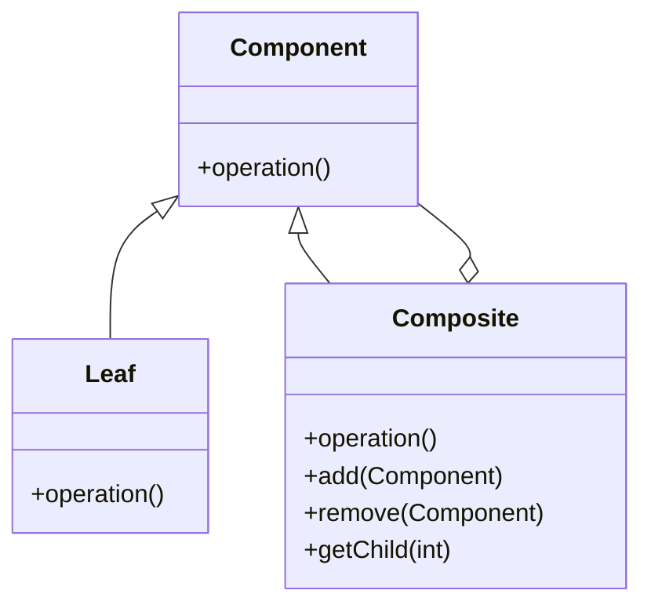

## 17.1 Glossary of Terms

Welcome to the glossary section of our guide, "Design Patterns in Java for Expert Software Engineers." This glossary is designed to provide you with clear and concise definitions of key terms and concepts related to design patterns and Java programming. Each term is accompanied by examples or scenarios to illustrate its application in the context of design patterns in Java. The terms are organized alphabetically for easy reference.

### Abstract Factory Pattern
A creational design pattern that provides an interface for creating families of related or dependent objects without specifying their concrete classes. This pattern is often used when a system needs to be independent of how its objects are created.

**Example**: In a GUI application, an abstract factory might be used to create different types of buttons and text fields for different operating systems.

### Adapter Pattern
A structural design pattern that allows incompatible interfaces to work together. It acts as a bridge between two incompatible interfaces by wrapping an existing class with a new interface.

**Example**: An adapter can be used to allow a legacy system to communicate with a new system by converting the interface of the legacy system to match the new one.

### Anti-Pattern
A common but ineffective solution to a recurring problem. Anti-patterns are often the result of a misunderstanding or misuse of design patterns.

**Example**: The "God Object" anti-pattern occurs when a single class takes on too many responsibilities, leading to a lack of cohesion and increased complexity.

### Aspect-Oriented Programming (AOP)
A programming paradigm that aims to increase modularity by allowing the separation of cross-cutting concerns. It involves breaking down a program into distinct parts called "aspects."

**Example**: Logging and security are common cross-cutting concerns that can be modularized using AOP.

### Builder Pattern
A creational design pattern that separates the construction of a complex object from its representation, allowing the same construction process to create different representations.

**Example**: A `StringBuilder` in Java is an example of the builder pattern, allowing the construction of a string through a series of method calls.

### Chain of Responsibility Pattern
A behavioral design pattern that allows an object to pass a request along a chain of potential handlers until the request is handled.

**Example**: In a logging system, different loggers (e.g., console, file, network) can be chained together, with each logger deciding whether to handle the log message.

### Class Diagram
A type of static structure diagram in UML that describes the structure of a system by showing its classes, attributes, operations, and the relationships among objects.

**Example**: A class diagram can be used to visualize the relationships between different classes in a design pattern, such as the components of a composite pattern.

### Cohesion
The degree to which the elements of a module belong together. High cohesion within a module or class indicates that its responsibilities are closely related.

**Example**: A class with high cohesion might encapsulate all the behavior related to a single concept, such as a `Customer` class handling customer-related operations.

### Command Pattern
A behavioral design pattern that encapsulates a request as an object, thereby allowing for parameterization of clients with queues, requests, and operations.

**Example**: In a GUI application, each button click can be represented as a command object, allowing for easy implementation of undo and redo functionality.

### Composite Pattern
A structural design pattern that allows you to compose objects into tree structures to represent part-whole hierarchies. It lets clients treat individual objects and compositions of objects uniformly.

**Example**: A file system can be represented using a composite pattern, where files and directories are treated as nodes in a tree structure.

### Coupling
The degree of interdependence between software modules. Low coupling is often a sign of a well-structured computer system and a good design pattern.

**Example**: Using interfaces to define interactions between modules can reduce coupling, as changes to one module do not directly affect others.

### Creational Patterns
Design patterns that deal with object creation mechanisms, trying to create objects in a manner suitable to the situation. The basic form of object creation could result in design problems or added complexity to the design.

**Example**: Singleton, Factory Method, and Builder are all examples of creational patterns.

### Decorator Pattern
A structural design pattern that allows behavior to be added to individual objects, either statically or dynamically, without affecting the behavior of other objects from the same class.

**Example**: Java's I/O Streams use the decorator pattern to add functionality such as buffering or filtering to streams.

### Dependency Injection
A design pattern used to implement IoC, allowing the creation of dependent objects outside of a class and providing those objects to a class through different ways.

**Example**: In Spring Framework, dependency injection is used to provide beans to other beans, reducing the need for hard-coded dependencies.

### Design Pattern
A general repeatable solution to a commonly occurring problem in software design. A design pattern is not a finished design that can be transformed directly into code.

**Example**: The Observer pattern is used to define a one-to-many dependency between objects so that when one object changes state, all its dependents are notified.

### Double-Checked Locking
A design pattern used to reduce the overhead of acquiring a lock by first testing the locking criterion without actually acquiring the lock.

**Example**: Double-checked locking is often used in the implementation of a Singleton pattern to ensure that only one instance of a class is created in a multi-threaded environment.

### Encapsulation
The bundling of data with the methods that operate on that data, or the restriction of direct access to some of an object's components.

**Example**: In Java, encapsulation is achieved using access modifiers like `private`, `protected`, and `public`.

### Factory Method Pattern
A creational design pattern that provides an interface for creating objects in a superclass, but allows subclasses to alter the type of objects that will be created.

**Example**: A document editor might use a factory method to create different types of documents (e.g., text, spreadsheet, presentation).

### Flyweight Pattern
A structural design pattern that allows for the efficient sharing of objects to support large numbers of fine-grained objects efficiently.

**Example**: A text editor might use a flyweight pattern to share character objects, reducing memory usage when displaying large documents.

### Inheritance
A mechanism in which one class acquires the property of another class. Inheritance is used to achieve runtime polymorphism or method overriding.

**Example**: In Java, a class can inherit from another class using the `extends` keyword.

### Interface
A reference type in Java, it is similar to a class, and is a collection of abstract methods. A class implements an interface, thereby inheriting the abstract methods of the interface.

**Example**: The `List` interface in Java provides a contract for list operations, which is implemented by classes like `ArrayList` and `LinkedList`.

### Iterator Pattern
A behavioral design pattern that provides a way to access the elements of an aggregate object sequentially without exposing its underlying representation.

**Example**: Java's `Iterator` interface is used to iterate over collections like lists and sets.

### Lazy Initialization
A technique used to delay the creation of an object, the calculation of a value, or some other expensive process until the first time it is needed.

**Example**: Lazy initialization is often used in the Singleton pattern to create the instance only when it is first requested.

### Liskov Substitution Principle (LSP)
A principle in object-oriented programming that states that objects of a superclass should be replaceable with objects of a subclass without affecting the correctness of the program.

**Example**: If a function expects an object of type `Animal`, it should be able to accept an object of type `Dog` without any issues.

### Mediator Pattern
A behavioral design pattern that defines an object that encapsulates how a set of objects interact. This pattern promotes loose coupling by keeping objects from referring to each other explicitly.

**Example**: In a chat application, a mediator can be used to manage communication between different chat participants.

### Memento Pattern
A behavioral design pattern that provides the ability to restore an object to its previous state (undo via rollback).

**Example**: A text editor might use the memento pattern to implement undo functionality, allowing users to revert to previous document states.

### Observer Pattern
A behavioral design pattern that defines a one-to-many dependency between objects so that when one object changes state, all its dependents are notified and updated automatically.

**Example**: In a model-view-controller (MVC) architecture, the view can be an observer of the model, updating its display whenever the model's data changes.

### Open/Closed Principle (OCP)
A principle in software design that states that software entities (classes, modules, functions, etc.) should be open for extension but closed for modification.

**Example**: Using interfaces and abstract classes allows new functionality to be added without modifying existing code.

### Polymorphism
The ability of different classes to be treated as instances of the same class through a common interface. It is one of the core concepts of object-oriented programming.

**Example**: In Java, method overriding is a form of polymorphism where a subclass provides a specific implementation of a method that is already defined in its superclass.

### Prototype Pattern
A creational design pattern that allows cloning of objects, even complex ones, without coupling to their specific classes.

**Example**: In a game, a prototype pattern might be used to clone existing characters or objects to create new ones with similar attributes.

### Proxy Pattern
A structural design pattern that provides an object representing another object. It acts as an interface to something else, such as a network connection, a large object in memory, a file, or some other resource that is expensive or impossible to duplicate.

**Example**: A virtual proxy might be used to load a large image only when it is needed, reducing memory usage.

### Refactoring
The process of restructuring existing computer code without changing its external behavior. It is intended to improve nonfunctional attributes of the software.

**Example**: Refactoring might involve breaking a large method into smaller, more manageable methods to improve readability and maintainability.

### Singleton Pattern
A creational design pattern that ensures a class has only one instance and provides a global point of access to it.

**Example**: A configuration manager might be implemented as a singleton to ensure that all parts of an application use the same configuration settings.

### SOLID Principles
A set of design principles intended to make software designs more understandable, flexible, and maintainable. The principles are Single Responsibility, Open/Closed, Liskov Substitution, Interface Segregation, and Dependency Inversion.

**Example**: Applying the single responsibility principle ensures that a class has only one reason to change, improving maintainability.

### Strategy Pattern
A behavioral design pattern that enables selecting an algorithm's behavior at runtime. It defines a family of algorithms, encapsulates each one, and makes them interchangeable.

**Example**: A sorting algorithm might be implemented as a strategy pattern, allowing different sorting strategies (e.g., quicksort, mergesort) to be selected at runtime.

### Template Method Pattern
A behavioral design pattern that defines the skeleton of an algorithm in a method, deferring some steps to subclasses. It lets subclasses redefine certain steps of an algorithm without changing its structure.

**Example**: A data processing framework might use a template method pattern to define the steps for processing data, allowing subclasses to implement specific data processing logic.

### UML (Unified Modeling Language)
A standardized modeling language consisting of an integrated set of diagrams, used to specify, visualize, construct, and document the artifacts of a software system.

**Example**: UML class diagrams are commonly used to represent the structure of a system, showing classes, attributes, operations, and relationships.

### Visitor Pattern
A behavioral design pattern that lets you separate algorithms from the objects on which they operate. It allows adding new operations to existing object structures without modifying the structures.

**Example**: In a compiler, a visitor pattern might be used to perform operations like type checking or code generation on different elements of a syntax tree.

### YAGNI (You Aren't Gonna Need It)
A principle of extreme programming that states a programmer should not add functionality until it is necessary.

**Example**: Avoiding the implementation of features that are not currently needed helps keep the codebase simple and maintainable.

### Try It Yourself

To reinforce your understanding of these terms, consider implementing a simple design pattern in Java. For instance, try creating a Singleton class and then modify it to be thread-safe using double-checked locking. Experiment with adding lazy initialization and observe how it affects the pattern's behavior.

### Visualizing Design Patterns

To better understand how design patterns interact within a system, let's visualize the relationships using a class diagram. Below is a simple representation of the Composite Pattern:

**Description**: This diagram illustrates the Composite Pattern, where `Component` is the base class, `Leaf` represents individual objects, and `Composite` represents a group of objects. The `Composite` class can contain both `Leaf` and other `Composite` objects, allowing for tree structures.

### Knowledge Check

Reflect on the terms and concepts covered in this glossary. How do these patterns and principles influence your approach to software design? Consider how you might apply them in your current projects to enhance code quality and maintainability.

## Quiz Time!



### What is the primary purpose of the Singleton Pattern?

- [x] To ensure a class has only one instance and provide a global access point to it.
- [ ] To create a family of related or dependent objects.
- [ ] To encapsulate a request as an object.
- [ ] To allow incompatible interfaces to work together.

> **Explanation:** The Singleton Pattern ensures that a class has only one instance and provides a global point of access to that instance.

### Which pattern is used to add behavior to individual objects dynamically?

- [ ] Singleton Pattern
- [ ] Factory Method Pattern
- [x] Decorator Pattern
- [ ] Observer Pattern

> **Explanation:** The Decorator Pattern allows behavior to be added to individual objects dynamically without affecting other objects from the same class.

### What does the Open/Closed Principle advocate?

- [x] Software entities should be open for extension but closed for modification.
- [ ] Software entities should be open for modification but closed for extension.
- [ ] Software entities should be open for both extension and modification.
- [ ] Software entities should be closed for both extension and modification.

> **Explanation:** The Open/Closed Principle states that software entities should be open for extension but closed for modification, allowing new functionality to be added without altering existing code.

### What is the main advantage of using the Factory Method Pattern?

- [ ] It ensures a class has only one instance.
- [x] It allows subclasses to alter the type of objects that will be created.
- [ ] It provides a way to access elements of a collection sequentially.
- [ ] It defines a one-to-many dependency between objects.

> **Explanation:** The Factory Method Pattern provides an interface for creating objects in a superclass but allows subclasses to alter the type of objects that will be created.

### Which principle is focused on reducing the interdependence between software modules?

- [ ] Cohesion
- [x] Coupling
- [ ] Encapsulation
- [ ] Polymorphism

> **Explanation:** Coupling refers to the degree of interdependence between software modules. Reducing coupling is a key goal in software design to enhance modularity and flexibility.

### What is the role of the Mediator Pattern?

- [ ] To encapsulate a request as an object.
- [x] To define an object that encapsulates how a set of objects interact.
- [ ] To provide a simplified interface to a complex subsystem.
- [ ] To allow incompatible interfaces to work together.

> **Explanation:** The Mediator Pattern defines an object that encapsulates how a set of objects interact, promoting loose coupling by preventing objects from referring to each other explicitly.

### Which pattern is used to efficiently share objects to support large numbers of fine-grained objects?

- [ ] Singleton Pattern
- [ ] Prototype Pattern
- [x] Flyweight Pattern
- [ ] Proxy Pattern

> **Explanation:** The Flyweight Pattern allows for the efficient sharing of objects to support large numbers of fine-grained objects efficiently.

### What is the benefit of using the Builder Pattern?

- [ ] It ensures a class has only one instance.
- [ ] It allows behavior to be added to individual objects dynamically.
- [x] It separates the construction of a complex object from its representation.
- [ ] It defines a one-to-many dependency between objects.

> **Explanation:** The Builder Pattern separates the construction of a complex object from its representation, allowing the same construction process to create different representations.

### Which pattern is used to provide a way to access elements of a collection sequentially without exposing its underlying representation?

- [ ] Singleton Pattern
- [ ] Factory Method Pattern
- [ ] Observer Pattern
- [x] Iterator Pattern

> **Explanation:** The Iterator Pattern provides a way to access elements of a collection sequentially without exposing its underlying representation.

### True or False: The Liskov Substitution Principle states that objects of a superclass should be replaceable with objects of a subclass without affecting the correctness of the program.

- [x] True
- [ ] False

> **Explanation:** The Liskov Substitution Principle is a fundamental concept in object-oriented programming that ensures that objects of a superclass can be replaced with objects of a subclass without affecting the correctness of the program.



Remember, this glossary is just the beginning. As you progress, you'll build more complex and interactive systems using these design patterns. Keep experimenting, stay curious, and enjoy the journey!
