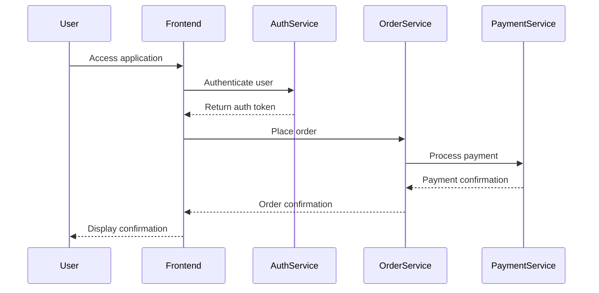

## 17.11.4 End-to-End Testing Strategies

In the realm of microservices architecture, end-to-end (E2E) testing plays a pivotal role in ensuring that the entire system functions cohesively. Unlike unit or integration tests that focus on individual components or interactions between a few services, E2E testing validates the complete workflow from start to finish. This section delves into the strategies for effective E2E testing, addressing the challenges and providing practical examples to enhance your testing framework.

### The Role of End-to-End Testing

End-to-end testing is crucial for identifying system-wide issues that may not be apparent when testing individual components. It simulates real user scenarios, ensuring that all services interact correctly and that the system meets business requirements. E2E tests are typically executed in an environment that closely resembles production, allowing for the detection of issues related to service communication, data integrity, and user experience.

#### Key Objectives of End-to-End Testing

- **Validation of Business Processes**: Ensure that the entire business process flows as expected.
- **System Integration**: Verify that all microservices communicate and integrate seamlessly.
- **User Experience**: Test the system from a user's perspective to ensure usability and performance.
- **Data Integrity**: Confirm that data is correctly processed and stored across services.

### Challenges in End-to-End Testing

While E2E testing is essential, it presents several challenges, particularly in a microservices architecture:

#### Test Environment Setup

Creating a test environment that mirrors production can be complex. It requires:

- **Service Deployment**: Deploying all microservices with their dependencies.
- **Network Configuration**: Ensuring network settings replicate production conditions.
- **Data Management**: Providing consistent and realistic test data.

#### Test Data Management

Managing test data is critical for reliable E2E tests. Challenges include:

- **Data Consistency**: Ensuring data remains consistent across multiple test runs.
- **Data Privacy**: Protecting sensitive information in test datasets.
- **Data Volume**: Handling large datasets that mimic production scenarios.

#### Test Maintenance

E2E tests can be brittle and require significant maintenance:

- **Test Flakiness**: Addressing tests that fail intermittently due to timing issues or dependencies.
- **Test Coverage vs. Maintenance**: Balancing comprehensive test coverage with the overhead of maintaining a large test suite.

### Strategies for Effective End-to-End Testing

To overcome these challenges, consider the following strategies:

#### Automated Test Suites

Automating E2E tests is essential for efficiency and consistency. Use tools like Selenium, Cypress, or TestNG for web applications, and consider frameworks like Cucumber for behavior-driven development (BDD).

```java
// Example of an automated E2E test using Selenium in Java
import org.openqa.selenium.WebDriver;
import org.openqa.selenium.chrome.ChromeDriver;
import org.openqa.selenium.By;

public class EndToEndTest {
    public static void main(String[] args) {
        // Set the path for the ChromeDriver
        System.setProperty("webdriver.chrome.driver", "/path/to/chromedriver");

        // Initialize the WebDriver
        WebDriver driver = new ChromeDriver();

        try {
            // Navigate to the application URL
            driver.get("http://example.com");

            // Perform actions to simulate user behavior
            driver.findElement(By.id("username")).sendKeys("testuser");
            driver.findElement(By.id("password")).sendKeys("password");
            driver.findElement(By.id("login")).click();

            // Validate the expected outcome
            String expectedTitle = "Dashboard";
            String actualTitle = driver.getTitle();
            assert actualTitle.equals(expectedTitle) : "Test Failed";

            System.out.println("End-to-End Test Passed");
        } finally {
            // Close the browser
            driver.quit();
        }
    }
}
```

#### Continuous Testing

Integrate E2E tests into your continuous integration/continuous deployment (CI/CD) pipeline to ensure that changes are validated continuously. This approach helps catch issues early and reduces the risk of defects reaching production.

#### Test Data Management Solutions

Implement strategies for effective test data management:

- **Data Masking**: Use data masking techniques to protect sensitive information.
- **Data Generation**: Automate the generation of test data to ensure consistency.
- **Data Versioning**: Maintain versions of test datasets to support different test scenarios.

#### Balancing Coverage and Maintenance

Achieve a balance between comprehensive test coverage and maintenance overhead by:

- **Prioritizing Critical Paths**: Focus on testing the most critical user journeys.
- **Modular Test Design**: Design tests in a modular fashion to facilitate reuse and reduce duplication.
- **Regular Review and Refactoring**: Regularly review and refactor test cases to improve efficiency and maintainability.

### Real-World Scenarios

Consider a microservices-based e-commerce platform. E2E testing would involve:

- **User Registration**: Testing the complete flow from user registration to account activation.
- **Product Purchase**: Validating the process from product selection to payment and order confirmation.
- **Order Tracking**: Ensuring that users can track their orders and receive notifications.

### Visualizing End-to-End Testing

To better understand the interactions in an E2E test, consider the following sequence diagram:



*Caption: Sequence diagram illustrating the end-to-end flow of a user placing an order in a microservices architecture.*

### Best Practices and Expert Tips

- **Use Mock Services**: When testing dependencies that are not under your control, use mock services to simulate their behavior.
- **Parallel Test Execution**: Run tests in parallel to reduce execution time and improve efficiency.
- **Monitor Test Results**: Implement monitoring and logging to capture detailed test results and facilitate debugging.

### Conclusion

End-to-end testing is a vital component of a robust testing strategy in microservices architecture. By addressing the challenges and implementing effective strategies, you can ensure that your system functions as intended and delivers a seamless user experience. Embrace automation, continuous testing, and efficient test data management to enhance your testing framework and achieve reliable results.

### Key Takeaways

- End-to-end testing validates the entire system flow, ensuring seamless integration and user experience.
- Overcome challenges by automating tests, managing test data effectively, and balancing coverage with maintenance.
- Integrate E2E tests into your CI/CD pipeline for continuous validation and early defect detection.

### Reflection

Consider how you can apply these strategies to your own projects. What challenges have you faced in E2E testing, and how might these approaches help you overcome them?

---

## Test Your Knowledge: End-to-End Testing Strategies Quiz



### What is the primary goal of end-to-end testing in microservices?

- [x] To validate the entire system flow and ensure seamless integration.
- [ ] To test individual microservices in isolation.
- [ ] To focus on performance testing of microservices.
- [ ] To only test the user interface.

> **Explanation:** End-to-end testing aims to validate the entire system flow, ensuring that all microservices integrate seamlessly and the system meets business requirements.

### Which of the following is a challenge in setting up an end-to-end test environment?

- [x] Service deployment and network configuration.
- [ ] Writing unit tests for individual services.
- [ ] Implementing design patterns.
- [ ] Refactoring code for performance.

> **Explanation:** Setting up an end-to-end test environment involves deploying all microservices and configuring the network to mirror production conditions.

### How can test data management be improved in end-to-end testing?

- [x] By using data masking and automated data generation.
- [ ] By manually entering test data for each test run.
- [ ] By using production data directly.
- [ ] By ignoring data consistency.

> **Explanation:** Test data management can be improved by using data masking to protect sensitive information and automating data generation for consistency.

### What is the benefit of integrating end-to-end tests into a CI/CD pipeline?

- [x] Continuous validation and early defect detection.
- [ ] Reducing the need for unit tests.
- [ ] Eliminating the need for manual testing.
- [ ] Improving code readability.

> **Explanation:** Integrating end-to-end tests into a CI/CD pipeline ensures continuous validation of changes and helps detect defects early in the development process.

### Which tool is commonly used for automating end-to-end tests in web applications?

- [x] Selenium
- [ ] JUnit
- [ ] Mockito
- [ ] Maven

> **Explanation:** Selenium is a popular tool for automating end-to-end tests in web applications, allowing for simulation of user interactions.

### What is a key consideration when balancing test coverage and maintenance?

- [x] Prioritizing critical paths and modular test design.
- [ ] Writing as many tests as possible.
- [ ] Focusing only on performance tests.
- [ ] Ignoring test flakiness.

> **Explanation:** Balancing test coverage and maintenance involves prioritizing critical paths and designing tests modularly to facilitate reuse and reduce duplication.

### How can test execution time be reduced in end-to-end testing?

- [x] By running tests in parallel.
- [ ] By reducing the number of tests.
- [ ] By increasing the complexity of tests.
- [ ] By using manual testing methods.

> **Explanation:** Running tests in parallel can significantly reduce execution time, improving efficiency and allowing for faster feedback.

### What is the purpose of using mock services in end-to-end testing?

- [x] To simulate the behavior of dependencies not under your control.
- [ ] To replace all real services in the test environment.
- [ ] To increase the complexity of tests.
- [ ] To eliminate the need for real data.

> **Explanation:** Mock services are used to simulate the behavior of dependencies that are not under your control, allowing for more reliable and isolated testing.

### Why is monitoring test results important in end-to-end testing?

- [x] To capture detailed results and facilitate debugging.
- [ ] To reduce the number of tests needed.
- [ ] To eliminate the need for test data management.
- [ ] To improve code performance.

> **Explanation:** Monitoring test results is important to capture detailed information about test execution, which aids in debugging and improving test reliability.

### True or False: End-to-end testing can replace all other forms of testing in a microservices architecture.

- [ ] True
- [x] False

> **Explanation:** False. End-to-end testing complements other forms of testing, such as unit and integration tests, but cannot replace them entirely as each serves a different purpose.



By mastering end-to-end testing strategies, you can ensure that your microservices architecture delivers a robust, reliable, and user-friendly experience.
