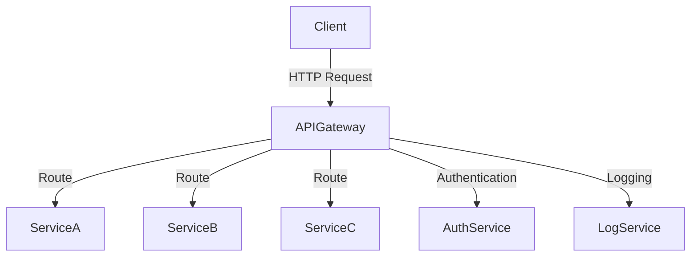

## 17.5 API Gateway Pattern

### Introduction

In the realm of microservices architecture, the **API Gateway Pattern** emerges as a pivotal design pattern that addresses the complexities of managing multiple microservices. This pattern serves as a single entry point for all client requests, effectively handling cross-cutting concerns such as authentication, logging, and rate limiting. By centralizing these functions, the API Gateway simplifies client interactions with the microservices ecosystem, enhancing both security and performance.

### Intent

- **Description**: The API Gateway Pattern aims to provide a unified entry point for microservices, managing cross-cutting concerns and streamlining client interactions.

### Also Known As

- **Alternate Names**: Edge Server, API Proxy

### Motivation

As microservices architectures grow in complexity, managing direct client interactions with numerous services becomes cumbersome. The API Gateway Pattern addresses this by acting as an intermediary, simplifying client requests and responses while offloading common concerns from individual services.

### Applicability

- **Guidelines**: Use the API Gateway Pattern when you need to manage multiple microservices, handle cross-cutting concerns centrally, or provide a simplified client interface.

### Structure



- **Caption**: The diagram illustrates the API Gateway Pattern, where the API Gateway routes client requests to various microservices and handles cross-cutting concerns.

### Participants

- **API Gateway**: The central component that routes requests, manages security, and handles cross-cutting concerns.
- **Client**: The entity making requests to the API Gateway.
- **Microservices**: The individual services that perform specific business functions.
- **AuthService**: A service responsible for authentication.
- **LogService**: A service that handles logging.

### Collaborations

- **Interactions**: The API Gateway receives client requests, authenticates them via the AuthService, logs the requests using the LogService, and routes them to the appropriate microservices.

### Consequences

- **Analysis**: The API Gateway Pattern simplifies client interactions and centralizes cross-cutting concerns. However, it can become a single point of failure and may introduce latency.

### Implementation

#### Implementation Guidelines

To implement the API Gateway Pattern in Java, consider using frameworks like Spring Cloud Gateway or Netflix Zuul. These tools provide robust features for routing, filtering, and managing requests.

#### Sample Code Snippets

**Using Spring Cloud Gateway**

```java
import org.springframework.boot.SpringApplication;
import org.springframework.boot.autoconfigure.SpringBootApplication;
import org.springframework.cloud.gateway.route.RouteLocator;
import org.springframework.cloud.gateway.route.builder.RouteLocatorBuilder;
import org.springframework.context.annotation.Bean;

@SpringBootApplication
public class ApiGatewayApplication {

    public static void main(String[] args) {
        SpringApplication.run(ApiGatewayApplication.class, args);
    }

    @Bean
    public RouteLocator customRouteLocator(RouteLocatorBuilder builder) {
        return builder.routes()
                .route("serviceA", r -> r.path("/serviceA/**")
                        .uri("http://localhost:8081"))
                .route("serviceB", r -> r.path("/serviceB/**")
                        .uri("http://localhost:8082"))
                .build();
    }
}
```

- **Explanation**: This code sets up a basic API Gateway using Spring Cloud Gateway. It defines routes for `serviceA` and `serviceB`, directing requests to their respective URIs.

**Using Netflix Zuul**

```java
import org.springframework.boot.SpringApplication;
import org.springframework.boot.autoconfigure.SpringBootApplication;
import org.springframework.cloud.netflix.zuul.EnableZuulProxy;

@SpringBootApplication
@EnableZuulProxy
public class ZuulApiGatewayApplication {

    public static void main(String[] args) {
        SpringApplication.run(ZuulApiGatewayApplication.class, args);
    }
}
```

- **Explanation**: This code enables Zuul as an API Gateway. The `@EnableZuulProxy` annotation activates Zuul's routing capabilities.

#### Sample Use Cases

- **Real-world Scenarios**: API Gateways are used in e-commerce platforms to manage requests to various services like inventory, payment, and user management. They are also prevalent in cloud service providers to handle API requests efficiently.

### Related Patterns

- **Connections**: The API Gateway Pattern is often used in conjunction with the [6.6 Singleton Pattern]( "Singleton Pattern") to ensure a single instance of the gateway is used.

### Known Uses

- **Examples in Libraries or Frameworks**: Spring Cloud Gateway and Netflix Zuul are popular implementations of the API Gateway Pattern.

### Practical Applications

#### Request Routing

API Gateways excel at routing requests to the appropriate microservices based on the request path or headers. This capability allows for flexible and dynamic request handling, essential in a microservices architecture.

#### Protocol Translation

API Gateways can translate between different protocols, such as HTTP and WebSocket, enabling seamless communication between clients and services that may use different protocols.

#### Load Balancing

By distributing incoming requests across multiple instances of a service, API Gateways can effectively balance load, improving system reliability and performance.

#### Security

Implement security measures such as authentication and authorization at the gateway level to protect your microservices. This centralizes security concerns and reduces the burden on individual services.

#### Implementing Functionality

- **Authentication**: Use OAuth2 or JWT tokens to authenticate requests at the gateway.
- **Throttling**: Implement rate limiting to prevent abuse and ensure fair usage.
- **Logging**: Centralize logging at the gateway to monitor and analyze traffic patterns.

### Potential Drawbacks

While the API Gateway Pattern offers numerous benefits, it also introduces potential drawbacks:

- **Single Point of Failure**: The gateway can become a bottleneck or single point of failure if not properly managed.
- **Increased Latency**: Additional processing at the gateway can introduce latency, impacting performance.
- **Complexity**: Implementing and maintaining an API Gateway adds complexity to the system architecture.

### Best Practices

- **Redundancy**: Deploy multiple instances of the API Gateway to avoid a single point of failure.
- **Caching**: Use caching mechanisms to reduce latency and improve response times.
- **Monitoring**: Implement robust monitoring and alerting to detect and address issues promptly.

### Conclusion

The API Gateway Pattern is a powerful tool in the microservices architect's toolkit. By centralizing cross-cutting concerns and providing a unified entry point, it simplifies client interactions and enhances system security and performance. However, careful consideration of potential drawbacks and adherence to best practices are essential to maximize its benefits.

For further reading on Spring Cloud Gateway, visit the [Spring Cloud Gateway](https://spring.io/projects/spring-cloud-gateway) official documentation.

## Test Your Knowledge: API Gateway Pattern in Java Quiz



### What is the primary role of an API Gateway in a microservices architecture?

- [x] To provide a single entry point for client requests
- [ ] To store data for microservices
- [ ] To compile Java code
- [ ] To replace microservices

> **Explanation:** The API Gateway acts as a single entry point for client requests, managing cross-cutting concerns and routing requests to the appropriate microservices.

### Which of the following is a common feature of API Gateways?

- [x] Load balancing
- [ ] Data storage
- [ ] Code compilation
- [ ] User interface design

> **Explanation:** API Gateways often include features like load balancing to distribute incoming requests across multiple service instances.

### What is a potential drawback of using an API Gateway?

- [x] It can become a single point of failure
- [ ] It improves system security
- [ ] It simplifies client interactions
- [ ] It reduces system complexity

> **Explanation:** An API Gateway can become a single point of failure if not properly managed, as all client requests pass through it.

### Which Java framework is commonly used to implement an API Gateway?

- [x] Spring Cloud Gateway
- [ ] Hibernate
- [ ] Apache Kafka
- [ ] JUnit

> **Explanation:** Spring Cloud Gateway is a popular Java framework for implementing API Gateways, providing features like routing and filtering.

### What is the purpose of protocol translation in an API Gateway?

- [x] To enable communication between clients and services using different protocols
- [ ] To store data in different formats
- [ ] To compile code in different languages
- [ ] To design user interfaces

> **Explanation:** Protocol translation allows an API Gateway to enable communication between clients and services that use different protocols, such as HTTP and WebSocket.

### How can an API Gateway enhance security in a microservices architecture?

- [x] By centralizing authentication and authorization
- [ ] By storing sensitive data
- [ ] By compiling secure code
- [ ] By designing secure interfaces

> **Explanation:** An API Gateway can enhance security by centralizing authentication and authorization, reducing the burden on individual services.

### What is a common use case for implementing throttling in an API Gateway?

- [x] To prevent abuse and ensure fair usage
- [ ] To store data efficiently
- [ ] To compile code faster
- [ ] To design user interfaces

> **Explanation:** Throttling is used to prevent abuse and ensure fair usage by limiting the number of requests a client can make in a given time period.

### Which of the following is a benefit of using an API Gateway?

- [x] Simplified client interactions
- [ ] Increased system complexity
- [ ] Reduced system security
- [ ] Slower response times

> **Explanation:** An API Gateway simplifies client interactions by providing a unified entry point and managing cross-cutting concerns.

### What is a best practice for avoiding a single point of failure in an API Gateway?

- [x] Deploy multiple instances of the API Gateway
- [ ] Store data in the API Gateway
- [ ] Compile code in the API Gateway
- [ ] Design user interfaces in the API Gateway

> **Explanation:** Deploying multiple instances of the API Gateway ensures redundancy and avoids a single point of failure.

### True or False: An API Gateway can introduce latency due to additional processing.

- [x] True
- [ ] False

> **Explanation:** An API Gateway can introduce latency due to the additional processing required to handle requests and manage cross-cutting concerns.



---
