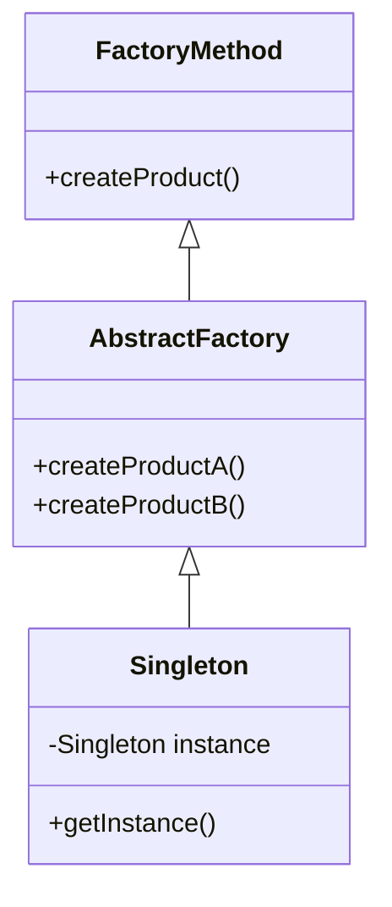

## 17.6 Frequently Asked Questions (FAQ)

Welcome to the Frequently Asked Questions (FAQ) section of our guide, "Design Patterns in Java for Expert Software Engineers." This section aims to address common queries that may arise as you delve into the intricacies of design patterns and their application in Java. Whether you're seeking clarification on fundamental concepts or advanced implementations, this FAQ is designed to provide clear, concise answers and direct you to relevant sections of the guide for further exploration.

### 1. What are design patterns, and why are they important in Java?

Design patterns are proven solutions to common software design problems. They provide a template for how to solve a problem in a way that is both reusable and adaptable. In Java, design patterns help developers create more maintainable, scalable, and efficient code by offering a shared language for discussing solutions and best practices.

### 2. How do design patterns relate to the SOLID principles?

The SOLID principles are a set of guidelines for object-oriented design that help developers create more understandable, flexible, and maintainable software. Design patterns often embody one or more of these principles. For example, the Strategy pattern promotes the Open/Closed Principle by allowing algorithms to be selected at runtime without modifying the client code.

### 3. Can you explain the difference between a Factory Method and an Abstract Factory?

Both Factory Method and Abstract Factory are creational patterns used to create objects. The Factory Method pattern defines an interface for creating an object but lets subclasses alter the type of objects that will be created. In contrast, the Abstract Factory pattern provides an interface for creating families of related or dependent objects without specifying their concrete classes. This allows for the creation of a suite of products that are designed to work together.

### 4. How does the Singleton pattern ensure that a class has only one instance?

The Singleton pattern restricts the instantiation of a class to a single object. This is typically achieved by making the constructor private and providing a static method that returns the instance. In Java, this can be implemented using a static variable to hold the single instance, ensuring that only one instance is created and reused.

```java
public class Singleton {
    private static Singleton instance;

    private Singleton() {
        // private constructor
    }

    public static Singleton getInstance() {
        if (instance == null) {
            instance = new Singleton();
        }
        return instance;
    }
}
```

### 5. What is the role of the Observer pattern in Java applications?

The Observer pattern is used to create a one-to-many dependency between objects, so that when one object changes state, all its dependents are notified and updated automatically. This is particularly useful in event-driven systems, such as GUI applications, where changes in the model need to be reflected in the view.

### 6. How does the Decorator pattern differ from inheritance?

The Decorator pattern allows behavior to be added to individual objects, either statically or dynamically, without affecting the behavior of other objects from the same class. Unlike inheritance, which adds behavior to all instances of a class, the Decorator pattern provides a flexible alternative to subclassing for extending functionality.

### 7. Can you give an example of when to use the Command pattern?

The Command pattern is useful when you need to parameterize objects with operations, delay the execution of a command, or support undoable operations. For instance, in a text editor, each action (like typing a character or deleting text) can be encapsulated as a command, allowing for easy implementation of undo and redo functionality.

### 8. What is the difference between the Adapter and the Facade patterns?

The Adapter pattern allows incompatible interfaces to work together by converting the interface of a class into another interface expected by the client. The Facade pattern, on the other hand, provides a simplified interface to a complex subsystem, making it easier to use. While both patterns involve interfaces, the Adapter focuses on compatibility, whereas the Facade focuses on simplification.

### 9. How can the Strategy pattern improve code flexibility?

The Strategy pattern defines a family of algorithms, encapsulates each one, and makes them interchangeable. This pattern allows the algorithm to vary independently from clients that use it. By using the Strategy pattern, you can change the behavior of a class by changing the algorithm it uses, without altering the class itself.

### 10. What are some common pitfalls when implementing design patterns?

Some common pitfalls include overusing patterns, which can lead to unnecessary complexity, and misapplying patterns, which can result in inefficient or incorrect solutions. It's important to understand the problem you're trying to solve and choose the appropriate pattern that fits the context.

### 11. How do design patterns enhance testability?

Design patterns can enhance testability by promoting loose coupling and separation of concerns. For example, the Dependency Injection pattern allows for easy substitution of dependencies with mocks or stubs during testing, making it easier to isolate and test individual components.

### 12. What is the role of the Proxy pattern in Java?

The Proxy pattern provides a surrogate or placeholder for another object to control access to it. This can be useful for lazy initialization, access control, or logging. In Java, dynamic proxies can be created using the `java.lang.reflect.Proxy` class, which allows for the creation of proxy instances at runtime.

### 13. How does the Builder pattern help in constructing complex objects?

The Builder pattern separates the construction of a complex object from its representation, allowing the same construction process to create different representations. This pattern is particularly useful when an object needs to be created with many optional parameters or when the construction process involves several steps.

### 14. Can you explain the concept of "composition over inheritance"?

"Composition over inheritance" is a design principle that favors the use of composition to achieve code reuse and flexibility over inheritance. By composing objects with other objects that implement desired behavior, you can create complex functionality without the rigidity and tight coupling that often comes with inheritance.

### 15. What are some best practices for applying design patterns?

Some best practices include understanding the problem domain before selecting a pattern, using patterns as a guide rather than a strict rule, and considering the trade-offs of each pattern. It's also important to keep code simple and avoid over-engineering.

### 16. How do design patterns relate to architectural patterns?

Design patterns focus on solving specific design problems within a system, while architectural patterns provide a blueprint for the overall structure of a system. Both types of patterns can be used together to create robust, scalable, and maintainable software.

### 17. What is the significance of the MVC pattern in web development?

The Model-View-Controller (MVC) pattern separates an application into three interconnected components: the model, the view, and the controller. This separation helps manage complex applications by dividing responsibilities, making it easier to manage and scale web applications.

### 18. How can I decide which design pattern to use?

Choosing the right design pattern involves understanding the problem you're trying to solve, the context in which you're working, and the trade-offs of each pattern. Consider factors such as flexibility, scalability, and maintainability, and consult the guide for detailed explanations and examples of each pattern.

### 19. How do design patterns evolve with new Java features?

As Java evolves, new language features can influence how design patterns are implemented. For example, Java 8 introduced lambda expressions and the Streams API, which can simplify the implementation of certain patterns like Strategy and Iterator. It's important to stay updated with the latest Java features and consider how they can enhance your use of design patterns.

### 20. What resources can I use to learn more about design patterns?

In addition to this guide, there are many resources available for learning more about design patterns. Books like "Design Patterns: Elements of Reusable Object-Oriented Software" by the Gang of Four, online courses, and community forums can provide valuable insights and examples. Additionally, exploring open-source projects and studying the design patterns they use can be a practical way to deepen your understanding.

### Try It Yourself

To solidify your understanding of design patterns, try implementing a small project using a combination of patterns. For example, create a simple text editor that uses the Command pattern for undo/redo functionality, the Observer pattern for updating the UI, and the Singleton pattern for managing application settings. Experiment with different patterns and see how they can work together to create a cohesive application.

### Visualizing Design Patterns

To help you better understand the relationships between different design patterns, here's a class diagram that illustrates the interaction between the Factory Method, Abstract Factory, and Singleton patterns.



This diagram shows how the Factory Method pattern can be extended by the Abstract Factory pattern, and how the Singleton pattern can be used to ensure only one instance of a factory is created.

### Knowledge Check

Before moving on, let's review some key concepts:

- **Design patterns** provide reusable solutions to common software design problems.
- **SOLID principles** guide the creation of flexible and maintainable software.
- **Creational patterns** focus on object creation mechanisms.
- **Structural patterns** simplify relationships between entities.
- **Behavioral patterns** manage algorithms and object responsibilities.

### Embrace the Journey

Remember, mastering design patterns is an ongoing journey. As you continue to learn and apply these patterns, you'll develop a deeper understanding of their benefits and trade-offs. Keep experimenting, stay curious, and enjoy the process of becoming a more skilled software engineer.

## Quiz Time!



### What is the primary purpose of design patterns in software development?

- [x] To provide reusable solutions to common design problems
- [ ] To enforce strict coding standards
- [ ] To replace the need for documentation
- [ ] To increase code complexity

> **Explanation:** Design patterns offer reusable solutions to common design problems, making code more maintainable and scalable.

### Which design pattern ensures a class has only one instance?

- [x] Singleton
- [ ] Factory Method
- [ ] Observer
- [ ] Decorator

> **Explanation:** The Singleton pattern restricts a class to a single instance and provides a global access point to it.

### How does the Strategy pattern improve code flexibility?

- [x] By allowing algorithms to be interchangeable
- [ ] By simplifying complex algorithms
- [ ] By enforcing a single algorithm
- [ ] By reducing the number of classes

> **Explanation:** The Strategy pattern encapsulates algorithms, making them interchangeable and allowing behavior to vary independently from clients.

### What is the main difference between the Adapter and Facade patterns?

- [x] Adapter focuses on compatibility, Facade focuses on simplification
- [ ] Adapter simplifies interfaces, Facade adapts interfaces
- [ ] Both patterns serve the same purpose
- [ ] Facade is used for inheritance, Adapter for composition

> **Explanation:** The Adapter pattern makes incompatible interfaces compatible, while the Facade pattern provides a simplified interface to a complex subsystem.

### Which pattern is useful for implementing undo functionality?

- [x] Command
- [ ] Observer
- [ ] Singleton
- [ ] Factory Method

> **Explanation:** The Command pattern encapsulates actions as objects, making it easier to implement undo and redo functionality.

### What does "composition over inheritance" mean?

- [x] Favoring composition for code reuse and flexibility
- [ ] Using inheritance to simplify code
- [ ] Avoiding the use of interfaces
- [ ] Preferring static methods over instance methods

> **Explanation:** "Composition over inheritance" means using composition to achieve code reuse and flexibility, avoiding the tight coupling of inheritance.

### How do design patterns enhance testability?

- [x] By promoting loose coupling and separation of concerns
- [ ] By increasing code complexity
- [ ] By enforcing strict coding standards
- [ ] By reducing the need for testing

> **Explanation:** Design patterns enhance testability by promoting loose coupling and separation of concerns, making it easier to isolate and test components.

### What is the role of the Proxy pattern?

- [x] To control access to another object
- [ ] To simplify complex interfaces
- [ ] To enforce a single instance
- [ ] To encapsulate algorithms

> **Explanation:** The Proxy pattern provides a surrogate or placeholder for another object to control access to it.

### How can the Builder pattern help in constructing complex objects?

- [x] By separating construction from representation
- [ ] By enforcing a single construction process
- [ ] By simplifying object interfaces
- [ ] By reducing the number of classes

> **Explanation:** The Builder pattern separates the construction of a complex object from its representation, allowing for different representations using the same construction process.

### True or False: Design patterns are only applicable to object-oriented programming.

- [x] True
- [ ] False

> **Explanation:** While design patterns are most commonly associated with object-oriented programming, some patterns can be adapted for use in other programming paradigms.




