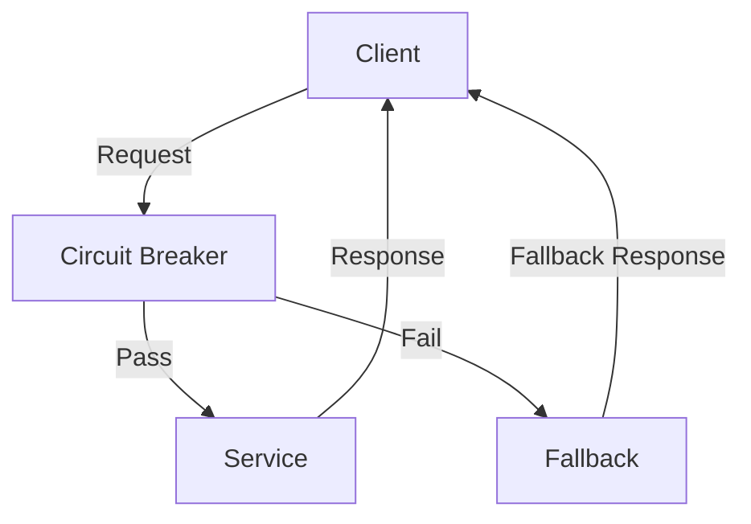

## 17.6 Circuit Breaker Pattern

### Description

The Circuit Breaker Pattern is a critical design pattern in microservices architecture, aimed at enhancing system resilience and preventing cascading failures. It acts as a safeguard, allowing systems to gracefully handle faults and maintain functionality even when some services are experiencing issues. This section delves into the intricacies of the Circuit Breaker Pattern, its implementation using Resilience4j, and its integration with Java microservices.

### Intent

- **Description**: The Circuit Breaker Pattern is designed to detect failures and encapsulate the logic of preventing a failure from constantly recurring during maintenance, temporary external system failure, or unexpected system difficulties.

### Also Known As

- **Alternate Names**: None

### Motivation

In a distributed system, services often depend on other services. If a service fails, it can cause a ripple effect, leading to system-wide failures. The Circuit Breaker Pattern helps mitigate this risk by monitoring the interactions between services and cutting off requests to a failing service, allowing it time to recover.

### Applicability

- **Guidelines**: Use the Circuit Breaker Pattern when:
  - You have a distributed system with multiple interdependent services.
  - You need to prevent cascading failures due to service unavailability.
  - You want to provide fallback mechanisms to maintain system functionality.

### Structure



- **Caption**: The diagram illustrates the flow of requests through a Circuit Breaker, showing how requests are routed to a service or a fallback mechanism based on the circuit's state.

### Participants

- **Client**: Initiates requests to the service.
- **Circuit Breaker**: Monitors requests and responses, deciding whether to allow requests to pass or to invoke a fallback.
- **Service**: The target service that processes requests.
- **Fallback**: An alternative mechanism that provides a response when the service is unavailable.

### Collaborations

- **Interactions**: The client sends a request to the service through the Circuit Breaker. If the service is healthy, the request is processed normally. If the service is failing, the Circuit Breaker invokes a fallback mechanism.

### Consequences

- **Analysis**: The Circuit Breaker Pattern improves system resilience by preventing cascading failures and providing fallback options. However, it introduces complexity in managing circuit states and requires careful configuration to balance between failure detection and recovery.

### Implementation

#### Implementation Guidelines

To implement the Circuit Breaker Pattern in Java, you can use the Resilience4j library, which provides a robust framework for fault tolerance.

#### Sample Code Snippets

```java
import io.github.resilience4j.circuitbreaker.CircuitBreaker;
import io.github.resilience4j.circuitbreaker.CircuitBreakerConfig;
import io.github.resilience4j.circuitbreaker.CircuitBreakerRegistry;
import io.github.resilience4j.circuitbreaker.event.CircuitBreakerEvent;
import io.github.resilience4j.circuitbreaker.event.CircuitBreakerOnErrorEvent;

import java.time.Duration;
import java.util.function.Supplier;

public class CircuitBreakerExample {

    public static void main(String[] args) {
        // Create a custom configuration for a CircuitBreaker
        CircuitBreakerConfig config = CircuitBreakerConfig.custom()
                .failureRateThreshold(50) // Percentage of failures to open the circuit
                .waitDurationInOpenState(Duration.ofSeconds(30)) // Time to wait before transitioning to half-open
                .ringBufferSizeInClosedState(5) // Number of calls to record in closed state
                .ringBufferSizeInHalfOpenState(3) // Number of calls to record in half-open state
                .build();

        // Create a CircuitBreakerRegistry with a custom global configuration
        CircuitBreakerRegistry registry = CircuitBreakerRegistry.of(config);

        // Get or create a CircuitBreaker from the registry
        CircuitBreaker circuitBreaker = registry.circuitBreaker("myCircuitBreaker");

        // Decorate your call to the service with a CircuitBreaker
        Supplier<String> decoratedSupplier = CircuitBreaker
                .decorateSupplier(circuitBreaker, CircuitBreakerExample::callService);

        // Execute the decorated supplier and handle fallback
        String result = circuitBreaker.executeSupplier(() -> {
            try {
                return decoratedSupplier.get();
            } catch (Exception e) {
                return fallback();
            }
        });

        System.out.println(result);
    }

    private static String callService() {
        // Simulate a service call
        throw new RuntimeException("Service not available");
    }

    private static String fallback() {
        // Fallback logic
        return "Fallback response";
    }
}
```

- **Explanation**: This example demonstrates a basic implementation of the Circuit Breaker Pattern using Resilience4j. The circuit breaker is configured with thresholds for failure rate and wait duration. The service call is decorated with the circuit breaker, and a fallback mechanism is provided.

#### Configuration Options

- **Failure Thresholds**: Set the percentage of failures that will trigger the circuit to open.
- **Open/Half-Open States**: Define the behavior when the circuit is open and the conditions for transitioning to half-open.
- **Reset Periods**: Specify the duration the circuit remains open before attempting to reset.

#### Sample Use Cases

- **Real-world Scenarios**: The Circuit Breaker Pattern is commonly used in e-commerce platforms to handle service outages gracefully, ensuring that user-facing applications remain responsive even when backend services are down.

### Related Patterns

- **Connections**: The Circuit Breaker Pattern is often used in conjunction with the [Retry Pattern]( "Retry Pattern") to enhance fault tolerance.

### Known Uses

- **Examples in Libraries or Frameworks**: Resilience4j is a popular library that implements the Circuit Breaker Pattern, widely used in Java microservices.

### Monitoring and Metrics Collection

To effectively manage circuit breakers, it's crucial to monitor their state and collect metrics. Resilience4j provides built-in support for monitoring circuit breaker events, which can be integrated with monitoring tools like Prometheus or Grafana.

```java
circuitBreaker.getEventPublisher()
    .onError(event -> System.out.println("CircuitBreaker error: " + event))
    .onStateTransition(event -> System.out.println("State transition: " + event.getStateTransition()));
```

- **Explanation**: This code snippet demonstrates how to subscribe to circuit breaker events, allowing you to log errors and state transitions for monitoring purposes.

### Expert Tips and Best Practices

- **Tip 1**: Carefully configure the failure thresholds and reset periods to balance between fault tolerance and recovery.
- **Tip 2**: Use circuit breakers in combination with other resilience patterns like retries and timeouts.
- **Tip 3**: Regularly review and adjust circuit breaker configurations based on system performance and failure patterns.

### Common Pitfalls and How to Avoid Them

- **Pitfall 1**: Overly aggressive failure thresholds can lead to frequent circuit openings, impacting system performance. **Solution**: Adjust thresholds based on historical data and testing.
- **Pitfall 2**: Neglecting to implement fallback mechanisms can result in user-facing errors. **Solution**: Always provide a fallback response to maintain user experience.

### Exercises and Practice Problems

1. **Exercise 1**: Modify the sample code to use a different failure threshold and observe the behavior.
2. **Exercise 2**: Implement a circuit breaker for a real-world service in your application and monitor its performance.

### Summary

The Circuit Breaker Pattern is a vital tool in building resilient microservices. By understanding its implementation and configuration, developers can enhance system reliability and prevent cascading failures. Integrating circuit breakers with monitoring tools further strengthens the ability to manage and optimize system performance.

## Test Your Knowledge: Circuit Breaker Pattern in Java Microservices



### What is the primary purpose of the Circuit Breaker Pattern?

- [x] To prevent cascading failures in distributed systems.
- [ ] To improve database performance.
- [ ] To enhance user interface responsiveness.
- [ ] To optimize memory usage.

> **Explanation:** The Circuit Breaker Pattern is designed to prevent cascading failures by monitoring service interactions and cutting off requests to failing services.

### Which library is commonly used in Java for implementing the Circuit Breaker Pattern?

- [x] Resilience4j
- [ ] Spring Boot
- [ ] Hibernate
- [ ] Apache Commons

> **Explanation:** Resilience4j is a popular library for implementing the Circuit Breaker Pattern in Java applications.

### What does the Circuit Breaker do when it detects a failure?

- [x] Opens the circuit to prevent further requests.
- [ ] Closes the circuit to allow more requests.
- [ ] Increases the request rate.
- [ ] Decreases the response time.

> **Explanation:** When a failure is detected, the Circuit Breaker opens the circuit to prevent further requests to the failing service.

### What is a fallback mechanism in the context of the Circuit Breaker Pattern?

- [x] An alternative response provided when the service is unavailable.
- [ ] A method to increase service capacity.
- [ ] A tool for logging errors.
- [ ] A way to cache responses.

> **Explanation:** A fallback mechanism provides an alternative response to maintain functionality when the primary service is unavailable.

### How can you monitor circuit breaker events in Resilience4j?

- [x] By subscribing to the event publisher.
- [ ] By using a database query.
- [ ] By checking the system logs.
- [ ] By analyzing user feedback.

> **Explanation:** Resilience4j allows you to subscribe to circuit breaker events through its event publisher for monitoring purposes.

### What is the role of the half-open state in a circuit breaker?

- [x] To test if the service has recovered.
- [ ] To permanently block requests.
- [ ] To reset the service.
- [ ] To log errors.

> **Explanation:** The half-open state allows a limited number of requests to test if the service has recovered before fully closing the circuit.

### Which of the following is a configuration option for a circuit breaker?

- [x] Failure rate threshold
- [ ] Database connection pool size
- [ ] User interface theme
- [ ] File system path

> **Explanation:** The failure rate threshold is a key configuration option that determines when the circuit should open.

### What is the consequence of not implementing a fallback mechanism?

- [x] User-facing errors may occur.
- [ ] Improved system performance.
- [ ] Reduced memory usage.
- [ ] Faster response times.

> **Explanation:** Without a fallback mechanism, user-facing errors may occur when the primary service is unavailable.

### How does the Circuit Breaker Pattern enhance system resilience?

- [x] By preventing cascading failures and providing fallback options.
- [ ] By increasing database throughput.
- [ ] By optimizing network bandwidth.
- [ ] By reducing code complexity.

> **Explanation:** The Circuit Breaker Pattern enhances system resilience by preventing cascading failures and providing fallback options to maintain functionality.

### True or False: The Circuit Breaker Pattern is only applicable to monolithic applications.

- [ ] True
- [x] False

> **Explanation:** The Circuit Breaker Pattern is particularly useful in distributed systems, such as microservices architectures, to manage service dependencies and prevent cascading failures.


