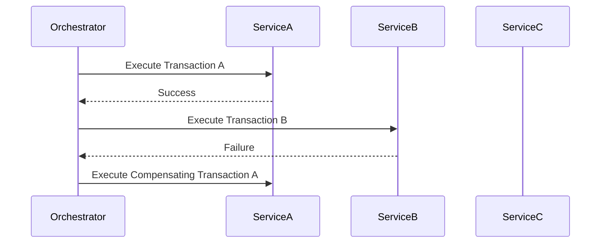
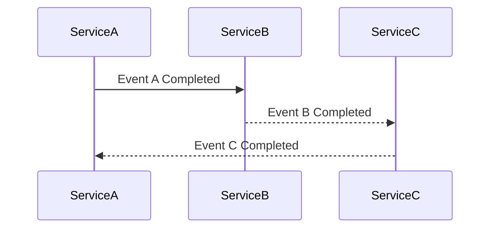

## 17.8 Saga Pattern for Distributed Transactions

### Introduction

In the realm of microservices architecture, managing transactions that span multiple services presents unique challenges. Traditional ACID (Atomicity, Consistency, Isolation, Durability) transactions are not feasible in distributed systems due to the lack of a centralized database. This is where the **Saga Pattern** comes into play, offering a solution to maintain data consistency across distributed services through a series of coordinated transactions.

### Challenges of Transactions in Distributed Systems

Distributed systems inherently involve multiple independent services, each with its own database. This decentralization leads to several challenges:

- **Data Consistency**: Ensuring that all services reflect the same state after a transaction.
- **Failure Handling**: Managing partial failures where some services succeed while others fail.
- **Latency and Performance**: Coordinating transactions across services can introduce latency.
- **Scalability**: Maintaining performance as the number of services increases.

### What is the Saga Pattern?

The Saga Pattern addresses these challenges by breaking down a distributed transaction into a series of smaller, manageable transactions, each with its own compensating transaction. If a step in the saga fails, the compensating transactions are executed to undo the changes made by the preceding steps, thus maintaining consistency.

#### How It Works

A saga is a sequence of transactions that can be either:

- **Orchestration-based**: A central coordinator manages the saga's execution.
- **Choreography-based**: Each service involved in the saga listens for events and decides when to act.

### Orchestration-Based Saga

In an orchestration-based saga, a central orchestrator dictates the flow of the saga. This approach provides a clear and centralized control mechanism but can become a single point of failure.



**Diagram Explanation**: The orchestrator manages the sequence of transactions. If a failure occurs, it triggers compensating transactions to revert changes.

### Choreography-Based Saga

In a choreography-based saga, there is no central orchestrator. Instead, each service publishes and listens to events, deciding its actions based on the events it receives.



**Diagram Explanation**: Each service acts independently, reacting to events and executing its part of the saga.

### Implementing the Saga Pattern in Java

#### Using Apache Camel

Apache Camel is a versatile integration framework that supports the implementation of sagas. It provides a DSL (Domain Specific Language) for defining routes and managing transactions.

```java
import org.apache.camel.builder.RouteBuilder;
import org.apache.camel.model.SagaPropagation;

public class SagaRoute extends RouteBuilder {
    @Override
    public void configure() throws Exception {
        saga()
            .propagation(SagaPropagation.REQUIRED)
            .completion("direct:completion")
            .compensation("direct:compensation");

        from("direct:start")
            .saga()
            .to("bean:serviceA")
            .to("bean:serviceB")
            .to("bean:serviceC");

        from("direct:completion")
            .log("Saga completed successfully");

        from("direct:compensation")
            .log("Compensating transaction executed");
    }
}
```

**Code Explanation**: This example demonstrates a saga using Apache Camel. The `saga()` method defines the saga's propagation, completion, and compensation routes.

#### Considerations for Idempotency and Failure Handling

- **Idempotency**: Ensure that operations can be repeated without adverse effects. This is crucial for compensating transactions.
- **Failure Handling**: Implement robust error handling to manage partial failures and retries.

### Drawbacks of the Saga Pattern

While the Saga Pattern offers a solution for distributed transactions, it introduces complexity:

- **Increased Complexity**: Managing compensating transactions and ensuring idempotency can complicate the system.
- **Potential for Inconsistent States**: During failure scenarios, there might be temporary inconsistencies until compensations are completed.

### Sample Use Cases

- **E-commerce Order Management**: Managing orders across inventory, payment, and shipping services.
- **Travel Booking Systems**: Coordinating bookings across flights, hotels, and car rentals.

### Related Patterns

- **[Event Sourcing]( "Event Sourcing")**: Complements the Saga Pattern by providing a mechanism to reconstruct the state of a system from a sequence of events.
- **[CQRS]( "CQRS")**: Often used alongside sagas to separate read and write operations.

### Known Uses

- **Netflix**: Utilizes the Saga Pattern for managing distributed transactions across its microservices.
- **Amazon**: Implements sagas for order processing and fulfillment.

### Conclusion

The Saga Pattern is a powerful tool for managing distributed transactions in microservices architectures. By breaking down transactions into smaller, manageable units and using compensating transactions, it ensures data consistency and reliability. However, it requires careful consideration of complexity, idempotency, and failure handling.

### Key Takeaways

- The Saga Pattern is essential for managing distributed transactions in microservices.
- It offers two main implementations: orchestration-based and choreography-based.
- Apache Camel and similar frameworks provide support for implementing sagas.
- Considerations for idempotency and failure handling are crucial for successful implementation.

### Reflection

Consider how the Saga Pattern can be applied to your projects. What challenges might you face, and how can you address them using the concepts discussed?

## Test Your Knowledge: Saga Pattern for Distributed Transactions Quiz



### What is the primary challenge of transactions in distributed systems?

- [x] Ensuring data consistency across multiple services
- [ ] Managing a single database
- [ ] Handling user authentication
- [ ] Implementing user interfaces

> **Explanation:** Distributed systems involve multiple services, each with its own database, making data consistency a primary challenge.

### How does the Saga Pattern maintain data consistency?

- [x] By using a series of compensating transactions
- [ ] By locking all resources
- [ ] By using a single database
- [ ] By ignoring failures

> **Explanation:** The Saga Pattern uses compensating transactions to undo changes in case of failures, maintaining data consistency.

### What is a key difference between orchestration-based and choreography-based sagas?

- [x] Orchestration uses a central coordinator, while choreography relies on event-driven actions.
- [ ] Orchestration is faster than choreography.
- [ ] Choreography uses a central coordinator, while orchestration relies on event-driven actions.
- [ ] Choreography is more reliable than orchestration.

> **Explanation:** Orchestration-based sagas use a central coordinator, whereas choreography-based sagas rely on services reacting to events.

### Which tool can be used to implement the Saga Pattern in Java?

- [x] Apache Camel
- [ ] Spring Boot
- [ ] Hibernate
- [ ] JUnit

> **Explanation:** Apache Camel is a framework that supports the implementation of the Saga Pattern in Java.

### What is a potential drawback of the Saga Pattern?

- [x] Increased complexity and potential for inconsistent states
- [ ] Reduced scalability
- [ ] Inability to handle failures
- [ ] Lack of support for microservices

> **Explanation:** The Saga Pattern can increase complexity and may lead to temporary inconsistent states during failure scenarios.

### Why is idempotency important in the Saga Pattern?

- [x] To ensure operations can be repeated without adverse effects
- [ ] To improve performance
- [ ] To reduce latency
- [ ] To simplify code

> **Explanation:** Idempotency ensures that operations can be safely repeated, which is crucial for compensating transactions in the Saga Pattern.

### What is a common use case for the Saga Pattern?

- [x] E-commerce order management
- [ ] User authentication
- [ ] Data caching
- [ ] Logging

> **Explanation:** The Saga Pattern is commonly used in e-commerce systems to manage transactions across inventory, payment, and shipping services.

### How does the Saga Pattern handle failures?

- [x] By executing compensating transactions
- [ ] By retrying indefinitely
- [ ] By ignoring them
- [ ] By logging them

> **Explanation:** The Saga Pattern handles failures by executing compensating transactions to revert changes.

### Which of the following is a related pattern to the Saga Pattern?

- [x] Event Sourcing
- [ ] Singleton
- [ ] Factory
- [ ] Observer

> **Explanation:** Event Sourcing is a related pattern that complements the Saga Pattern by providing a mechanism to reconstruct the state of a system from events.

### True or False: The Saga Pattern can be used to manage transactions in a single monolithic application.

- [ ] True
- [x] False

> **Explanation:** The Saga Pattern is designed for distributed systems, not for managing transactions within a single monolithic application.



By mastering the Saga Pattern, Java developers and software architects can effectively manage distributed transactions, ensuring data consistency and reliability in complex microservices architectures.
