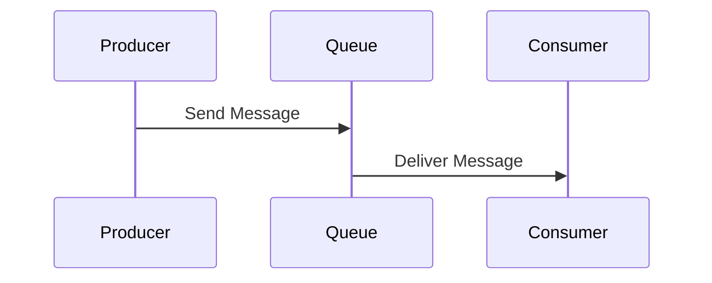
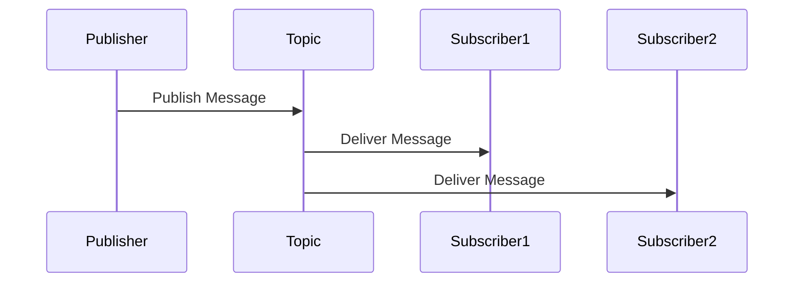

## 18.4 Message Brokers and Queues

In the realm of modern software architecture, integrating Java applications with message brokers and queues is pivotal for enabling asynchronous communication and decoupling between systems. This section delves into the intricacies of message brokers, such as RabbitMQ, Apache Kafka, and ActiveMQ, and explores how they facilitate robust, scalable, and reliable communication in distributed systems.

### Introduction to Message Brokers

Message brokers are middleware solutions that enable different systems to communicate with each other by sending and receiving messages. They act as intermediaries that manage message transmission, ensuring that messages are delivered reliably and efficiently. Some of the most popular message brokers include:

- **RabbitMQ**: Known for its ease of use and support for multiple messaging protocols, RabbitMQ is a robust message broker that facilitates complex routing and reliable message delivery.
- **Apache Kafka**: Designed for high-throughput and fault-tolerant messaging, Kafka is ideal for real-time data streaming and processing.
- **ActiveMQ**: A versatile and widely-used message broker that supports a variety of messaging patterns and protocols.

### Producing and Consuming Messages with JMS

Java Message Service (JMS) is a Java API that provides a standard way to create, send, receive, and read messages. It is a key component in integrating Java applications with message brokers. Below is an example of how to produce and consume messages using JMS.

#### Producing Messages

```java
import javax.jms.Connection;
import javax.jms.ConnectionFactory;
import javax.jms.Destination;
import javax.jms.JMSException;
import javax.jms.MessageProducer;
import javax.jms.Session;
import javax.jms.TextMessage;
import org.apache.activemq.ActiveMQConnectionFactory;

public class MessageProducerExample {
    public static void main(String[] args) throws JMSException {
        // Create a ConnectionFactory
        ConnectionFactory connectionFactory = new ActiveMQConnectionFactory("tcp://localhost:61616");

        // Create a Connection
        Connection connection = connectionFactory.createConnection();
        connection.start();

        // Create a Session
        Session session = connection.createSession(false, Session.AUTO_ACKNOWLEDGE);

        // Create a Destination (Topic or Queue)
        Destination destination = session.createQueue("exampleQueue");

        // Create a MessageProducer from the Session to the Queue
        MessageProducer producer = session.createProducer(destination);

        // Create a message
        TextMessage message = session.createTextMessage("Hello, JMS!");

        // Send the message
        producer.send(message);

        System.out.println("Sent message: " + message.getText());

        // Clean up
        session.close();
        connection.close();
    }
}
```

#### Consuming Messages

```java
import javax.jms.Connection;
import javax.jms.ConnectionFactory;
import javax.jms.Destination;
import javax.jms.JMSException;
import javax.jms.Message;
import javax.jms.MessageConsumer;
import javax.jms.Session;
import javax.jms.TextMessage;
import org.apache.activemq.ActiveMQConnectionFactory;

public class MessageConsumerExample {
    public static void main(String[] args) throws JMSException {
        // Create a ConnectionFactory
        ConnectionFactory connectionFactory = new ActiveMQConnectionFactory("tcp://localhost:61616");

        // Create a Connection
        Connection connection = connectionFactory.createConnection();
        connection.start();

        // Create a Session
        Session session = connection.createSession(false, Session.AUTO_ACKNOWLEDGE);

        // Create a Destination (Topic or Queue)
        Destination destination = session.createQueue("exampleQueue");

        // Create a MessageConsumer from the Session to the Queue
        MessageConsumer consumer = session.createConsumer(destination);

        // Wait for a message
        Message message = consumer.receive(1000);

        if (message instanceof TextMessage) {
            TextMessage textMessage = (TextMessage) message;
            System.out.println("Received message: " + textMessage.getText());
        } else {
            System.out.println("Received: " + message);
        }

        // Clean up
        consumer.close();
        session.close();
        connection.close();
    }
}
```

### Benefits of Messaging Systems

Messaging systems offer numerous benefits that enhance the scalability and reliability of applications:

- **Asynchronous Communication**: Decouples the sender and receiver, allowing them to operate independently and improving system responsiveness.
- **Scalability**: Facilitates horizontal scaling by distributing messages across multiple consumers.
- **Reliability**: Ensures message delivery through mechanisms like acknowledgments, retries, and dead-letter queues.
- **Decoupling**: Reduces dependencies between systems, making them easier to maintain and evolve.

### Messaging Patterns

Understanding different messaging patterns is crucial for designing effective communication strategies in distributed systems.

#### Point-to-Point

In the point-to-point pattern, messages are sent to a specific queue, and a single consumer processes each message. This pattern is suitable for tasks that require exclusive processing.



#### Publish-Subscribe

In the publish-subscribe pattern, messages are published to a topic, and multiple subscribers can receive the same message. This pattern is ideal for broadcasting events to multiple consumers.



### Best Practices for Messaging Systems

Implementing best practices ensures that messaging systems are robust and efficient:

- **Message Durability**: Persist messages to prevent data loss in case of broker failure.
- **Ordering**: Maintain message order when necessary, using features like Kafka's partitioning.
- **Idempotency**: Design consumers to handle duplicate messages gracefully, ensuring operations are idempotent.
- **Monitoring and Management**: Use tools like Prometheus and Grafana to monitor message brokers and manage performance and health.

### Considerations for Monitoring and Managing Message Brokers

Effective monitoring and management are essential for maintaining the health and performance of message brokers:

- **Metrics Collection**: Gather metrics on message throughput, latency, and error rates.
- **Alerting**: Set up alerts for critical issues like broker downtime or message backlog.
- **Capacity Planning**: Regularly assess and adjust resources to handle peak loads.
- **Security**: Implement authentication and encryption to protect message data.

### Conclusion

Integrating Java applications with message brokers and queues is a powerful strategy for building scalable, reliable, and decoupled systems. By leveraging the capabilities of RabbitMQ, Apache Kafka, and ActiveMQ, developers can design robust communication architectures that meet the demands of modern software applications.

### References and Further Reading

- [Java Message Service (JMS) Documentation](https://docs.oracle.com/javaee/7/tutorial/jms-intro.htm)
- [RabbitMQ Official Documentation](https://www.rabbitmq.com/documentation.html)
- [Apache Kafka Documentation](https://kafka.apache.org/documentation/)
- [ActiveMQ Documentation](https://activemq.apache.org/documentation)

## Test Your Knowledge: Java Message Brokers and Queues Quiz



### What is the primary role of a message broker in a distributed system?

- [x] To facilitate communication between different systems by managing message transmission.
- [ ] To store data persistently for long-term access.
- [ ] To execute business logic and process transactions.
- [ ] To provide a user interface for application interaction.

> **Explanation:** A message broker acts as an intermediary that manages the transmission of messages between different systems, ensuring reliable and efficient communication.

### Which of the following is a key benefit of using messaging systems?

- [x] Asynchronous communication
- [ ] Synchronous processing
- [ ] Direct database access
- [ ] User authentication

> **Explanation:** Messaging systems enable asynchronous communication, allowing systems to operate independently and improving responsiveness.

### In the point-to-point messaging pattern, how many consumers can process each message?

- [x] One
- [ ] Two
- [ ] Multiple
- [ ] None

> **Explanation:** In the point-to-point pattern, each message is processed by a single consumer, ensuring exclusive processing.

### What is the primary advantage of the publish-subscribe messaging pattern?

- [x] It allows multiple subscribers to receive the same message.
- [ ] It ensures messages are processed in order.
- [ ] It provides direct communication between two systems.
- [ ] It reduces message size.

> **Explanation:** The publish-subscribe pattern allows messages to be broadcast to multiple subscribers, making it ideal for event broadcasting.

### Which of the following practices helps ensure message durability?

- [x] Persisting messages to disk
- [ ] Using in-memory storage
- [x] Implementing message acknowledgments
- [ ] Disabling retries

> **Explanation:** Persisting messages to disk and using acknowledgments help ensure message durability by preventing data loss.

### What is a common tool used for monitoring message brokers?

- [x] Prometheus
- [ ] Eclipse
- [ ] IntelliJ IDEA
- [ ] Jenkins

> **Explanation:** Prometheus is a popular tool for monitoring systems, including message brokers, by collecting and analyzing metrics.

### Why is idempotency important in message consumption?

- [x] To handle duplicate messages gracefully
- [ ] To increase message throughput
- [x] To ensure operations are performed only once
- [ ] To reduce message size

> **Explanation:** Idempotency ensures that operations are performed only once, even if a message is processed multiple times, preventing unintended side effects.

### What is a key consideration for maintaining message order?

- [x] Using partitioning in Kafka
- [ ] Disabling message persistence
- [ ] Increasing message size
- [ ] Reducing consumer count

> **Explanation:** Using partitioning in Kafka helps maintain message order by ensuring messages are processed in the sequence they were produced.

### Which message broker is known for high-throughput and fault-tolerant messaging?

- [x] Apache Kafka
- [ ] RabbitMQ
- [ ] ActiveMQ
- [ ] ZeroMQ

> **Explanation:** Apache Kafka is designed for high-throughput and fault-tolerant messaging, making it suitable for real-time data streaming.

### True or False: Message brokers can only be used for asynchronous communication.

- [x] True
- [ ] False

> **Explanation:** Message brokers are primarily used for asynchronous communication, allowing systems to operate independently and improving responsiveness.


