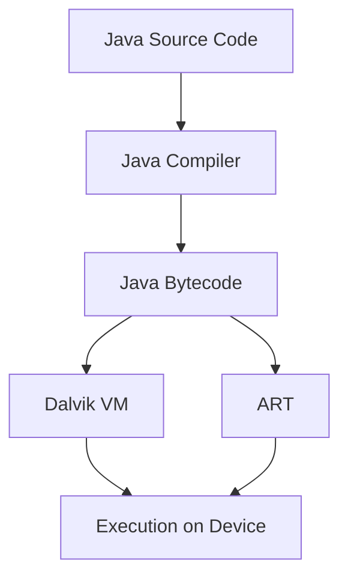

## 19.1 Java in Android Development

### Introduction to the Android Platform

Android, an open-source operating system developed by Google, has become the dominant platform for mobile devices worldwide. Its flexibility, extensive ecosystem, and robust support for a wide range of hardware make it a preferred choice for developers and manufacturers alike. At the heart of Android development is Java, a versatile and widely-used programming language that has played a crucial role in shaping the Android landscape.

### The Role of Java in Android Development

Java has been the primary programming language for Android development since the platform's inception. Its object-oriented nature, platform independence, and extensive libraries make it an ideal choice for building complex mobile applications. Java's syntax and semantics are familiar to many developers, which has contributed to the rapid growth and adoption of Android.

### Historical Context: Java and Android

#### The Java Virtual Machine (JVM) and Android

Java applications typically run on the Java Virtual Machine (JVM), which provides a runtime environment for executing Java bytecode. However, Android does not use the standard JVM. Instead, it initially employed the Dalvik Virtual Machine, a custom virtual machine designed to optimize performance on mobile devices with limited resources.

#### Dalvik and ART Runtimes

Dalvik was specifically tailored for Android, using a register-based architecture rather than the stack-based architecture of the JVM. This design choice improved memory efficiency and execution speed on mobile devices. With the release of Android 5.0 (Lollipop), Google introduced the Android Runtime (ART) as a replacement for Dalvik. ART brought ahead-of-time (AOT) compilation, which further enhanced performance by compiling bytecode into native machine code during app installation.



*Diagram: The flow of Java code from source to execution in Android, highlighting the transition from Dalvik to ART.*

### Java Versions and Android API Levels

Android development is closely tied to specific API levels, which correspond to different versions of the Android operating system. Each API level introduces new features and capabilities, often aligned with advancements in the Java language itself. However, Android does not always support the latest Java versions immediately, leading to a nuanced relationship between Java versions and Android API levels.

#### Java 7 and Android

For many years, Android development was limited to Java 7 features, even as newer Java versions were released. This limitation was due to the need for compatibility across a wide range of devices and Android versions.

#### Java 8 and Beyond

With the introduction of Android Studio 3.0 and the Jack toolchain, developers gained access to some Java 8 features, such as lambda expressions and method references. Subsequent updates have expanded support for additional Java 8 features and beyond, allowing developers to leverage modern Java capabilities in their Android applications.

### Writing Native Android Applications with Java

Java enables developers to write native Android applications by providing a comprehensive set of APIs and tools. The Android SDK (Software Development Kit) includes libraries for UI design, data storage, networking, and more, all accessible through Java.

#### Basic Android Application Components

An Android application consists of several key components, each serving a specific purpose:

- **Activities**: Represent a single screen with a user interface.
- **Services**: Run in the background to perform long-running operations.
- **Broadcast Receivers**: Respond to system-wide broadcast announcements.
- **Content Providers**: Manage shared app data.

Below is a simple example of an Android `Activity` written in Java:

```java
package com.example.myapp;

import android.os.Bundle;
import android.app.Activity;
import android.widget.TextView;

public class MainActivity extends Activity {
    @Override
    protected void onCreate(Bundle savedInstanceState) {
        super.onCreate(savedInstanceState);
        TextView textView = new TextView(this);
        textView.setText("Hello, Android!");
        setContentView(textView);
    }
}
```

*Explanation*: This code defines a basic `Activity` that displays a "Hello, Android!" message on the screen. The `onCreate` method is overridden to set up the user interface when the activity is created.

### Transition to Kotlin and Java Interoperability

In 2017, Google announced Kotlin as an official language for Android development. Kotlin offers modern language features, improved syntax, and enhanced safety compared to Java. Despite this shift, Java remains a vital part of the Android ecosystem due to its extensive legacy codebase and seamless interoperability with Kotlin.

#### Interoperability with Kotlin

Kotlin is designed to interoperate fully with Java, allowing developers to use both languages within the same project. This interoperability ensures that existing Java code can be incrementally migrated to Kotlin, or that both languages can be used side-by-side.

```kotlin
// Kotlin code calling a Java method
val javaObject = JavaClass()
javaObject.javaMethod()
```

*Explanation*: This Kotlin snippet demonstrates calling a method from a Java class, highlighting the seamless integration between the two languages.

### Importance of Java in Android Development

Despite the rise of Kotlin, understanding Java remains crucial for several reasons:

- **Legacy Code Maintenance**: Many existing Android applications are written in Java, requiring ongoing maintenance and updates.
- **Interoperability**: Java knowledge is essential for working with mixed-language projects and leveraging existing Java libraries.
- **Comprehensive Resources**: Java's extensive documentation and community support provide valuable resources for Android developers.

### Conclusion

Java has been instrumental in the development and success of the Android platform. Its robust features, extensive libraries, and compatibility with Android's architecture have made it a cornerstone of mobile development. As the Android ecosystem evolves, Java continues to play a critical role, complemented by Kotlin's modern capabilities. Understanding Java is essential for maintaining legacy applications, ensuring interoperability, and leveraging the full potential of Android development.

### Key Takeaways

- Java has been the primary language for Android development since the platform's inception.
- Android uses the Dalvik and ART runtimes instead of the standard JVM.
- The relationship between Java versions and Android API levels is complex but evolving.
- Java enables developers to write native Android applications using the Android SDK.
- Kotlin is now an official language for Android, but Java remains crucial for legacy code and interoperability.

### Encouragement for Further Exploration

Consider how you might apply Java and Kotlin together in your Android projects. Experiment with converting Java code to Kotlin and observe the differences in syntax and functionality. Reflect on how understanding both languages can enhance your ability to maintain and develop Android applications.

## Test Your Knowledge: Java in Android Development Quiz



### What is the primary runtime used in Android to execute Java bytecode?

- [ ] Java Virtual Machine (JVM)
- [x] Android Runtime (ART)
- [ ] HotSpot
- [ ] OpenJDK

> **Explanation:** Android uses the Android Runtime (ART) to execute Java bytecode, replacing the earlier Dalvik VM.

### Which Android component is responsible for managing shared app data?

- [ ] Activity
- [ ] Service
- [ ] Broadcast Receiver
- [x] Content Provider

> **Explanation:** Content Providers manage shared app data and provide a mechanism for data sharing between applications.

### What feature of Java 8 was first supported in Android development?

- [x] Lambda expressions
- [ ] Modules
- [ ] Records
- [ ] Pattern Matching

> **Explanation:** Android Studio 3.0 introduced support for Java 8 features like lambda expressions and method references.

### How does Kotlin ensure compatibility with existing Java code?

- [x] Full interoperability
- [ ] Code translation
- [ ] Separate runtime
- [ ] Java emulation

> **Explanation:** Kotlin is fully interoperable with Java, allowing both languages to be used within the same project seamlessly.

### Why is understanding Java important for Android developers?

- [x] Legacy code maintenance
- [ ] Exclusive use in new projects
- [x] Interoperability with Kotlin
- [ ] Required for all Android APIs

> **Explanation:** Java is crucial for maintaining legacy code and ensuring interoperability with Kotlin in Android projects.

### What was the primary reason for transitioning from Dalvik to ART?

- [x] Improved performance
- [ ] Better UI design
- [ ] Enhanced security
- [ ] Reduced app size

> **Explanation:** ART introduced ahead-of-time (AOT) compilation, improving performance by compiling bytecode into native machine code.

### Which language feature is NOT supported by Android's Java implementation?

- [ ] Lambda expressions
- [x] Modules
- [ ] Method references
- [ ] Streams API

> **Explanation:** Android's Java implementation does not support Java modules, which were introduced in Java 9.

### What is the main advantage of using Kotlin for Android development?

- [x] Modern language features
- [ ] Larger community
- [ ] Faster compilation
- [ ] Exclusive Android support

> **Explanation:** Kotlin offers modern language features, improved syntax, and enhanced safety, making it a popular choice for Android development.

### How do Android API levels relate to Java versions?

- [x] They determine the Java features available
- [ ] They dictate the Java syntax
- [ ] They control Java's memory usage
- [ ] They manage Java's security settings

> **Explanation:** Android API levels determine the Java features available to developers, impacting the language capabilities in Android development.

### True or False: Java is no longer relevant in Android development due to Kotlin's rise.

- [ ] True
- [x] False

> **Explanation:** Java remains relevant in Android development for maintaining legacy applications and ensuring interoperability with Kotlin.


