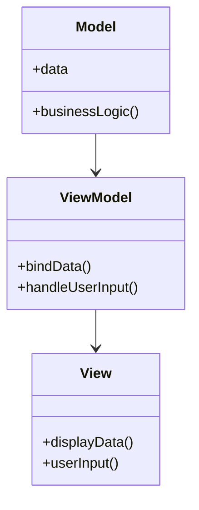
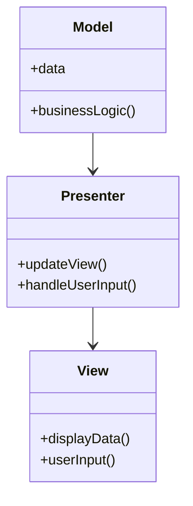
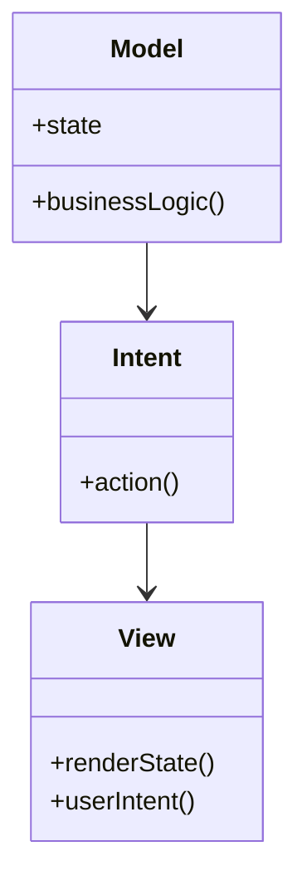

## 19.2 Modern Android Development Practices

Modern Android Development (MAD) is a set of tools, APIs, and best practices recommended by Google to help developers build high-quality Android applications efficiently. As Android continues to evolve, so do the methodologies and technologies used to develop applications. This section explores the contemporary practices in Android development, focusing on architecture patterns, modern libraries, and tools that enhance productivity and application quality.

### Introduction to Modern Android Development (MAD)

Modern Android Development is a comprehensive approach that emphasizes the use of modern tools, libraries, and architectural patterns to create robust, maintainable, and scalable Android applications. It encourages developers to adopt practices that improve code quality, enhance performance, and streamline the development process.

### Architectural Patterns in Android

Architectural patterns play a crucial role in organizing code, improving maintainability, and separating concerns within an application. The most popular architectural patterns in Android development are MVVM (Model-View-ViewModel), MVP (Model-View-Presenter), and MVI (Model-View-Intent).

#### MVVM (Model-View-ViewModel)

**Intent**: MVVM is designed to separate the development of the graphical user interface from the business logic or back-end logic (the data model).

**Structure**:



**Explanation**: The `Model` represents the data and business logic. The `View` is the UI layer that displays data and captures user input. The `ViewModel` acts as a bridge between the Model and View, handling data transformation and user input.

**Sample Code**:

```java
// Model
public class User {
    private String name;
    private String email;
    // Getters and setters
}

// ViewModel
public class UserViewModel extends ViewModel {
    private MutableLiveData<User> userLiveData = new MutableLiveData<>();

    public LiveData<User> getUser() {
        return userLiveData;
    }

    public void fetchUserData() {
        // Simulate fetching data
        User user = new User();
        user.setName("John Doe");
        user.setEmail("john.doe@example.com");
        userLiveData.setValue(user);
    }
}

// View (Activity)
public class UserActivity extends AppCompatActivity {
    private UserViewModel userViewModel;

    @Override
    protected void onCreate(Bundle savedInstanceState) {
        super.onCreate(savedInstanceState);
        setContentView(R.layout.activity_user);

        userViewModel = new ViewModelProvider(this).get(UserViewModel.class);
        userViewModel.getUser().observe(this, user -> {
            // Update UI with user data
        });

        userViewModel.fetchUserData();
    }
}
```

#### MVP (Model-View-Presenter)

**Intent**: MVP aims to separate the presentation layer from the logic, making it easier to test and maintain.

**Structure**:



**Explanation**: The `Model` contains the data and business logic. The `View` is responsible for displaying data and capturing user input. The `Presenter` acts as an intermediary, updating the View with data from the Model and handling user interactions.

**Sample Code**:

```java
// Model
public class User {
    private String name;
    private String email;
    // Getters and setters
}

// View Interface
public interface UserView {
    void showUserData(User user);
}

// Presenter
public class UserPresenter {
    private UserView view;
    private User user;

    public UserPresenter(UserView view) {
        this.view = view;
        this.user = new User();
    }

    public void loadUserData() {
        // Simulate fetching data
        user.setName("Jane Doe");
        user.setEmail("jane.doe@example.com");
        view.showUserData(user);
    }
}

// View (Activity)
public class UserActivity extends AppCompatActivity implements UserView {
    private UserPresenter presenter;

    @Override
    protected void onCreate(Bundle savedInstanceState) {
        super.onCreate(savedInstanceState);
        setContentView(R.layout.activity_user);

        presenter = new UserPresenter(this);
        presenter.loadUserData();
    }

    @Override
    public void showUserData(User user) {
        // Update UI with user data
    }
}
```

#### MVI (Model-View-Intent)

**Intent**: MVI is a reactive architecture pattern that emphasizes unidirectional data flow and state management.

**Structure**:



**Explanation**: The `Model` holds the state and business logic. The `View` renders the state and captures user intents. The `Intent` represents user actions that trigger state changes.

**Sample Code**:

```java
// Model
public class UserState {
    private String name;
    private String email;
    // Getters and setters
}

// Intent
public interface UserIntent {
    void fetchUserData();
}

// View (Activity)
public class UserActivity extends AppCompatActivity implements UserIntent {
    private UserState userState;

    @Override
    protected void onCreate(Bundle savedInstanceState) {
        super.onCreate(savedInstanceState);
        setContentView(R.layout.activity_user);

        // Initialize state
        userState = new UserState();
        fetchUserData();
    }

    @Override
    public void fetchUserData() {
        // Simulate fetching data
        userState.setName("Alice Smith");
        userState.setEmail("alice.smith@example.com");
        renderState(userState);
    }

    private void renderState(UserState state) {
        // Update UI with user state
    }
}
```

### Android Jetpack Components

Android Jetpack is a suite of libraries, tools, and guidance to help developers write high-quality apps more easily. It provides components that work together to make app development faster and more efficient. For more information, visit [Android Jetpack](https://developer.android.com/jetpack).

#### LiveData and ViewModel

**LiveData** is an observable data holder class that is lifecycle-aware, meaning it respects the lifecycle of other app components, such as activities, fragments, or services.

**ViewModel** is a class that is responsible for preparing and managing the data for an Activity or a Fragment. It also handles the communication of the Activity/Fragment with the rest of the application (e.g., calling the business logic classes).

**Sample Code**:

```java
// ViewModel
public class UserViewModel extends ViewModel {
    private MutableLiveData<User> userLiveData = new MutableLiveData<>();

    public LiveData<User> getUser() {
        return userLiveData;
    }

    public void fetchUserData() {
        // Simulate fetching data
        User user = new User();
        user.setName("John Doe");
        user.setEmail("john.doe@example.com");
        userLiveData.setValue(user);
    }
}

// View (Activity)
public class UserActivity extends AppCompatActivity {
    private UserViewModel userViewModel;

    @Override
    protected void onCreate(Bundle savedInstanceState) {
        super.onCreate(savedInstanceState);
        setContentView(R.layout.activity_user);

        userViewModel = new ViewModelProvider(this).get(UserViewModel.class);
        userViewModel.getUser().observe(this, user -> {
            // Update UI with user data
        });

        userViewModel.fetchUserData();
    }
}
```

#### Navigation Component

The Navigation component helps developers implement navigation, from simple button clicks to more complex patterns, such as app bars and navigation drawers.

**Sample Code**:

```xml
<!-- navigation/nav_graph.xml -->
<navigation xmlns:android="http://schemas.android.com/apk/res/android"
    xmlns:app="http://schemas.android.com/apk/res-auto"
    xmlns:tools="http://schemas.android.com/tools"
    app:startDestination="@id/homeFragment">

    <fragment
        android:id="@+id/homeFragment"
        android:name="com.example.HomeFragment"
        tools:layout="@layout/fragment_home" >
        <action
            android:id="@+id/action_homeFragment_to_detailFragment"
            app:destination="@id/detailFragment" />
    </fragment>

    <fragment
        android:id="@+id/detailFragment"
        android:name="com.example.DetailFragment"
        tools:layout="@layout/fragment_detail" />
</navigation>
```

#### Room Persistence Library

Room provides an abstraction layer over SQLite to allow fluent database access while harnessing the full power of SQLite.

**Sample Code**:

```java
// Entity
@Entity
public class User {
    @PrimaryKey
    private int id;
    private String name;
    private String email;
    // Getters and setters
}

// DAO
@Dao
public interface UserDao {
    @Insert
    void insert(User user);

    @Query("SELECT * FROM user WHERE id = :userId")
    User getUserById(int userId);
}

// Database
@Database(entities = {User.class}, version = 1)
public abstract class AppDatabase extends RoomDatabase {
    public abstract UserDao userDao();
}
```

### Reactive Programming with RxJava and Coroutines

Reactive programming is a programming paradigm oriented around data flows and the propagation of change. RxJava and Kotlin Coroutines are popular libraries for implementing reactive programming in Android.

#### RxJava

RxJava is a library for composing asynchronous and event-based programs using observable sequences.

**Sample Code**:

```java
Observable<String> observable = Observable.just("Hello, World!");
observable.subscribe(System.out::println);
```

#### Coroutines

Kotlin Coroutines provide a way to write asynchronous code in a sequential manner.

**Sample Code**:

```kotlin
fun fetchUserData() = GlobalScope.launch {
    val user = getUserFromNetwork()
    updateUI(user)
}
```

### Dependency Injection with Dagger and Hilt

Dependency injection is a technique where an object receives other objects that it depends on. Dagger and Hilt are popular frameworks for implementing dependency injection in Android.

#### Dagger

Dagger is a fully static, compile-time dependency injection framework for Java, Kotlin, and Android.

**Sample Code**:

```java
@Component
public interface AppComponent {
    void inject(MainActivity mainActivity);
}

@Module
public class UserModule {
    @Provides
    User provideUser() {
        return new User("John Doe", "john.doe@example.com");
    }
}
```

#### Hilt

Hilt is a dependency injection library for Android that reduces the boilerplate of doing manual dependency injection in your project.

**Sample Code**:

```java
@HiltAndroidApp
public class MyApplication extends Application {}

@AndroidEntryPoint
public class MainActivity extends AppCompatActivity {
    @Inject
    User user;
}
```

### Best Practices for App Modularization, Testing, and Performance Optimization

#### App Modularization

Modularization involves dividing an application into separate modules that can be developed, tested, and maintained independently.

**Best Practices**:
- Define clear module boundaries.
- Use Gradle to manage dependencies between modules.
- Ensure each module has a well-defined API.

#### Testing

Testing is crucial for ensuring the quality and reliability of an application.

**Best Practices**:
- Write unit tests for business logic.
- Use Espresso for UI testing.
- Implement continuous integration to automate testing.

#### Performance Optimization

Performance optimization involves improving the speed and efficiency of an application.

**Best Practices**:
- Use profiling tools to identify bottlenecks.
- Optimize network requests and database queries.
- Minimize memory usage and avoid memory leaks.

### Conclusion

Modern Android Development practices provide a robust framework for building high-quality Android applications. By adopting architectural patterns like MVVM, MVP, and MVI, leveraging Android Jetpack components, embracing reactive programming, and utilizing dependency injection frameworks, developers can create applications that are maintainable, scalable, and efficient. Additionally, following best practices for app modularization, testing, and performance optimization ensures that applications meet the high standards expected by users.

### References and Further Reading

- [Android Jetpack](https://developer.android.com/jetpack)
- [Dagger](https://dagger.dev/)
- [Hilt](https://dagger.dev/hilt/)
- [RxJava](https://github.com/ReactiveX/RxJava)
- [Kotlin Coroutines](https://kotlinlang.org/docs/coroutines-overview.html)

---

## Test Your Knowledge: Modern Android Development Practices Quiz



### Which architectural pattern emphasizes unidirectional data flow and state management?

- [ ] MVVM
- [ ] MVP
- [x] MVI
- [ ] MVC

> **Explanation:** MVI (Model-View-Intent) emphasizes unidirectional data flow and state management.

### What is the primary purpose of the ViewModel in the MVVM pattern?

- [x] To manage and prepare data for the View
- [ ] To handle user input directly
- [ ] To store UI-related data permanently
- [ ] To render the UI components

> **Explanation:** The ViewModel in MVVM is responsible for managing and preparing data for the View.

### Which Android Jetpack component is lifecycle-aware and used for holding observable data?

- [ ] ViewModel
- [x] LiveData
- [ ] Room
- [ ] Navigation

> **Explanation:** LiveData is a lifecycle-aware component used for holding observable data.

### What is the main advantage of using Kotlin Coroutines over RxJava?

- [x] Simpler syntax for asynchronous code
- [ ] Better performance
- [ ] More features
- [ ] Easier to learn

> **Explanation:** Kotlin Coroutines offer a simpler syntax for writing asynchronous code compared to RxJava.

### Which dependency injection framework is specifically designed for Android and reduces boilerplate code?

- [ ] Dagger
- [x] Hilt
- [ ] Guice
- [ ] Spring

> **Explanation:** Hilt is designed for Android and reduces boilerplate code for dependency injection.

### What is the role of the Presenter in the MVP pattern?

- [x] To act as an intermediary between the View and Model
- [ ] To directly update the UI components
- [ ] To store application state
- [ ] To handle database operations

> **Explanation:** The Presenter acts as an intermediary between the View and Model in the MVP pattern.

### Which Android Jetpack component provides an abstraction layer over SQLite?

- [ ] LiveData
- [ ] ViewModel
- [x] Room
- [ ] WorkManager

> **Explanation:** Room provides an abstraction layer over SQLite for database operations.

### What is a key benefit of app modularization?

- [x] Improved maintainability and scalability
- [ ] Faster app launch times
- [ ] Reduced APK size
- [ ] Enhanced security

> **Explanation:** App modularization improves maintainability and scalability by dividing the app into independent modules.

### Which tool is recommended for UI testing in Android?

- [ ] JUnit
- [ ] Mockito
- [x] Espresso
- [ ] Robolectric

> **Explanation:** Espresso is recommended for UI testing in Android applications.

### True or False: MVVM, MVP, and MVI are all architectural patterns used in Android development.

- [x] True
- [ ] False

> **Explanation:** MVVM, MVP, and MVI are all architectural patterns commonly used in Android development.



---
