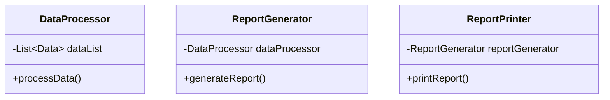

## 2.1.1 Single Responsibility Principle (SRP)

The Single Responsibility Principle (SRP) is a cornerstone of object-oriented design and one of the five SOLID principles. It states that a class should have only one reason to change, meaning it should have only one job or responsibility. This principle is crucial for creating robust, maintainable, and scalable software systems.

### Understanding the Single Responsibility Principle

The essence of SRP is simplicity and clarity. By ensuring that each class has a single responsibility, we make our code easier to understand, test, and modify. When a class has multiple responsibilities, it becomes more complex and harder to manage. Changes to one responsibility can inadvertently affect others, leading to bugs and increased maintenance costs.

#### Why SRP Matters

1. **Maintainability**: Classes with a single responsibility are easier to maintain. When changes are needed, they are localized to a specific class, reducing the risk of unintended side effects.

2. **Testability**: Single-responsibility classes are easier to test. Each class can be tested in isolation, ensuring that its specific functionality works as intended.

3. **Scalability**: As systems grow, SRP helps manage complexity by keeping classes focused and manageable. This makes it easier to extend the system with new features.

4. **Robustness**: By limiting the reasons for a class to change, SRP reduces the likelihood of bugs and increases the stability of the codebase.

### Identifying Violations of SRP

To understand SRP violations, let's consider a common scenario in software development: a class that handles both data processing and reporting. Such a class might look like this:

```java
public class ReportGenerator {
    private List<Data> dataList;

    public ReportGenerator(List<Data> dataList) {
        this.dataList = dataList;
    }

    // Responsibility 1: Data processing
    public void processData() {
        // Code to process data
    }

    // Responsibility 2: Report generation
    public void generateReport() {
        // Code to generate report
    }

    // Responsibility 3: Report printing
    public void printReport() {
        // Code to print report
    }
}
```

In this example, the `ReportGenerator` class has multiple responsibilities: processing data, generating reports, and printing reports. This violates SRP because changes to one responsibility (e.g., changing the report format) could impact other responsibilities (e.g., data processing).

### Problems Arising from SRP Violations

1. **Complexity**: The class becomes more complex as it tries to handle multiple tasks, making it harder to understand and modify.

2. **Tight Coupling**: Responsibilities are tightly coupled, meaning changes in one area can affect others, leading to a fragile codebase.

3. **Difficult Testing**: Testing becomes challenging because the class has multiple behaviors to verify, increasing the likelihood of errors.

### Refactoring to Adhere to SRP

To adhere to SRP, we need to refactor the `ReportGenerator` class by splitting its responsibilities into separate classes. Here's how we can do it:

```java
public class DataProcessor {
    private List<Data> dataList;

    public DataProcessor(List<Data> dataList) {
        this.dataList = dataList;
    }

    public void processData() {
        // Code to process data
    }
}

public class ReportGenerator {
    private DataProcessor dataProcessor;

    public ReportGenerator(DataProcessor dataProcessor) {
        this.dataProcessor = dataProcessor;
    }

    public void generateReport() {
        // Code to generate report
    }
}

public class ReportPrinter {
    private ReportGenerator reportGenerator;

    public ReportPrinter(ReportGenerator reportGenerator) {
        this.reportGenerator = reportGenerator;
    }

    public void printReport() {
        // Code to print report
    }
}
```

In this refactored version, each class has a single responsibility:

- `DataProcessor` handles data processing.
- `ReportGenerator` is responsible for generating reports.
- `ReportPrinter` takes care of printing reports.

This separation of concerns makes each class simpler, easier to test, and less prone to bugs.

### Benefits of Adhering to SRP

1. **Improved Maintainability**: Changes to one responsibility do not affect others, making the system easier to maintain.

2. **Enhanced Testability**: Each class can be tested independently, ensuring that its specific functionality works correctly.

3. **Increased Flexibility**: New features can be added without affecting existing functionality, making the system more adaptable to change.

4. **Reduced Complexity**: By focusing on a single responsibility, each class remains simple and easy to understand.

### Common Misconceptions and Challenges

1. **Over-Splitting**: A common misconception is that SRP requires splitting classes into too many small classes. While SRP encourages separation of concerns, it's important to find a balance and avoid over-engineering.

2. **Identifying Responsibilities**: Determining the single responsibility of a class can be challenging, especially in complex systems. It's important to focus on the core functionality and purpose of the class.

3. **Balancing Cohesion and Coupling**: While SRP promotes high cohesion within classes, it's also important to manage coupling between classes. Striking the right balance is key to effective design.

### Best Practices for Applying SRP

1. **Focus on Core Functionality**: Identify the primary purpose of the class and ensure it aligns with a single responsibility.

2. **Use Descriptive Class Names**: Class names should reflect their responsibility, making it easier to understand their purpose.

3. **Regularly Review and Refactor**: Continuously review your codebase to identify SRP violations and refactor as needed.

4. **Collaborate with Team Members**: Discuss design decisions with your team to gain different perspectives and ensure alignment with SRP.

### Try It Yourself

To deepen your understanding of SRP, try refactoring a class in your own codebase that has multiple responsibilities. Consider the following steps:

1. **Identify the Responsibilities**: List all the responsibilities the class currently handles.

2. **Separate Concerns**: Create new classes for each responsibility, ensuring each class has a single purpose.

3. **Refactor the Code**: Move the relevant code to the new classes and update the original class to use these new classes.

4. **Test the Changes**: Verify that the refactored code works as expected and that each class fulfills its responsibility.

### Visualizing SRP

To better understand the concept of SRP, let's visualize the refactoring process using a class diagram:



In this diagram, each class is responsible for a specific task, demonstrating the application of SRP.

### References and Further Reading

- [SOLID Principles of Object-Oriented Design](https://en.wikipedia.org/wiki/SOLID)
- [Clean Code: A Handbook of Agile Software Craftsmanship by Robert C. Martin](https://www.amazon.com/Clean-Code-Handbook-Software-Craftsmanship/dp/0132350882)
- [Refactoring: Improving the Design of Existing Code by Martin Fowler](https://www.amazon.com/Refactoring-Improving-Design-Existing-Code/dp/0201485672)

### Knowledge Check

To reinforce your understanding of SRP, consider the following questions:

1. What is the primary goal of the Single Responsibility Principle?
2. How does SRP improve the maintainability of a codebase?
3. What are the potential drawbacks of over-splitting classes when applying SRP?
4. How can descriptive class names aid in adhering to SRP?
5. What are some common challenges when identifying the single responsibility of a class?

### Embrace the Journey

Remember, mastering SRP is a journey. As you continue to apply this principle, you'll develop a deeper understanding of its benefits and challenges. Keep experimenting, stay curious, and enjoy the process of creating clean, maintainable code.

## Quiz Time!



### What is the primary goal of the Single Responsibility Principle?

- [x] To ensure a class has only one reason to change
- [ ] To make classes as large as possible
- [ ] To reduce the number of classes in a system
- [ ] To ensure all classes are public

> **Explanation:** The Single Responsibility Principle aims to ensure that a class has only one reason to change, which means it should have only one responsibility or job.

### How does SRP improve the maintainability of a codebase?

- [x] By localizing changes to specific classes
- [ ] By increasing the number of classes
- [ ] By making classes more complex
- [ ] By reducing the need for testing

> **Explanation:** SRP improves maintainability by localizing changes to specific classes, reducing the risk of unintended side effects and making the system easier to manage.

### What is a potential drawback of over-splitting classes when applying SRP?

- [x] Increased complexity due to too many small classes
- [ ] Reduced testability
- [ ] Increased coupling between classes
- [ ] Decreased code readability

> **Explanation:** Over-splitting classes can lead to increased complexity due to too many small classes, making the system harder to understand and manage.

### How can descriptive class names aid in adhering to SRP?

- [x] By reflecting the class's responsibility
- [ ] By making the code longer
- [ ] By reducing the number of methods
- [ ] By making classes private

> **Explanation:** Descriptive class names help adhere to SRP by clearly reflecting the class's responsibility, making it easier to understand its purpose.

### What are some common challenges when identifying the single responsibility of a class?

- [x] Determining the core functionality and purpose
- [x] Balancing cohesion and coupling
- [ ] Ensuring all methods are public
- [ ] Reducing the number of lines of code

> **Explanation:** Common challenges include determining the core functionality and purpose of a class and balancing cohesion and coupling to maintain effective design.

### What is the relationship between SRP and testability?

- [x] SRP enhances testability by allowing classes to be tested in isolation
- [ ] SRP reduces testability by increasing class complexity
- [ ] SRP has no impact on testability
- [ ] SRP requires more complex testing strategies

> **Explanation:** SRP enhances testability by allowing classes to be tested in isolation, ensuring that each class's specific functionality works as intended.

### What is a common misconception about SRP?

- [x] That it requires splitting classes into too many small classes
- [ ] That it reduces code readability
- [ ] That it increases the number of methods
- [ ] That it makes classes private

> **Explanation:** A common misconception about SRP is that it requires splitting classes into too many small classes, which can lead to over-engineering.

### What is the benefit of regularly reviewing and refactoring code to adhere to SRP?

- [x] It helps identify SRP violations and improve code quality
- [ ] It reduces the number of classes
- [ ] It makes the code longer
- [ ] It decreases testability

> **Explanation:** Regularly reviewing and refactoring code helps identify SRP violations and improve code quality by ensuring that each class has a single responsibility.

### How does SRP contribute to scalability?

- [x] By keeping classes focused and manageable
- [ ] By increasing the number of classes
- [ ] By making classes more complex
- [ ] By reducing the need for testing

> **Explanation:** SRP contributes to scalability by keeping classes focused and manageable, making it easier to extend the system with new features.

### True or False: SRP is only applicable to large systems.

- [ ] True
- [x] False

> **Explanation:** False. SRP is applicable to systems of all sizes. It is a fundamental principle of object-oriented design that helps create robust and maintainable code, regardless of the system's size.


