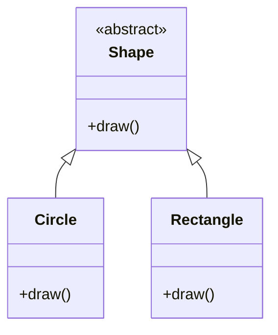

## 2.1.2 Open/Closed Principle (OCP)

The Open/Closed Principle (OCP) is a fundamental concept in object-oriented design and one of the five SOLID principles. It states that software entities such as classes, modules, and functions should be open for extension but closed for modification. This principle is crucial for developing robust, maintainable, and scalable software systems. Let's delve into the intricacies of OCP, explore its benefits, and examine how it can be implemented in Java through practical examples and design patterns.

### Understanding the Open/Closed Principle

The Open/Closed Principle was first introduced by Bertrand Meyer in his book "Object-Oriented Software Construction." The principle emphasizes that a software entity should be extendable without altering its existing code. This means that the behavior of a module can be changed or enhanced by adding new code rather than changing the existing code.

#### Key Concepts

- **Open for Extension**: A module is considered open if its behavior can be extended to accommodate new requirements.
- **Closed for Modification**: A module is closed if its source code is not changed when it is extended.

By adhering to OCP, developers can introduce new functionalities with minimal risk of introducing bugs into existing code. This principle is particularly beneficial in environments where software must evolve over time to meet changing requirements.

### Benefits of the Open/Closed Principle

Implementing OCP in software design offers several advantages:

1. **Enhanced Maintainability**: By minimizing changes to existing code, OCP reduces the likelihood of introducing new bugs. This makes the software easier to maintain and evolve over time.

2. **Improved Flexibility**: OCP allows developers to add new features without altering existing code, making the software more adaptable to change.

3. **Reduced Risk**: Since existing code remains unchanged, the risk of breaking existing functionality is minimized.

4. **Facilitated Testing**: With OCP, new features can be tested independently of the existing code, simplifying the testing process.

5. **Encouragement of Reusability**: OCP promotes the creation of reusable components that can be extended for different purposes.

### Implementing OCP in Java

Java provides several mechanisms to implement the Open/Closed Principle, including inheritance, interfaces, and abstract classes. Let's explore these techniques with examples.

#### Using Inheritance

Inheritance is a powerful feature in Java that allows a class to inherit properties and behaviors from another class. This enables developers to extend the functionality of existing classes without modifying their code.

```java
// Base class
abstract class Shape {
    abstract void draw();
}

// Extended class
class Circle extends Shape {
    @Override
    void draw() {
        System.out.println("Drawing a circle");
    }
}

// Extended class
class Rectangle extends Shape {
    @Override
    void draw() {
        System.out.println("Drawing a rectangle");
    }
}
```

In this example, the `Shape` class is open for extension through inheritance. New shapes can be added by creating subclasses without modifying the existing `Shape` class.

#### Using Interfaces

Interfaces in Java define a contract that classes can implement. This allows for the creation of flexible and extensible designs.

```java
// Interface
interface PaymentMethod {
    void pay(double amount);
}

// Implementation class
class CreditCardPayment implements PaymentMethod {
    @Override
    public void pay(double amount) {
        System.out.println("Paid " + amount + " using Credit Card");
    }
}

// Implementation class
class PayPalPayment implements PaymentMethod {
    @Override
    public void pay(double amount) {
        System.out.println("Paid " + amount + " using PayPal");
    }
}
```

Here, the `PaymentMethod` interface is open for extension. New payment methods can be added by implementing the interface, without altering existing implementations.

#### Using Abstract Classes

Abstract classes can provide default behavior while allowing subclasses to override or extend this behavior.

```java
// Abstract class
abstract class Notification {
    abstract void send(String message);
}

// Concrete class
class EmailNotification extends Notification {
    @Override
    void send(String message) {
        System.out.println("Sending email: " + message);
    }
}

// Concrete class
class SMSNotification extends Notification {
    @Override
    void send(String message) {
        System.out.println("Sending SMS: " + message);
    }
}
```

The `Notification` class is open for extension through subclassing, allowing new notification types to be added without modifying the existing code.

### Scenarios Illustrating OCP Violations and Solutions

Let's consider a scenario where violating the Open/Closed Principle can lead to problems, and how adhering to it can solve these issues.

#### Scenario: Payment Processing System

Imagine a payment processing system that initially supports only credit card payments. The system is designed with a single `PaymentProcessor` class that handles all payment logic.

```java
class PaymentProcessor {
    void processCreditCardPayment(double amount) {
        // Process credit card payment
    }
}
```

As the system evolves, new payment methods such as PayPal and Bitcoin need to be supported. Violating OCP, developers might modify the `PaymentProcessor` class to add new methods for each payment type.

```java
class PaymentProcessor {
    void processCreditCardPayment(double amount) {
        // Process credit card payment
    }

    void processPayPalPayment(double amount) {
        // Process PayPal payment
    }

    void processBitcoinPayment(double amount) {
        // Process Bitcoin payment
    }
}
```

This approach leads to a bloated class that is difficult to maintain and extend. Each new payment method requires modifying the existing class, increasing the risk of introducing bugs.

#### Solution: Applying OCP

To adhere to OCP, we can refactor the design using interfaces or abstract classes.

```java
// Payment method interface
interface PaymentMethod {
    void pay(double amount);
}

// Concrete payment method
class CreditCardPayment implements PaymentMethod {
    @Override
    public void pay(double amount) {
        System.out.println("Paid " + amount + " using Credit Card");
    }
}

// Concrete payment method
class PayPalPayment implements PaymentMethod {
    @Override
    public void pay(double amount) {
        System.out.println("Paid " + amount + " using PayPal");
    }
}

// Payment processor
class PaymentProcessor {
    void processPayment(PaymentMethod paymentMethod, double amount) {
        paymentMethod.pay(amount);
    }
}
```

In this refactored design, the `PaymentProcessor` class is closed for modification but open for extension. New payment methods can be added by implementing the `PaymentMethod` interface, without altering the `PaymentProcessor` class.

### Design Patterns Supporting OCP

Several design patterns inherently support the Open/Closed Principle by promoting extensibility and flexibility. Let's explore some of these patterns.

#### Strategy Pattern

The Strategy Pattern defines a family of algorithms, encapsulates each one, and makes them interchangeable. This pattern allows the algorithm to vary independently from clients that use it.

```java
// Strategy interface
interface SortingStrategy {
    void sort(int[] array);
}

// Concrete strategy
class BubbleSort implements SortingStrategy {
    @Override
    public void sort(int[] array) {
        // Implement bubble sort
    }
}

// Concrete strategy
class QuickSort implements SortingStrategy {
    @Override
    public void sort(int[] array) {
        // Implement quick sort
    }
}

// Context
class Sorter {
    private SortingStrategy strategy;

    public Sorter(SortingStrategy strategy) {
        this.strategy = strategy;
    }

    public void sortArray(int[] array) {
        strategy.sort(array);
    }
}
```

The `Sorter` class is open for extension through different sorting strategies, allowing new algorithms to be added without modifying existing code.

#### Template Method Pattern

The Template Method Pattern defines the skeleton of an algorithm in a method, deferring some steps to subclasses. This pattern allows subclasses to redefine certain steps of an algorithm without changing its structure.

```java
// Abstract class
abstract class DataProcessor {
    public final void process() {
        readData();
        processData();
        writeData();
    }

    abstract void readData();
    abstract void processData();
    abstract void writeData();
}

// Concrete class
class CSVDataProcessor extends DataProcessor {
    @Override
    void readData() {
        System.out.println("Reading CSV data");
    }

    @Override
    void processData() {
        System.out.println("Processing CSV data");
    }

    @Override
    void writeData() {
        System.out.println("Writing CSV data");
    }
}
```

The `DataProcessor` class is open for extension through subclassing, allowing new data processing types to be added without modifying the existing algorithm structure.

#### Decorator Pattern

The Decorator Pattern attaches additional responsibilities to an object dynamically. This pattern provides a flexible alternative to subclassing for extending functionality.

```java
// Component interface
interface Coffee {
    String getDescription();
    double getCost();
}

// Concrete component
class SimpleCoffee implements Coffee {
    @Override
    public String getDescription() {
        return "Simple coffee";
    }

    @Override
    public double getCost() {
        return 5.0;
    }
}

// Decorator
abstract class CoffeeDecorator implements Coffee {
    protected Coffee decoratedCoffee;

    public CoffeeDecorator(Coffee decoratedCoffee) {
        this.decoratedCoffee = decoratedCoffee;
    }

    @Override
    public String getDescription() {
        return decoratedCoffee.getDescription();
    }

    @Override
    public double getCost() {
        return decoratedCoffee.getCost();
    }
}

// Concrete decorator
class MilkDecorator extends CoffeeDecorator {
    public MilkDecorator(Coffee decoratedCoffee) {
        super(decoratedCoffee);
    }

    @Override
    public String getDescription() {
        return decoratedCoffee.getDescription() + ", milk";
    }

    @Override
    public double getCost() {
        return decoratedCoffee.getCost() + 1.5;
    }
}
```

The `Coffee` interface is open for extension through decorators, allowing new functionalities to be added without modifying existing classes.

### Balancing Design Rigor and Over-Engineering

While the Open/Closed Principle is a powerful tool for creating extensible software, it's important to strike a balance between being too rigid in design and over-engineering for extensibility. Overly complex designs can lead to unnecessary complexity and maintenance challenges.

#### Anticipating Variations

When designing software, it's crucial to anticipate potential variations and design abstractions accordingly. However, it's equally important to avoid over-engineering by trying to predict every possible future requirement. Focus on current needs and use patterns like OCP to accommodate future changes gracefully.

### Visualizing the Open/Closed Principle

To better understand the Open/Closed Principle, let's visualize the concept using a class diagram.



In this diagram, the `Shape` class is an abstract class that defines the `draw` method. The `Circle` and `Rectangle` classes extend `Shape`, implementing the `draw` method. This structure adheres to OCP by allowing new shapes to be added without modifying the existing `Shape` class.

### Try It Yourself

To deepen your understanding of the Open/Closed Principle, try modifying the code examples provided. For instance, add a new shape to the `Shape` hierarchy or a new payment method to the `PaymentMethod` interface. Observe how these changes can be made without altering existing code, demonstrating the power of OCP.

### Knowledge Check

Before we conclude, let's review some key takeaways:

- The Open/Closed Principle promotes software entities that are open for extension but closed for modification.
- OCP enhances maintainability, flexibility, and reduces the risk of introducing bugs.
- Java features like inheritance, interfaces, and abstract classes facilitate OCP implementation.
- Design patterns such as Strategy, Template Method, and Decorator support OCP.
- Balance is key—avoid over-engineering while designing for extensibility.

### Embrace the Journey

Remember, mastering the Open/Closed Principle is a journey. As you continue to develop software, keep experimenting with different design patterns and techniques. Stay curious, and enjoy the process of creating flexible, maintainable, and scalable systems.

## Quiz Time!



### What is the Open/Closed Principle?

- [x] Software entities should be open for extension but closed for modification.
- [ ] Software entities should be open for modification but closed for extension.
- [ ] Software entities should be neither open for extension nor modification.
- [ ] Software entities should be both open for extension and modification.

> **Explanation:** The Open/Closed Principle states that software entities should be open for extension but closed for modification, allowing new functionalities to be added without altering existing code.


### Which Java feature supports the Open/Closed Principle by allowing classes to be extended?

- [x] Inheritance
- [ ] Encapsulation
- [ ] Polymorphism
- [ ] Abstraction

> **Explanation:** Inheritance allows classes to be extended, supporting the Open/Closed Principle by enabling new functionalities to be added without modifying existing classes.


### How does the Strategy Pattern support the Open/Closed Principle?

- [x] By defining a family of algorithms and making them interchangeable.
- [ ] By defining a fixed algorithm structure.
- [ ] By attaching additional responsibilities to an object dynamically.
- [ ] By providing a simplified interface to a complex subsystem.

> **Explanation:** The Strategy Pattern supports the Open/Closed Principle by defining a family of algorithms, encapsulating each one, and making them interchangeable, allowing new algorithms to be added without modifying existing code.


### What is a potential downside of over-engineering for extensibility?

- [x] Unnecessary complexity and maintenance challenges.
- [ ] Increased risk of introducing bugs.
- [ ] Reduced flexibility.
- [ ] Decreased reusability.

> **Explanation:** Over-engineering for extensibility can lead to unnecessary complexity and maintenance challenges, making the software harder to understand and maintain.


### Which design pattern allows for adding new functionalities to an object without modifying its existing code?

- [x] Decorator Pattern
- [ ] Singleton Pattern
- [ ] Factory Pattern
- [ ] Observer Pattern

> **Explanation:** The Decorator Pattern allows for adding new functionalities to an object dynamically without modifying its existing code, supporting the Open/Closed Principle.


### What is a key benefit of adhering to the Open/Closed Principle?

- [x] Enhanced maintainability and reduced risk of bugs.
- [ ] Increased coupling between modules.
- [ ] Decreased flexibility in software design.
- [ ] Reduced reusability of components.

> **Explanation:** Adhering to the Open/Closed Principle enhances maintainability and reduces the risk of introducing bugs, as existing code remains unchanged when new functionalities are added.


### Which pattern defines the skeleton of an algorithm, allowing subclasses to redefine certain steps?

- [x] Template Method Pattern
- [ ] Strategy Pattern
- [ ] Decorator Pattern
- [ ] Observer Pattern

> **Explanation:** The Template Method Pattern defines the skeleton of an algorithm in a method, deferring some steps to subclasses, allowing them to redefine certain steps without changing the algorithm's structure.


### How can interfaces support the Open/Closed Principle in Java?

- [x] By defining a contract that classes can implement, allowing for flexible and extensible designs.
- [ ] By providing a fixed implementation that cannot be changed.
- [ ] By allowing classes to inherit properties and behaviors.
- [ ] By encapsulating data and behavior within a single class.

> **Explanation:** Interfaces define a contract that classes can implement, allowing for flexible and extensible designs that adhere to the Open/Closed Principle.


### What is the primary goal of the Open/Closed Principle?

- [x] To allow software entities to be extended without modifying existing code.
- [ ] To ensure software entities are closed for both extension and modification.
- [ ] To promote the use of global variables.
- [ ] To encourage the use of hard-coded values.

> **Explanation:** The primary goal of the Open/Closed Principle is to allow software entities to be extended without modifying existing code, enhancing maintainability and flexibility.


### True or False: The Open/Closed Principle is one of the SOLID principles.

- [x] True
- [ ] False

> **Explanation:** True. The Open/Closed Principle is one of the five SOLID principles, which are fundamental concepts in object-oriented design.


