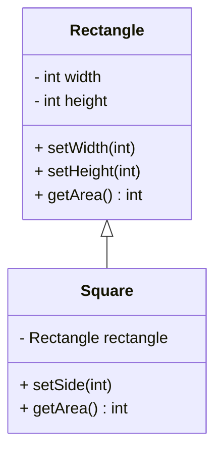

## 2.1.3 Liskov Substitution Principle (LSP)

The Liskov Substitution Principle (LSP) is one of the five SOLID principles of object-oriented design, which are essential for creating robust and maintainable software. LSP is named after Barbara Liskov, who introduced the concept in a 1987 conference keynote address. The principle states that objects of a superclass should be replaceable with objects of a subclass without affecting the correctness of the program. This principle ensures that a subclass can stand in for its superclass without altering the desirable properties of the program, such as correctness, task completion, and performance.

### Understanding Liskov Substitution Principle

The essence of LSP is that a subclass should enhance, rather than replace, the behavior of its superclass. This means that the subclass should adhere to the expected behavior of the superclass, ensuring that any instance of the subclass can be used wherever an instance of the superclass is expected.

#### Key Concepts

- **Preconditions**: Conditions that must be true before a method is executed. A subclass should not strengthen the preconditions of the methods it overrides.
- **Postconditions**: Conditions that must be true after a method is executed. A subclass should not weaken the postconditions of the methods it overrides.
- **Invariants**: Conditions that must always be true for an object. A subclass should maintain the invariants of the superclass.

### Role of LSP in Reliable Inheritance

LSP plays a crucial role in ensuring reliable inheritance hierarchies. By adhering to LSP, developers can create subclasses that are true extensions of their superclasses, maintaining the integrity and expected behavior of the system. This leads to more predictable and stable software, where changes in subclasses do not introduce unexpected behaviors.

### Violations of LSP

Violations of LSP occur when a subclass overrides methods in a way that is incompatible with the superclass. This can lead to unexpected behaviors and code fragility. Let's explore some common violations and how to avoid them.

#### Example of LSP Violation

Consider a simple example involving a `Rectangle` class and a `Square` class:

```java
class Rectangle {
    protected int width;
    protected int height;

    public void setWidth(int width) {
        this.width = width;
    }

    public void setHeight(int height) {
        this.height = height;
    }

    public int getArea() {
        return width * height;
    }
}

class Square extends Rectangle {
    @Override
    public void setWidth(int width) {
        this.width = width;
        this.height = width; // Violation: Changes height when width is set
    }

    @Override
    public void setHeight(int height) {
        this.width = height; // Violation: Changes width when height is set
        this.height = height;
    }
}
```

In this example, the `Square` class violates LSP because it changes the behavior of the `setWidth` and `setHeight` methods. A `Square` is a specific type of `Rectangle`, but it does not adhere to the expected behavior of a `Rectangle`, where width and height can be set independently.

#### Consequences of Violating LSP

Violating LSP can lead to several issues:

- **Unexpected Behaviors**: Programs may behave unpredictably when subclasses do not adhere to the expected behavior of their superclasses.
- **Code Fragility**: Changes in subclasses can introduce bugs and require extensive testing to ensure that the program still functions correctly.
- **Reduced Reusability**: Violating LSP can make it difficult to reuse code, as subclasses may not be suitable replacements for their superclasses.

### Ensuring Adherence to LSP

To ensure adherence to LSP, follow these best practices:

- **Maintain Method Contracts**: Ensure that subclasses do not alter the method contracts of their superclasses. This includes maintaining preconditions, postconditions, and invariants.
- **Use Interfaces Wisely**: Design interfaces that define the expected behavior of classes. Subclasses should implement these interfaces without altering the expected behavior.
- **Favor Composition Over Inheritance**: In some cases, composition may be a better choice than inheritance, as it allows for greater flexibility and adherence to LSP.

#### Proper Adherence to LSP

Let's modify the previous example to adhere to LSP by using composition instead of inheritance:

```java
class Rectangle {
    private int width;
    private int height;

    public Rectangle(int width, int height) {
        this.width = width;
        this.height = height;
    }

    public void setWidth(int width) {
        this.width = width;
    }

    public void setHeight(int height) {
        this.height = height;
    }

    public int getArea() {
        return width * height;
    }
}

class Square {
    private Rectangle rectangle;

    public Square(int side) {
        this.rectangle = new Rectangle(side, side);
    }

    public void setSide(int side) {
        rectangle.setWidth(side);
        rectangle.setHeight(side);
    }

    public int getArea() {
        return rectangle.getArea();
    }
}
```

In this example, the `Square` class uses composition to maintain the expected behavior of a `Rectangle` while providing the specific functionality of a square.

### LSP and Interface Segregation

LSP is closely related to the Interface Segregation Principle (ISP), which states that clients should not be forced to depend on interfaces they do not use. By adhering to LSP and ISP, developers can create robust inheritance structures that are easy to understand and maintain.

### Encouraging Best Practices

To ensure that subclasses extend and enhance, rather than replace, the behavior of their superclasses, consider the following practices:

- **Design for Extension**: Design classes with extension in mind, allowing subclasses to add functionality without altering existing behavior.
- **Use Abstract Classes and Interfaces**: Define clear contracts for subclasses to implement, ensuring adherence to expected behavior.
- **Test Substitutions**: Regularly test subclasses to ensure they can be substituted for their superclasses without affecting program correctness.

### Visualizing Liskov Substitution Principle

To better understand LSP, let's visualize the relationship between a superclass and its subclasses:



This diagram illustrates how the `Square` class uses composition to adhere to LSP, maintaining the expected behavior of a `Rectangle`.

### Try It Yourself

Experiment with the code examples provided by making the following modifications:

1. **Add a New Shape**: Create a `Circle` class that adheres to LSP, using composition to maintain expected behavior.
2. **Test Substitution**: Write a test case that verifies the substitution of a `Square` for a `Rectangle` without affecting program correctness.
3. **Explore Violations**: Modify the `Square` class to violate LSP and observe the consequences in your test cases.

### Conclusion

The Liskov Substitution Principle is a fundamental aspect of object-oriented design that ensures reliable inheritance hierarchies. By adhering to LSP, developers can create subclasses that enhance, rather than replace, the behavior of their superclasses, leading to more robust and maintainable software. Remember to maintain method contracts, use interfaces wisely, and favor composition over inheritance when necessary. As you continue to explore design patterns and principles, keep LSP in mind to create software that is both flexible and reliable.

## Quiz Time!



### What does the Liskov Substitution Principle (LSP) ensure in object-oriented design?

- [x] Subclasses can replace superclasses without affecting program correctness.
- [ ] Subclasses can alter the behavior of superclasses.
- [ ] Superclasses can replace subclasses without affecting program correctness.
- [ ] Subclasses must inherit all methods from superclasses.

> **Explanation:** LSP ensures that subclasses can replace superclasses without affecting the correctness of the program.

### Which of the following is a violation of LSP?

- [x] A subclass changes the behavior of a method in a way that breaks the expected behavior of the superclass.
- [ ] A subclass adds new methods that are not present in the superclass.
- [ ] A subclass inherits methods from the superclass without overriding them.
- [ ] A subclass implements an interface defined by the superclass.

> **Explanation:** Violating LSP occurs when a subclass changes the behavior of a method, breaking the expected behavior of the superclass.

### What are preconditions in the context of LSP?

- [x] Conditions that must be true before a method is executed.
- [ ] Conditions that must be true after a method is executed.
- [ ] Conditions that must always be true for an object.
- [ ] Conditions that are optional for method execution.

> **Explanation:** Preconditions are conditions that must be true before a method is executed.

### How can you ensure adherence to LSP?

- [x] Maintain method contracts and use interfaces wisely.
- [ ] Strengthen preconditions in subclasses.
- [ ] Weaken postconditions in subclasses.
- [ ] Alter invariants of the superclass.

> **Explanation:** To adhere to LSP, maintain method contracts and use interfaces wisely.

### What is the relationship between LSP and Interface Segregation Principle (ISP)?

- [x] Both contribute to robust inheritance structures.
- [ ] LSP is unrelated to ISP.
- [ ] ISP weakens the adherence to LSP.
- [ ] ISP replaces the need for LSP.

> **Explanation:** LSP and ISP both contribute to robust inheritance structures by ensuring adherence to expected behavior.

### What is a common consequence of violating LSP?

- [x] Unexpected behaviors and code fragility.
- [ ] Improved code reusability.
- [ ] Enhanced performance.
- [ ] Simplified inheritance hierarchies.

> **Explanation:** Violating LSP can lead to unexpected behaviors and code fragility.

### How does composition help in adhering to LSP?

- [x] It allows for greater flexibility and adherence to expected behavior.
- [ ] It strengthens preconditions of methods.
- [ ] It weakens postconditions of methods.
- [ ] It alters invariants of the superclass.

> **Explanation:** Composition allows for greater flexibility and adherence to expected behavior, helping to adhere to LSP.

### What should subclasses do to adhere to LSP?

- [x] Extend and enhance the behavior of their superclasses.
- [ ] Replace the behavior of their superclasses.
- [ ] Alter the method contracts of their superclasses.
- [ ] Ignore the expected behavior of their superclasses.

> **Explanation:** Subclasses should extend and enhance the behavior of their superclasses to adhere to LSP.

### What is an invariant in the context of LSP?

- [x] A condition that must always be true for an object.
- [ ] A condition that must be true before a method is executed.
- [ ] A condition that must be true after a method is executed.
- [ ] A condition that is optional for method execution.

> **Explanation:** An invariant is a condition that must always be true for an object.

### True or False: LSP states that a superclass should be replaceable with a subclass without affecting program correctness.

- [x] True
- [ ] False

> **Explanation:** True. LSP states that a superclass should be replaceable with a subclass without affecting program correctness.


