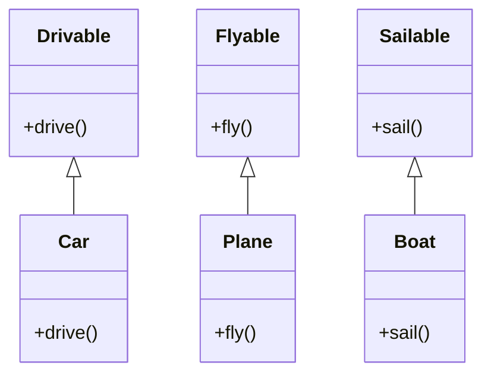

## 2.1.4 Interface Segregation Principle (ISP)

The Interface Segregation Principle (ISP) is a fundamental concept in object-oriented design, forming one of the five SOLID principles. It emphasizes the importance of creating small, client-specific interfaces rather than large, monolithic ones. By adhering to ISP, developers can reduce unnecessary dependencies, enhance maintainability, and foster a more modular codebase.

### Understanding the Interface Segregation Principle

The Interface Segregation Principle states that no client should be forced to depend on methods it does not use. This principle encourages the design of interfaces that are specific to the needs of the client, thereby avoiding the pitfalls associated with large, unwieldy interfaces.

#### The Problem with Fat Interfaces

Fat interfaces, or interfaces that contain a large number of methods, can lead to several implementation challenges:

- **Increased Coupling**: Clients that implement fat interfaces are forced to provide implementations for methods they do not use, leading to unnecessary coupling.
- **Reduced Flexibility**: Changes to a fat interface can have widespread implications, affecting all clients that implement it.
- **Complexity and Maintenance**: Large interfaces can become difficult to understand and maintain, especially as the system evolves.

### Violations of ISP: A Java Example

Consider a scenario where we have a `Printer` interface that defines several methods for different types of printers:

```java
public interface Printer {
    void printDocument(String document);
    void printPhoto(String photo);
    void faxDocument(String document);
    void scanDocument(String document);
}
```

In this example, a simple document printer may not need to implement `printPhoto`, `faxDocument`, or `scanDocument`. However, because it implements the `Printer` interface, it is forced to provide implementations for all these methods, even if they are not relevant.

### Applying ISP: Splitting Interfaces

To adhere to the Interface Segregation Principle, we can split the `Printer` interface into smaller, more specific interfaces:

```java
public interface DocumentPrinter {
    void printDocument(String document);
}

public interface PhotoPrinter {
    void printPhoto(String photo);
}

public interface Fax {
    void faxDocument(String document);
}

public interface Scanner {
    void scanDocument(String document);
}
```

Now, a simple document printer can implement only the `DocumentPrinter` interface, avoiding unnecessary dependencies on methods it does not use.

### Benefits of the Interface Segregation Principle

Implementing ISP offers several advantages:

- **Reduced Coupling**: By creating client-specific interfaces, we minimize the dependencies between different parts of the system.
- **Enhanced Maintainability**: Smaller interfaces are easier to understand and maintain, making the codebase more manageable.
- **Increased Flexibility**: Changes to one interface do not affect clients that do not depend on it, allowing for more flexible evolution of the system.

### Potential Issues When Ignoring ISP

Failing to adhere to the Interface Segregation Principle can lead to several problems:

- **Code Bloat**: Clients are forced to implement methods they do not need, leading to bloated and inefficient code.
- **Difficulty in Managing Changes**: Changes to a large interface can have unintended consequences, affecting all clients that implement it.
- **Reduced Clarity**: Large interfaces can become confusing, making it difficult to understand the responsibilities of different components.

### Best Practices for Designing Interfaces in Java

To effectively apply the Interface Segregation Principle, consider the following best practices:

- **Identify Client Needs**: Understand the specific needs of each client and design interfaces that cater to those needs.
- **Keep Interfaces Small**: Aim for interfaces with a single responsibility, focusing on a specific aspect of functionality.
- **Use Composition**: Prefer composition over inheritance to combine small interfaces into more complex behaviors.
- **Refactor Regularly**: Continuously refactor interfaces as the system evolves to ensure they remain relevant and efficient.

### Refactoring to Comply with ISP

Refactoring existing code to comply with the Interface Segregation Principle involves identifying fat interfaces and breaking them down into smaller, client-specific ones. Here are some strategies to consider:

- **Analyze Dependencies**: Identify which methods are used by each client and group them into cohesive interfaces.
- **Incremental Refactoring**: Refactor interfaces incrementally, starting with the most problematic ones.
- **Leverage Tools**: Use refactoring tools available in modern IDEs to assist in the process.

### Code Example: Refactoring a Fat Interface

Let's refactor a fat interface to comply with ISP. Consider the following `Vehicle` interface:

```java
public interface Vehicle {
    void drive();
    void fly();
    void sail();
}
```

A car, which only needs to drive, should not be forced to implement `fly` or `sail`. We can refactor this interface as follows:

```java
public interface Drivable {
    void drive();
}

public interface Flyable {
    void fly();
}

public interface Sailable {
    void sail();
}
```

Now, a `Car` class can implement only the `Drivable` interface:

```java
public class Car implements Drivable {
    @Override
    public void drive() {
        System.out.println("Driving a car");
    }
}
```

### Try It Yourself

To better understand the Interface Segregation Principle, try modifying the code examples above. For instance, create a `Boat` class that implements the `Sailable` interface, or a `Plane` class that implements the `Flyable` interface. Experiment with adding new methods to the interfaces and observe how the changes affect the implementing classes.

### Visualizing ISP with a Diagram

To further illustrate the concept of the Interface Segregation Principle, let's visualize the relationship between the different interfaces and their implementing classes using a class diagram.



In this diagram, we can see how each class implements only the interface relevant to its functionality, adhering to the Interface Segregation Principle.

### Knowledge Check

Before we conclude, let's pose a few questions to reinforce the concepts we've covered:

- Why is it important to avoid fat interfaces?
- How does the Interface Segregation Principle contribute to reduced coupling?
- What are some strategies for refactoring existing code to comply with ISP?

### Summary

The Interface Segregation Principle is a powerful tool in the software engineer's arsenal, promoting the creation of small, client-specific interfaces that enhance maintainability and reduce unnecessary dependencies. By adhering to ISP, developers can create more modular, flexible, and understandable systems.

### Embrace the Journey

Remember, mastering the Interface Segregation Principle is just one step on your journey to becoming an expert software engineer. Keep experimenting, stay curious, and continue to refine your skills as you explore the world of design patterns in Java.

## Quiz Time!



### What is the main goal of the Interface Segregation Principle (ISP)?

- [x] To ensure no client is forced to depend on methods it does not use.
- [ ] To create as many interfaces as possible.
- [ ] To enforce the use of inheritance in all designs.
- [ ] To make all interfaces as large as possible.

> **Explanation:** ISP aims to create small, client-specific interfaces, ensuring clients are not burdened with unnecessary methods.

### What problem does a "fat interface" introduce?

- [x] Increased coupling and complexity.
- [ ] Improved performance.
- [ ] Simplified code maintenance.
- [ ] Enhanced flexibility.

> **Explanation:** Fat interfaces lead to increased coupling and complexity, making maintenance and flexibility more challenging.

### How can we refactor a fat interface to comply with ISP?

- [x] By splitting it into smaller, more specific interfaces.
- [ ] By adding more methods to it.
- [ ] By removing all methods from it.
- [ ] By converting it into a class.

> **Explanation:** Splitting a fat interface into smaller, specific interfaces aligns with ISP, reducing unnecessary dependencies.

### What is a key benefit of applying ISP?

- [x] Reduced coupling between system components.
- [ ] Increased code duplication.
- [ ] More complex interfaces.
- [ ] Slower system performance.

> **Explanation:** ISP reduces coupling by ensuring interfaces are specific to client needs, enhancing maintainability.

### Which of the following is a violation of ISP?

- [x] A class implementing an interface with methods it does not use.
- [ ] A class implementing multiple small interfaces.
- [ ] An interface with a single method.
- [ ] A class that does not use interfaces.

> **Explanation:** Implementing an interface with unused methods violates ISP, as it forces unnecessary dependencies.

### What is a strategy for designing interfaces in Java according to ISP?

- [x] Keeping interfaces small and focused on specific client needs.
- [ ] Designing interfaces with as many methods as possible.
- [ ] Avoiding the use of interfaces altogether.
- [ ] Making interfaces identical to classes.

> **Explanation:** ISP encourages small, focused interfaces to reduce unnecessary dependencies and enhance flexibility.

### What is a potential issue when not adhering to ISP?

- [x] Code bloat and difficulty in managing changes.
- [ ] Improved code readability.
- [ ] Enhanced system performance.
- [ ] Simplified interface design.

> **Explanation:** Ignoring ISP can lead to code bloat and difficulties in managing changes due to large, unwieldy interfaces.

### How does ISP enhance maintainability?

- [x] By reducing the number of methods a client must implement.
- [ ] By increasing the number of interfaces a client must implement.
- [ ] By making interfaces more complex.
- [ ] By eliminating the need for interfaces.

> **Explanation:** ISP enhances maintainability by ensuring clients only implement methods they need, reducing complexity.

### Which principle is closely related to ISP?

- [x] Single Responsibility Principle (SRP)
- [ ] Open/Closed Principle (OCP)
- [ ] Liskov Substitution Principle (LSP)
- [ ] Dependency Inversion Principle (DIP)

> **Explanation:** ISP is closely related to SRP, as both emphasize focused responsibilities and reducing unnecessary dependencies.

### True or False: ISP encourages the use of large, comprehensive interfaces to cover all possible client needs.

- [ ] True
- [x] False

> **Explanation:** False. ISP encourages small, client-specific interfaces to avoid unnecessary dependencies.


