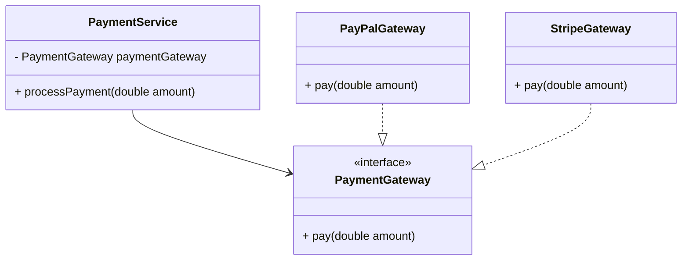

## 2.1.5 Dependency Inversion Principle (DIP)

The Dependency Inversion Principle (DIP) is a fundamental concept in software engineering, particularly within the realm of object-oriented design. It is one of the five SOLID principles introduced by Robert C. Martin, aimed at creating more maintainable, flexible, and scalable software systems. In this section, we will delve into the intricacies of DIP, its significance, and how it can be effectively implemented in Java.

### Understanding the Dependency Inversion Principle

At its core, the Dependency Inversion Principle suggests that:

1. **High-level modules should not depend on low-level modules. Both should depend on abstractions.**
2. **Abstractions should not depend on details. Details should depend on abstractions.**

This principle emphasizes the importance of decoupling software modules by relying on abstractions (such as interfaces or abstract classes) rather than concrete implementations. By doing so, it facilitates a more flexible and testable codebase.

#### Significance of DIP

The primary goal of DIP is to reduce the dependency of high-level modules on the details of low-level modules. This decoupling is crucial for several reasons:

- **Flexibility**: By depending on abstractions, you can easily swap out implementations without affecting the high-level module.
- **Testability**: It becomes easier to test high-level modules by mocking or stubbing the dependencies.
- **Maintainability**: Changes in low-level modules do not ripple through the system, making maintenance more manageable.
- **Scalability**: As systems grow, the ability to introduce new features or modify existing ones without disrupting the entire system is enhanced.

### Implementing DIP in Java

To implement the Dependency Inversion Principle in Java, we typically use interfaces or abstract classes to define the contracts that both high-level and low-level modules adhere to. Let's explore this with a practical example.

#### Example: Payment Processing System

Consider a payment processing system where we have a `PaymentService` (high-level module) that processes payments through different payment gateways (low-level modules).

**Without DIP:**

```java
class PaymentService {
    private PayPalGateway payPalGateway = new PayPalGateway();
    
    public void processPayment(double amount) {
        payPalGateway.pay(amount);
    }
}

class PayPalGateway {
    public void pay(double amount) {
        // Logic to process payment through PayPal
    }
}
```

In this example, `PaymentService` is tightly coupled to `PayPalGateway`. If we want to introduce a new payment gateway, we need to modify `PaymentService`, violating the Open/Closed Principle.

**With DIP:**

```java
interface PaymentGateway {
    void pay(double amount);
}

class PaymentService {
    private PaymentGateway paymentGateway;

    public PaymentService(PaymentGateway paymentGateway) {
        this.paymentGateway = paymentGateway;
    }

    public void processPayment(double amount) {
        paymentGateway.pay(amount);
    }
}

class PayPalGateway implements PaymentGateway {
    public void pay(double amount) {
        // Logic to process payment through PayPal
    }
}

class StripeGateway implements PaymentGateway {
    public void pay(double amount) {
        // Logic to process payment through Stripe
    }
}
```

Here, `PaymentService` depends on the `PaymentGateway` interface rather than a specific implementation. This allows us to inject any `PaymentGateway` implementation, such as `PayPalGateway` or `StripeGateway`, into `PaymentService`.

#### Using Dependency Injection

Dependency Injection (DI) is a design pattern that facilitates the implementation of DIP by injecting dependencies into a class rather than the class creating them. This can be done through constructors, setters, or interfaces.

**Constructor Injection Example:**

```java
class PaymentService {
    private PaymentGateway paymentGateway;

    public PaymentService(PaymentGateway paymentGateway) {
        this.paymentGateway = paymentGateway;
    }

    public void processPayment(double amount) {
        paymentGateway.pay(amount);
    }
}
```

**Setter Injection Example:**

```java
class PaymentService {
    private PaymentGateway paymentGateway;

    public void setPaymentGateway(PaymentGateway paymentGateway) {
        this.paymentGateway = paymentGateway;
    }

    public void processPayment(double amount) {
        paymentGateway.pay(amount);
    }
}
```

### Benefits of Using DIP

1. **Decoupling**: By depending on abstractions, high-level modules are decoupled from low-level modules, allowing for independent development and testing.
2. **Ease of Testing**: With dependencies injected, it becomes straightforward to mock or stub these dependencies in unit tests.
3. **Flexibility and Extensibility**: New implementations can be introduced without modifying existing code, adhering to the Open/Closed Principle.
4. **Improved Maintainability**: Changes in low-level modules do not impact high-level modules, reducing the risk of bugs and simplifying maintenance.

### Common Patterns Incorporating DIP

Several design patterns inherently incorporate the Dependency Inversion Principle, including:

- **Strategy Pattern**: Defines a family of algorithms, encapsulates each one, and makes them interchangeable. The strategy pattern relies on DIP to allow the client to choose the algorithm at runtime.
- **Observer Pattern**: Allows an object to notify other objects about changes in its state. Observers depend on an abstraction of the subject, promoting decoupling.
- **Dependency Injection Frameworks**: Frameworks like Spring provide robust support for dependency injection, making it easier to adhere to DIP in large-scale applications.

### Challenges and Considerations

While DIP offers numerous benefits, there are challenges and considerations to keep in mind:

- **Complexity**: Introducing too many abstractions can lead to increased complexity, making the code harder to understand.
- **Performance Overhead**: The use of interfaces and dependency injection can introduce a slight performance overhead, although this is often negligible compared to the benefits.
- **Design Discipline**: Adhering to DIP requires discipline in design and a clear understanding of the system's architecture.

### Visualizing Dependency Inversion

To better understand the concept of dependency inversion, let's visualize the relationship between high-level and low-level modules when DIP is applied.



**Diagram Description**: In this class diagram, `PaymentService` depends on the `PaymentGateway` interface, while `PayPalGateway` and `StripeGateway` implement this interface. This setup allows `PaymentService` to remain agnostic of the specific payment gateway implementation.

### Problems with Direct Dependencies

When high-level modules depend directly on low-level modules, several problems can arise:

- **Tight Coupling**: Changes in low-level modules can have a cascading effect, requiring updates in high-level modules.
- **Reduced Flexibility**: Introducing new features or swapping implementations becomes cumbersome and error-prone.
- **Difficult Testing**: Testing high-level modules in isolation becomes challenging as they are tightly coupled with specific implementations.

### Designing with Abstractions

To effectively apply DIP, design modules with clear, abstracted interfaces. This approach promotes independence and allows for greater flexibility in implementation.

**Example: Logger System**

Consider a logging system where different logging mechanisms can be used (e.g., console, file, remote server).

**Without DIP:**

```java
class Logger {
    private ConsoleLogger consoleLogger = new ConsoleLogger();

    public void log(String message) {
        consoleLogger.log(message);
    }
}

class ConsoleLogger {
    public void log(String message) {
        System.out.println(message);
    }
}
```

**With DIP:**

```java
interface Logger {
    void log(String message);
}

class ApplicationLogger {
    private Logger logger;

    public ApplicationLogger(Logger logger) {
        this.logger = logger;
    }

    public void log(String message) {
        logger.log(message);
    }
}

class ConsoleLogger implements Logger {
    public void log(String message) {
        System.out.println(message);
    }
}

class FileLogger implements Logger {
    public void log(String message) {
        // Logic to write message to a file
    }
}
```

In this example, `ApplicationLogger` depends on the `Logger` interface, allowing it to work with any `Logger` implementation, such as `ConsoleLogger` or `FileLogger`.

### Try It Yourself

To solidify your understanding of the Dependency Inversion Principle, try modifying the examples provided:

1. **Add a new payment gateway**: Implement a new `PaymentGateway` class and inject it into `PaymentService`.
2. **Create a new logger**: Implement a `RemoteLogger` that sends logs to a remote server and use it in `ApplicationLogger`.
3. **Experiment with Dependency Injection**: Use different injection methods (constructor, setter) in the examples and observe the impact on code flexibility.

### Conclusion

The Dependency Inversion Principle is a powerful tool in the software engineer's toolkit, promoting decoupling and enhancing the flexibility, testability, and maintainability of code. By adhering to DIP, developers can create systems that are easier to extend and maintain, ultimately leading to more robust and scalable software solutions.

---

## Quiz Time!



### What is the primary goal of the Dependency Inversion Principle (DIP)?

- [x] To decouple high-level modules from low-level modules by relying on abstractions.
- [ ] To ensure that low-level modules are tightly coupled with high-level modules.
- [ ] To eliminate the use of interfaces and abstract classes.
- [ ] To increase the dependency of high-level modules on low-level modules.

> **Explanation:** The primary goal of DIP is to decouple high-level modules from low-level modules by relying on abstractions, such as interfaces or abstract classes, rather than concrete implementations.

### Which of the following is a benefit of applying the Dependency Inversion Principle?

- [x] Improved testability
- [x] Enhanced flexibility
- [ ] Increased coupling
- [ ] Reduced maintainability

> **Explanation:** DIP improves testability and enhances flexibility by decoupling high-level modules from low-level modules, allowing for easier testing and implementation swapping.

### How does the Dependency Inversion Principle promote flexibility in software design?

- [x] By allowing high-level modules to depend on abstractions rather than specific implementations.
- [ ] By enforcing tight coupling between modules.
- [ ] By eliminating the need for interfaces.
- [ ] By requiring all modules to be implemented as concrete classes.

> **Explanation:** DIP promotes flexibility by allowing high-level modules to depend on abstractions, such as interfaces, which can be implemented by various concrete classes.

### What is a common pattern that incorporates the Dependency Inversion Principle?

- [x] Strategy Pattern
- [ ] Singleton Pattern
- [ ] Factory Pattern
- [ ] Observer Pattern

> **Explanation:** The Strategy Pattern is a common design pattern that incorporates DIP by allowing algorithms to be selected at runtime through the use of abstractions.

### Which method of dependency injection involves passing dependencies through a class's constructor?

- [x] Constructor Injection
- [ ] Setter Injection
- [ ] Interface Injection
- [ ] Field Injection

> **Explanation:** Constructor Injection involves passing dependencies through a class's constructor, allowing for dependencies to be set at the time of object creation.

### What problem arises when high-level modules depend directly on low-level modules?

- [x] Tight coupling
- [ ] Increased flexibility
- [ ] Improved testability
- [ ] Enhanced maintainability

> **Explanation:** When high-level modules depend directly on low-level modules, tight coupling occurs, making the system less flexible and harder to maintain.

### Which of the following is a key component of the Dependency Inversion Principle?

- [x] Abstractions should not depend on details.
- [x] Details should depend on abstractions.
- [ ] High-level modules should depend on low-level modules.
- [ ] Low-level modules should depend on high-level modules.

> **Explanation:** A key component of DIP is that abstractions should not depend on details, and details should depend on abstractions, promoting decoupling.

### What is the role of interfaces in the Dependency Inversion Principle?

- [x] To define abstractions that both high-level and low-level modules depend on.
- [ ] To enforce tight coupling between modules.
- [ ] To eliminate the need for abstract classes.
- [ ] To increase the dependency of high-level modules on low-level modules.

> **Explanation:** Interfaces define abstractions that both high-level and low-level modules depend on, allowing for decoupling and flexibility in implementation.

### How does the Dependency Inversion Principle facilitate easier maintenance?

- [x] By isolating changes in low-level modules from high-level modules.
- [ ] By increasing the dependency of high-level modules on low-level modules.
- [ ] By eliminating the use of interfaces.
- [ ] By enforcing tight coupling between modules.

> **Explanation:** DIP facilitates easier maintenance by isolating changes in low-level modules from high-level modules, reducing the impact of changes on the overall system.

### True or False: The Dependency Inversion Principle requires that all modules be implemented as concrete classes.

- [ ] True
- [x] False

> **Explanation:** False. The Dependency Inversion Principle encourages the use of abstractions, such as interfaces or abstract classes, rather than concrete implementations, to promote decoupling and flexibility.


