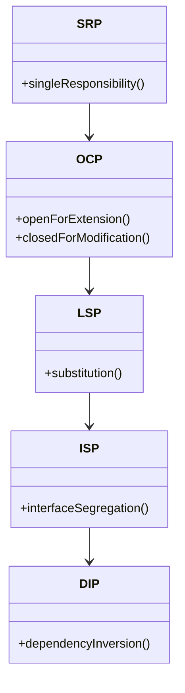

## 2.1 The SOLID Principles

In the realm of software engineering, crafting code that is not only functional but also maintainable and scalable is paramount. The SOLID principles serve as a beacon for developers striving to achieve these goals in object-oriented design. These principles—Single Responsibility, Open/Closed, Liskov Substitution, Interface Segregation, and Dependency Inversion—form the foundation for creating robust software architectures.

### Understanding SOLID

The SOLID principles were introduced by Robert C. Martin, also known as Uncle Bob, as a set of guidelines to improve software design. Each principle addresses a specific aspect of design, aiming to make software more understandable, flexible, and adaptable to change. Let's briefly explore each principle before delving into their individual sections:

1. **Single Responsibility Principle (SRP)**: A class should have only one reason to change, meaning it should have only one job or responsibility.
2. **Open/Closed Principle (OCP)**: Software entities should be open for extension but closed for modification.
3. **Liskov Substitution Principle (LSP)**: Objects of a superclass should be replaceable with objects of a subclass without affecting the correctness of the program.
4. **Interface Segregation Principle (ISP)**: Clients should not be forced to depend on interfaces they do not use.
5. **Dependency Inversion Principle (DIP)**: High-level modules should not depend on low-level modules; both should depend on abstractions.

### Importance of SOLID Principles

Applying the SOLID principles leads to software that is easier to manage and extend over time. By adhering to these guidelines, developers can create systems that are:

- **Robust**: Less prone to bugs and easier to debug.
- **Flexible**: Easier to adapt to changing requirements.
- **Maintainable**: Simpler to understand and modify.

The principles also encourage a design that is modular, where components can be developed and tested independently, promoting reusability and reducing the impact of changes.

### The Interrelation of SOLID Principles

While each SOLID principle addresses a specific aspect of design, they are interrelated and collectively contribute to the overall quality of software. For instance, adhering to the Single Responsibility Principle often leads to smaller, more focused classes, which naturally aligns with the Interface Segregation Principle. Similarly, the Dependency Inversion Principle complements the Open/Closed Principle by promoting the use of abstractions, which facilitates extension without modification.

### Applying SOLID Principles

As we explore each principle in detail, we'll provide practical examples and code snippets in Java to illustrate their application. By the end of this section, you'll have a comprehensive understanding of how to apply SOLID principles to enhance your software design.

---

### Single Responsibility Principle (SRP)

The Single Responsibility Principle (SRP) asserts that a class should have only one reason to change. In other words, a class should have a single job or responsibility. This principle helps in reducing the complexity of classes and makes them easier to understand and maintain.

#### Why SRP Matters

When a class has multiple responsibilities, changes to one responsibility can affect the others, leading to a fragile design. By adhering to SRP, we ensure that each class has a clear purpose, making the codebase more modular and easier to manage.

#### Example of SRP Violation

Consider a class that handles both user authentication and logging:

```java
public class UserManager {
    public void login(String username, String password) {
        // Authenticate user
        // Log the login attempt
    }

    public void logout() {
        // Log the logout attempt
    }
}
```

In this example, the `UserManager` class has two responsibilities: managing user authentication and logging. This violates the SRP.

#### Refactoring to Adhere to SRP

To adhere to SRP, we can refactor the code by separating the responsibilities into different classes:

```java
public class AuthenticationService {
    public void login(String username, String password) {
        // Authenticate user
    }

    public void logout() {
        // Perform logout
    }
}

public class Logger {
    public void log(String message) {
        // Log the message
    }
}
```

Now, the `AuthenticationService` class is responsible only for authentication, and the `Logger` class handles logging.

#### Try It Yourself

Experiment with refactoring a class in your project that has multiple responsibilities. Identify the distinct responsibilities and create separate classes for each. Observe how this change affects the readability and maintainability of your code.

---

### Open/Closed Principle (OCP)

The Open/Closed Principle (OCP) states that software entities should be open for extension but closed for modification. This means that the behavior of a module can be extended without altering its source code.

#### Importance of OCP

Adhering to OCP allows developers to add new functionality without risking existing code. This principle is crucial for maintaining a stable codebase while accommodating new requirements.

#### Example of OCP Violation

Consider a class that calculates discounts for different types of customers:

```java
public class DiscountCalculator {
    public double calculateDiscount(String customerType, double amount) {
        if (customerType.equals("Regular")) {
            return amount * 0.1;
        } else if (customerType.equals("Premium")) {
            return amount * 0.2;
        }
        return 0;
    }
}
```

Adding a new customer type requires modifying the `calculateDiscount` method, violating OCP.

#### Refactoring to Adhere to OCP

We can refactor the code using polymorphism to adhere to OCP:

```java
public interface DiscountStrategy {
    double calculateDiscount(double amount);
}

public class RegularCustomerDiscount implements DiscountStrategy {
    public double calculateDiscount(double amount) {
        return amount * 0.1;
    }
}

public class PremiumCustomerDiscount implements DiscountStrategy {
    public double calculateDiscount(double amount) {
        return amount * 0.2;
    }
}

public class DiscountCalculator {
    public double calculateDiscount(DiscountStrategy strategy, double amount) {
        return strategy.calculateDiscount(amount);
    }
}
```

Now, adding a new customer type involves creating a new class that implements `DiscountStrategy`, without modifying existing code.

#### Try It Yourself

Identify a part of your codebase that requires frequent modifications to accommodate new features. Refactor it to use polymorphism or other techniques to adhere to OCP, and observe how it simplifies future extensions.

---

### Liskov Substitution Principle (LSP)

The Liskov Substitution Principle (LSP) states that objects of a superclass should be replaceable with objects of a subclass without affecting the correctness of the program. This principle ensures that a subclass can stand in for its superclass.

#### Importance of LSP

Adhering to LSP ensures that inheritance hierarchies are used correctly, preventing unexpected behavior when subclasses are used in place of their superclasses.

#### Example of LSP Violation

Consider a superclass `Bird` and a subclass `Penguin`:

```java
public class Bird {
    public void fly() {
        System.out.println("Flying");
    }
}

public class Penguin extends Bird {
    @Override
    public void fly() {
        throw new UnsupportedOperationException("Penguins can't fly");
    }
}
```

In this example, substituting a `Penguin` for a `Bird` would lead to an exception, violating LSP.

#### Refactoring to Adhere to LSP

To adhere to LSP, we can refactor the hierarchy to better represent the capabilities of the classes:

```java
public abstract class Bird {
    public abstract void move();
}

public class FlyingBird extends Bird {
    @Override
    public void move() {
        System.out.println("Flying");
    }
}

public class Penguin extends Bird {
    @Override
    public void move() {
        System.out.println("Walking");
    }
}
```

Now, both `FlyingBird` and `Penguin` can be used interchangeably without violating LSP.

#### Try It Yourself

Review your class hierarchies and ensure that subclasses can be substituted for their superclasses without causing errors. Refactor any hierarchies that violate LSP to better represent the capabilities of the classes.

---

### Interface Segregation Principle (ISP)

The Interface Segregation Principle (ISP) states that clients should not be forced to depend on interfaces they do not use. This principle encourages the creation of smaller, more specific interfaces.

#### Importance of ISP

Adhering to ISP prevents the implementation of unnecessary methods and reduces the impact of changes in interfaces, leading to more maintainable code.

#### Example of ISP Violation

Consider an interface `Printer` with multiple methods:

```java
public interface Printer {
    void print();
    void scan();
    void fax();
}
```

A class `BasicPrinter` that implements `Printer` is forced to provide implementations for all methods, even if it doesn't support scanning or faxing.

#### Refactoring to Adhere to ISP

We can refactor the code by creating smaller, more specific interfaces:

```java
public interface Printable {
    void print();
}

public interface Scannable {
    void scan();
}

public interface Faxable {
    void fax();
}

public class BasicPrinter implements Printable {
    @Override
    public void print() {
        System.out.println("Printing");
    }
}
```

Now, `BasicPrinter` only implements the `Printable` interface, adhering to ISP.

#### Try It Yourself

Examine your interfaces and identify any that force classes to implement methods they don't use. Refactor these interfaces into smaller, more specific ones to adhere to ISP.

---

### Dependency Inversion Principle (DIP)

The Dependency Inversion Principle (DIP) states that high-level modules should not depend on low-level modules; both should depend on abstractions. This principle promotes decoupling and enhances the flexibility of the code.

#### Importance of DIP

Adhering to DIP allows for more flexible and reusable code by reducing the dependency on concrete implementations. This principle is crucial for creating systems that are easy to modify and extend.

#### Example of DIP Violation

Consider a class `EmailService` that directly depends on a `SmtpServer`:

```java
public class EmailService {
    private SmtpServer smtpServer;

    public EmailService() {
        this.smtpServer = new SmtpServer();
    }

    public void sendEmail(String message) {
        smtpServer.send(message);
    }
}
```

This design tightly couples `EmailService` to `SmtpServer`, violating DIP.

#### Refactoring to Adhere to DIP

We can refactor the code to depend on an abstraction:

```java
public interface EmailServer {
    void send(String message);
}

public class SmtpServer implements EmailServer {
    @Override
    public void send(String message) {
        // Send email via SMTP
    }
}

public class EmailService {
    private EmailServer emailServer;

    public EmailService(EmailServer emailServer) {
        this.emailServer = emailServer;
    }

    public void sendEmail(String message) {
        emailServer.send(message);
    }
}
```

Now, `EmailService` depends on the `EmailServer` interface, adhering to DIP.

#### Try It Yourself

Identify dependencies in your codebase that are tightly coupled to specific implementations. Refactor these dependencies to rely on abstractions, and observe how it enhances the flexibility and testability of your code.

---

### Visualizing SOLID Principles

To better understand the relationships and flow of the SOLID principles, let's visualize them using a class diagram:



**Diagram Explanation**: This diagram illustrates how each SOLID principle builds upon the previous one, forming a cohesive framework for designing robust software. The arrows indicate the flow of influence, showing how adhering to one principle naturally leads to the application of the next.

---

### Encouragement and Conclusion

Remember, the journey to mastering SOLID principles is ongoing. As you continue to apply these principles in your projects, you'll find that your code becomes more modular, easier to maintain, and adaptable to change. Keep experimenting, stay curious, and enjoy the process of refining your software design skills.

---

## Quiz Time!



### What does the SOLID acronym stand for?

- [x] Single Responsibility, Open/Closed, Liskov Substitution, Interface Segregation, Dependency Inversion
- [ ] Single Responsibility, Object-Oriented, Liskov Substitution, Interface Segregation, Dependency Injection
- [ ] Simple, Open/Closed, Liskov Substitution, Interface Segregation, Dependency Inversion
- [ ] Single Responsibility, Open/Closed, Liskov Substitution, Interface Segregation, Dependency Injection

> **Explanation:** SOLID stands for Single Responsibility, Open/Closed, Liskov Substitution, Interface Segregation, Dependency Inversion.

### Which principle states that a class should have only one reason to change?

- [x] Single Responsibility Principle
- [ ] Open/Closed Principle
- [ ] Liskov Substitution Principle
- [ ] Interface Segregation Principle

> **Explanation:** The Single Responsibility Principle states that a class should have only one reason to change.

### What does the Open/Closed Principle advocate?

- [x] Software entities should be open for extension but closed for modification.
- [ ] Software entities should be closed for extension but open for modification.
- [ ] Software entities should be open for both extension and modification.
- [ ] Software entities should be closed for both extension and modification.

> **Explanation:** The Open/Closed Principle advocates that software entities should be open for extension but closed for modification.

### Which principle ensures that subclasses can replace base classes without affecting correctness?

- [x] Liskov Substitution Principle
- [ ] Single Responsibility Principle
- [ ] Open/Closed Principle
- [ ] Interface Segregation Principle

> **Explanation:** The Liskov Substitution Principle ensures that subclasses can replace base classes without affecting correctness.

### What does the Interface Segregation Principle suggest?

- [x] Clients should not be forced to depend on interfaces they do not use.
- [ ] Clients should depend on large interfaces to cover all use cases.
- [ ] Clients should be forced to depend on all interfaces.
- [ ] Clients should not depend on any interfaces.

> **Explanation:** The Interface Segregation Principle suggests that clients should not be forced to depend on interfaces they do not use.

### What is the main goal of the Dependency Inversion Principle?

- [x] High-level modules should not depend on low-level modules; both should depend on abstractions.
- [ ] Low-level modules should not depend on high-level modules; both should depend on implementations.
- [ ] High-level modules should depend on low-level modules directly.
- [ ] Low-level modules should depend on high-level modules directly.

> **Explanation:** The Dependency Inversion Principle's main goal is that high-level modules should not depend on low-level modules; both should depend on abstractions.

### How can the Single Responsibility Principle improve code?

- [x] By reducing complexity and making it easier to understand and maintain.
- [ ] By increasing complexity for more robust code.
- [ ] By making code less modular.
- [ ] By forcing classes to handle multiple responsibilities.

> **Explanation:** The Single Responsibility Principle improves code by reducing complexity and making it easier to understand and maintain.

### What is a common violation of the Open/Closed Principle?

- [x] Modifying existing code to add new functionality.
- [ ] Extending code without modifying it.
- [ ] Using polymorphism to add new functionality.
- [ ] Creating new classes for new functionality.

> **Explanation:** A common violation of the Open/Closed Principle is modifying existing code to add new functionality.

### Which principle is violated if a class implements methods it doesn't use?

- [x] Interface Segregation Principle
- [ ] Single Responsibility Principle
- [ ] Liskov Substitution Principle
- [ ] Dependency Inversion Principle

> **Explanation:** The Interface Segregation Principle is violated if a class implements methods it doesn't use.

### True or False: The SOLID principles are only applicable to large-scale software projects.

- [ ] True
- [x] False

> **Explanation:** The SOLID principles are applicable to projects of all sizes, not just large-scale software projects.


