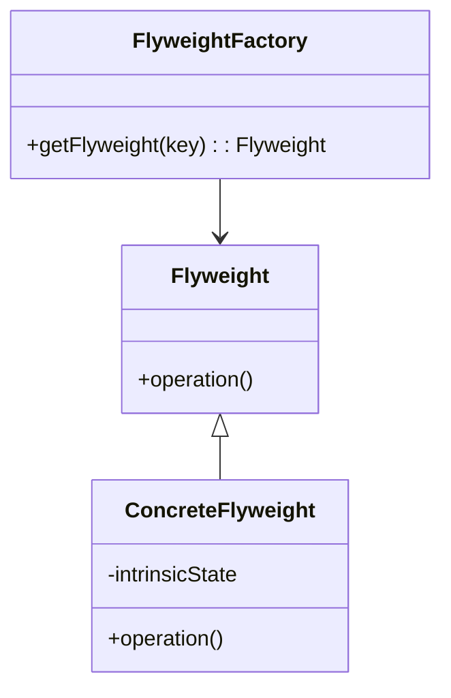

## 2.2 Memory Management and Garbage Collection

### Introduction

In the realm of Java programming, understanding memory management and garbage collection is crucial for developing efficient and high-performing applications. Java's automatic memory management system, primarily driven by garbage collection, abstracts the complexities of manual memory allocation and deallocation. This section delves into Java's memory model, the intricacies of garbage collection algorithms, and best practices for optimizing memory usage. Additionally, we explore how certain design patterns, such as the Flyweight Pattern, can aid in memory optimization.

### Java's Memory Model

Java's memory model is divided into two main areas: the **Heap** and the **Stack**. Each plays a distinct role in memory allocation and management.

#### The Heap

The heap is a shared memory area used for dynamic memory allocation. It is where all Java objects and arrays are stored. The heap is divided into several generations:

- **Young Generation**: This is where new objects are allocated. It consists of the Eden space and two Survivor spaces. Objects that survive garbage collection in the young generation are promoted to the old generation.
- **Old Generation**: Also known as the Tenured Generation, this is where long-lived objects reside.
- **Permanent Generation (PermGen)**: Used in older Java versions to store metadata about classes and methods. In Java 8 and later, PermGen has been replaced by the Metaspace, which is allocated in native memory.

#### The Stack

The stack is used for static memory allocation and stores primitive data types and references to objects in the heap. Each thread has its own stack, which holds frames for method calls, including local variables and partial results.

### Garbage Collection in Java

Garbage collection (GC) is the process of automatically reclaiming memory by identifying and disposing of objects that are no longer reachable in the program. Java provides several garbage collection algorithms, each with its own strengths and trade-offs.

#### Serial Garbage Collector

The Serial Garbage Collector is the simplest form of GC, designed for single-threaded environments. It performs garbage collection in a single thread, making it suitable for small applications with minimal memory requirements.

#### Parallel Garbage Collector

The Parallel Garbage Collector, also known as the throughput collector, uses multiple threads to speed up garbage collection. It is ideal for applications that can tolerate pauses and require high throughput.

#### Concurrent Mark-Sweep (CMS) Collector

The CMS Collector is designed to minimize GC pauses by performing most of its work concurrently with the application. It is suitable for applications that require low latency.

#### Garbage-First (G1) Collector

The G1 Collector is a server-style garbage collector that aims to achieve high throughput with predictable pause times. It divides the heap into regions and prioritizes garbage collection in regions with the most garbage.

#### Z Garbage Collector (ZGC)

ZGC is a low-latency garbage collector that aims to keep pause times below 10 milliseconds. It is designed for applications with large heap sizes and requires minimal configuration.

### Impact of Object Creation and Destruction

Frequent object creation and destruction can lead to increased garbage collection activity, affecting application performance. Understanding the lifecycle of objects and minimizing unnecessary object creation are key to optimizing performance.

### Best Practices for Memory Management

1. **Avoid Memory Leaks**: Ensure that objects are dereferenced when no longer needed.
2. **Use Primitive Types**: Prefer primitive types over wrapper classes to reduce memory overhead.
3. **Optimize Data Structures**: Choose the right data structures for your needs, considering both memory usage and performance.
4. **Use StringBuilder for String Manipulation**: Avoid using `String` concatenation in loops; use `StringBuilder` instead.
5. **Profile and Monitor Memory Usage**: Use tools like VisualVM, JProfiler, or YourKit to analyze memory consumption and identify bottlenecks.

### Design Patterns for Memory Optimization

Certain design patterns can help optimize memory usage in Java applications. The **Flyweight Pattern** is particularly useful for reducing memory consumption by sharing objects.

#### Flyweight Pattern

- **Category**: Structural Pattern

#### Intent

- **Description**: The Flyweight Pattern is used to minimize memory usage by sharing as much data as possible with similar objects.

#### Motivation

In scenarios where a large number of similar objects are created, the Flyweight Pattern can significantly reduce memory consumption by sharing common data among objects.

#### Applicability

- **Guidelines**: Use the Flyweight Pattern when you need to create a large number of objects that share common data.

#### Structure



- **Caption**: The Flyweight Pattern structure showing the Flyweight interface, ConcreteFlyweight class, and FlyweightFactory.

#### Participants

- **Flyweight**: Declares an interface through which flyweights can receive and act on extrinsic state.
- **ConcreteFlyweight**: Implements the Flyweight interface and stores intrinsic state.
- **FlyweightFactory**: Creates and manages flyweight objects.

#### Collaborations

- **Interactions**: The FlyweightFactory ensures that flyweights are shared properly. Clients request flyweights from the factory, passing extrinsic state to the flyweight's methods.

#### Consequences

- **Analysis**: The Flyweight Pattern reduces memory usage by sharing objects, but it can increase complexity due to the need to manage extrinsic state.

#### Implementation

- **Implementation Guidelines**: Ensure that the FlyweightFactory efficiently manages the creation and sharing of flyweights.

- **Sample Code Snippets**:

```java
import java.util.HashMap;
import java.util.Map;

// Flyweight interface
interface Flyweight {
    void operation(String extrinsicState);
}

// ConcreteFlyweight class
class ConcreteFlyweight implements Flyweight {
    private final String intrinsicState;

    public ConcreteFlyweight(String intrinsicState) {
        this.intrinsicState = intrinsicState;
    }

    @Override
    public void operation(String extrinsicState) {
        System.out.println("Intrinsic State: " + intrinsicState + ", Extrinsic State: " + extrinsicState);
    }
}

// FlyweightFactory class
class FlyweightFactory {
    private final Map<String, Flyweight> flyweights = new HashMap<>();

    public Flyweight getFlyweight(String key) {
        if (!flyweights.containsKey(key)) {
            flyweights.put(key, new ConcreteFlyweight(key));
        }
        return flyweights.get(key);
    }
}

// Client code
public class FlyweightPatternDemo {
    public static void main(String[] args) {
        FlyweightFactory factory = new FlyweightFactory();

        Flyweight flyweight1 = factory.getFlyweight("A");
        flyweight1.operation("First Call");

        Flyweight flyweight2 = factory.getFlyweight("A");
        flyweight2.operation("Second Call");

        Flyweight flyweight3 = factory.getFlyweight("B");
        flyweight3.operation("Third Call");
    }
}
```

- **Explanation**: This code demonstrates the Flyweight Pattern, where the FlyweightFactory manages the creation of flyweights, ensuring that shared objects are reused.

#### Sample Use Cases

- **Real-world Scenarios**: The Flyweight Pattern is often used in graphical applications where many similar objects, such as characters in a text editor, need to be rendered.

### Profiling and Monitoring Memory Consumption

Profiling and monitoring are essential for understanding memory usage and identifying potential issues. Use tools like VisualVM, JProfiler, or YourKit to gain insights into memory allocation, garbage collection activity, and object lifecycles.

### Conclusion

Mastering memory management and garbage collection in Java is essential for developing efficient applications. By understanding Java's memory model, leveraging appropriate garbage collection algorithms, and applying best practices, developers can optimize performance and resource utilization. Design patterns like the Flyweight Pattern further aid in reducing memory consumption, making them valuable tools in a developer's arsenal.

### Key Takeaways

- Java's memory model consists of the heap and stack, each serving distinct purposes.
- Garbage collection is an automatic process that reclaims memory by disposing of unreachable objects.
- Different garbage collection algorithms offer various trade-offs between throughput and latency.
- Best practices in memory management include avoiding memory leaks, using primitive types, and profiling memory usage.
- Design patterns like the Flyweight Pattern can help optimize memory usage by sharing objects.

### Reflection

Consider how these concepts apply to your projects. Are there areas where memory management could be improved? How might you leverage design patterns to enhance performance?

## Test Your Knowledge: Java Memory Management and Garbage Collection Quiz



### Which part of Java's memory model is used for dynamic memory allocation?

- [x] Heap
- [ ] Stack
- [ ] Metaspace
- [ ] PermGen

> **Explanation:** The heap is used for dynamic memory allocation, where objects and arrays are stored.

### What is the primary goal of garbage collection in Java?

- [x] To reclaim memory by disposing of unreachable objects
- [ ] To allocate memory for new objects
- [ ] To optimize CPU usage
- [ ] To manage thread execution

> **Explanation:** Garbage collection reclaims memory by identifying and disposing of objects that are no longer reachable.

### Which garbage collector is designed for low-latency applications?

- [x] Z Garbage Collector (ZGC)
- [ ] Serial Garbage Collector
- [ ] Parallel Garbage Collector
- [ ] Concurrent Mark-Sweep (CMS) Collector

> **Explanation:** ZGC is designed for low-latency applications, aiming to keep pause times below 10 milliseconds.

### What is the main advantage of the Flyweight Pattern?

- [x] It reduces memory usage by sharing objects
- [ ] It simplifies code structure
- [ ] It increases execution speed
- [ ] It enhances security

> **Explanation:** The Flyweight Pattern reduces memory usage by sharing as much data as possible with similar objects.

### Which tool can be used to profile memory usage in Java applications?

- [x] VisualVM
- [ ] Eclipse
- [x] JProfiler
- [ ] IntelliJ IDEA

> **Explanation:** VisualVM and JProfiler are tools that can be used to profile memory usage in Java applications.

### What is the role of the FlyweightFactory in the Flyweight Pattern?

- [x] To manage the creation and sharing of flyweight objects
- [ ] To store intrinsic state
- [ ] To perform operations on extrinsic state
- [ ] To handle garbage collection

> **Explanation:** The FlyweightFactory manages the creation and sharing of flyweight objects, ensuring efficient memory usage.

### Which part of the heap is used for long-lived objects?

- [x] Old Generation
- [ ] Young Generation
- [ ] Eden Space
- [ ] Survivor Space

> **Explanation:** The Old Generation, also known as the Tenured Generation, is used for long-lived objects.

### What is a common consequence of frequent object creation and destruction?

- [x] Increased garbage collection activity
- [ ] Reduced memory usage
- [ ] Improved application performance
- [ ] Enhanced security

> **Explanation:** Frequent object creation and destruction can lead to increased garbage collection activity, affecting performance.

### How can memory leaks be avoided in Java applications?

- [x] By ensuring objects are dereferenced when no longer needed
- [ ] By using more threads
- [ ] By increasing heap size
- [ ] By using the Serial Garbage Collector

> **Explanation:** Memory leaks can be avoided by ensuring that objects are dereferenced when they are no longer needed.

### True or False: The stack is used for dynamic memory allocation in Java.

- [ ] True
- [x] False

> **Explanation:** False. The stack is used for static memory allocation, while the heap is used for dynamic memory allocation.


