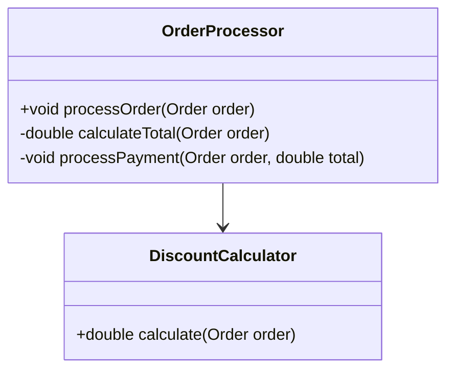

## 2.2 DRY (Don't Repeat Yourself)

In the realm of software engineering, the DRY (Don't Repeat Yourself) principle stands as a cornerstone for writing clean, efficient, and maintainable code. The essence of DRY is simple yet profound: avoid code duplication. By adhering to this principle, developers can significantly reduce the risk of errors, lower maintenance costs, and improve the overall quality of software projects.

### Understanding the DRY Principle

The DRY principle, coined by Andy Hunt and Dave Thomas in their book "The Pragmatic Programmer," emphasizes that "every piece of knowledge must have a single, unambiguous, authoritative representation within a system." This means that any logic, data, or configuration should be defined once and reused wherever necessary.

#### Why Redundancy is Detrimental

Redundancy in code can lead to several issues:

- **Increased Maintenance Effort**: When the same logic is duplicated across multiple locations, any change requires updating each instance, increasing the likelihood of errors and inconsistencies.
- **Higher Likelihood of Bugs**: Duplicated code can lead to discrepancies if not all instances are updated consistently, resulting in bugs that are difficult to trace.
- **Reduced Readability**: Code duplication can clutter the codebase, making it harder for developers to understand and navigate the system.

### Negative Impacts of Code Duplication

To illustrate the negative impacts of code duplication, consider the following Java example:

```java
public class OrderProcessor {

    public void processOnlineOrder(Order order) {
        if (order.isValid()) {
            // Calculate total
            double total = order.getQuantity() * order.getPrice();
            // Apply discount
            total -= order.getDiscount();
            // Process payment
            processPayment(order, total);
        }
    }

    public void processInStoreOrder(Order order) {
        if (order.isValid()) {
            // Calculate total
            double total = order.getQuantity() * order.getPrice();
            // Apply discount
            total -= order.getDiscount();
            // Process payment
            processPayment(order, total);
        }
    }

    private void processPayment(Order order, double total) {
        // Payment processing logic
    }
}
```

In this example, the logic for calculating the total and applying a discount is duplicated in both `processOnlineOrder` and `processInStoreOrder` methods. This redundancy can lead to maintenance challenges and potential errors if changes are needed.

### Refactoring to Eliminate Redundancy

To adhere to the DRY principle, we can refactor the code by extracting the duplicated logic into a separate method:

```java
public class OrderProcessor {

    public void processOnlineOrder(Order order) {
        double total = calculateTotal(order);
        processPayment(order, total);
    }

    public void processInStoreOrder(Order order) {
        double total = calculateTotal(order);
        processPayment(order, total);
    }

    private double calculateTotal(Order order) {
        double total = order.getQuantity() * order.getPrice();
        total -= order.getDiscount();
        return total;
    }

    private void processPayment(Order order, double total) {
        // Payment processing logic
    }
}
```

By extracting the `calculateTotal` method, we have eliminated redundancy, making the code more maintainable and less error-prone.

### Techniques to Adhere to DRY

#### 1. Abstraction

Abstraction involves creating a general concept that can be used to represent multiple specific instances. In Java, this can be achieved through interfaces and abstract classes.

```java
public abstract class OrderProcessor {

    public void processOrder(Order order) {
        double total = calculateTotal(order);
        processPayment(order, total);
    }

    protected abstract double calculateTotal(Order order);

    private void processPayment(Order order, double total) {
        // Payment processing logic
    }
}
```

#### 2. Method Extraction

Method extraction is a refactoring technique where common code is moved into a separate method. This not only reduces duplication but also improves readability and reusability.

#### 3. Utilizing Inheritance and Composition

Inheritance allows you to define a base class with common functionality that can be extended by subclasses. Composition involves building complex objects by combining simpler ones, promoting code reuse.

```java
public class DiscountCalculator {

    public double calculate(Order order) {
        return order.getQuantity() * order.getPrice() - order.getDiscount();
    }
}

public class OrderProcessor {

    private DiscountCalculator discountCalculator = new DiscountCalculator();

    public void processOrder(Order order) {
        double total = discountCalculator.calculate(order);
        processPayment(order, total);
    }

    private void processPayment(Order order, double total) {
        // Payment processing logic
    }
}
```

### Balancing DRY and Readability

While the DRY principle is crucial for maintainability, it's essential to balance it with code readability. In some cases, minor duplication might be acceptable if it improves clarity. For example, repeating a small piece of logic in two different contexts might make the code easier to understand than abstracting it into a separate method.

### DRY Beyond Code

The DRY principle extends beyond code to documentation and processes. Consistent documentation ensures that information is not repeated unnecessarily, reducing the risk of discrepancies. Similarly, DRY processes promote efficiency and consistency across the project.

### Regular Code Reviews

Encourage the practice of regularly reviewing code to identify and refactor duplications. Code reviews are an excellent opportunity to spot redundancy and suggest improvements.

### Java-Specific Tips

- **Utility Classes**: Use utility classes to encapsulate common functionality that can be reused across different parts of the application.
- **Common Libraries**: Leverage common libraries and frameworks that provide reusable components, reducing the need to write duplicate code.

### Try It Yourself

To solidify your understanding of the DRY principle, try refactoring the following code snippet to eliminate duplication:

```java
public class ReportGenerator {

    public void generateSalesReport() {
        // Fetch data
        List<Sale> sales = fetchSalesData();
        // Format data
        String formattedData = formatData(sales);
        // Print report
        printReport(formattedData);
    }

    public void generateInventoryReport() {
        // Fetch data
        List<Inventory> inventory = fetchInventoryData();
        // Format data
        String formattedData = formatData(inventory);
        // Print report
        printReport(formattedData);
    }

    private List<Sale> fetchSalesData() {
        // Fetch sales data logic
    }

    private List<Inventory> fetchInventoryData() {
        // Fetch inventory data logic
    }

    private String formatData(Object data) {
        // Format data logic
    }

    private void printReport(String data) {
        // Print report logic
    }
}
```

### Visualizing DRY Principle

To better understand how the DRY principle can be applied, let's visualize the refactoring process using a class diagram:



This diagram illustrates the relationship between `OrderProcessor` and `DiscountCalculator`, showing how composition can be used to adhere to the DRY principle.

### Knowledge Check

- **What is the DRY principle, and why is it important?**
- **How can code duplication negatively impact a software project?**
- **What techniques can be used to adhere to the DRY principle?**
- **How does the DRY principle apply beyond code?**

### Embrace the Journey

Remember, the journey to mastering the DRY principle is ongoing. As you continue to develop your skills, you'll find new ways to eliminate redundancy and improve the quality of your code. Keep experimenting, stay curious, and enjoy the process of becoming a more efficient and effective software engineer.

## Quiz Time!



### What does the DRY principle stand for?

- [x] Don't Repeat Yourself
- [ ] Do Repeat Yourself
- [ ] Duplicate Reusable Yield
- [ ] Dynamic Resource Yield

> **Explanation:** DRY stands for "Don't Repeat Yourself," emphasizing the importance of avoiding code duplication.

### Why is code duplication detrimental to software projects?

- [x] It increases maintenance effort and likelihood of bugs.
- [ ] It makes code easier to read.
- [ ] It improves performance.
- [ ] It enhances security.

> **Explanation:** Code duplication increases maintenance effort and the likelihood of bugs, as changes need to be made in multiple places.

### Which technique can be used to adhere to the DRY principle?

- [x] Method extraction
- [ ] Hard coding
- [ ] Copy-paste programming
- [ ] Premature optimization

> **Explanation:** Method extraction involves moving common code into a separate method, reducing duplication.

### What is a potential downside of strictly adhering to the DRY principle?

- [x] It can reduce code readability in some cases.
- [ ] It always improves performance.
- [ ] It eliminates all bugs.
- [ ] It makes code harder to maintain.

> **Explanation:** Strict adherence to DRY can sometimes reduce readability if over-abstraction is applied.

### How can DRY be applied beyond code?

- [x] In documentation and processes
- [ ] Only in code
- [ ] In hardware design
- [ ] In user interfaces

> **Explanation:** DRY can be applied to documentation and processes, promoting consistency and reducing redundancy.

### What is a Java-specific tip for adhering to DRY?

- [x] Use utility classes
- [ ] Use magic numbers
- [ ] Hard code values
- [ ] Avoid libraries

> **Explanation:** Utility classes encapsulate common functionality, promoting code reuse and adherence to DRY.

### What is the main goal of the DRY principle?

- [x] To reduce redundancy and improve maintainability
- [ ] To increase code complexity
- [ ] To duplicate code for clarity
- [ ] To enhance security

> **Explanation:** The main goal of DRY is to reduce redundancy, improving maintainability and reducing errors.

### Which of the following is NOT a technique to adhere to DRY?

- [ ] Abstraction
- [ ] Method extraction
- [x] Copy-paste programming
- [ ] Using inheritance

> **Explanation:** Copy-paste programming is the opposite of adhering to DRY, as it leads to code duplication.

### How does DRY relate to code readability?

- [x] It can sometimes reduce readability if over-applied.
- [ ] It always improves readability.
- [ ] It has no impact on readability.
- [ ] It makes code unreadable.

> **Explanation:** While DRY generally improves maintainability, it can reduce readability if over-applied.

### True or False: DRY principle is only applicable to code.

- [ ] True
- [x] False

> **Explanation:** The DRY principle applies beyond code, including documentation and processes, to ensure consistency and reduce redundancy.


