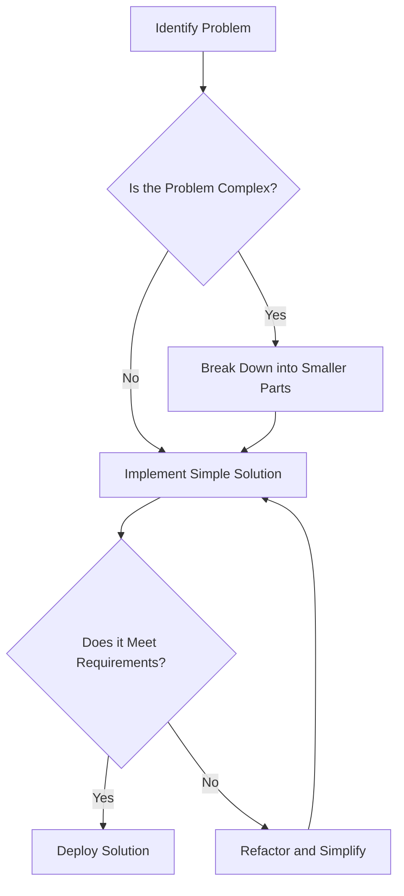

## 2.3 KISS (Keep It Simple, Stupid)

In the realm of software engineering, the KISS principle—"Keep It Simple, Stupid"—stands as a beacon guiding developers towards clarity and efficiency. This principle underscores the importance of simplicity in software design, advocating for solutions that are straightforward and easy to understand. By adhering to KISS, developers can create code that is not only more maintainable but also less prone to errors and easier to debug.

### Understanding the KISS Principle

The KISS principle is rooted in the idea that simplicity should be a key goal in design, and unnecessary complexity should be avoided. The term "stupid" is not meant to be derogatory but rather a reminder that overthinking and overengineering can lead to convoluted solutions that are difficult to manage.

#### The Value of Simplicity

Simplicity in software development is invaluable for several reasons:

- **Maintainability**: Simple code is easier to read, understand, and modify. This is crucial for long-term maintenance, especially when new developers join a project.
- **Error Reduction**: Complex code is more likely to contain bugs. By keeping solutions simple, the likelihood of introducing errors decreases.
- **Performance**: Simple solutions often lead to more efficient code execution, as they avoid unnecessary operations and convolutions.
- **Debugging**: When issues arise, simple code is easier to debug and troubleshoot, saving time and resources.

### The Pitfalls of Complexity

Overly complex solutions can lead to a host of problems:

- **Increased Errors**: Complex code paths can introduce subtle bugs that are hard to detect and fix.
- **Difficult Maintenance**: As code complexity increases, so does the difficulty of maintaining and extending it.
- **Knowledge Silos**: Complex solutions may only be understood by a few team members, leading to bottlenecks and knowledge silos.

#### Example of Complexity

Consider a scenario where a developer implements a custom sorting algorithm for a specific use case. The algorithm is intricate and requires deep understanding to modify or debug. However, the same functionality could have been achieved using Java's built-in sorting methods, which are optimized and well-documented.

```java
// Overly complex custom sorting algorithm
public class CustomSorter {
    public void sort(int[] array) {
        // Complex sorting logic
    }
}

// Simplified solution using Java's built-in sort
import java.util.Arrays;

public class SimpleSorter {
    public void sort(int[] array) {
        Arrays.sort(array); // Simple and efficient
    }
}
```

### Strategies for Keeping Designs Simple

Adopting the KISS principle requires conscious effort and strategic planning. Here are some strategies to keep your designs simple:

1. **Break Down Problems**: Divide complex problems into smaller, manageable parts. This modular approach makes it easier to tackle each component individually.

2. **Use Clear Naming Conventions**: Names should be descriptive and convey the purpose of variables, methods, and classes. This enhances readability and understanding.

3. **Avoid Unnecessary Features**: Implement only what is necessary. Features that are not required can add unnecessary complexity and should be avoided.

4. **Refactor Regularly**: Continuously refactor code to simplify and improve it. This involves removing redundant code, simplifying logic, and improving structure.

5. **Leverage Existing Libraries**: Use well-established libraries and frameworks instead of reinventing the wheel. This not only saves time but also ensures reliability.

6. **Focus on the Problem at Hand**: Avoid over-engineering by concentrating on solving the current problem rather than anticipating future requirements that may never arise.

### Simplicity and Performance

Simplicity often leads to better performance. Simple code is typically more efficient, as it avoids unnecessary operations and optimizes resource usage. For example, using Java's built-in data structures and algorithms can lead to significant performance improvements compared to custom implementations.

#### Example of Performance Improvement

Consider a scenario where a developer implements a custom data structure for storing and retrieving data. The custom implementation is complex and inefficient. By switching to Java's `HashMap`, the developer can achieve better performance with less code.

```java
// Complex custom data structure
public class CustomDataStructure {
    // Complex logic for storing and retrieving data
}

// Simplified solution using Java's HashMap
import java.util.HashMap;

public class SimpleDataStructure {
    private HashMap<String, String> map = new HashMap<>();

    public void add(String key, String value) {
        map.put(key, value);
    }

    public String get(String key) {
        return map.get(key);
    }
}
```

### Avoiding Over-Engineering

Over-engineering occurs when developers add unnecessary complexity to a solution in an attempt to make it more robust or future-proof. This often leads to bloated code that is difficult to understand and maintain.

#### Example of Over-Engineering

Imagine a developer designing a simple calculator application. Instead of implementing basic arithmetic operations, they create a complex framework to support advanced mathematical functions that are not required.

```java
// Over-engineered calculator
public class ComplexCalculator {
    // Complex logic for advanced mathematical functions
}

// Simple calculator
public class SimpleCalculator {
    public int add(int a, int b) {
        return a + b;
    }

    public int subtract(int a, int b) {
        return a - b;
    }
}
```

### Case Studies: Simplicity Leading to Success

#### Case Study 1: The Success of Unix

Unix is a prime example of the power of simplicity. Its design philosophy emphasizes simplicity and clarity, with each program doing one thing well. This approach has led to its widespread adoption and longevity.

#### Case Study 2: The Evolution of the Web

The early web was built on simple technologies like HTML and HTTP. This simplicity allowed for rapid growth and innovation, leading to the complex web applications we have today. By starting simple, the web was able to evolve and adapt to new challenges.

### Visualizing Simplicity

Let's visualize the concept of simplicity in software design using a flowchart. This diagram illustrates the decision-making process when designing a solution, emphasizing the importance of simplicity.



### Try It Yourself

To truly embrace the KISS principle, try simplifying a piece of complex code you have written or encountered. Refactor it to use simpler constructs or leverage existing libraries. Observe the impact on readability, maintainability, and performance.

### Knowledge Check

- **What is the primary goal of the KISS principle?**
- **Why is simplicity important in software design?**
- **How can overly complex solutions affect a project?**
- **What strategies can be used to keep designs simple?**
- **How does simplicity relate to performance?**

### Embrace the Journey

Remember, simplicity is not just about writing less code; it's about writing better code. By focusing on simplicity, we can create software that is more robust, maintainable, and enjoyable to work with. Keep experimenting, stay curious, and enjoy the journey!

## Quiz Time!



### What is the primary goal of the KISS principle?

- [x] To keep software design simple and straightforward
- [ ] To add as many features as possible
- [ ] To make code complex and sophisticated
- [ ] To focus on future-proofing

> **Explanation:** The KISS principle emphasizes simplicity in software design to enhance maintainability and reduce errors.

### Why is simplicity important in software development?

- [x] It enhances maintainability and reduces errors
- [ ] It makes code harder to understand
- [ ] It encourages over-engineering
- [ ] It focuses on adding unnecessary features

> **Explanation:** Simplicity makes code easier to read, understand, and maintain, reducing the likelihood of errors.

### How can overly complex solutions affect a project?

- [x] They can increase errors and make maintenance difficult
- [ ] They make the project more efficient
- [ ] They simplify debugging
- [ ] They enhance performance

> **Explanation:** Complex solutions often lead to increased errors and maintenance challenges, complicating the project.

### What is one strategy for keeping designs simple?

- [x] Break down problems into smaller parts
- [ ] Add unnecessary features
- [ ] Use complex algorithms
- [ ] Over-engineer solutions

> **Explanation:** Breaking down problems into smaller parts makes them more manageable and easier to solve simply.

### How does simplicity relate to performance?

- [x] Simple solutions often lead to better performance
- [ ] Complexity always enhances performance
- [ ] Simplicity has no impact on performance
- [ ] Simple code is always slower

> **Explanation:** Simple solutions avoid unnecessary operations, leading to more efficient code execution.

### What is over-engineering?

- [x] Adding unnecessary complexity to a solution
- [ ] Simplifying a solution
- [ ] Using existing libraries
- [ ] Focusing on the problem at hand

> **Explanation:** Over-engineering involves adding complexity that is not needed, often complicating the solution.

### What is a benefit of using clear naming conventions?

- [x] Enhances readability and understanding
- [ ] Makes code harder to read
- [ ] Encourages complexity
- [ ] Focuses on future-proofing

> **Explanation:** Clear naming conventions make code more readable and understandable, aiding in simplicity.

### What is a common pitfall when not following the KISS principle?

- [x] Increased complexity and errors
- [ ] Improved code quality
- [ ] Enhanced performance
- [ ] Simplified debugging

> **Explanation:** Ignoring the KISS principle can lead to increased complexity, making code error-prone and hard to maintain.

### What does the KISS principle discourage?

- [x] Over-engineering and unnecessary complexity
- [ ] Using simple solutions
- [ ] Focusing on the current problem
- [ ] Breaking down problems

> **Explanation:** The KISS principle discourages over-engineering and unnecessary complexity, promoting simplicity.

### True or False: Simplicity in code always leads to worse performance.

- [ ] True
- [x] False

> **Explanation:** Simplicity often leads to better performance by avoiding unnecessary operations and optimizing resource usage.


